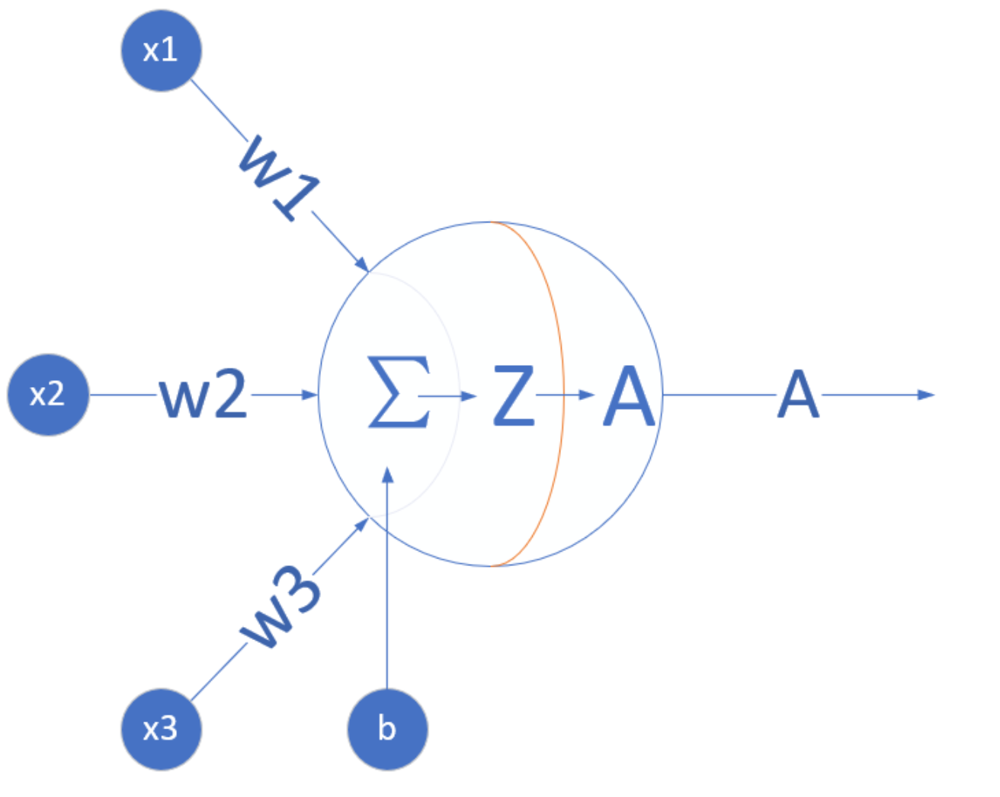
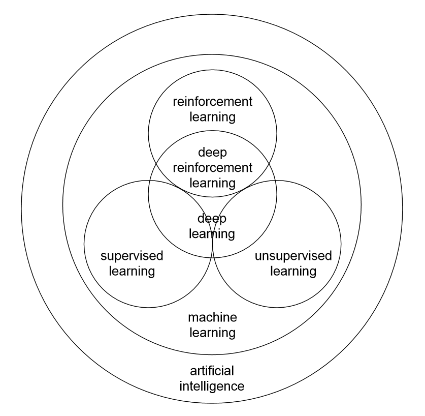

<!--Copyright © Microsoft Corporation. All rights reserved.
  适用于[License](https://github.com/Microsoft/ai-edu/blob/master/LICENSE.md)版权许可-->

## 1.1 人工智能的定义

现在（2019年），人们口中的人工智能其实是一个非常庞杂的概念，从人们对人工智能的期待，技术，和应用角度，都有很多不同的概念。我们详细分析如下：

#### 第一个层面，人们对人工智能的**期待**可以分为：

- **智能地把某件特定的事情做好，在某个领域增强人类的智慧，这种方式又叫做智能增强**——像搜索引擎，自动语言翻译，某个领域的智能助手那样的程序，帮助人类完成某种特定任务。这也叫做“弱人工智能”，或者“狭义人工智能”。
- **像人类一样能认知，思考，判断：模拟人类的智能**——像人类一样能认知，思考，判断的智能软件。这是人工智能学科一开始就有的梦想。这样的智能也叫做“通用人工智能”（Artificial General Intelligence， AGI）， 或“强人工智能”。对于这样的人工智能，科幻小说有很多描写，也有一些研究，但是在实际的应用还没有什么突破。有学者认为，AGI是不可能通过目前人们编程程序的方式实现的$^{[1]}$。尽管如此，社会上还是有人担忧有一天电脑的AGI会超过人类的智能，人类再也赶不上电脑，从而永远受制于电脑。

#### 第二个层面，**从技术的特点来看**。

要实现某种狭义的人工智能，我们很自然地想到，如果我们能让运行程序的电脑来学习并自动掌握某些规律，那该多好啊，这就是“机器学习”。机器学习在几十年的发展历史中，产生了很多技术，这些技术都有下面的共性：

> 如果一个程序解决任务（T）的效能（用P表示）随着经验（E）得到了提高，那么，这个程序就能从经验（E）中学到了关于任务（T）的知识，并让衡量值（P）得到提高。$^{[2]}$

1. 选择一个模型结构（例如逻辑回归，决策树等），这就是上面说的程序。
2. 用训练数据（输入和输出）输入模型。这就是上面的经验（E）。
3. 通过不断执行任务（T）并衡量结果（P），让P
不断提高，直到达到一个满意的值。

那么，机器学习的各种方法是如何从经验中学习呢？我们可以大致地分为下面三种类型：

1. 监督学习（Supervised Learning）

    通过标注的数据来学习，例如，程序通过学习标注了正确答案的手写数字的图像数据，它就能认识其他的手写数字。

2. 无监督学习（Unsupervised Learning）

    通过没有标注的数据来学习。这种算法可以发现数据中自然形成的共同特性（聚类），可以用来发现不同数据之间的联系，例如，买了商品A的顾客往往也购买了商品B。

3. 强化学习（Reinforcement Learning）

    我们可以让程序选择和它的环境互动（例如玩一个游戏），环境给程序的反馈是一些“奖励”（例如游戏中获得高分），程序要学习到一个模型，能在这种环境中得到高的分数，不仅是当前局面要得到高分，而且最终的结果也要是高分才行。

综合来看，如果我们把机器学习当作一个小孩，那么，教育小孩的方式就有根据正确答案指导学习（监督学习）；根据小孩实践的过程给予各种鼓励（强化学习）；还有自由探索世界，让小孩自己总结规律（无监督学习）。

机器学习领域出现了各种模型，其中，神经网络模型是一个重要的方法，它的原型在1943就出现了，在生物神经网络中，每个神经元与其他神经元相连，当它兴奋时，就会像相邻的神经元发送化学物质，从而改变这些神经元内的电位；如果某神经元的电位超过了一个阈值，那么它就会被激活（兴奋），向其他神经元发送化学物质。把许多这样的神经元按照一定的层次结构连接起来，我们就构建了一个神经网络$^{[3]}$。图1-4是M-P神经元模型的示意图。

图1-4 M-P神经元模型

随着数据的丰富和机器算力的增强，人们不断增加神经网络的层次数目，相邻层次之间的输入输出由非线性函数来控制，这就产生了DNN（深度神经网络）。DNN在最近十年给人工智能领域带来了新的生机，并在图像分类、语音识别、自然语言处理等方面取得了重大突破。

随着人们不断的调整网络结构，DNN也演变成许多不同的网络拓扑结构，例如CNN（卷积神经网络），RNN（循环神经网络），LSTM（长期短期记忆），GAN（生成对抗网络），Transfer Learning（迁移学习）等，这些模型还在不断演化中。

训练AI模型，需要一系列专门的工具，业界有不少成熟的训练平台（TensorFlow，PyTorch，MXNet等），这些平台也在不断演化，支持新的模型，提高训练的效率，改进易用性，等等。当然我们也可以自己开发平台来训练，本书的大部分章节就是带领读者自己动手打造一个小型的开发平台。

#### 第三个层面，**从应用的角度来看**，我们看到狭义人工智能在各个领域都取得了很大的成果。

一种是标杆式的任务，例如ImageNet，考察AI模型能否识别图像的类别，2015年，AI取得了超过人类的成果。在其它的领域中，我们也看到了AI取得了达到或超过人类最高水平的成绩：

- 翻译领域（微软的中英翻译超过人类）
- 阅读理解（SQuAD 比赛）
- 下围棋（2016）德州扑克（2019）麻将（2019）

另一种，是AI技术和各种其他技术结合，解决政府，企业，个人用户的需求。在政府方面，把所有计算，数据，云端和物联网终端的设备联系起来，搭建一个能支持智能决定的系统，现代社会的城市管理，金融，医疗，物流和交通管理等等都运行在这样的系统上。专家称之为智能基础建设$^{[4]}$。

一个案例是，微软亚洲研究院与某大型船运公司在深度强化学习领域展开了研究合作。船运公司经营着数百条货轮，在上百个港口搬运集装箱，其中装有不同种类、不同优先级和不同目的地的货物，经常会出现某港口有大量空的集装箱，而另外的港口却急需集装箱的情况。如何能最大化地利用货轮的运输能力，避免过多转运空的货柜集装箱？双方合作开发了一套基于大数据和强化学习的全新解决方案，能够在货船抵达港口时就预估出需要装载或者卸载的空集装箱的最优数量。这个方案大幅度降低了港口货柜短缺的情况，提高了效率。

在个人用户方面，AI技术出现在各种各样的应用程序和服务中，解决用户旅游时的外语翻译、照片美颜、和个人定制化的学习等需求。

回过头来看，本书（连同相关的网上社区）的内容，其实是庞大AI系统中几个微小的部分，图1-5显示了弱人工智能领域中机器学习部分的内容。

图1-5 弱人工智能领域中机器学习部分的内容

从这个角度说，本书的名字“智能之门”也只能说明这本书是进入人工智能领域的一个小门而已。 还有其他很多门道。

那么，一个典型的机器学习的模型是怎么得来的，又是怎么在应用中使用的呢？以MNIST数据集为例，整体流程如图1-6所示。

图1-6 模型的生成与应用

从图1-6中可以看到，首先我们要设计一个模型，然后用已经标注过的数据来训练这个模型，在训练过程中，模型的各个参数在多次训练中不断得到调整，最后得到了一个达到要求的模型。这个模型会被用于一个推理模型中，和其它程序模块一起组成一个应用程序或者是服务，能处理新的数据，满足用户的需求。

在现代软件开发流程中，程序的开发，和AI模型的开发的生命周期应该如何协作呢？软件工程师和数据科学家并肩工作，一个完善代码库，另一个完善模型库，最后的产品通过各种途径（网页/桌面程序/手机/IoT设备）交到用户手中。图1-7展示了这个协作的过程。

图1-7 软件开发流程与AI模型开发流程的协作
