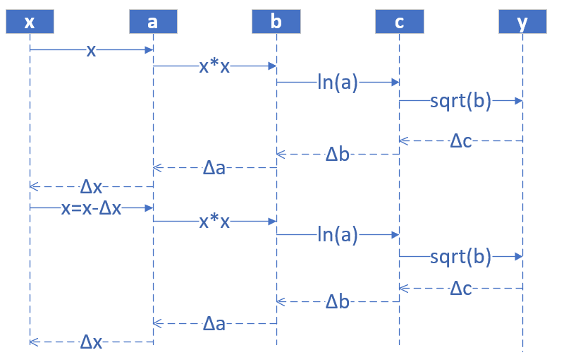

<!--Copyright © Microsoft Corporation. All rights reserved.
  适用于[License](https://github.com/Microsoft/ai-edu/blob/master/LICENSE.md)版权许可-->

## 2.2 非线性反向传播

### 2.2.1 提出问题

在上面的线性例子中，我们可以发现，误差一次性地传递给了初始值w和b，即，只经过一步，直接修改w和b的值，就能做到误差校正。因为从它的计算图看，无论中间计算过程有多么复杂，它都是线性的，所以可以一次传到底。缺点是这种线性的组合最多只能解决线性问题，不能解决更复杂的问题。这个我们在神经网络基本原理中已经阐述过了，需要有激活函数连接两个线性单元。

下面我们看一个非线性的例子，如图2-8所示。



图2-8 非线性的反向传播

其中$1<x<=10，0<y<2.15$。假设有5个人分别代表x、a、b、c、y：

#### 正向过程

1. 第1个人，输入层，随机输入第一个x值，x取值范围(1,10]，假设第一个数是2
2. 第2个人，第一层网络计算，接收第1个人传入x的值，计算：$a=x^2$
3. 第3个人，第二层网络计算，接收第2个人传入a的值，计算b：$b=\ln (a)$
4. 第4个人，第三层网络计算，接收第3个人传入b的值，计算c：$c=\sqrt{b}$
5. 第5个人，输出层，接收第4个人传入c的值

#### 反向过程

6. 第5个人，计算y与c的差值：$\Delta c = c - y$，传回给第4个人
7. 第4个人，接收第5个人传回$\Delta c，计算\Delta b：\Delta b = \Delta c \cdot 2\sqrt{b}$
8. 第3个人，接收第4个人传回$\Delta b，计算\Delta a：\Delta a = \Delta b \cdot a$
9. 第2个人，接收第3个人传回$\Delta a，计算\Delta x：\Delta x = \Delta a / 2x$
10. 第1个人，接收第2个人传回$\Delta x，更新x：x = x - \Delta x$，回到第1步

提出问题：假设我们想最后得到c=2.13的值，x应该是多少？（误差小于0.001即可）

### 2.2.2 数学解析解

$$c=\sqrt{b}=\sqrt{\ln(a)}=\sqrt{\ln(x^2)}=2.13$$
$$x = 9.6653$$

### 2.2.3 梯度迭代解

$$
\frac{da}{dx}=\frac{d(x^2)}{dx}=2x=\frac{\Delta a}{\Delta x} \tag{1}
$$
$$
\frac{db}{da} =\frac{d(\ln{a})}{da} =\frac{1}{a} = \frac{\Delta b}{\Delta a} \tag{2}
$$
$$
\frac{dc}{db}=\frac{d(\sqrt{b})}{db}=\frac{1}{2\sqrt{b}}=\frac{\Delta c}{\Delta b} \tag{3}
$$
因此得到如下一组公式，可以把最后一层$\Delta c$的误差一直反向传播给最前面的$\Delta x$，从而更新x值：
$$
\Delta c = c - y \tag{4}
$$
$$
\Delta b = \Delta c \cdot 2\sqrt{b}  \tag{根据式3}
$$
$$
\Delta a = \Delta b \cdot a  \tag{根据式2}
$$
$$
\Delta x = \Delta a / 2x \tag{根据式1}
$$

我们给定初始值$x=2，\Delta x=0$，依次计算结果如表2-2。

表2-2 正向与反向的迭代计算

|方向|公式|迭代1|迭代2|迭代3|迭代4|迭代5|
|---|---|---|---|---|---|---|
|正向|$x=x-\Delta x$|2|4.243|7.344|9.295|9.665|
|正向|$a=x^2$|4|18.005|53.934|86.404|93.233|
|正向|$b=\ln(a)$|1.386|2.891|3.988|4.459|4.535|
|正向|$c=\sqrt{b}$|1.177|1.700|1.997|2.112|2.129|
||标签值y|2.13|2.13|2.13|2.13|2.13|
|反向|$\Delta c = c - y$|-0.953|-0.430|-0.133|-0.018||
|反向|$\Delta b = \Delta c \cdot 2\sqrt{b}$|-2.243|-1.462|-0.531|-0.078||
|反向|$\Delta a = \Delta b \cdot a$|-8.973|-26.317|-28.662|-6.698||
|反向|$\Delta x = \Delta a / 2x$|-2.243|-3.101|-1.951|-0.360||

表2-2，先看“迭代-1”列，从上到下是一个完整的正向+反向的过程，最后一行是-2.243，回到“迭代-2”列的第一行，2-(-2.243)=4.243，然后继续向下。到第5轮时，正向计算得到的c=2.129，非常接近2.13了，迭代结束。

运行示例代码的话，可以得到如下结果：

```
how to play: 1) input x, 2) calculate c, 3) input target number but not faraway from c
input x as initial number(1.2,10), you can try 1.3:
2
c=1.177410
input y as target number(0.5,2), you can try 1.8:
2.13
forward...
x=2.000000,a=4.000000,b=1.386294,c=1.177410
backward...
delta_c=-0.952590, delta_b=-2.243178, delta_a=-8.972712, delta_x=-2.243178
......
forward...
x=9.655706,a=93.232666,b=4.535098,c=2.129577
backward...
done!
```

为节省篇幅只列出了第一步和最后一步（第5步）的结果，第一步时c=1.177410，最后一步时c=2.129577，停止迭代。

### 代码位置

ch02, Level2
