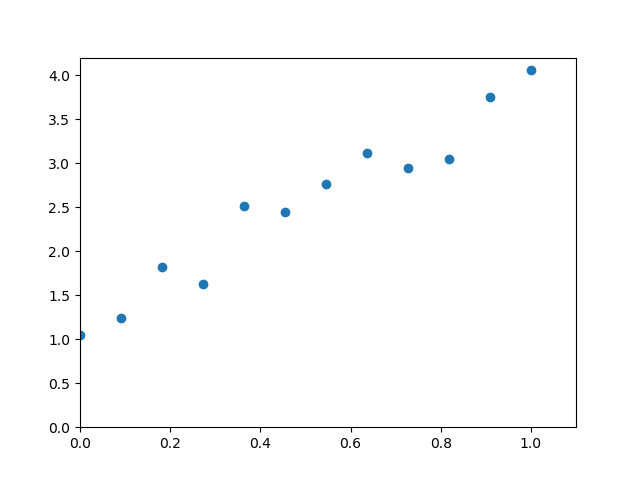
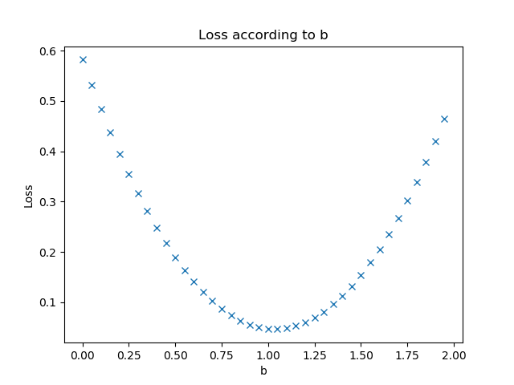
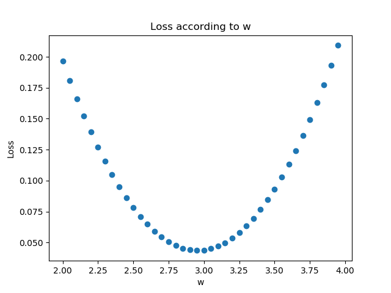
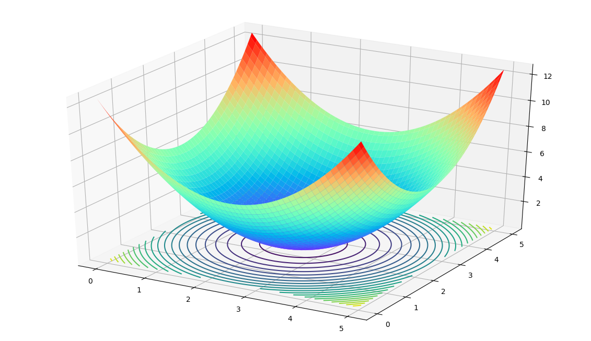
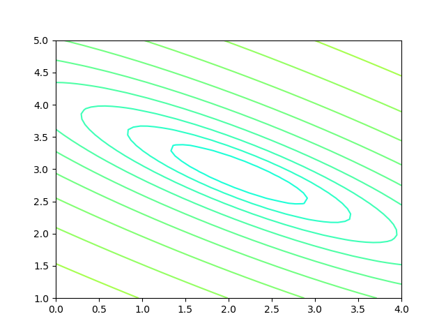
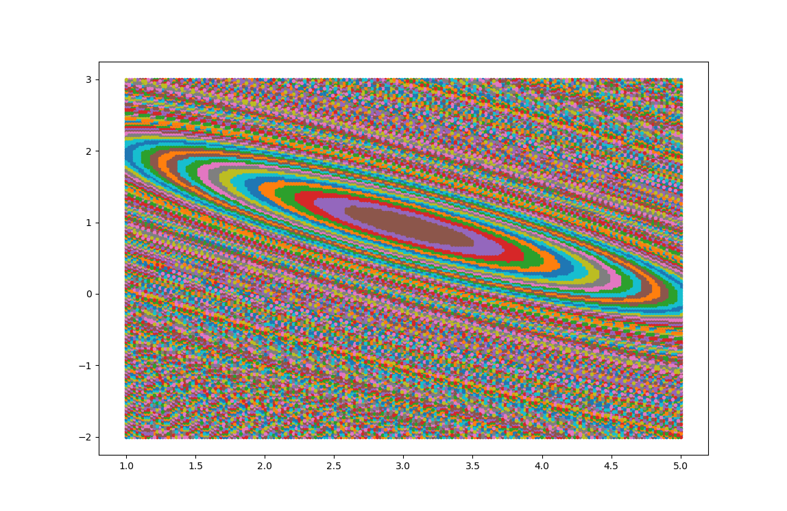

<!--Copyright © Microsoft Corporation. All rights reserved.
  适用于[License](https://github.com/Microsoft/ai-edu/blob/master/LICENSE.md)版权许可-->

## 3.1 均方差函数

MSE - Mean Square Error。

该函数就是最直观的一个损失函数了，计算预测值和真实值之间的欧式距离。预测值和真实值越接近，两者的均方差就越小。

均方差函数常用于线性回归(linear regression)，即函数拟合(function fitting)。公式如下：

$$
loss = {1 \over 2}(z-y)^2 \tag{单样本}
$$

$$
J=\frac{1}{2m} \sum_{i=1}^m (z_i-y_i)^2 \tag{多样本}
$$

### 3.1.1 工作原理

要想得到预测值a与真实值y的差距，最朴素的想法就是用$Error=a_i-y_i$。

对于单个样本来说，这样做没问题，但是多个样本累计时，$a_i-y_i$有可能有正有负，误差求和时就会导致相互抵消，从而失去价值。所以有了绝对值差的想法，即$Error=|a_i-y_i|$。这看上去很简单，并且也很理想，那为什么还要引入均方差损失函数呢？两种损失函数的比较如表3-1所示。

表3-1 绝对值损失函数与均方差损失函数的比较

|样本标签值|样本预测值|绝对值损失函数|均方差损失函数|
|------|------|------|------|
|$[1,1,1]$|$[1,2,3]$|$(1-1)+(2-1)+(3-1)=3$|$(1-1)^2+(2-1)^2+(3-1)^2=5$|
|$[1,1,1]$|$[1,3,3]$|$(1-1)+(3-1)+(3-1)=4$|$(1-1)^2+(3-1)^2+(3-1)^2=8$|
|||$4/3=1.33$|$8/5=1.6$|

可以看到5比3已经大了很多，8比4大了一倍，而8比5也放大了某个样本的局部损失对全局带来的影响，用术语说，就是“对某些偏离大的样本比较敏感”，从而引起监督训练过程的足够重视，以便回传误差。

### 3.1.2 实际案例

假设有一组数据如图3-3，我们想找到一条拟合的直线。



图3-3 平面上的样本数据

图3-4中，前三张显示了一个逐渐找到最佳拟合直线的过程。

- 第一张，用均方差函数计算得到Loss=0.53；
- 第二张，直线向上平移一些，误差计算Loss=0.16，比图一的误差小很多；
- 第三张，又向上平移了一些，误差计算Loss=0.048，此后还可以继续尝试平移（改变b值）或者变换角度（改变w值），得到更小的损失函数值；
- 第四张，偏离了最佳位置，误差值Loss=0.18，这种情况，算法会让尝试方向反向向下。


图3-4 损失函数值与直线位置的关系

第三张图损失函数值最小的情况。比较第二张和第四张图，由于均方差的损失函数值都是正值，如何判断是向上移动还是向下移动呢？

在实际的训练过程中，是没有必要计算损失函数值的，因为损失函数值会体现在反向传播的过程中。我们来看看均方差函数的导数：

$$
\frac{\partial{J}}{\partial{a_i}} = a_i-y_i
$$

虽然$(a_i-y_i)^2$永远是正数，但是$a_i-y_i$却可以是正数（直线在点下方时）或者负数（直线在点上方时），这个正数或者负数被反向传播回到前面的计算过程中，就会引导训练过程朝正确的方向尝试。

在上面的例子中，我们有两个变量，一个w，一个b，这两个值的变化都会影响最终的损失函数值的。

我们假设该拟合直线的方程是y=2x+3，当我们固定w=2，把b值从2到4变化时，看看损失函数值的变化如图3-5所示。



图3-5 固定W时，b的变化造成的损失值

我们假设该拟合直线的方程是y=2x+3，当我们固定b=3，把w值从1到3变化时，看看损失函数值的变化如图3-6所示。



图3-6 固定b时，W的变化造成的损失值

### 3.1.3 损失函数的可视化

#### 损失函数值的3D示意图

横坐标为W，纵坐标为b，针对每一个w和一个b的组合计算出一个损失函数值，用三维图的高度来表示这个损失函数值。下图中的底部并非一个平面，而是一个有些下凹的曲面，只不过曲率较小，如图3-7。



图3-7 W和b同时变化时的损失值形成的曲面

#### 损失函数值的2D示意图

在平面地图中，我们经常会看到用等高线的方式来表示海拔高度值，下图就是上图在平面上的投影，即损失函数值的等高线图，如图3-8所示。



图3-8 损失函数的等高线图

如果还不能理解的话，我们用最笨的方法来画一张图，代码如下：

```Python
    s = 200
    W = np.linspace(w-2,w+2,s)
    B = np.linspace(b-2,b+2,s)
    LOSS = np.zeros((s,s))
    for i in range(len(W)):
        for j in range(len(B)):
            z = W[i] * x + B[j]
            loss = CostFunction(x,y,z,m)
            LOSS[i,j] = round(loss, 2)
```

上述代码针对每个w和b的组合计算出了一个损失值，保留小数点后2位，放在LOSS矩阵中，如下所示：

```
[[4.69 4.63 4.57 ... 0.72 0.74 0.76]
 [4.66 4.6  4.54 ... 0.73 0.75 0.77]
 [4.62 4.56 4.5  ... 0.73 0.75 0.77]
 ...
 [0.7  0.68 0.66 ... 4.57 4.63 4.69]
 [0.69 0.67 0.65 ... 4.6  4.66 4.72]
 [0.68 0.66 0.64 ... 4.63 4.69 4.75]]
```

然后遍历矩阵中的损失函数值，在具有相同值的位置上绘制相同颜色的点，比如，把所有值为0.72的点绘制成红色，把所有值为0.75的点绘制成蓝色......，这样就可以得到图3-9。



图3-9 用笨办法绘制等高线图

此图和等高线图的表达方式等价，但由于等高线图比较简明清晰，所以以后我们都使用等高线图来说明问题。

### 代码位置

ch03, Level1
