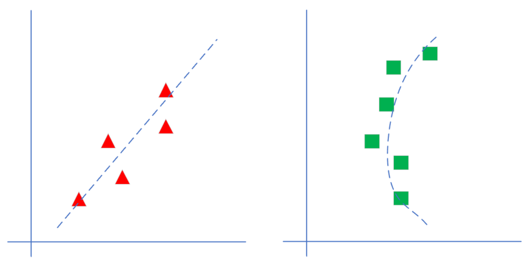

<!--Copyright © Microsoft Corporation. All rights reserved.
适用于[License](https://github.com/Microsoft/ai-edu/blob/master/LICENSE.md)版权许可-->

# 第4章 单入单出的单层神经网络

## 4.0 单变量线性回归问题

### 4.0.1 提出问题

在互联网建设初期，各大运营商需要解决的问题就是保证服务器所在的机房的温度常年保持在23摄氏度左右。在一个新建的机房里，如果计划部署346台服务器，我们如何配置空调的最大功率？

这个问题虽然能通过热力学计算得到公式，但是总会有误差。因此人们往往会在机房里装一个温控器，来控制空调的开关或者风扇的转速或者制冷能力，其中最大制冷能力是一个关键性的数值。更先进的做法是直接把机房建在海底，用隔离的海水循环降低空气温度的方式来冷却。

通过一些统计数据（称为样本数据），我们得到了表4-1。

表4-1 样本数据

|样本序号|服务器数量(千台)X|空调功率(千瓦)Y|
|---|---|---|
|1|0.928|4.824|
|2|0.469|2.950|
|3|0.855|4.643|
|...|...|...|

在上面的样本中，我们一般把自变量X称为样本特征值，把因变量Y称为样本标签值。

这个数据是二维的，所以我们可以用可视化的方式来展示，横坐标是服务器数量，纵坐标是空调功率，如图4-1所示。

图4-1 样本数据可视化

通过对上图的观察，我们可以判断它属于一个线性回归问题，而且是最简单的一元线性回归。于是，我们把热力学计算的问题转换成为了一个统计问题，因为实在是不能精确地计算出每块电路板或每台机器到底能产生多少热量。

头脑灵活的读者可能会想到一个办法：在样本数据中，我们找到一个与346非常近似的例子，以它为参考就可以找到合适的空调功率数值了。

不得不承认，这样做是完全科学合理的，实际上这就是线性回归的解题思路：利用已有值，预测未知值。也就是说，这些读者不经意间使用了线性回归模型。而实际上，这个例子非常简单，只有一个自变量和一个因变量，因此可以用简单直接的方法来解决问题。但是，当有多个自变量时，这种直接的办法可能就会失效了。假设有三个自变量，很有可能不能够在样本中找到和这三个自变量的组合非常接近的数据，此时我们就应该借助更系统的方法了。

### 4.0.2 一元线性回归模型

回归分析是一种数学模型。当因变量和自变量为线性关系时，它是一种特殊的线性模型。

最简单的情形是一元线性回归，由大体上有线性关系的一个自变量和一个因变量组成，模型是：

$$Y=a+bX+ε \tag{1}$$

X是自变量，Y是因变量，ε是随机误差，a和b是参数，在线性回归模型中，a和b是我们要通过算法学习出来的。

什么叫模型？第一次接触这个概念时，可能会有些不明觉厉。从常规概念上讲，是人们通过主观意识借助实体或者虚拟表现来构成对客观事物的描述，这种描述通常是有一定的逻辑或者数学含义的抽象表达方式。

比如对小轿车建模的话，会是这样描述：由发动机驱动的四轮铁壳子。对能量概念建模的话，那就是爱因斯坦狭义相对论的著名推论：$E=mc^2$。

对数据建模的话，就是想办法用一个或几个公式来描述这些数据的产生条件或者相互关系，比如有一组数据是大致满足$y=3x+2$这个公式的，那么这个公式就是模型。为什么说是“大致”呢？因为在现实世界中，一般都有噪音（误差）存在，所以不可能非常准确地满足这个公式，只要是在这条直线两侧附近，就可以算作是满足条件。

对于线性回归模型，有如下一些概念需要了解：

- 通常假定随机误差的均值为0，方差为σ^2（σ^2﹥0，σ^2与X的值无关）
- 若进一步假定随机误差遵从正态分布，就叫做正态线性模型
- 一般地，若有k个自变量和1个因变量（即公式1中的Y），则因变量的值分为两部分：一部分由自变量影响，即表示为它的函数，函数形式已知且含有未知参数；另一部分由其他的未考虑因素和随机性影响，即随机误差
- 当函数为参数未知的线性函数时，称为线性回归分析模型
- 当函数为参数未知的非线性函数时，称为非线性回归分析模型
- 当自变量个数大于1时称为多元回归
- 当因变量个数大于1时称为多重回归

我们通过对数据的观察，可以大致认为它符合线性回归模型的条件，于是列出了公式1，不考虑随机误差的话，我们的任务就是找到合适的a和b，这就是线性回归的任务。

图4-2 线性回归和非线性回归的区别

如图4-2所示，左侧为线性模型，可以看到直线穿过了一组三角形所形成的区域的中心线，并不要求这条直线穿过每一个三角形。右侧为非线性模型，一条曲线穿过了一组矩形所形成的区域的中心线。在本章中，我们先学习如何解决左侧的线性回归问题。

我们接下来会用几种方法来解决这个问题：

1. 最小二乘法；
2. 梯度下降法；
3. 简单的神经网络法；
4. 更通用的神经网络算法。

### 4.0.3 公式形态

这里要解释一下线性公式中w和x的顺序问题。在很多教科书中，我们可以看到下面的公式：

$$y = w^Tx+b \tag{1}$$

或者：

$$y = w \cdot x + b \tag{2}$$

而我们在本书中使用：

$$y = x \cdot w + b \tag{3}$$

这三者的主要区别是样本数据x的形状定义，相应地会影响到w的形状定义。举例来说，如果x有三个特征值，那么w必须有三个权重值与特征值对应，则：

#### 公式1的矩阵形式

x是列向量：

$$
x=
\begin{pmatrix}
x_{1} \\
x_{2} \\
x_{3}
\end{pmatrix}
$$

w也是列向量：

$$
w=
\begin{pmatrix}
w_{1} \\ w_{2} \\ w_{3}
\end{pmatrix}
$$
$$
y=w^Tx+b=
\begin{pmatrix}
w_1 & w_2 & w_3
\end{pmatrix}
\begin{pmatrix}
x_{1} \\
x_{2} \\
x_{3}
\end{pmatrix}
+b
$$
$$
=w_1 \cdot x_1 + w_2 \cdot x_2 + w_3 \cdot x_3 + b \tag{4}
$$

w和x都是列向量，所以需要先把w转置后，再与x做矩阵乘法。

#### 公式2的矩阵形式

公式2与公式1的区别是w的形状，在公式2中，w直接就是个行向量：

$$
w=
\begin{pmatrix}
w_{1} & w_{2} & w_{3}
\end{pmatrix}
$$

而x的形状仍然是列向量：

$$
x=
\begin{pmatrix}
x_{1} \\
x_{2} \\
x_{3}
\end{pmatrix}
$$

这样相乘之前不需要做矩阵转置了：

$$
y=wx+b=
\begin{pmatrix}
w_1 & w_2 & w_3
\end{pmatrix}
\begin{pmatrix}
x_{1} \\
x_{2} \\
x_{3}
\end{pmatrix}
+b
$$
$$
=w_1 \cdot x_1 + w_2 \cdot x_2 + w_3 \cdot x_3 + b \tag{5}
$$

#### 公式3的矩阵形式

x是个行向量：

$$
x=
\begin{pmatrix}
x_{1} & x_{2} & x_{3}
\end{pmatrix}
$$

w是列向量：

$$
w=
\begin{pmatrix}
w_{1} \\ w_{2} \\ x_{3}
\end{pmatrix}
$$

所以x在前，w在后：

$$
y=x \cdot w+b=
\begin{pmatrix}
x_1 & x_2 & x_3
\end{pmatrix}
\begin{pmatrix}
w_{1} \\
w_{2} \\
w_{3}
\end{pmatrix}
+b
$$
$$
=x_1 \cdot w_1 + x_2 \cdot w_2 + x_3 \cdot w_3 + b \tag{6}
$$

比较公式4，5，6，其实最后的运算结果是相同的。

我们再分析一下前两种形式的x矩阵，由于x是个列向量，意味着特征由行表示，当有2个样本同时参与计算时，x需要增加一列，变成了如下形式：

$$
x=
\begin{pmatrix}
x_{11} & x_{21} \\
x_{12} & x_{22} \\
x_{13} & x_{23} 
\end{pmatrix}
$$

x的第一个下标表示样本序号，第二个下标表示样本特征，所以$x_{21}$是第2个样本的第1个特征。看$x_{21}$这个序号很别扭，一般我们都是认为行在前、列在后，但是$x_{21}$却是处于第1行第2列，和习惯正好相反。

如果采用第三种形式，则两个样本的x的矩阵是：

$$
x=
\begin{pmatrix}
x_{11} & x_{12} & x_{13} \\
x_{21} & x_{22} & x_{23}
\end{pmatrix}
$$

第1行是第1个样本的3个特征，第2行是第2个样本的3个特征，这与常用的阅读习惯正好一致，第1个样本的第2个特征在矩阵的第1行第2列，因此我们在本书中一律使用第三种形式来描述线性方程。

另外一个原因是，在很多深度学习库的实现中，确实是把x放在w前面做矩阵运算的，同时w的形状也是从左向右看，比如左侧有2个样本的3个特征输入（2x3表示2个样本3个特征值），右侧是1个输出，则w的形状就是3x1。否则的话就需要倒着看，w的形状成为了1x3，而x变成了3x2，很别扭。

对于b来说，它永远是1行，列数与w的列数相等。比如w是3x1的矩阵，则b是1x1的矩阵。如果w是3x2的矩阵，意味着3个特征输入到2个神经元上，则b是1x2的矩阵，每个神经元分配1个bias。
