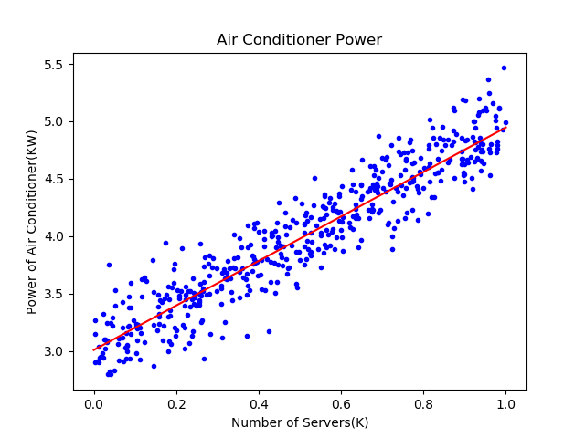

Copyright © Microsoft Corporation. All rights reserved.
适用于[License](https://github.com/Microsoft/ai-edu/blob/master/LICENSE.md)版权许可
 
## 4.3 神经网络法

在梯度下降法中，我们简单讲述了一下神经网络做线性拟合的原理，即：

1. 初始化权重值
2. 根据权重值放出一个解
3. 根据均方差函数求误差
4. 误差反向传播给线性计算部分以调整权重值
5. 是否满足终止条件？不满足的话跳回2

一个不恰当的比喻就是穿糖葫芦：桌子上放了一溜儿12个红果，给你一个足够长的竹签子，选定一个角度，在不移动红果的前提下，想办法用竹签子穿起最多的红果。

最开始你可能会任意选一个方向，用竹签子比划一下，数数能穿到几个红果，发现是5个；然后调整一下竹签子在桌面上的水平角度，发现能穿到6个......最终你找到了能穿10个红果的的角度。

### 4.3.1 定义神经网络结构

我们是首次尝试建立神经网络，先用一个最简单的单层单点神经元：

 

下面，我们用这个最简的线性回归的例子，来说明神经网络中最重要的反向传播和梯度下降的概念、过程以及代码实现。

- 输入层

它在输入层只接受一个输入，经过参数w,b的计算后，直接输出结果。这样一个简单的“网络”，只能解决简单的一元线性回归问题，而且由于是线性的，我们不需要定义激活函数，这就大大简化了程序，而且便于大家循序渐进地理解各种知识点。

严格来说输入层在神经网络中并不能称为一个层。

- 权重w/b

因为是一元线性问题，所以w/b都是一个标量，我们猜想这组数据遵循线性关系：$y = x \cdot w+b$

- 输出层

输出层1个神经元，是上述预测公式的直接输出，但定义上有所变化，应该是：

$$z_i = x_i \cdot w + b$$

z是模型的预测输出，y是实际的样本标签值。

- 损失函数

因为是线性回归问题，所以损失函数使用均方差函数。

$$loss(w,b) = \frac{1}{2} (z_i-y_i)^2$$

### 4.3.2 反向传播

由于我们使用了和上一节中的梯度下降法同样的数学原理，所以反向传播的算法也是一样的，细节请查看4.2.1。

在本小节中，反向传播使用单样本方式，在下一节中，我们将介绍多样本方式。

### 4.3.3 代码实现

其实神经网络法和梯度下降法在本质上是一样的，只不过神经网络法使用一个崭新的编程模型，即以神经元为中心的代码结构设计，这样便于以后的功能扩充。

在Python中可以使用面向对象的技术，通过创建一个类来描述神经网络的属性和行为，下面我们将会创建一个叫做NeuralNet的class，然后通过逐步向此类中添加方法，来实现神经网络的训练和推理过程。

- 定义类
```Python
class NeuralNet(object):
    def __init__(self, eta):
        self.eta = eta
        self.w = 0
        self.b = 0
```
NeuralNet类从object类派生，并具有初始化函数，其参数是eta，也就是学习率，需要调用者指定。另外两个成员变量是w和b，初始化为0。

- 前向计算

```Python
    def __forward(self, x):
        z = x * self.w + self.b
        return z
```
这是一个私有方法，所以前面有两个下划线，只在NeuralNet类中被调用，不对外公开。


- 反向传播

下面的代码是通过梯度下降法中的公式推导而得的，也设计成私有方法：

```Python
    def __backward(self, x,y,z):
        dz = z - y
        db = dz
        dw = x * dz
        return dw, db
```
dz是中间变量，避免重复计算。dz又可以写成delta_Z，是当前层神经网络的反向误差输入。

- 梯度更新

```Python
    def __update(self, dw, db):
        self.w = self.w - self.eta * dw
        self.b = self.b - self.eta * db
```

每次更新好新的w和b的值以后，直接存储在成员变量中，方便下次迭代时直接使用，不需要在全局范围当作参数内传来传去的。

- 训练过程

一般的训练算法就是：

***
循环，直到所有样本数据使用完毕：
1. 读取一个样本数据
2. 前向计算
3. 反向传播
4. 更新梯度
***

```Python
    def train(self, dataReader):
        for i in range(dataReader.num_train):
            # get x and y value for one sample
            x,y = dataReader.GetSingleTrainSample(i)
            # get z from x,y
            z = self.__forward(x)
            # calculate gradient of w and b
            dw, db = self.__backward(x, y, z)
            # update w,b
            self.__update(dw, db)
        # end for
```

- 推理预测

```Python
    def inference(self, x):
        return self.__forward(x)
```

推理过程，实际上就是一个前向计算过程，我们把它单独拿出来，方便对外接口的设计，所以这个方法被设计成了公开的方法。

- 主程序

```Python
if __name__ == '__main__':
    # read data
    sdr = SimpleDataReader()
    sdr.ReadData()
    # create net
    eta = 0.1
    net = NeuralNet(eta)
    net.train(sdr)
    # result
    print("w=%f,b=%f" %(net.w, net.b))
    # predication
    result = net.inference(0.346)
    print("result=", result)
    ShowResult(net, sdr)
```

### 4.3.4 运行结果

- 打印输出

```
w=1.716290,b=3.196841
result= [3.79067723]
```

最终我们得到了W和B的值，对应的直线方程是$y=1.71629x+3.196841$。推理预测时，已知有346台服务器，先要除以1000，因为横坐标是以K(千台)服务器为单位的，代入前向计算函数，得到的结果是3.74千瓦。

- 结果显示函数

```Python
def ShowResult(net, dataReader):
    X,Y = dataReader.GetWholeTrainSamples()
    # draw sample data
    plt.plot(X, Y, "b.")
    # draw predication data
    PX = np.linspace(0,1,10)
    PZ = net.inference(PX)
    plt.plot(PX, PZ, "r")
    plt.title("Air Conditioner Power")
    plt.xlabel("Number of Servers(K)")
    plt.ylabel("Power of Air Conditioner(KW)")
    plt.show()
```

对于初学神经网络的人来说，可视化的训练过程及结果，可以极大地帮助理解神经网络的原理，Python的Matplotlib库提供了非常丰富的绘图功能。

在上面的函数中，先获得所有样本点数据，把它们绘制出来。然后在[0,1]之间等距设定10个点做为x值，用x值通过网络推理方法net.inference()获得每个点的y值，最后把这些点连起来，就可以画出下图中的拟合直线：



可以看到红色直线虽然穿过了蓝色点阵，但是好像不是处于正中央的位置，应该再逆时针旋转几度。我们后面小节中会讲到如何提供训练结果的精度问题。

### 代码位置

ch04, Level3

### 思考和练习

1. 请读者把上述代码中的dw和db也改成私有属性，然后试着运行程序。