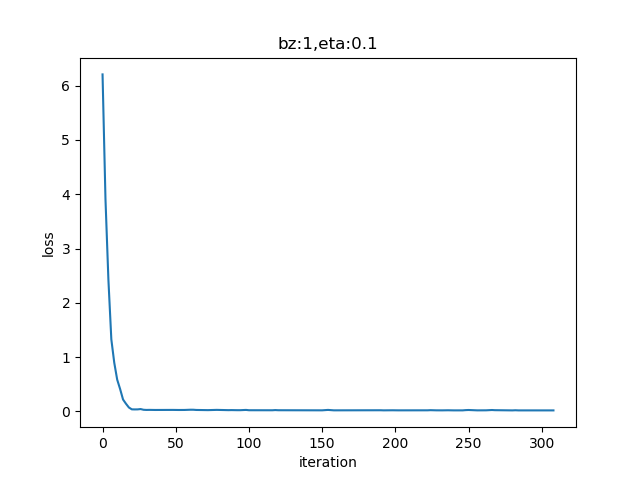
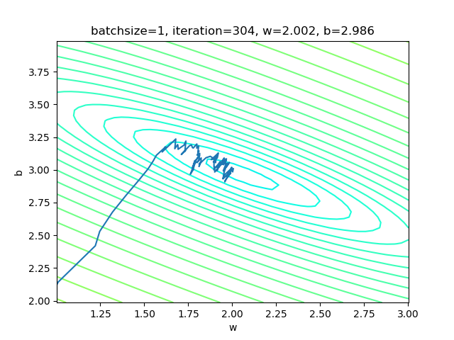
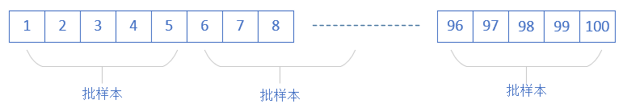
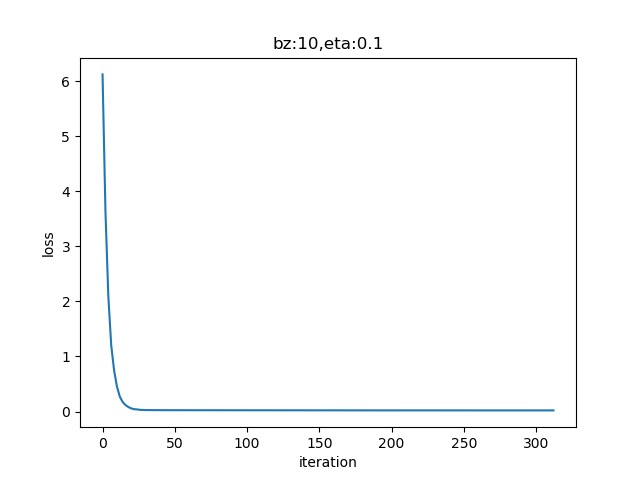
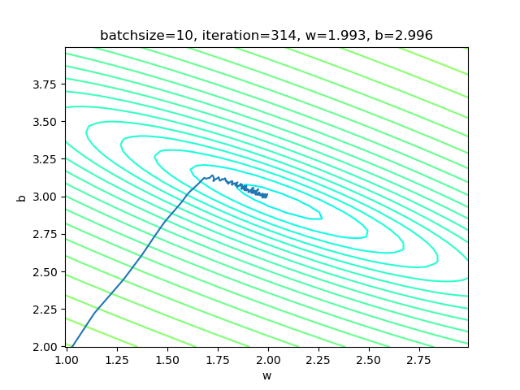
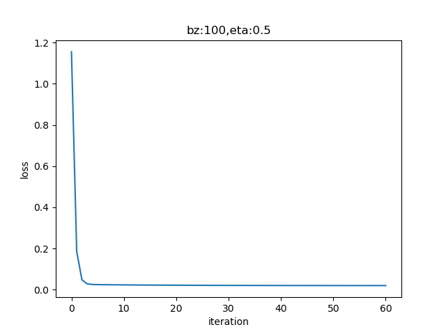
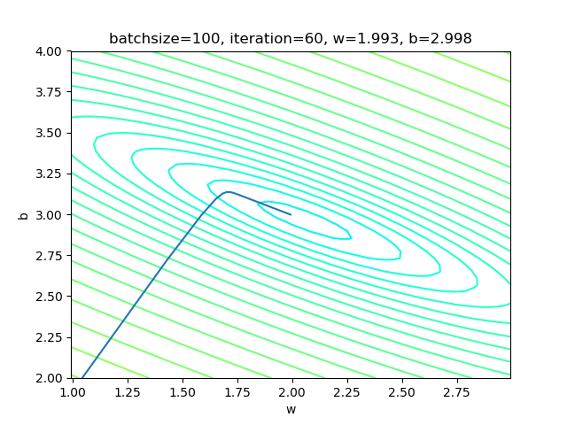

Copyright © Microsoft Corporation. All rights reserved.
适用于[License](https://github.com/Microsoft/ai-edu/blob/master/LICENSE.md)版权许可

## 4.5 梯度下降的三种形式

我们比较一下目前我们用三种方法得到的w和b的值：

|方法|w|b|
|----|----|----|
|最小二乘法|2.056827|2.965434|
|梯度下降法|1.71629006|3.19684087|
|神经网络法|1.71629006|3.19684087|

这个问题的原始值是可能是$w=2，b=3$，由于样本噪音的存在，使用最小二乘法得到了2.05、2.96这样的非整数解，这是完全可以接受的。但是使用梯度下降和神经网络两种方式，都得到1.71、3.19这样的值，准确程度很低。从下图来的神经网络的训练结果来看，拟合直线线是斜着穿过样本点区域的，并没有在正中央的骨架上。


难度是神经网络方法有什么问题吗？

初次使用神经网络，一定有水土不服的地方。最小二乘法是数学方法，所以它的结果是可信的。梯度下降法和神经网络法，实际是一回事儿，只是梯度下降没有使用神经元模型而已。所以，接下来我们研究一下如何调整神经网络的训练过程，先从最简单的梯度下降的三种形式说起。

### 4.5.1 单样本随机梯度下降

SDG(Stochastic Grident Descent)

- 正向计算过程

$$Z^{(1 \times n)}= X^{(1 \times f)} \cdot W^{(f \times n)} + B^{(1 \times n)}$$

其中：

$$f=特征值数，n=神经元数，X=输入值$$

- 特点
  
  - 训练样本：每次使用一个样本数据进行一次训练，更新一次梯度，重复以上过程。
  - 优点：训练开始时损失值下降很快，随机性大，找到最优解的可能性大。
  - 缺点：受单个样本的影响最大，损失函数值波动大，到后期徘徊不前，在最优解附近震荡。不能并行计算。

- 样本访问示意图
  


- 运行结果

设置batch_size=1，即单样本方式：

```Python
if __name__ == '__main__':
    sdr = SimpleDataReader()
    sdr.ReadData()
    params = HyperParameters(1, 1, eta=0.1, max_epoch=100, batch_size=1, eps = 0.02)
    net = NeuralNet(params)
    net.train(sdr)
```    

|损失函数值|梯度下降过程|
|---|---|
|||

左图，由于我们使用了限定的停止条件，即当loss值小于等于0.02时停止训练，所以，单样本方式迭代了300次后达到了精度要求。

右图是w和b共同构成的损失函数等高线图。梯度下降时，开始收敛较快，稍微有些弯曲地向中央地带靠近。到后期波动较大，找不到准确的前进方向，曲折地达到中心附近。

```
epoch=3
3 0 0.020063957628321537 [[1.99545619]] [[2.98248664]]
3 2 0.02004185261702133 [[1.99773058]] [[2.98235673]]
3 4 0.019951095031038736 [[2.0034618]] [[2.98975235]]
[[2.0034618]] [[2.98975235]]
346 machines need the power of the air-conditioner= [[3.68295014]]
w=2.003462,b=2.989752
```

### 4.5.2 小批量样本梯度下降

Mini-Batch Gradient Descent

- 正向计算过程

$$Z^{(m \times n)}= X^{(m \times f)} \cdot W^{(f \times n)}+ B^{(1 \times n)}$$

其中：

$$f=特征值数，m=批样本数，n=神经元数，X=输入样本$$

结合了前两种的优点，又避免了前两者的缺点。


- 特点

  - 训练样本：选择一小部分样本进行训练，更新一次梯度，然后再选取另外一小部分样本进行训练，再更新一次梯度/
  - 优点：不受单样本噪声影响，训练速度较快。
  - 缺点：batch size的数值选择很关键，会影响训练结果。

- 样本访问示意图



- 运行结果

设置batch_size=10：

```Python
if __name__ == '__main__':
    sdr = SimpleDataReader()
    sdr.ReadData()
    params = HyperParameters(1, 1, eta=0.1, max_epoch=100, batch_size=10, eps = 0.02)
    net = NeuralNet(params)
    net.train(sdr)   
```


|损失函数值|梯度下降过程|
|---|---|
|||

右图，梯度下降时，在接近中心时有小波动。图太小看不清楚，可以用matplot工具放大局部来观察。和单样本方式比较，在中心区的波动已经缓解了很多。

```
30 6 0.020151619713975957 [[1.98509847]] [[2.98493634]]
30 8 0.0200003951391974 [[1.99398859]] [[2.99163496]]
epoch=31
31 0 0.01998738985753502 [[1.99554453]] [[2.99262236]]
[[1.99554453]] [[2.99262236]]
346 machines need the power of the air-conditioner= [[3.68308077]]
w=1.995545,b=2.992622
```

小批量的大小通常由以下几个因素决定：

- 更大的批量会计算更精确的梯度，但是回报却是小于线性的
- 极小批量通常难以充分利用多核架构。这决定了最小批量的数值，低于这个值的小批量处理不会减少计算时间
- 如果批量处理中的所有样本可以并行地处理，那么内存消耗和批量大小成正比。对于多硬件设施，这是批量大小的限制因素。
- 某些硬件上使用特点大小的数组时，运行时间会更少，尤其是GPU，通常使用2的幂数作为批量大小可以更快，如32 ~ 256，大模型时尝试用16
- 可能是由于小批量在学习过程中加入了噪声，会带来一些正则化的效果。泛化误差通常在批量大小为1时最好。因为梯度估计的高方差，小批量使用较小的学习率，以保持稳定性，但是降低学习率会使迭代次数增加

在实际工程中，我们通常使用小批量梯度下降形式。


### 4.5.3 全批量样本梯度下降 

Full Batch Gradient Descent

- 正向计算过程

$$Z^{(m \times n)}= X^{(m \times f)} \cdot W^{(f \times n)}+ B^{(1 \times n)}$$

其中：

$$f=特征值数，m=样本数，n=神经元数，X=输入值$$

- 特点

  - 训练样本：每次使用全部数据集进行一次训练，更新一次梯度，重复以上过程。
  - 优点：受单个样本的影响最小，一次计算全体样本速度快，损失函数值没有波动，到达最优点平稳。方便并行计算。
  - 缺点：数据量较大时不能实现（内存限制），训练过程变慢。初始值不同，可能导致获得局部最优解，并非全局最优解。

- 样本访问示意图


- 运行结果

```Python
if __name__ == '__main__':
    sdr = SimpleDataReader()
    sdr.ReadData()
    params = HyperParameters(1, 1, eta=0.1, max_epoch=1000, batch_size=-1, eps = 0.02)
    net = NeuralNet(params)
    net.train(sdr)
```

设置batch_size=-1，即是全批量的意思。

|损失函数值|梯度下降过程|
|---|---|
|||

右图，梯度下降时，在整个过程中只拐了一个弯儿，就到达了中心点。

```
...
epoch=305
305 0 0.02000482599086189
epoch=306
306 0 0.02000284921147815
epoch=307
307 0 0.020000896417436027
epoch=308
308 0 0.019998967317708283
[[1.992927]] [[2.99827748]]
346 machines need the power of the air-conditioner= [[3.68783023]]
```

### 4.5.4 三种方式的比较

||单样本|小批量|全批量|
|---|---|---|---|
|梯度下降过程||||
|批大小|1|10|100|
|迭代次数|304|310|308|
|epoch|3|30|300|

相关的概念：

- Batch Size：批大小，一次训练的样本数量。
- Iteration：迭代，一次正向+一次反向。
- Epoch：所有样本被使用了一次，叫做一个Epoch。

假设一共有样本1000个，batch size=20，则一个Epoch中，需要1000/20=50次Iteration才能训练完所有样本。

从上表可以看出，三种方式的迭代次数差不多，但是epoch的却是10倍的关系，这也与批大小有关。虽然参与计算的样本多时可以提高计算精度，但是整体看迭代次数并没有差异。epoch表示样本被使用的次数，单样本方式，每个样本只被使用了3次，而全批量方式时，每个样本被使用了300次，计算量大大增加。

### 代码位置

ch04, Level5

### 思考与练习

1. 调整学习率、批大小等参数，观察神经网络训练的过程与结果
2. 用纸笔推算一下矩阵运算的维度。假设：
   - X (4x2)
   - W (2x3)
   - B (1x3)
