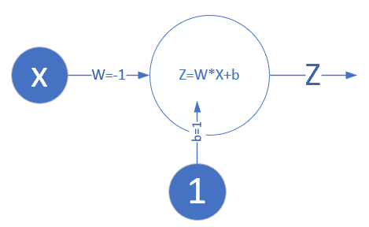

Copyright © Microsoft Corporation. All rights reserved.
  适用于[License](https://github.com/Microsoft/ai-edu/blob/master/LICENSE.md)版权许可

## 4.6 实现逻辑非门

### 4.6.1 原理

单层神经网络，又叫做感知机，它可以轻松实现逻辑与、或、非门。由于逻辑与、或门，需要有两个变量输入，目前我们只学习了单变量输入，所以，我们可以先实现非门。

很多阅读材料上会这样介绍：有公式$z=wx+b$，令$w=-1,b=1$，则：

- 当x=0时，$z = -1 \times 0 + 1 = 1$
- 当x=1时，$z = -1 \times 1 + 1 = 0$
  
如下图所示：



这是人工找到的精确解，如何使用单层神经网络训练出这个结果呢？我们先分析一下输入数据：

||x|y|
|---|---|---|
|样本1|0|1|
|样本2|1|0|

我们可以看作是用一条直线来拟合这两个样本：当x=0的时候，y=1；当x=1的时候，y=0。这样可以利用我们在第4章学到的知识和代码。

### 4.6.2 代码实现

我们先继承自SimpleDataReader，来建立逻辑非门的独有数据集NotGateDataReader类：

```Python
import numpy as np
import matplotlib.pyplot as plt

from HelperClass.SimpleDataReader import *
from Level4_Base import *

class LogicNotGateDataReader(SimpleDataReader):
    # x=0,y=1; x=1,y=0
    def ReadData(self):
        X = np.array([0,1]).reshape(2,1)
        Y = np.array([1,0]).reshape(2,1)
        self.XTrain = X
        self.YTrain = Y
        self.num_train = 2
```

代码中的"from HelperClass.SimpleDataReader import *"，就是从目录HelperClass中引入SimpleDataReader.py的文件内容，而"class LogicNotGateDataReader(SimpleDataReader)"即是继承SimpleDataReader类。然后在子类中覆盖了父类的ReadData()方法，制造出了两行训练数据。

神经网络没有数学解析解，只有近似解，所以我们用以下测试函数来验证。这是一个简单的测试函数，要求网络预测的结果的误差小于0.001：

```Python
def Test(net):
    z1 = net.inference(0)
    z2 = net.inference(1)
    print (z1,z2)
    if np.abs(z1-1) < 0.001 and np.abs(z2-0)<0.001:
        return True
    return False
```

下面是主过程代码：

```Python
if __name__ == '__main__':
     # read data
    sdr = LogicNotGateDataReader()
    sdr.ReadData()
    # create net
    params = HyperParameters(eta=0.1, max_epoch=1000, batch_size=1, eps = 1e-8)
    net = NeuralNet(params)
    net.train(sdr)
    # result
    print("w=%f,b=%f" %(net.W, net.B))
    # predication
    print(Test(net))
    ShowResult(net)
```

在HyperParamaters类中，我们指定了eps=1e-8，意思是当loss值小于1e-8时停止训练，这样可以保证我们下面的Test(net)可以返回True。

### 4.6.3 运行结果

```
......
epoch=203
203 0 1.205633427173616e-08
epoch=204
204 0 1.1092719589749097e-08
epoch=205
205 0 9.919676609047276e-09
[[-0.99971975]] [[0.99984559]]
w=-0.999720,b=0.999846
[[0.99984559]] [[0.00012585]]
True
```

由于设置了eps=1e-8，即损失函数值小于eps时，才算到达精度，因此迭代了205次。最后的w=-0.999，b=0.999，基本上与w=-1，b=1的数学解析解近似。只要误差小于0.001，就算达到精度了。下图中两个点(0,1)，(1,0)都被我们训练出来的直线拟合住了：


### 代码位置

ch04, Level5