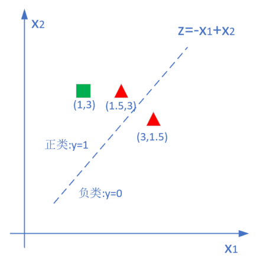

Copyright © Microsoft Corporation. All rights reserved.
  适用于[License](https://github.com/Microsoft/ai-edu/blob/master/LICENSE.md)版权许可

## 6.1 线性二分类原理

### 6.1.1 线性分类和线性回归的异同

此原理对线性和非线性二分类都适用。

回忆一下前面学习过的线性回归，通过用均方差函数的误差反向传播的方法，不断矫正拟合直线的角度（Weights）和偏移（Bias），因为均方差函数能够准确地反映出当前的拟合程度。那么在线性分类中，我们能不能采取类似的方法呢？

线性分类，试图在含有两种样本的空间中划出一条分界线，让双方截然分开，就好像是中国象棋的棋盘中的楚河汉界一样。与线性回归相似的地方是，两者都需要划出那条“直线”来，但是不同的地方也很明显：

||线性回归|线性分类|
|---|---|---|
|相同点|需要在样本群中找到一条直线|需要在样本群中找到一条直线|
|不同点|用直线来拟合所有样本，使得各个样本到这条直线的距离尽可能最短|用直线来分割所有样本，使得正例样本和负例样本尽可能分布在直线两侧|

可以看到线性回归中的目标--“距离最短”，还是很容易理解的，但是线性分类的目标--“分布在两侧”，用数学方式如何描述呢？我们可以有代数和几何两种方式来描述：

- 代数方式：通过一个分类函数计算所有样本点在经过线性变换后的概率值，使得正例样本的概率大于0.5，而负例样本的概率小于0.5
- 几何方式：下图中，让所有正例样本处于直线的上方，所有负例样本处于直线的下方

### 6.1.2 二分类函数

对率函数Logistic Function，即是激活函数，又可以当作二分类的分类函数。而在很多不太正规的文字材料中，把这两个概念混用了，比如下面这个说法：“我们在最后使用Sigmoid激活函数来做二分类”，这个说法是不恰当的。在本书中，我们会根据不同的任务区分激活函数和分类函数这两个概念，在二分类任务中，使用“对率函数”的叫法。

- 公式

$$a(z) = \frac{1}{1 + e^{-z}}$$

- 导数

$$a^{'}(z) = a(z)(1 - a(z))$$

- 输入值域

$$[-\infty, \infty]$$

- 输出值域

$$[0,1]$$

- 函数图像

- 使用方式

此函数实际上是一个概率计算，它把$[-\infty, \infty]$之间的任何数字都压缩到[0,1]之间，返回一个概率值，这就是它的工作原理。

训练时，一个样本x在经过神经网络的最后一层的矩阵运算结果作为输入z，经过Logistic后，输出一个[0,1]之间的预测值。我们假设这个样本的标签值为0（属于负类，另外一类是第1类属于正类），如果其预测值越接近0，就越接近标签值，那么误差越小，反向传播的力度就越小。

推理时，我们预先设定一个阈值，比如上图中的红线，我们设置阈值=0.5，则当推理结果大于0.5时，认为是正类；小于0.5时认为是负类；等于0.5时，根据情况自己定义。阈值也不一定就是0.5，也可以是0.65等等，阈值越大，准确率越高，召回率越低；阈值越小则相反。

比如：
- input=2时，output=0.88，而0.88>0.5，算作正例
- input=-1时，output=0.27，而0.27<0.5，算作负例

### 6.1.3 二分类过程

下面我们以单样本双特征值为例来说明神经网络的二分类过程，这是用代数方式来解释其工作原理。

1. 正向计算

$$
z = x_1 w_1+ x_2 w_2 + b  \tag{1}
$$

2. 分类计算

$$
a={1 \over 1 + e^{-z}} \tag{2}
$$

3. 损失函数计算

$$
loss = -[y \ln (a)+(1-y) \ln (1-a)] \tag{3}
$$

用下图举例来说明计算过程：

假设：

1. 绿色点为正例，标签值y=1，坐标值为(1, 3)
2. 红色点为负例，标签值y=0，坐标值分别为(1.5, 3)和(3, 1.5)
3. 初始值$w_1=-1，w_2=1，b=0$，所以有$z=-1\cdot x_1+1 \cdot x_2 + 0$，即$z=-x_1+x_2$。如果令z=0，即Logistic(z)=0.5，是两个区域的分割线（面），则有平面上的直线$x_2=x_1$

在上面三个点中，绿色点和右下角的红色点，是分类正确的点，而中间的红色点是分类错误的点。下面我们把公式1，2，3代入具体的值，来看一下神经网络如何做分类的。

1. 把绿色点代入公式，此时y=1：

$$z=-1+3=2 \tag{见公式1}$$
$$a=\frac{1}{1+e^{-2}}=0.88 \tag{见公式2}$$
$$loss=-[1 \cdot \ln 0.88 + 0]=0.127 \tag{见公式3}$$

2. 把左上方的红色点代入公式，此时y=0：

$$z=-1.5+3=1.5 \tag{见公式1}$$
$$a=\frac{1}{1+e^{-1.5}}=0.817 \tag{见公式2}$$
$$loss=-[0 + (1-0) \ln (1-0.817)]=1.7 \tag{见公式3}$$

3. 把右下方的红色点代入公式，此时y=0：

$$z=-3+1.5=-1.5 \tag{见公式1}$$
$$a=\frac{1}{1+e^{1.5}}=0.182 \tag{见公式2}$$
$$loss=-[0 + (1-0) \ln (1-0.182)]=0.2 \tag{见公式3}$$

对比总结如下表：

|点ID|坐标值|z值|a值|loss值|y值|分类情况|
|---|---|---|---|---|---|---|
|1|(1,3)|2|0.88|0.127|1|正确|
|2|(1.5,3)|1.5|0.817|1.7|0|错误|
|3|(3,1.5)|-1.5|0.182|0.2|0|正确|

- 在正例情况y=1时，a如果越靠近1，表明分类越正确，此时损失值会越小。点1就是这种情况：a=0.88，距离1不远；loss值0.127，不算很大
- 在负例情况y=0时，a如果越靠近0，表明分类越正确，此时损失值会越小。点3就是这种情况：a=0.182，距离0不远；loos值0.2，不算很大
- 点2是分类错误的情况，a=0.817，距离0远，距离1反而近，所以它的loss=1.7，从与其它两个点比较的相对值来看，是非常大的，这样误差就大，反向传播的力度也大

### 6.1.4 二分类的几何原理

我们再观察一下下面这张分类正确的图：

假设绿色方块为正类：标签值$y=1$，红色三角形为负类：标签值$y=0$。

从几何关系上理解，如果我们有一条直线，其公式为：$z = w \cdot x_1+b$，如图中的虚线所示，则所有正类的样本的x2都大于z，而所有的负类样本的x2都小于z，那么这条直线就是我们需要的分割线。用正例的样本来表示：

$$
x_2 > z，即正例满足条件：x_2 > w \cdot x_1 + b \tag{4}
$$

那么神经网络用矩阵运算+分类函数+损失函数这么复杂的流程，其工作原理是什么呢？

经典机器学习中的SVM确实就是用这种思路来解决这个问题的，即一个类别的所有样本在分割线的一侧，而负类样本都在线的另一侧。神经网络的正向公式如公式1，2所示，当a>0.5时，判为正类。当a<0.5时，判为负类。z=0即a=0.5时为分割线：

我们用正例来举例：

$$a = Logistic(z) = {1 \over 1 + e^{-z}} > 0.5$$

做公式变形，再两边取自然对数，可以得到：

$$z > 0$$

即：
$$
z = x_1 \cdot w_1 + x_2 \cdot w_2 + b > 0
$$
对上式做一下变形，把x2放在左侧，其他项放在右侧：
$$
x_2 > - {w_1 \over w_2}x_1 - {b \over w_2} \tag{5}
$$
简化一下两个系数，令w'=-w1/w2，b'=-b/w2：
$$
x_2 > w' \cdot x_1 + b' \tag{6}
$$
比较一下公式4和6，
$$
x_2 > w \cdot x_1 + b \tag{4}
$$

一模一样！这就说明神经网络的工作原理和我们在二维平面上的直观感觉是相同的，即当x2大于一条直线时，会被判为正例。如果用负例举例，其结果将会是：$a<0.5，z<0，x_2 \lt w \cdot x_1 + b$，即点处于直线下方。

由此，我们还得到了一个额外的收获，即：

$$w' = - w1 / w2 \tag{7}$$

$$b' = -b/w2 \tag{8}$$

我们可以使用神经网络计算出$w1，w2，b$三个值以后，换算成$w'，b'$，以便在二维平面上画出分割线，来直观地判断神经网络训练结果的正确性。

### 6.1.5 对数几率的来历

经过数学推导后可以知道，神经网络实际也是在做这样一件事：经过调整w和b的值，把所有正例的样本都归纳到大于0.5的范围内，所有负例都小于0.5。但是如果只说大于或者小于，无法做准确的量化计算，所以用一个对率函数来模拟。

说到对率函数，还有一个问题，它为啥叫做“对数几率”函数呢？从哪里看出是“对数”了？“几率”是什么意思呢？

我们举例说明：假设有一个硬币，抛出落地后，得到正面的概率是0.5，得到反面的概率是0.5，这两个概率叫做probability。如果用正面的概率除以反面的概率，0.5/0.5=1，这个数值叫做odds，几率。

泛化一下，如果正面的概率是a，则反面的概率就是1-a，则几率等于：

$$odds = \frac{a}{1-a} \tag{9}$$

上式中，如果a是把样本x的预测为正例的可能性，那么1-a就是其负例的可能性，a/(1-a)就是正负例的比值，称为几率(odds)，反映了x作为正例的相对可能性，而对几率取对数就叫做对数几率(log odds, logit)。

如果假设概率如下表：

|a|0|0.1|0.2|0.3|0.4|0.5|0.6|0.7|0.8|0.9|1|
|--|--|--|--|--|--|--|--|--|--|--|--|
|1-a|1|0.9|0.8|0.7|0.6|0.5|0.4|0.3|0.2|0.1|0|
|odds|0|0.11|0.25|0.43|0.67|1|1.5|2.33|4|9|无穷大|
|ln(odds)|N/A|-2.19|-1.38|-0.84|-0.4|0|0.4|0.84|1.38|2.19|N/A|

可以看到0dds的值不是线性的，不利于分析问题，所以在表中第4行对odds取对数，可以得到一组成线性关系的值，即：

$$\ln \frac{a}{1-a} = xw + b \tag{10}$$

对公式10两边取自然指数：

$$\frac{a}{1-a}=e^{xw+b} \tag{11}$$

对公式11取倒数：

$$\frac{1-a}{a}=e^{-(xw+b)}$$

变形：

$$\frac{1}{a}-1=e^{-(xw+b)}$$
$$\frac{1}{a}=1+e^{-(xw+b)}$$
$$a=\frac{1}{1+e^{-(xw+b)}}$$

令$z=e^{-(xw+b)}$：

$$a=\frac{1}{1+e^{-z}} \tag{12}$$

公式12就是公式2！对数几率的函数形式可以认为是这样得到的。

以上推导过程，实际上就是用线性回归模型的预测结果来逼近样本分类的对数几率。这就是为什么它叫做逻辑回归(logistic regression)，但其实是分类学习的方法。这种方法的优点如下：

- 直接对分类可能性建模，无需事先假设数据分布，避免了假设分布不准确所带来的问题
- 不仅预测出类别，而是得到了近似的概率，这对许多需要利用概率辅助决策的任务很有用
- 对率函数是任意阶可导的凸函数，有很好的数学性，许多数值优化算法都可以直接用于求取最优解

### 参考资料

- 周志华老师的西瓜书

