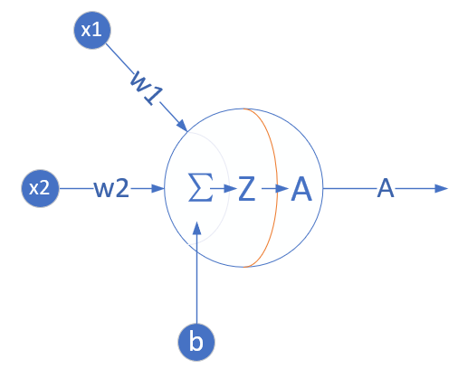
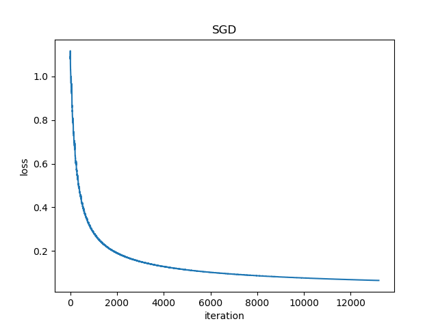

<!--Copyright © Microsoft Corporation. All rights reserved.
  适用于[License](https://github.com/Microsoft/ai-edu/blob/master/LICENSE.md)版权许可-->
  
## 6.2 用神经网络实现线性二分类

我们先看看如何用神经网络在两组不同标签的样本之间画一条明显的分界线。这条分界线可以是直线，也可以是曲线。这就是二分类问题。如果只画一条分界线的话，无论是直线还是曲线，我们可以用一支假想的笔（即一个神经元），就可以达到目的，也就是说笔的走向，完全依赖于这一个神经元根据输入信号的判断。

再看楚汉城池示意图，在两个颜色区域之间似乎存在一条分割的直线，即线性可分的。

1. 从视觉上判断是线性可分的，所以我们使用单层神经网络即可；
2. 输入特征是经度和纬度，所以我们在输入层设置两个输入X1=经度，X2=维度；
3. 最后输出的是一个二分类，分别是楚汉地盘，可以看成非0即1的二分类问题，所以我们只用一个输出单元就可以了。

### 6.2.1 定义神经网络结构

根据前面的猜测，看来我们只需要一个二入一出的神经元就可以搞定。这个网络只有输入层和输出层，由于输入层不算在内，所以是一层网络，见图6-3。



图6-3 完成二分类任务的神经元结构

与上一章的网络结构图的区别是，这次我们在神经元输出时使用了分类函数，所以有个A的输出，而不是以往的Z的直接输出。

#### 输入层

输入经度$x_1$和纬度$x_2$两个特征：

$$
X=\begin{pmatrix}
x_{1} & x_{2}
\end{pmatrix}
$$

#### 权重矩阵

输入是2个特征，输出一个数，则$W$的尺寸就是2x1：

$$
W=\begin{pmatrix}
w_{1} \\ w_{2}
\end{pmatrix}
$$

B的尺寸是1x1，行数永远是1，列数永远和W一样。

$$
B=\begin{pmatrix}
b_{1}
\end{pmatrix}
$$

#### 输出层

$$
\begin{aligned}    
z &= X \cdot W + B
=\begin{pmatrix}
    x_1 & x_2
\end{pmatrix}
\begin{pmatrix}
    w_1 \\ w_2
\end{pmatrix} + (b_1) \\
&=x_1 \cdot w_1 + x_2 \cdot w_2 + b_1 
\end{aligned}
\tag{1}
$$
$$a = Logistic(z) \tag{2}$$

#### 损失函数

二分类交叉熵损失函数：

$$
loss(w,b) = -[yln a+(1-y)ln(1-a)] \tag{3}
$$

### 6.2.2 反向传播

我们在6.1节已经推导了loss对z的偏导数，结论为$A-Y$。接下来，我们求loss对w的导数。本例中，w的形式是一个2行1列的向量，所以求w的偏导时，要对向量求导：

$$
\frac{\partial loss}{\partial w}=
\begin{pmatrix}
    {\partial loss / \partial w_1} \\ 
    {\partial loss / \partial w_2}
\end{pmatrix}
$$
$$
=\begin{pmatrix}
 \frac{\partial loss}{\partial z}\frac{\partial z}{\partial w_1} \\
 \\
 \frac{\partial loss}{\partial z}\frac{\partial z}{\partial w_2}   
\end{pmatrix}
=\begin{pmatrix}
    (a-y)x_1 \\
    (a-y)x_2
\end{pmatrix}
$$
$$
=(x_1 \ x_2)^T (a-y) \tag{4}
$$

上式中$x_1x_2$是一个样本的两个特征值。如果是多样本的话，公式4将会变成其矩阵形式，以3个样本为例：

$$
{\partial J(w,b) \over \partial w}=
\begin{pmatrix}
    x_{11} & x_{12} \\
    x_{21} & x_{22} \\
    x_{31} & x_{32} 
\end{pmatrix}^T
\begin{pmatrix}
    a_1-y_1 \\
    a_2-y_2 \\
    a_3-y_3 
\end{pmatrix}
$$
$$
=X^T(A-Y) \tag{5}
$$

### 6.2.3 代码实现

我们先第5章的HelperClass5中，把一些已经写好的类copy过来，然后稍加改动，就可以满足我们的需要了。

由于以前我们的神经网络只会做线性回归，现在多了一个做分类的技能，所以我们加一个枚举类型，可以让调用者通过指定参数来控制神经网络的功能。

```Python
class NetType(Enum):
    Fitting = 1,
    BinaryClassifier = 2,
    MultipleClassifier = 3,
```

然后在超参类里把这个新参数加在初始化函数里：

```Python
class HyperParameters(object):
    def __init__(self, eta=0.1, max_epoch=1000, batch_size=5, eps=0.1, net_type=NetType.Fitting):
        self.eta = eta
        self.max_epoch = max_epoch
        self.batch_size = batch_size
        self.eps = eps
        self.net_type = net_type
```
再增加一个Logistic分类函数：

```Python
class Logistic(object):
    def forward(self, z):
        a = 1.0 / (1.0 + np.exp(-z))
        return a
```

以前只有均方差函数，现在我们增加了交叉熵函数，所以新建一个类便于管理：

```Python
class LossFunction(object):
    def __init__(self, net_type):
        self.net_type = net_type
    # end def

    def MSE(self, A, Y, count):
        ...

    # for binary classifier
    def CE2(self, A, Y, count):
        ...
```
上面的类是通过初始化时的网络类型来决定何时调用均方差函数(MSE)，何时调用交叉熵函数(CE2)的。

下面修改一下NeuralNet类的前向计算函数，通过判断当前的网络类型，来决定是否要在线性变换后再调用sigmoid分类函数：

```Python
class NeuralNet(object):
    def __init__(self, params, input_size, output_size):
        self.params = params
        self.W = np.zeros((input_size, output_size))
        self.B = np.zeros((1, output_size))

    def __forwardBatch(self, batch_x):
        Z = np.dot(batch_x, self.W) + self.B
        if self.params.net_type == NetType.BinaryClassifier:
            A = Sigmoid().forward(Z)
            return A
        else:
            return Z
```

最后是主过程：

```Python
if __name__ == '__main__':
    ......
    params = HyperParameters(eta=0.1, max_epoch=100, batch_size=10, eps=1e-3, net_type=NetType.BinaryClassifier)
    ......
```

与以往不同的是，我们设定了超参中的网络类型是BinaryClassifier。

### 6.2.4 运行结果

图6-4所示的损失函数值记录很平稳地下降，说明网络收敛了。



图6-4 训练过程中损失函数值的变化

最后几行的打印输出：

```
......
99 19 0.20742586902509108
W= [[-7.66469954]
 [ 3.15772116]]
B= [[2.19442993]]
A= [[0.65791301]
 [0.30556477]
 [0.53019727]]
```

打印出来的W,B的值对我们来说是几个很神秘的数字，下一节再解释。A值是返回的预测结果：

1. 经纬度相对值为(0.58,0.92)时，概率为0.65，属于汉；
2. 经纬度相对值为(0.62,0.55)时，概率为0.30，属于楚；
3. 经纬度相对值为(0.39,0.29)时，概率为0.53，属于汉。

分类的方式是，可以指定当A > 0.5时是正例，A <= 0.5时就是反例。有时候正例反例的比例不一样或者有特殊要求时，也可以用不是0.5的数来当阈值。

### 代码位置

ch06, Level1
