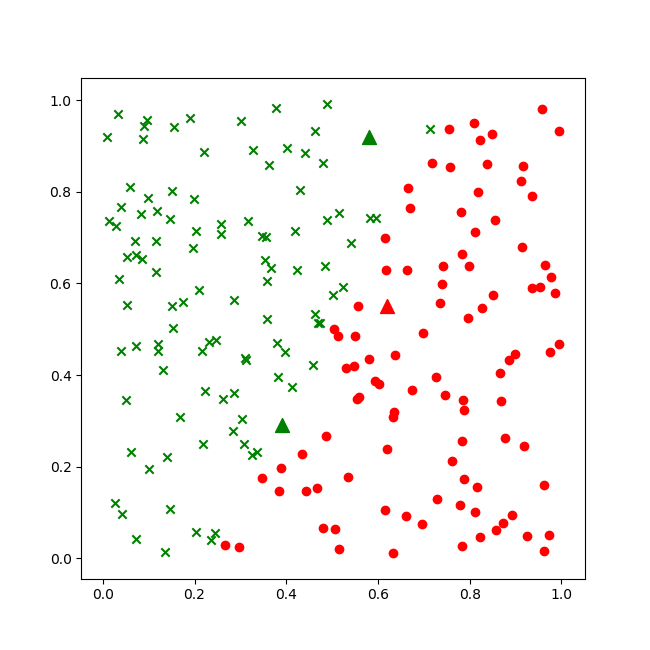

Copyright © Microsoft Corporation. All rights reserved.
  适用于[License](https://github.com/Microsoft/ai-edu/blob/master/LICENSE.md)版权许可

## 6.3 二分类结果可视化

### 6.3.1 可视化的重要性

我们虽然得到了结果，但都是一些神秘的数字，我们如何知道它们是正确还是错误的呢？

后面我们会讲到，在实际的工程实践中，一般我们会把样本分成训练集、验证集、测试集，用测试集来测试训练结果的正确性。在本例中我们没有这样做，原因有二：
1. 样本数据量比较少，一共只有200个样本，如果再分成两部分，会造成数据集覆盖不全面，存在很大的差异，对训练、验证、测试都没有帮助
2. 由于本例的数据特征比较少，所以我们有更好的手段：可视化。在神经网络学习初期，可视化的训练过程与结果会对读者有巨大的帮助。

### 6.3.2 

那么下面的这几个关于W,B数字如何可视化呢？

```
W= [[-18.18569771   6.49279869]]
B= [[7.77920305]]
```

铁柱：这是一个线性二分类问题，所以如果我们能够根据以这个训练结果，在图上画出一条直线来分割两个区域，是不是就很直观了呢？


$$
Z = W \cdot X+B=w_{1} \cdot x_1 + w_{2} \cdot x_2 + b
$$
$$
A=Sigmoid(Z)
$$

铁柱：当A大于0.5时，属于汉，当A小于0.5时，属于楚。那么A=0.5时，就是边界啦！

木头：哦！那我再写一下公式。
$$A = 0.5, 相当于Z=0$$
$$Z = W \cdot X+B=w_{1} \cdot x_1 + w_{2} \cdot x_2 + b = 0$$

铁柱：再把x2留在等式左侧，其它的挪到右侧去，就可以得到一条直线的方程了。

$$w_{2} \cdot x_2 = -w_{1} \cdot x_1 - b$$
$$x2 = -{w_1 \over w_2}x_1 - {b \over w_2} \tag{1}$$

好了，这就是标准的直线方程$y=ax+b$的形式了。这个公式等同于二分类原理中的公式14，15。

木头：好，我用Python代码实现一下。

先在程序运行前，展示一下样本数据：

```Python
def ShowData(X,Y):
    for i in range(X.shape[1]):
        if Y[0,i] == 0:
            plt.plot(X[0,i], X[1,i], '.', c='r')
        elif Y[0,i] == 1:
            plt.plot(X[0,i], X[1,i], 'x', c='g')
        # end if
    # end for
    plt.show()
```

在程序运行后，展示一下结果：

```Python
def ShowResult(X,Y,W,B,xt):
    for i in range(X.shape[1]):
        if Y[0,i] == 0:
            plt.plot(X[0,i], X[1,i], '.', c='r')
        elif Y[0,i] == 1:
            plt.plot(X[0,i], X[1,i], 'x', c='g')
        # end if
    # end for

    w12 = -W[0,0]/W[0,1]
    b12 = -B[0,0]/W[0,1]

    x = np.linspace(0,1,10)
    y = w12 * x + b12
    plt.plot(x,y)

    for i in range(xt.shape[1]):
        plt.plot(xt[0,i], xt[1,i], '^', c='b')

    plt.axis([-0.1,1.1,-0.1,1.1])
    plt.show()
```
上面代码中的计算w12,b12的code就是根据公式1来的，只不过我们的W的定义是(w1, w2)，而python是zero-based，所以:

$$w1 = W[0,0]$$

$$w2 = W[0,1]$$

$$b = B[0,0]$$

简单说，就是把所有下标都减1。再改一下主程序，调用上面两段代码：

```Python
# 主程序
if __name__ == '__main__':
    # SGD, MiniBatch, FullBatch
    method = "SGD"
    # read data
    XData,YData = ReadData(x_data_name, y_data_name)
    X, X_norm = NormalizeData(XData)
    ShowData(XData, YData)
    Y = ToBool(YData)
    W, B = train(method, X, Y, ForwardCalculationBatch, CheckLoss)
    print("W=",W)
    print("B=",B)
    xt = np.array([5,1,6,9,5,5]).reshape(2,3,order='F')
    result, xt_norm = Inference(W,B,X_norm,xt)
    print("result=",result)
    print(np.around(result))
    ShowResult(X,YData,W,B,xt_norm)
```

下图为样本数据：


下图为结果：


可以看到：
1. 分割线非常准确
2. 三个蓝色三角点是求解问题的三个坐标

需要注意的问题：
1. 我们用归一化前的数据画的第一张图，所以坐标范围是[0,10][0,10]
2. 我们用归一化后的数据画的第二张图，所以坐标范围是[0,1][0,1]


可是这三个结果对不对呢？目前我们还没有什么好的手段来判定，只好借助于可视化的方式，添加如下方法：

```Python
def ShowResult(net, dataReader):
    fig = plt.figure(figsize=(6.5,6.5))
    X,Y = dataReader.GetWholeTrainSamples()
    for i in range(200):
        if Y[i,0] == 1:
            plt.scatter(X[i,0], X[i,1], marker='x', c='g')
        else:
            plt.scatter(X[i,0], X[i,1], marker='o', c='r')
        #end if
    #end for

    x = np.array([0.58,0.92,0.62,0.55,0.39,0.29]).reshape(3,2)
    a = net.inference(x)
    print("A=", a)
    for i in range(3):
        if a[i,0] > 0.5:
            plt.scatter(x[i,0], x[i,1], marker='^', c='g', s=100)
        else:
            plt.scatter(x[i,0], x[i,1], marker='^', c='r', s=100)
        #end if
    #end for
    
    plt.show()
```

前半部分把所有200个样本都显示出来，正例用绿色的叉子来表示，负例用红色的圆点来表示。

后半部分是先做推理，把三组坐标值变成一个批数据，送到神经网络中，然后根据得到的结果A，包含三行结果数据，然后以0.5为门限值，绘制绿色的三角形（正例）或者红色的三角形（负例）。

最后得到下图：



可以看到上方的两个三角形基本处于正确的区域，最小面的绿色三角形处于边界地区，不是很容易分辨。咱们在后面再解决这个问题。

代码位置：ch06, Level0, Level1, Level2