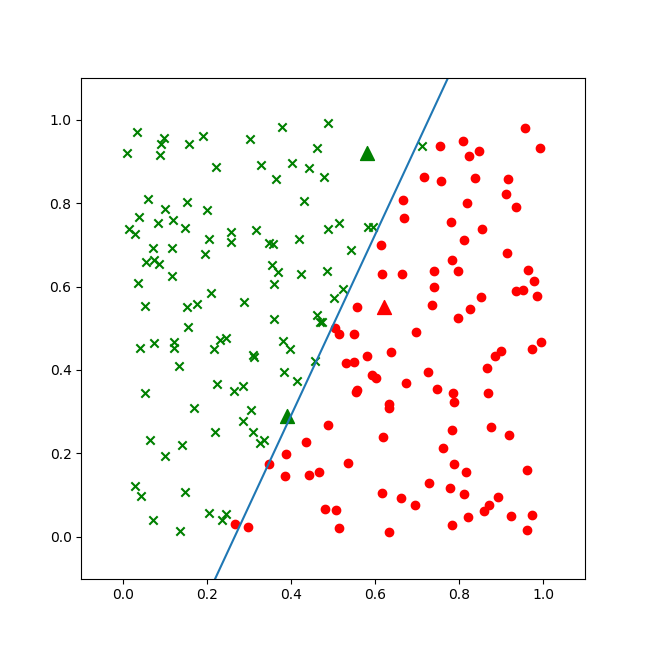
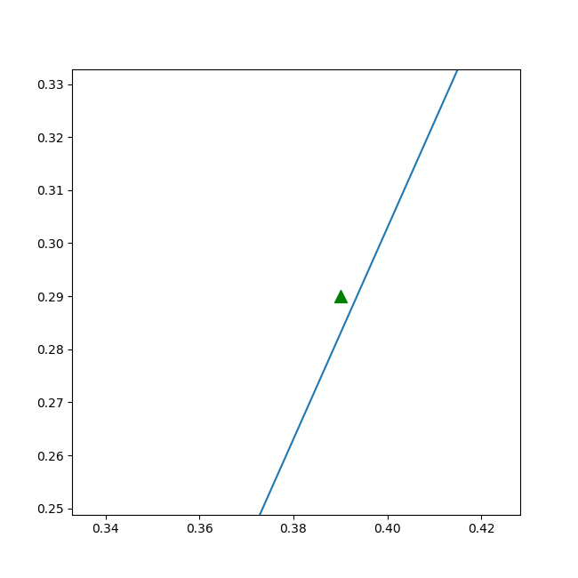

<!--Copyright © Microsoft Corporation. All rights reserved.
  适用于[License](https://github.com/Microsoft/ai-edu/blob/master/LICENSE.md)版权许可-->

## 6.4 二分类结果可视化

### 6.4.1 可视化的重要性

我们虽然得到了结果，但都是一些神秘的数字，我们如何知道它们是正确还是错误的呢？

后面我们会讲到，在实际的工程实践中，一般我们会把样本分成训练集、验证集、测试集，用测试集来测试训练结果的正确性。在本例中我们没有这样做，原因有二：

1. 样本数据量比较少，一共只有200个样本，如果再分成两部分，会造成数据集覆盖不全面，存在很大的差异，对训练、验证、测试都没有帮助
2. 由于本例的数据特征比较少，所以我们有更好的手段：可视化。在神经网络学习初期，可视化的训练过程与结果会对读者有巨大的帮助。

神经网络的可视化，说简单也很简单，说难也很难，关键是对框架系统的理解，对运行机制和工作原理的理解，掌握了这些，可视化就会使一件轻而易举且令人愉快的事情。

### 6.4.2 权重值的含义

在6.2节中的训练结果如下，这几个关于W,B数字如何解读呢？

```
W= [[-7.66469954]
 [ 3.15772116]]
B= [[2.19442993]]
A= [[0.65791301]
 [0.30556477]
 [0.53019727]]
``````

在6.1节中我们一起学习了线性二分类的原理，其中提到了如果我们能够根据训练结果，在图上画出一条直线来分割正例和负例两个区域，是不是就很直观了呢？

$$
z = x_{1} \cdot w_1 + x_{2} \cdot w_2 + b \tag{1}
$$
$$
a=Logistic(z) \tag{2}
$$

对公式2来说，当a大于0.5时，属于正例（属于汉），当a小于0.5时，属于负例（属于楚）。那么a=0.5时，就是楚汉边界啦！

$$a = 0.5, 相当于z=0$$
$$z = x_{1} \cdot w_1 + x_{2} \cdot w_2 + b = 0$$

把x2留在等式左侧，其它的挪到右侧去，就可以得到一条直线的方程了：

$$x_{2} \cdot w_2 = -x_{1} \cdot w_1 - b$$
$$x_2 = -{w_1 \over w_2}x_1 - {b \over w_2} \tag{3}$$

好了，这就是标准的直线方程$y=ax+b$的形式了。这个公式等同于二分类原理中的公式7，8。

### 6.4.3 代码实现

用Python代码实现公式3如下：

```Python
def draw_split_line(net):
    b12 = -net.B[0,0]/net.W[1,0]
    w12 = -net.W[0,0]/net.W[1,0]
    print(w12,b12)
    x = np.linspace(0,1,10)
    y = w12 * x + b12
    plt.plot(x,y)
    plt.axis([-0.1,1.1,-0.1,1.1])
    plt.show()
```
上面代码中的计算w12,b12就是根据公式3来的，只不过我们的W的定义是(w1, w2)，而python是zero-based，所以：
$w_1 = W[0,0]，w_2 = W[0,1]，b = B[0,0]$。

同时需要展示样本数据，以便判断分割线和样本数据的吻合程度：

```Python
def draw_source_data(net, dataReader):
    fig = plt.figure(figsize=(6.5,6.5))
    X,Y = dataReader.GetWholeTrainSamples()
    for i in range(200):
        if Y[i,0] == 1:
            plt.scatter(X[i,0], X[i,1], marker='x', c='g')
        else:
            plt.scatter(X[i,0], X[i,1], marker='o', c='r')
        #end if
    #end for
```

最后还可以显示一下三个预测点的位置，看看是否正确：

```Python
def draw_predicate_data(net):
    x = np.array([0.58,0.92,0.62,0.55,0.39,0.29]).reshape(3,2)
    a = net.inference(x)
    print("A=", a)
    for i in range(3):
        if a[i,0] > 0.5:
            plt.scatter(x[i,0], x[i,1], marker='^', c='g', s=100)
        else:
            plt.scatter(x[i,0], x[i,1], marker='^', c='r', s=100)
        #end if
    #end for
```
主程序：

```Python
# 主程序
if __name__ == '__main__':
    ......
    # show result
    draw_source_data(net, reader)
    draw_predicate_data(net)
    draw_split_line(net)
    plt.show()
```

### 6.4.4 运行结果

图6-8为二分类结果。



图6-8 稍有欠缺的二分类结果

虽然蓝色的分割线大体分开了楚汉两国，但是细心的读者会发现在上下两端，还是绿点在分割线右侧，而红点在分割线左侧的情况。这说明我们的神经网络的训练精度不够。所以，稍微改一下超参，再训练一遍：

```Python
params = HyperParameters(eta=0.1, max_epoch=10000, batch_size=10, eps=1e-3, net_type=NetType.BinaryClassifier)
```
把max_epoch从100改成了10000，再跑一次。


图6-9 训练过程中损失函数值的变化

从图6-9的曲线看，损失函数值一直在下降，说明网络还在继续收敛。再看图6-10的直线位置，已经比较完美地分开了红色和绿色区域。


图6-10 比较完美的二分类的结果

三个三角点是求解问题的三个坐标，其中第三个三角点处于分割线附近，用肉眼不是很容易分得出来，看打印输出：

```
W= [[-42.62417571]
 [ 21.36558218]]
B= [[10.5773054]]
A= [[0.99597669]
 [0.01632475]
 [0.53740392]]
w12= 1.994992477013739
b12= -0.49506282174794675
```

前两个点的概率分别是0.995和0.016，可以明确地区分正例负例，第三个点是0.537，大于0.5，可以算作正例。

在matplot的绘图控件中，我们也可以放大局部观察，可以图6-11的细节。



图6-11 放大后的细节，绿色点确实在直线左侧，分类正确

第三个点位于左侧正例区域。

好了，我们已经自信满满地找到了解释神经网络工作的原理，有数值计算验证，有公式推导，有图形显示，至少可以自圆其说了。但实际情况是不是这样呢？有没有更高深的原理还没有接触到呢？暂且留下这个问题，留在以后的章节去继续学习。

### 代码位置

ch06, Level2