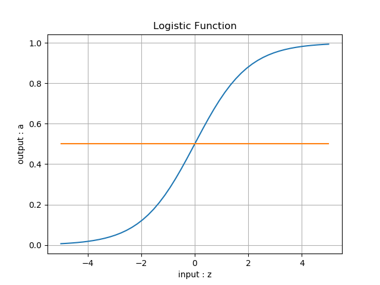
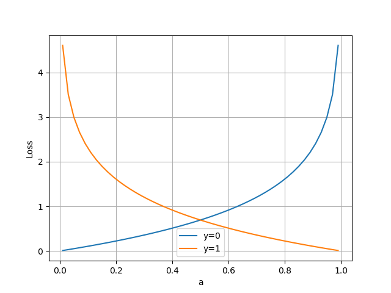

<!--Copyright © Microsoft Corporation. All rights reserved.
  适用于[License](https://github.com/Microsoft/ai-edu/blob/master/LICENSE.md)版权许可-->

## 6.6 用双曲正切函数做二分类函数

此节为扩展阅读内容，通过对源代码的一系列修改，最终可以达到用双曲正切函数做分类函数的目的。虽然这个“需求”是我们虚构出来的，但是通过动手实践这一过程，可以加深对分类函数、损失函数、反向传播等基本概念的工作原理的理解，达到举一反三的目的。

### 6.6.1 提出问题

在二分类问题中，一般都使用对率函数（Logistic Function，常被称为Sigmoid Function）作为分类函数，并配合二分类交叉熵损失函数：

$$Logisitc(z_i) = \frac{1}{1 + e^{-z_i}} \rightarrow a_i \tag{1}$$

$$loss(w,b)=-[y_i \ln a_i + (1-y_i) \ln (1-a_i)] \tag{2}$$

还有一个与对率函数长得非常像的函数，即双曲正切函数（Tanh Function），公式如下：

$$Tanh(z) = \frac{e^{z} - e^{-z}}{e^{z} + e^{-z}} = \frac{2}{1 + e^{-2z}} - 1 \tag{3}$$

**提出问题：能不能用双曲正切函数作为分类函数呢？**

比较一下二者的函数图像，如表6-9。

表6-9 对率函数和双曲正切函数的比较

|对率函数|双曲正切函数|
|---|---|
|||
|正负类分界线：a=0.5|正负类分界线：a=0|

对于对率函数来说，一般使用0.5作为正负类的分界线，那我们会自然地想到，对于双曲正切函数来说，可以使用0作为正负类的分界线。

所谓分界线，其实只是人们理解神经网络做二分类的一种方式，对于神经网络来说，其实并没有分界线这个概念，它要做的是通过线性变换，尽量把正例向上方推，把负例向下方推。

### 6.6.2 修改前向计算和反向传播函数

现在我们就开始动手实践，第一步显然是要用双曲正切来代替对率函数，修改正向计算的同时，不要忘记修改反向传播的代码。

#### 增加双曲正切分类函数

```Python
def Tanh(z):
    a = 2.0 / (1.0 + np.exp(-2*z)) - 1.0
    return a
```

#### 修改前向计算方法

软件开发中一个重要的原则是开放封闭原则：对“增加”开放，对“修改”封闭。主要是防止改出bug来。为了不修改已有的NeuralNet类的代码，我们派生出一个子类来，在子类中增加新的方法来覆盖父类的方法，对于其它代码来说，仍然使用父类的逻辑；对于本例来说，使用子类的逻辑。

```Python
class TanhNeuralNet(NeuralNet):
    def forwardBatch(self, batch_x):
        Z = np.dot(batch_x, self.W) + self.B
        if self.params.net_type == NetType.BinaryClassifier:
            A = Sigmoid().forward(Z)
            return A
        elif self.params.net_type == NetType.BinaryTanh:
            A = Tanh().forward(Z)
            return A
        else:
            return Z

```

子类的新方法Overwrite掉以前的前向计算方法，通过判断网络类型NetType参数值来调用Tanh函数。相应地，要在网络类型中增加一个枚举值：BinaryTanh，意为用Tanh做二分类。

```Python
class NetType(Enum):
    Fitting = 1,
    BinaryClassifier = 2,
    MultipleClassifier = 3,
    BinaryTanh = 4,
```

#### 修改反向传播方法

正向计算很容易改，反向传播需要自己推导公式！

对公式2的交叉熵函数求导，为了方便起见，我们使用单样本方式书写求导过程：

$$
{\partial{loss} \over \partial{a_i}}= {y_i-a_i \over a_i(1-a_i)} \tag{4}
$$

通常是用损失函数对Logistic函数求导，但现在我们需要用Tanh函数做分类函数，所以改成对公式3的Tanh函数求导：

$$
{\partial{a_i} \over \partial{z_i}}=(1-a_i)(1+a_i) \tag{5}
$$

用链式法则结合公式4，5：

$$
\begin{aligned}    
{\partial{loss} \over \partial{z_i}}&={\partial{loss} \over \partial{a_i}}{\partial{a_i} \over \partial{z_i}} \\
&= {y_i-a_i \over a_i(1-a_i)} (1+a_i)(1-a_i) \\
&={(a_i-y_i)(1+a_i) \over a_i}\tag{6}
\end{aligned}
$$

反向传播代码的实现，同样是在TanhNeuralNet子类中，写一个新的backwardBatch方法来覆盖父类的方法：

```Python
class TanhNeuralNet(NeuralNet):
    def backwardBatch(self, batch_x, batch_y, batch_a):
        m = batch_x.shape[0]
        dZ = (batch_a - batch_y) * (1 + batch_a) / batch_a
        dB = dZ.sum(axis=0, keepdims=True)/m
        dW = np.dot(batch_x.T, dZ)/m
        return dW, dB
```

这个实现是利用公式6的结果。再仔细地推导一遍公式，确认无误后，我们可以试着运行：

```
epoch=0
Level4_TanhAsBinaryClassifier.py:29: RuntimeWarning: divide by zero encountered in true_divide
  dZ = (batch_a - batch_y) * (1 + batch_a) / batch_a
Level4_TanhAsBinaryClassifier.py:29: RuntimeWarning: invalid value encountered in true_divide
  dZ = (batch_a - batch_y) * (1 + batch_a) / batch_a
0 1 nan
0 3 nan
0 5 nan
......
```

不出意外，出错了！看第一个错误应该是除数为0，即batch_a值为0。为什么在使用对率函数时没有出过这样的异常呢？原因有二：

1. 用对率函数，输出值域为(0,1)，所以a值永远会大于0，不可能为0。而Tanh函数的输出值域是(-1,1)，有可能是0；
2. 以前的误差项 dZ = batch_a - batch_y，并没有除法项。

第一个原因我们无法解决，因为那是函数本身的特性，Tanh函数的导数是固定形式的(1+A)(1-A)，不能修改，如果修改了就不是Tanh函数了。

那我们考虑第二个原因吧，能不能把batch_a从dZ中去掉呢？也就是说让交叉熵函数的导数中，在分母中含有(1-a)(1+a)项，从而可以与Tanh函数的导数互相抵消掉？根据这样的思路把交叉熵函数修改一下，我们依然用简写方式，方便推导。

### 6.6.3 修改损失函数

交叉熵函数原公式为：

$$loss=-[y_i \ln a_i + (1-y_i) \ln (1-a_i)]$$

改成：

$$loss=-[(1+y_i) \ln (1+a_i) + (1-y_i) \ln (1-a_i)] \tag{7}$$

对公式7求导：

$$
{\partial loss \over \partial a_i} = {2(a_i-y_i) \over (1+a_i)(1-a_i)} \tag{8}
$$


结合公式5的Tanh的导数：

$$
\begin{aligned}
{\partial loss \over \partial z_i}&={\partial loss \over \partial a_i}{\partial a_i \over \partial z_i} \\
&={2(a_i-y_i) \over (1+a_i)(1-a_i)} (1+a_i)(1-a_i) \\
&=2(a_i-y_i) 
\end{aligned}
\tag{9}
$$

好，我们成功地把分母消除了！现在我们需要同时修改损失函数和反向传播函数。

#### 增加新的损失函数

```Python
class LossFunction(object):
    def CE2_tanh(self, A, Y, count):
        p = (1-Y) * np.log(1-A) + (1+Y) * np.log(1+A)
        LOSS = np.sum(-p)
        loss = LOSS / count
        return loss
```
在原LossFunction类中，新增加了一个叫做CE2_tanh的损失函数，完全按照公式7实现。

#### 修改反向传播方法

```Python
class NeuralNet(object):
    def backwardBatch(self, batch_x, batch_y, batch_a):
        m = batch_x.shape[0]
        # setp 1 - use original cross-entropy function
#        dZ = (batch_a - batch_y) * (1 + batch_a) / batch_a
        # step 2 - modify cross-entropy function
        dZ = 2 * (batch_a - batch_y)
        ......
```
注意我们注释掉了step1的代码，利用公式9的结果，代替为step2的代码。

第二次运行，结果只运行了一轮就停止了。看打印信息和损失函数值，损失函数居然是个负数！

```
epoch=0
0 1 -0.1882585728753378
W= [[0.04680528]
 [0.10793676]]
B= [[0.16576018]]
A= [[0.28416676]
 [0.24881074]
 [0.21204905]]
w12= -0.4336361115243373
b12= -1.5357156668786782
```
如果忽略损失函数为负数而强行继续训练的话，可以看到损失函数图6-17。


图6-17 训练过程中损失函数值的变化

从表面上看损失值不断下降，好像是收敛了，但是全程都是负数。从交叉熵损失函数的原始定义来看，其值本身应该是永远大于0的。难道是因为改了损失函数形式从而得到了负值吗？让我们再来比较一下公式2和公式7：

$$loss=-[y_i \ln(a_i)+(1-y_i) \ln (1-a_i)] \tag{2}$$

由于使用对率函数计算输出a，所以a的值永远在(0,1)之间，那么1-a也在(0,1)之间，所以$ln(a_i)$和$ln(1-a_i)$都是负数。而y的值是0或1，两项相加也是负数。最前面有个负号，所以最终loss的结果是个正数。

改成1+a后：

$$loss=-[(1+y_i) \ln (1+a_i) + (1-y_i) \ln (1-a_i)] \tag{7}$$

Tanh函数输出值a为(-1,1)，这样$1+a \in (0,2)$，$1-a \in (0,2)$，当处于(1,2)区间时，$ln(1+a)$和$ln(1-a)$的值大于0，最终导致loss为负数。如果仍然想用交叉熵函数，必须符合其原始设计思想，让1+a和1-a都在(0,1)值域内！

### 6.6.4 再次修改损失函数代码

既然1+a和1-a都在(0,2)区间内，我们把它们都除以2，就可以变成(0,1)区间了。

$$loss=-[(1+y_i) \ln ({1+a_i \over 2})+(1-y_i) \ln ({1-a_i \over 2})] \tag{9}$$

虽然分母有个2，但是对导数公式没有影响，最后的结果仍然是公式8的形式：

$${\partial loss \over \partial z_i} =2(a_i-y_i) \tag{8}$$

```Python
class LossFunction(object):
    def CE2_tanh(self, A, Y, count):
        #p = (1-Y) * np.log(1-A) + (1+Y) * np.log(1+A)
        p = (1-Y) * np.log((1-A)/2) + (1+Y) * np.log((1+A)/2)
        ......
```

注意我们注释掉了上一次的代码，增加了分母为2的代码，完全按照公式9实现。

第三次运行，终于能跑起来了，得到图6-18、图6-19所示的结果。


图6-18 训练过程中损失函数值的变化


图6-19 有偏差的分类效果图

这次的损失函数值曲线非常好，值域正确并且收敛了。可是看图6-19的分类结果，为什么分界线整体向右偏移了呢？

这个偏移让我们想起了本节最开始logistic function和Tanh function的比较图，Tanh的输出值域在(-1,1)之间，而logistic的输出值域在(0,1)之间，相当于把(0,1)拉伸成为(-1,1)。这与分类结果的偏移有没有关系呢？

### 6.6.5 修改样本数据标签值

仔细观察原始数据，其标签值是非0即1的，表示正负类，这符合对率函数的输出值域。而Tanh要求正负类的标签是-1和1，所以我们要把标签值改一下。

在SimpleDataReader类上派生出子类SimpleDataReader_tanh，并增加一个ToZeroOne()方法，目的是把原来的[0/1]标签变成[-1/1]标签。

```Python
class SimpleDataReader_tanh(SimpleDataReader):
    def ToZeroOne(self):
        Y = np.zeros((self.num_train, 1))
        for i in range(self.num_train):
            if self.YTrain[i,0] == 0:     # 第一类的标签设为0
                Y[i,0] = -1
            elif self.YTrain[i,0] == 1:   # 第二类的标签设为1
                Y[i,0] = 1
        ......
```

同时不要忘记把预测函数里的0.5变成0，因为Tanh函数的正负类分界线是0，而不是0.5。

```Python
def draw_predicate_data(net):
    ......
    for i in range(3):
        # if a[i,0] > 0.5:  # logistic function
        if a[i,0] > 0:      # tanh function
            ......
```

最后别忘记在主程序里调用修改标签值的方法：

```Python
if __name__ == '__main__':
    ......
    reader.ToZeroOne()  # change lable value from 0/1 to -1/1
    # net
    params = HyperParameters(eta=0.1, max_epoch=100, batch_size=10, eps=1e-3, net_type=NetType.BinaryTanh)
    ......
    net = TanhNeuralNet(params, num_input, num_output)
    ......
```

第四次运行！......Perfect！无论是打印输出还是最终的可视化结果图6-20都很完美。


图6-20 完美的分类效果图

最后我们对比一下两个分类函数以及与它们对应的交叉熵函数的图像，如表6-10。

表6-10 对比使用不同分类函数的交叉熵函数的不同 

|分类函数|交叉熵函数|
|---|---|
|||
|输出值域a在(0,1)之间，分界线为a=0.5，标签值为y=0/1|y=0为负例，y=1为正例，输入值域a在(0,1)之间，符合对率函数的输出值域|
|||
|输出值域a在(-1,1)之间，分界线为a=0，标签值为y=-1/1|y=-1为负例，y=1为正例，输入值域a在(-1,1)之间，符合双曲正切函数的输出值域|

可以形象地总结出，当使用Tanh函数后，相当于把Logistic的输出值域范围拉伸到2倍，下边界从0变成-1；而对应的交叉熵函数，是把输入值域的范围拉伸到2倍，左边界从0变成-1，完全与分类函数匹配。

### 代码位置

ch06, Level5
