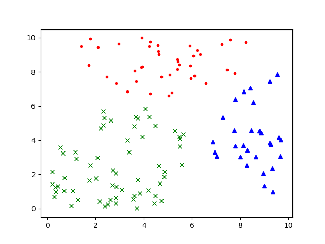
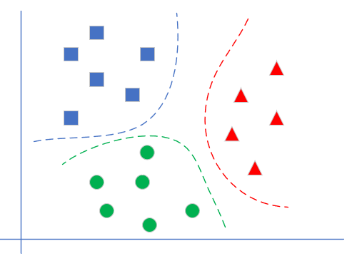

Copyright © Microsoft Corporation. All rights reserved.
  适用于[License](https://github.com/Microsoft/ai-edu/blob/master/LICENSE.md)版权许可
  
# 第7章 多入单出的单层神经网路

## 7.0 线性多分类问题

### 7.0.1 提出问题

我们解决了楚汉相争的问题，现在看一下公元220年的三国问题。

|样本序号|经度相对值|纬度相对值|分类|
|---|---|---|---|
|1|7.033|3.075|3|
|2|4.489|4.869|2|
|3|8.228|9.735|1|
|4|4.632|9.014|1|

1. 魏国城池（标签为1，红色）
2. 蜀国城池（标签为2，绿色）
3. 吴国城池（标签为3，蓝色）

### 问题：
1. 经纬度相对值为(5,1)时，属于哪个国？
2. 经纬度相对值为(7,6)时，属于哪个国？
3. 经纬度相对值为(5,6)时，属于哪个国？
4. 经纬度相对值为(2,7)时，属于哪个国？
 
## 问题分析

从图示来看，似乎在三个颜色区间之间有两个比较明显的分界线，而且是直线，即线性可分的。我们如何通过神经网络精确地找到这两条分界线呢？

- 从视觉上判断是线性可分的，所以我们使用单层神经网络即可
- 输入特征是温度和湿度，所以我们在输入层设置两个输入X1=经度，X2=纬度
- 最后输出的是三个分类，分别是魏蜀吴，所以输出层有三个神经元

## 多分类问题

如果有三个以上的分类同时存在，我们需要对每一类别分配一个神经元，这个神经元的作用是根据前端输入的各种数据，先做线性处理（Y=WX+B)，然后做一次非线性处理，计算每个样本在每个类别中的预测概率，再和标签中的类别比较，看看预测是否准确，如果准确，则奖励这个预测，给与正反馈；如果不准确，则惩罚这个预测，给与负反馈。两类反馈都反向传播到神经网络系统中去调整参数。

|线性多分类|非线性多分类|
|---|---|
|||

多分类问题一共有三种解法：
1. 一对一
   
   每次先只保留两个类别的数据，训练一个分类器。如果一共有N个类别，则需要训练$C^2_N$个分类器。以N=3时举例，需要训练(A|B)，(B|C)，(A|C)三个分类器。

   推理时，(A|B)分类器告诉你是A类时，需要到(A|C)分类器再试一下，如果也是A类，则就是A类。如果(A|C)告诉你是C类，则基本是C类了，不可能是B类，不信的话可以到(B|C)分类器再去测试一下。

2. 一对多
   
   如下图，处理一个类别时，暂时把其它所有类别看作是一类，这样对于三分类问题，可以得到三个分类器。

   每次做推理时，同时调用三个分类器，再把三种结果组合起来，就是真实的结果。比如，第一个分类器告诉你是“红类”，那么它确实就是红类；如果告诉你是非红类，则需要看第二个分类器的结果，绿类或者非绿类；依此类推。
  

3. 多对多

    假设有4个类别ABCD，我们可以把AB算作一类，CD算作一类，训练一个分类器1；再把AC算作一类，BD算作一类，训练一个分类器2。
    
    推理时，第1个分类器告诉你是AB类，第二个分类器告诉你是BD类，则做“与”操作，就是B类。

**本章作业：**

1. 用线性二分类实现逻辑与门，逻辑或门
2. 下载鸢尾化数据集，实现线性多分类
