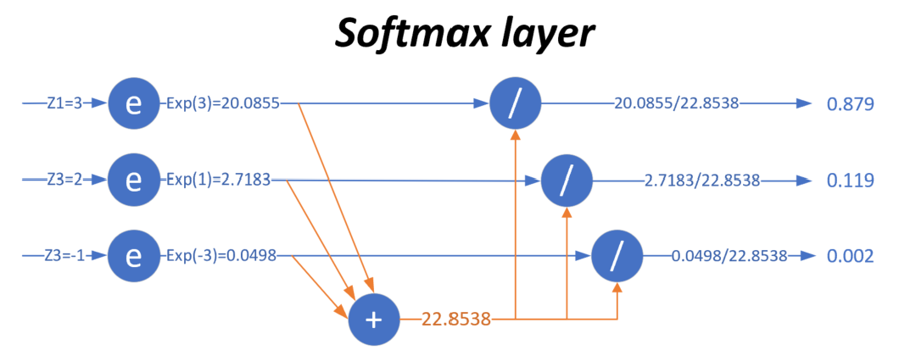

<!--Copyright © Microsoft Corporation. All rights reserved.
  适用于[License](https://github.com/Microsoft/ai-edu/blob/master/LICENSE.md)版权许可-->

## 7.1 多分类函数

此函数对线性多分类和非线性多分类都适用。

先回忆一下二分类问题，在线性计算后，使用了Logistic函数计算样本的概率值，从而把样本分成了正负两类。那么对于多分类问题，应该使用什么方法来计算样本属于各个类别的概率值呢？又是如何作用到反向传播过程中的呢？我们这一节主要研究这个问题。

### 7.1.1 多分类函数定义 - Softmax

#### 为什么叫做Softmax？

假设输入值是：[3,1,-3]，如果取max操作会变成：[1,0,0]，这符合我们的分类需要。但是有两个不足：

1. 分类结果是[1，0，0]，只保留的非0即1的信息，没有各元素之间相差多少的信息，可以理解是“Hard-Max”
2. max操作本身不可导，无法用在反向传播中。

所以Softmax加了个"soft"来模拟max的行为，但同时又保留了相对大小的信息。

$$
a_j = \frac{e^{z_j}}{\sum\limits_{i=1}^m e^{z_i}}=\frac{e^{z_j}}{e^{z_1}+e^{z_2}+\dots+e^{z_m}}
$$

上式中:

- $z_j$是对第 j 项的分类原始值，即矩阵运算的结果
- $z_i$是参与分类计算的每个类别的原始值
- m 是总的分类数
- $a_j$是对第 j 项的计算结果

假设j=1，m=3，上式为：
  
$$a_1=\frac{e^{z_1}}{e^{z_1}+e^{z_2}+e^{z_3}}$$

用图7-5来形象地说明这个过程。



图7-5 Softmax工作过程

当输入的数据$[z_1,z_2,z_3]$是$[3,1,-3]$时，按照图示过程进行计算，可以得出输出的概率分布是$[0.879,0.119,0.002]$。

对比MAX运算和Softmax的不同，如表7-2所示。

表7-2 MAX运算和Softmax的不同

|输入原始值|(3, 1, -3)|
|---|---|
|MAX计算|(1, 0, 0)|
|Softmax计算|(0.879, 0.119, 0.002)|

也就是说，在（至少）有三个类别时，通过使用Softmax公式计算它们的输出，比较相对大小后，得出该样本属于第一类，因为第一类的值为0.879，在三者中最大。注意这是对一个样本的计算得出的数值，而不是三个样本，亦即softmax给出了某个样本分别属于三个类别的概率。

它有两个特点：

1. 三个类别的概率相加为1
2. 每个类别的概率都大于0

#### Softmax的工作原理

我们仍假设网络输出的预测数据是z=[3, 1, -3]，而标签值是y=[1, 0, 0]。在做反向传播时，根据前面的经验，我们会用z-y，得到：

$$z-y=[2,1,-3]$$

这个信息很奇怪：

- 第一项是2，我们已经预测准确了此样本属于第一类，但是反向误差的值是2，即惩罚值是2
- 第二项是1，惩罚值是1，预测对了，仍有惩罚值
- 第三项是-3，惩罚值是-3，意为着奖励值是3，明明预测错误了却给了奖励

所以，如果不使用Softmax这种机制，会存在有个问题：

- z值和y值之间，即预测值和标签值之间不可比，比如z[0]=3与y[0]=1是不可比的
- z值中的三个元素之间虽然可比，但只能比大小，不能比差值，比如z[0]>z[1]>z[2]，但3和1相差2，1和-3相差4，这些差值是无意义的

在使用Softmax之后，我们得到的值是a=[0.879, 0.119, 0.002]，用a-y：

$$a-y=[-0.121, 0.119, 0.002]$$

再来分析这个信息：

- 第一项-0.121是奖励给该类别0.121，因为它做对了，但是可以让这个概率值更大，最好是1
- 第二项0.119是惩罚，因为它试图给第二类0.119的概率，所以需要这个概率值更小，最好是0
- 第三项0.002是惩罚，因为它试图给第三类0.002的概率，所以需要这个概率值更小，最好是0

这个信息是完全正确的，可以用于反向传播。Softmax先做了归一化，把输出值归一到[0,1]之间，这样就可以与标签值的0或1去比较，并且知道惩罚或奖励的幅度。

从继承关系的角度来说，Softmax函数可以视作Logistic函数扩展，比如一个二分类问题：

$$
a1 = \frac{e^{z_1}}{e^{z_1} + e^{z_2}} = \frac{1}{1 + e^{z_2 - z_1}}
$$

是不是和Logistic函数形式非常像？其实Logistic函数也是给出了当前样本的一个概率值，只不过是依靠偏近0或偏近1来判断属于正类还是负类。

### 7.1.2 正向传播

#### 矩阵运算

$$
z=x \cdot w + b \tag{1}
$$

#### 分类计算

$$
a_j = \frac{e^{z_j}}{\sum\limits_{i=1}^m e^{z_i}}=\frac{e^{z_j}}{e^{z_1}+e^{z_2}+\dots+e^{z_m}} \tag{2}
$$

#### 损失函数计算

计算单样本时，m是分类数：
$$
loss(w,b)=-\sum_{i=1}^m y_i \ln a_i \tag{3}
$$

计算多样本时，m是分类数，n是样本数：
$$J(w,b) =- \sum_{j=1}^n \sum_{i=1}^m y_{ij} \log a_{ij} \tag{4}$$

如图7-6示意。


图7-6 Softmax在神经网络结构中的示意图

### 7.1.3 反向传播

#### 实例化推导

我们先用实例化的方式来做反向传播公式的推导，然后再扩展到一般性上。假设有三个类别，则：

$$
z_1 = x \cdot w+ b_1 \tag{5}
$$
$$
z_2 = x \cdot w + b_2 \tag{6}
$$
$$
z_3 = x \cdot w + b_3 \tag{7}
$$
$$
a_1=\frac{e^{z_1}}{\sum_i e^{z_i}}=\frac{e^{z_1}}{e^{z_1}+e^{z_2}+e^{z_3}}  \tag{8}
$$
$$
a_2=\frac{e^{z_2}}{\sum_i e^{z_i}}=\frac{e^{z_2}}{e^{z_1}+e^{z_2}+e^{z_3}}  \tag{9}
$$
$$
a_3=\frac{e^{z_3}}{\sum_i e^{z_i}}=\frac{e^{z_3}}{e^{z_1}+e^{z_2}+e^{z_3}}  \tag{10}
$$

为了方便书写，我们令：

$$
E ={e^{z_1}+e^{z_2}+e^{z_3}}
$$

$$
loss(w,b)=-(y_1 \ln a_1 + y_2 \ln a_2 + y_3 \ln a_3)  \tag{11}
$$

$$
\frac{\partial{loss}}{\partial{z_1}}= \frac{\partial{loss}}{\partial{a_1}}\frac{\partial{a_1}}{\partial{z_1}} + \frac{\partial{loss}}{\partial{a_2}}\frac{\partial{a_2}}{\partial{z_1}} + \frac{\partial{loss}}{\partial{a_3}}\frac{\partial{a_3}}{\partial{z_1}}  \tag{12}
$$

依次求解公式12中的各项：

$$
{\partial loss \over \partial a_1}=- {y_1 \over a_1} \tag{13}
$$
$$
{\partial loss \over \partial a_2}=- {y_2 \over a_2} \tag{14}
$$
$$
{\partial loss \over \partial a_3}=- {y_3 \over a_3} \tag{15}
$$

$$
\begin{aligned}
{\partial a_1 \over \partial z_1}&=({\partial e^{z_1}\over \partial z_1} E -{\partial E \over \partial z_1}e^{z_1})/E^2 \\
&={e^{z_1}E - e^{z_1}e^{z_1} \over E^2}=a_1(1-a_1)  
\end{aligned}
\tag{16}
$$

$$
\begin{aligned}
{\partial a_2 \over \partial z_1}&=({\partial e^{z_2}\over \partial z_1} E -{\partial E \over \partial z_1}e^{z_2})/E^2 \\
&={0 - e^{z_1}e^{z_2} \over E^2}=-a_1 a_2 
\end{aligned}
\tag{17}
$$

$$
\begin{aligned}
{\partial a_3 \over \partial z_1}&=({\partial e^{z_3}\over \partial z_1} E -{\partial E \over \partial z_1}e^{z_3})/E^2 \\
&={0 - e^{z_1}e^{z_3} \over E^2}=-a_1 a_3  
\end{aligned}
\tag{18}
$$

把公式13~18组合到12中：

$$
\begin{aligned}    
{\partial loss \over \partial z_1}&=-{y_1 \over a_1}a_1(1-a_1)+{y_2 \over a_2}a_1a_2+{y_3 \over a_3}a_1a_3 \\
&=-y_1+y_1a_1+y_2a_1+y_3a_1 \\
&=-y_1+a_1(y_1+y_2+y_3) \\
&=a_1-y_1 
\end{aligned}
\tag{19}
$$

不失一般性，由公式19可得：
$$
{\partial loss \over \partial z_i}=a_i-y_i \tag{20}
$$

#### 一般性推导

1. Softmax函数自身的求导

由于Softmax涉及到求和，所以有两种情况：

- 求输出项$a_1$对输入项$z_1$的导数，此时：$j=1, i=1, i=j$，可以扩展到i, j为任意相等值
- 求输出项$a_2或a_3$对输入项$z_1$的导数，此时：$j=2或3, i=1, i \neq j$，可以扩展到i, j为任意不等值

Softmax函数的分子：因为是计算$a_j$，所以分子是$e^{z_j}$。

Softmax函数的分母：
$$
\sum\limits_{i=1}^m e^{z_i} = e^{z_1} + \dots + e^{z_j} + \dots +e^{z_m} => E
$$

- $i=j$时（比如输出分类值a1对z1的求导），求$a_j$对$z_i$的导数，此时分子上的$e^{z_j}$要参与求导。参考基本数学导数公式33：

$$
\begin{aligned}
\frac{\partial{a_j}}{\partial{z_i}} &= \frac{\partial{}}{\partial{z_i}}(e^{z_j}/E) \\
&= \frac{\partial{}}{\partial{z_j}}(e^{z_j}/E) \quad (因为z_i==z_i)\\
&=\frac{e^{z_j}E-e^{z_j}e^{z_j}}{E^2} 
=\frac{e^{z_j}}{E} - \frac{(e^{z_j})^2}{E^2} \\
&= a_j-a^2_j=a_j(1-a_j)  \\
\end{aligned}
\tag{21}
$$

- $i \neq j$时（比如输出分类值a1对z2的求导，j=1, i=2），$a_j$对$z_i$的导数，分子上的$z_j与i$没有关系，求导为0，分母的求和项中$e^{z_i}$要参与求导。同样是公式33，因为分子$e^{z_j}$对$e^{z_i}$求导的结果是0：

$$
\frac{\partial{a_j}}{\partial{z_i}}=\frac{-(E)'e^{z_j}}{E^2}
$$
求和公式对$e^{z_i}$的导数$(E)'$，除了$e^{z_i}$项外，其它都是0：
$$
(E)' = (e^{z_1} + \dots + e^{z_i} + \dots +e^{z_m})'=e^{z_i}
$$
所以：
$$
\begin{aligned}
\frac{\partial{a_j}}{\partial{z_i}}&=\frac{-(E)'e^{z_j}}{(E)^2}=-\frac{e^{z_j}e^{z_i}}{{(E)^2}} \\
&=-\frac{e^{z_j}}{{E}}\frac{e^{z_j}}{{E}}=-a_{i}a_{j} 
\end{aligned}
\tag{22}
$$

2. 结合损失函数的整体反向传播公式

看上图，我们要求Loss值对Z1的偏导数。和以前的Logistic函数不同，那个函数是一个z对应一个a，所以反向关系也是一对一。而在这里，a1的计算是有z1,z2,z3参与的，a2的计算也是有z1,z2,z3参与的，即所有a的计算都与前一层的z有关，所以考虑反向时也会比较复杂。

先从Loss的公式看，$loss=-(y_1lna_1+y_2lna_2+y_3lna_3)$，a1肯定与z1有关，那么a2,a3是否与z1有关呢？

再从Softmax函数的形式来看：

无论是a1，a2，a3，都是与z1相关的，而不是一对一的关系，所以，想求Loss对Z1的偏导，必须把Loss->A1->Z1， Loss->A2->Z1，Loss->A3->Z1，这三条路的结果加起来。于是有了如下公式：

$$
\begin{aligned}    
\frac{\partial{loss}}{\partial{z_i}} &= \frac{\partial{loss}}{\partial{a_1}}\frac{\partial{a_1}}{\partial{z_i}} + \frac{\partial{loss}}{\partial{a_2}}\frac{\partial{a_2}}{\partial{z_i}} + \frac{\partial{loss}}{\partial{a_3}}\frac{\partial{a_3}}{\partial{z_i}} \\
&=\sum_j \frac{\partial{loss}}{\partial{a_j}}\frac{\partial{a_j}}{\partial{z_i}}
\end{aligned}
$$

你可以假设上式中$i=1，j=3$，就完全符合我们的假设了，而且不失普遍性。

前面说过了，因为Softmax涉及到各项求和，A的分类结果和Y的标签值分类是否一致，所以需要分情况讨论：

$$
\frac{\partial{a_j}}{\partial{z_i}} = \begin{cases} a_j(1-a_j), & i = j \\ -a_ia_j, & i \neq j \\ \end{cases}
$$

因此，$\frac{\partial{loss}}{\partial{z_i}}$应该是$i=j和i \neq j$两种情况的和：

- $i = j时，loss通过a_1对z_1求导（或者是通过a_2对z_2求导）$：

$$
\begin{aligned}
\frac{\partial{loss}}{\partial{z_i}} &= \frac{\partial{loss}}{\partial{a_j}}\frac{\partial{a_j}}{\partial{z_i}}=-\frac{y_j}{a_j}a_j(1-a_j) \\
&=y_j(a_j-1)=y_i(a_i-1) 
\end{aligned}
\tag{23}
$$

- $i \neq j，loss通过a_2+a_3对z_1求导$：

$$
\begin{aligned}    
\frac{\partial{loss}}{\partial{z_i}} &= \frac{\partial{loss}}{\partial{a_j}}\frac{\partial{a_j}}{\partial{z_i}}=\sum_j^m(-\frac{y_j}{a_j})(-a_ja_i) \\
&=\sum_j^m(y_ja_i)=a_i\sum_{j \neq i}{y_j} 
\end{aligned}
\tag{24}
$$

把两种情况加起来：

$$
\begin{aligned}    
\frac{\partial{loss}}{\partial{z_i}} &= y_i(a_i-1)+a_i\sum_{j \neq i}y_j \\
&=-y_i+a_iy_i+a_i\sum_{j \neq i}y_j \\
&=-y_i+a_i(y_i+\sum_{j \neq i}y_j) \\
&=-y_i + a_i*1 \\
&=a_i-y_i 
\end{aligned}
\tag{25}$$

因为$y_j$是取值$[1,0,0]$或者$[0,1,0]$或者$[0,0,1]$的，这三者用$\sum$加起来，就是$[1,1,1]$，在矩阵乘法运算里乘以$[1,1,1]$相当于什么都不做，就等于原值。

我们惊奇地发现，最后的反向计算过程就是：$a_i-y_i$，假设当前样本的$a_i=[0.879, 0.119, 0.002]$，而$y_i=[0, 1, 0]$，则：
$$a_i - y_i = [0.879, 0.119, 0.002]-[0,1,0]=[0.879,-0.881,0.002]$$

其含义是，样本预测第一类，但实际是第二类，所以给第一类0.879的惩罚值，给第二类0.881的奖励，给第三类0.002的惩罚，并反向传播给神经网络。

后面对$z=wx+b$的求导，与二分类一样，不再赘述。

### 7.1.4 代码实现

第一种，直截了当按照公式写：
```Python
def Softmax1(x):
    e_x = np.exp(x)
    v = np.exp(x) / np.sum(e_x)
    return v
```
这个可能会发生的问题是，当x很大时，np.exp(x)很容易溢出，因为是指数运算。所以，有了下面这种改进的代码：

```Python
def Softmax2(Z):
    shift_Z = Z - np.max(Z)
    exp_Z = np.exp(shift_Z)
    A = exp_Z / np.sum(exp_Z)
    return A
```
测试一下：
```Python
Z = np.array([3,0,-3])
print(Softmax1(Z))
print(Softmax2(Z))
```
两个实现方式的结果一致：
```
[0.95033021 0.04731416 0.00235563]
[0.95033021 0.04731416 0.00235563]
```

为什么一样呢？从代码上看差好多啊！我们来证明一下：

假设有3个值a，b，c，并且a在三个数中最大，则b所占的Softmax比重应该这样写：

$$P(b)=\frac{e^b}{e^a+e^b+e^c}$$

如果减去最大值变成了a-a，b-a，c-a，则b'所占的Softmax比重应该这样写：

$$
\begin{aligned}
P(b') &= \frac{e^{b-a}}{e^{a-a}+e^{b-a}+e^{c-a}} \\
&=\frac{e^b/e^a}{e^a/e^a+e^b/e^a+e^c/e^a} \\
&= \frac{e^b}{e^a+e^b+e^c}
\end{aligned}
$$
所以：
$$
P(b) == P(b')
$$

Softmax2的写法对一个一维的向量或者数组是没问题的，如果遇到Z是个$M \times N$维(M,N>1)的矩阵的话，就有问题了，因为np.sum(exp_Z)这个函数，会把MxN矩阵里的所有元素加在一起，得到一个标量值，而不是相关列元素加在一起。

所以应该这么写：

```Python
class Softmax(object):
    def forward(self, z):
        shift_z = z - np.max(z, axis=1, keepdims=True)
        exp_z = np.exp(shift_z)
        a = exp_z / np.sum(exp_z, axis=1, keepdims=True)
        return a

```

axis=1这个参数非常重要，因为如果输入Z是单样本的预测值话，如果是分三类，则应该是个3x1的数组，如果：

- $z = [3, 1, -3]$
- $a = [0.879, 0.119, 0.002]$

但是，如果是批量训练，假设每次用两个样本，则：
```
if __name__ == '__main__':
    z = np.array([[3,1,-3],[1,-3,3]]).reshape(2,3)
    a = Softmax().forward(z)
    print(a)
```
结果：
```
[[0.87887824 0.11894324 0.00217852]
 [0.11894324 0.00217852 0.87887824]]
```
其中，a是包含两个样本的softmax结果，每个数组里面的三个数字相加为1。

如果s = np.sum(exp_z)，不指定axis=1参数，则：
```
[[0.43943912 0.05947162 0.00108926]
 [0.05947162 0.00108926 0.43943912]]
```
A虽然仍然包含两个样本，但是变成了两个样本所有的6个元素相加为1，这不是softmax的本意，softmax只计算一个样本（一行）中的数据。
