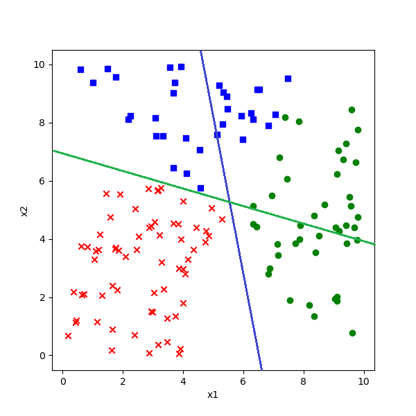
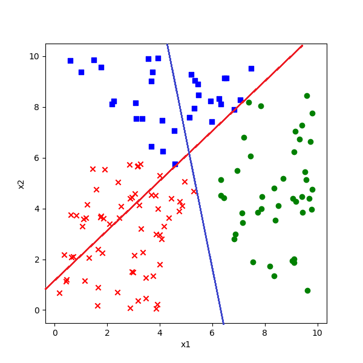
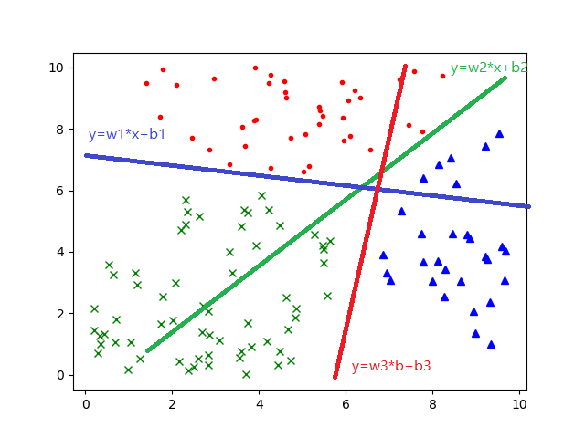

<!--Copyright © Microsoft Corporation. All rights reserved.
  适用于[License](https://github.com/Microsoft/ai-edu/blob/master/LICENSE.md)版权许可-->

## 7.3 线性多分类原理

此原理对线性多分类和非线性多分类都适用。

### 7.3.1 多分类过程

我们在此以具有两个特征值的三分类举例。可以扩展到更多的分类或任意特征值，比如在ImageNet的图像分类任务中，最后一层全连接层输出给分类器的特征值有成千上万个，分类有1000个。

1. 线性计算

$$z_1 = x_1 w_{11} + x_2 w_{21} + b_1 \tag{1}$$
$$z_2 = x_1 w_{12} + x_2 w_{22} + b_2 \tag{2}$$
$$z_3 = x_1 w_{13} + x_2 w_{23} + b_3 \tag{3}$$

2. 分类计算

$$
a_1=\frac{e^{z_1}}{\sum_i e^{z_i}}=\frac{e^{z_1}}{e^{z_1}+e^{z_2}+e^{z_3}}  \tag{4}
$$
$$
a_2=\frac{e^{z_2}}{\sum_i e^{z_i}}=\frac{e^{z_2}}{e^{z_1}+e^{z_2}+e^{z_3}}  \tag{5}
$$
$$
a_3=\frac{e^{z_3}}{\sum_i e^{z_i}}=\frac{e^{z_3}}{e^{z_1}+e^{z_2}+e^{z_3}}  \tag{6}
$$

3. 损失函数计算

单样本时，$n$表示类别数，$j$表示类别序号：

$$
\begin{aligned}
loss(w,b)&=-(y_1 \ln a_1 + y_2 \ln a_2 + y_3 \ln a_3) \\
&=-\sum_{j=1}^{n} y_j \ln a_j 
\end{aligned}
\tag{7}
$$

批量样本时，$m$表示样本数，$i$表示样本序号：

$$
\begin{aligned}
J(w,b) &=- \sum_{i=1}^m (y_{i1} \ln a_{i1} + y_{i2} \ln a_{i2} + y_{i3} \ln a_{i3}) \\
&=- \sum_{i=1}^m \sum_{j=1}^n y_{ij} \ln a_{ij}
\end{aligned}
 \tag{8}
$$

损失函数计算在交叉熵函数一节有详细介绍。

### 7.3.2 数值计算举例

假设对预测一个样本的计算得到的$z$值为：

$$z=[z_1,z_2,z_3]=[3,1,-3]$$

则按公式4、5、6进行计算，可以得出Softmax的概率分布是：

$$a=[a_1,a_2,a_3]=[0.879,0.119,0.002]$$

#### 如果标签值表明此样本为第一类

即：

$$y=[1,0,0]$$

则损失函数为：

$$
loss_1=-(1 \times \ln 0.879 + 0 \times \ln 0.119 + 0 \times \ln 0.002)=0.123
$$

反向传播误差矩阵为：

$$a-y=[-0.121,0.119,0.002]$$

因为$a_1=0.879$，为三者最大，分类正确，所以$a-y$的三个值都不大。

#### 如果标签值表明此样本为第二类

即：

$$y=[0,1,0]$$

则损失函数为：

$$
loss_2=-(0 \times \ln 0.879 + 1 \times \ln 0.119 + 0 \times \ln 0.002)=2.128
$$

可以看到由于分类错误，$loss_2$的值比$loss_1$的值大很多。

反向传播误差矩阵为：

$$a-y=[0.879,0.881,0.002]$$

本来是第二类，误判为第一类，所以前两个元素的值很大，反向传播的力度就大。

### 7.3.3 多分类的几何原理

在前面的二分类原理中，很容易理解为我们用一条直线分开两个部分。对于多分类问题，是否可以沿用二分类原理中的几何解释呢？答案是肯定的，只不过需要单独判定每一个类别。

假设一共有三类样本，蓝色为1，红色为2，绿色为3，那么Softmax的形式应该是：

$$
a_j = \frac{e^{z_j}}{\sum\limits_{i=1}^3 e^{z_i}}=\frac{e^{z_j}}{e^{z_1}+e^{z_2}+^{z_3}}
$$

#### 当样本属于第一类时

把蓝色点与其它颜色的点分开。

如果判定一个点属于第一类，则$a_1$的概率值一定会比$a_2、a_3$大，表示为公式：

$$a_1 > a_2 且 a_1 > a_3 \tag{9}$$

由于Softmax的特殊形式，分母都一样，所以只比较分子就行了。而分子是一个自然指数，输出值域大于零且单调递增，所以只比较指数就可以了，因此，公式9等同于下式：

$$z_1 > z_2 且 z_1 > z_3 \tag{10}$$

把公式1、2、3引入到10：

$$x_1 w_{11}  + x_2 w_{21}  + b1  > x_1 w_{12} + x_2 w_{22}  + b_2 \tag{11}$$
$$x_1 w_{11}  + x_2 w_{21} + b1  > x_1 w_{13} + x_2 w_{23} + b_3 \tag{12}$$

变形：

$$(w_{21} - w_{22})x_2 > (w_{12} - w_{11})x_1 + (b_2 - b_1) \tag{13}$$

$$(w_{21} - w_{23})x_2 > (w_{13} - w_{11})x_1 + (b_3 - b_1) \tag{14}$$

我们先假设：

$$w_{21} > w_{22}，且 w_{21}> w_{23} \tag{15}$$

所以公式13、14左侧的系数都大于零，两边同时除以系数：

$$x_2 > {w_{12} - w_{11} \over w_{21} - w_{22}}x_1 + {b_2 - b_1 \over w_{21} - w_{22}} \tag{16}$$

$$x_2 > {w_{13} - w_{11} \over w_{21} - w_{23}} x_1 + {b_3 - b_1 \over w_{21} - w_{23}} \tag{17}$$

简化：

$$y > W_{12} \cdot x + B_{12} \tag{18}$$

$$y > W_{13} \cdot x + B_{13} \tag{19}$$

此时y代表了第一类的蓝色点。

图7-9 如何把蓝色样本与其它两色的样本分开

借用二分类中的概念，公式18的几何含义是：有一条直线可以分开第一类（蓝色点）和第二类（红色点），使得所有蓝色点都在直线的上方，所有的红色点都在直线的下方。于是我们可以画出图7-9中的那条绿色直线。

而公式19的几何含义是：有一条直线可以分开第一类（蓝色点）和第三类（绿色点），使得所有蓝色点都在直线的上方，所有的绿色点都在直线的下方。于是我们可以画出图7-9中的那条红色直线。

也就是说在图中画两条直线，所有蓝点都同时在红线和绿线这两条直线的上方。

#### 当样本属于第二类时

即如何把红色点与其它两色点分开。

$$z_2 > z_1 且 z_2 > z_3 \tag{20}$$

同理可得

$$y < W_{12} \cdot x + B_{12} \tag{21}$$

$$y > W_{23} \cdot x + B_{23} \tag{22}$$

图7-10 如何把红色样本与其它两色的样本分开

此时$y$代表了第二类的红色点。

公式21和公式18几何含义相同，不等号相反，代表了图7-10中绿色直线的分割作用，即红色点在绿色直线下方。

公式22的几何含义是，有一条蓝色直线可以分开第二类（红色点）和第三类（绿色点），使得所有红色点都在直线的上方，所有的绿色点都在直线的下方。

#### 当样本属于第三类时

即如何把绿色点与其它两色点分开。

$$z_3 > z_1 且 z_3 > z_2 \tag{22}$$

最后可得：

$$y < W_{13} \cdot x + B_{13} \tag{23}$$

$$y < W_{23} \cdot x + B_{23} \tag{24}$$

此时$y$代表了第三类的绿色点。

图7-11 如何把绿色样本与其它两色的样本分开

公式23与公式19不等号相反，几何含义相同，代表了图7-11中红色直线的分割作用，绿色点在红色直线下方。

公式24与公式22不等号相反，几何含义相同，代表了图7-11中蓝色直线的分割作用，绿色点在蓝色直线下方。

#### 综合效果

把三张图综合在一起，应该是图7-12的样子。

图7-12 三条线分开三种样本

### 思考与练习

1. 我们假设$w_{21} > w_{22} > w_{23}$是否有根据呢？假设$w_{21} > w_{23} > w_{23}$，直线的位置会有所变化吗？
2. 最后一张图的三条直线应该相交于一点吗？
