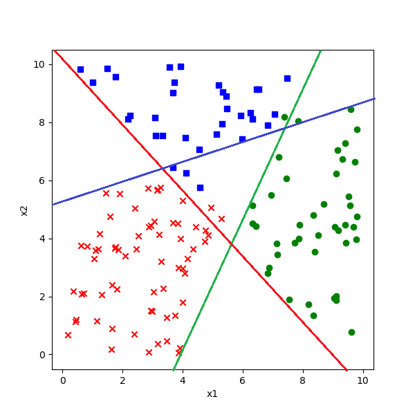
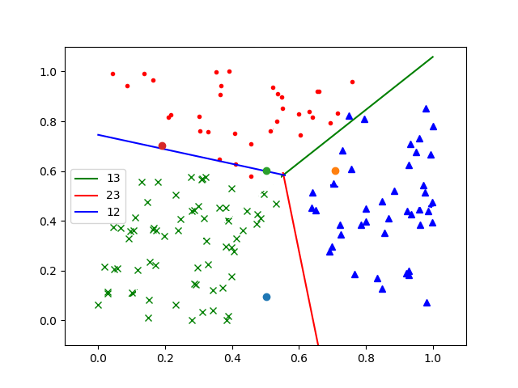

<!--Copyright © Microsoft Corporation. All rights reserved.
  适用于[License](https://github.com/Microsoft/ai-edu/blob/master/LICENSE.md)版权许可-->
  
## 7.4 多分类结果可视化

神经网络到底是一对一方式，还是一对多方式呢？从Softmax公式，好像是一对多方式，因为只取一个最大值，那么理想中的一对多方式应该是图7-13所示的样子。



图7-13 理想中的一对多方式的分割线

实际上是什么样子的，我们来看下面的具体分析。

### 7.4.1 显示原始数据图

与二分类时同样的问题，如何直观地理解多分类的结果？三分类要复杂一些，我们先把原始数据显示出来。

```Python
def ShowData(X,Y):
    for i in range(X.shape[0]):
        if Y[i,0] == 1:
            plt.plot(X[i,0], X[i,1], '.', c='r')
        elif Y[i,0] == 2:
            plt.plot(X[i,0], X[i,1], 'x', c='g')
        elif Y[i,0] == 3:
            plt.plot(X[i,0], X[i,1], '^', c='b')
        # end if
    # end for
    plt.show()
```

会画出图7-1来。

### 7.4.2 显示分类结果分割线图

下面的数据是神经网络训练出的权重和偏移值的结果：

```
......
epoch=98
98 1385 0.25640040547970516
epoch=99
99 1399 0.2549651316913006
W= [[-1.43299777 -3.57488388  5.00788165]
 [ 4.47527075 -2.88799216 -1.58727859]]
B= [[-1.821679    3.66752583 -1.84584683]]
......
```

其实在7.2节中讲解多分类原理的时候，我们已经解释了其几何理解，那些公式的推导就可以用于指导我们画出多分类的分割线来。先把几个有用的结论拿过来。

从7.2节中的公式16，把不等号变成等号，即$z_1=z_2$，则代表了那条绿色的分割线，用于分割第一类和第二类的：

$$x_2 = {w_{12} - w_{11} \over w_{21} - w_{22}}x_1 + {b_2 - b_1 \over w_{21} - w_{22}} \tag{1}$$

$$即：y = W_{12} \cdot x + B_{12}$$

由于Python数组是从0开始的，所以公式1中的所有下标都减去1，写成代码：

```Python
b12 = (net.B[0,1] - net.B[0,0])/(net.W[1,0] - net.W[1,1])
w12 = (net.W[0,1] - net.W[0,0])/(net.W[1,0] - net.W[1,1])
```

从7.2节中的公式17，把不等号变成等号，即$z_1=z_3$，则代表了那条红色的分割线，用于分割第一类和第三类的：

$$x_2 = {w_{13} - w_{11} \over w_{21} - w_{23}} x_1 + {b_3 - b_1 \over w_{21} - w_{23}} \tag{2}$$
$$即：y = W_{13} \cdot x + B_{13}$$

写成代码：

```Python
b13 = (net.B[0,0] - net.B[0,2])/(net.W[1,2] - net.W[1,0])
w13 = (net.W[0,0] - net.W[0,2])/(net.W[1,2] - net.W[1,0])
```

从7.2节中的公式24，把不等号变成等号，即$z_2=z_3$，则代表了那条蓝色的分割线，用于分割第二类和第三类的：

$$x_2 = {w_{13} - w_{12} \over w_{22} - w_{23}} x_1 + {b_3 - b_2 \over w_{22} - w_{23}} \tag{3}$$
$$即：y = W_{23} \cdot x + B_{23}$$

写成代码：

```Python
b23 = (net.B[0,2] - net.B[0,1])/(net.W[1,1] - net.W[1,2])
w23 = (net.W[0,2] - net.W[0,1])/(net.W[1,1] - net.W[1,2])
```

完整代码请看ch07 Level2的python文件。

改一下主函数，增加对以上两个函数ShowData()和ShowResult()的调用，最后可以看到图7-14所示的分类结果图，注意，这个结果图和我们在7.2中分析的一样，只是蓝线斜率不同。


图7-14 神经网络绘出的分类结果图

图7-14中的四个三角形的大点是需要我们预测的四个坐标值，其中三个点的分类都比较明确，只有那个蓝色的点看不清在边界那一侧，可以通过在实际的运行结果图上放大局部来观察。

### 7.4.3 理解神经网络的分类方式

做为实际结果，图7-14与我们猜想的图7-13完全不同：

- 蓝色线是2|3的边界，不考虑第1类
- 绿色线是1|2的边界，不考虑第3类
- 红色线是1|3的边界，不考虑第2类

我们只看蓝色的第1类，当要区分1|2和1|3时，神经网络实际是用了两条直线（绿色和红色）同时作为边界。那么它是一对一方式还是一对多方式呢？

图7-14的分割线是我们令$z_1=z_2, z_2=z_3, z_3=z_1$三个等式得到的，但实际上神经网络的工作方式不是这样的，它不会单独比较两类，而是会同时比较三类，这个从Softmax会同时输出三个概率值就可以理解。比如，当我们想得到第一类的分割线时，需要同时满足两个条件：

$$z_1=z_2，且：z_1=z_3 \tag{4}$$

即，同时，找到第一类和第三类的边界。

这就意味着公式4其实是一个线性分段函数，而不是两条直线，即图7-15中红色射线和绿色射线所组成的函数。



图7-15 分段线性的分割作用

同理，用于分开红色点和其它两类的分割线是蓝色射线和绿色射线，用于分开绿色点和其它两类的分割线是红色射线和蓝色射线。

训练一对多分类器时，是把蓝色样本当作一类，把红色和绿色样本混在一起当作另外一类。训练一对一分类器时，是把绿色样本扔掉，只考虑蓝色样本和红色样本。而我们在此并没有这样做，三类样本是同时参与训练的。所以我们只能说神经网络从结果上看，是一种一对多的方式，至于它的实质，我们在后面的非线性分类时再进一步探讨。

### 代码位置

ch07, Level2

### 思考与练习

1. 使用一对一的方法训练三个二分类器，来解决此问题。
