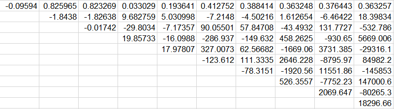
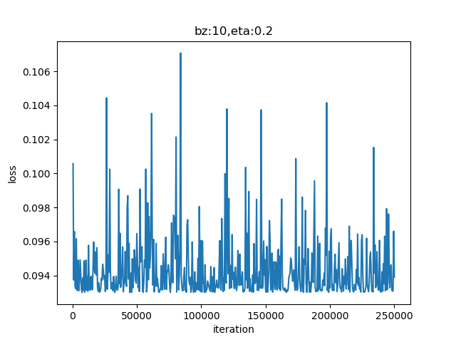
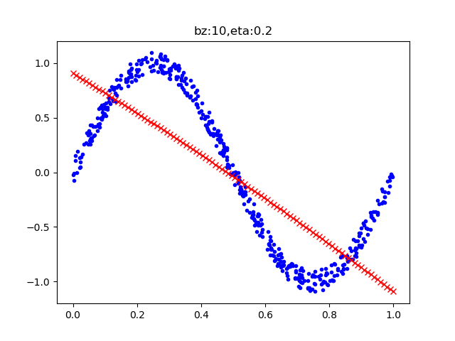

Copyright © Microsoft Corporation. All rights reserved.
  适用于[License](https://github.com/Microsoft/ai-edu/blob/master/LICENSE.md)版权许可

## 9.1 多项式回归

### 9.1.1 拟合曲线

我们先看一个被经常拿出来讲解的例子：


一堆散点，看上去像是一条带很大噪音的正弦曲线，从左上到右下，分别是一次多项式、二次多项式......10次多项式，其中：
- 第4、5、6、7图都是比较理想的拟合
- 第1、2、3图欠拟合，多项式的次数不够高
- 第8、9、10图，多项式次数过高，过拟合了

再看下表中多项式的权重值，



项数越多，权重值越大。这是为什么呢？咱们先做试验，然后再来用试验结果说明这个问题。

### 9.1.1 拟合正弦曲线

鉴于以上的认知，我们要考虑使用几次的多项式来拟合正弦曲线。在没有什么经验的情况下，可以先试一下用二次多项式，即：

$$z = x w_1 + x^2 w_2 + b \tag{1}$$


#### 数据增强

在ch08.train.npz中，读出来的XTrain数组，只有1列x的原始值，根据公式1，我们需要再增加一列x的平方值，所以代码如下：

```Python
import numpy as np
import matplotlib.pyplot as plt

from HelperClass.NeuralNet import *
from HelperClass.SimpleDataReader import *
from HelperClass.HyperParameters import *

file_name = "../../data/ch08.train.npz"

class DataReaderEx(SimpleDataReader):
    def Add(self):
        X = self.XTrain[:,]**2
        self.XTrain = np.hstack((self.XTrain, X))
```

从SimpleDataReader类中派生出子类DataReaderEx，然后添加Add()方法，先计算XTrain第一列的平方值放入矩阵X中，然后再把X合并到XTrain右侧，这样XTrain就变成了两列，第一列是x的原始值，第二列是x的平方值。

#### 主程序

在主程序中，先加载数据，做数据增强，然后建立一个net，num_input=2，对应着XTrain中的两列数据，相当于两个特征值，

```Python
if __name__ == '__main__':
    dataReader = DataReaderEx(file_name)
    dataReader.ReadData()
    dataReader.Add()
    print(dataReader.XTrain.shape)

    # net
    params = HyperParameters(eta=0.2, max_epoch=5000, batch_size=10, eps=0.03, net_type=NetType.Fitting)
    num_input = 2
    num_output = 1
    net = NeuralNet(params, num_input, num_output)
    net.train(dataReader, checkpoint=10)
    ShowResult(net, dataReader, params.toString())
```

#### 运行结果

|损失函数值|拟合结果|
|---|---|
|||

从loss曲线上看，没有任何损失值下降的趋势；再看拟合情况，只拟合成了一条直线。这说明二次多项式不能满足要求。持有怀疑的读者，可以尝试着调试主程序中的各种超参数，比如降低学习率、增加循环次数等，来验证一下这个结论。


### 9.1.2 拟合复合函数曲线


```
995999 99 0.0015901747781799206
996999 99 0.0015873294515363775
997999 99 0.001596472587606985
998999 99 0.0015935143877633367
999999 99 0.0016124984420510522
W= [[  2.75832935]
 [-30.05663986]
 [ 99.68833781]
 [-85.95142109]
 [-71.42918867]
 [ 63.88516377]
 [104.44561608]
 [-82.7452897 ]]
B= [[-0.31611388]]
```