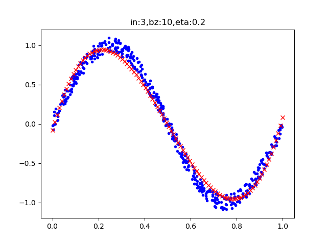
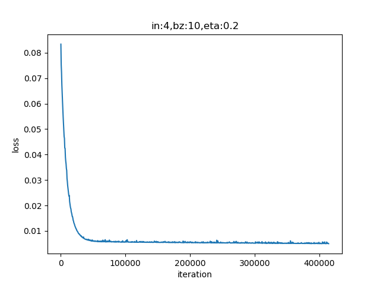

<!--Copyright © Microsoft Corporation. All rights reserved.
  适用于[License](https://github.com/Microsoft/ai-edu/blob/master/LICENSE.md)版权许可-->

## 9.1 用多项式回归法拟合正弦曲线

### 9.1.1 多项式回归的概念

多项式回归有几种形式：

#### 一元一次线性模型

因为只有一项，所以不能称为多项式了。它可以解决单变量的线性回归，我们在第4章学习过相关内容。其模型为：

$$z = x w + b \tag{1}$$

#### 多元一次多项式

多变量的线性回归，我们在第5章学习过相关内容。其模型为：

$$z = x_1 w_1 + x_2 w_2 + ...+ x_m w_m + b \tag{2}$$

这里的多变量，是指样本数据的特征值为多个，上式中的$x_1,x_2,...,x_m$代表了m个特征值。

#### 一元多次多项式

单变量的非线性回归，比如上面这个正弦曲线的拟合问题，很明显不是线性问题，但是只有一个x特征值，所以不满足前两种形式。如何解决这种问题呢？

有一个定理：任意一个函数在一个较小的范围内，都可以用多项式任意逼近。因此在实际工程实践中，有时候可以不管y值与x值的数学关系究竟是什么，而是强行用回归分析方法进行近似的拟合。

那么如何得到更多的特征值呢？对于只有一个特征值的问题，人们发明了一种聪明的办法，就是把特征值的高次方作为另外的特征值，加入到回归分析中，用公式描述：

$$z = x w_1 + x^2 w_2 + ... + x^m w_m + b \tag{3}$$

上式中x是原有的唯一特征值，$x^m$是利用x的m次方作为额外的特征值，这样就把特征值的数量从1个变为m个。

换一种表达形式，令：$x_1 = x，x_2=x^2，...，x_m=x^m$，则：

$$z = x_1 w_1 + x_2 w_2 + ... + x_m w_m + b \tag{4}$$

可以看到公式4和上面的公式2是一样的，所以解决方案也一样。

#### 多元多次多项式

多变量的非线性回归，其参数与特征组合繁复，但最终都可以归结为公式2和公式4的形式。

所以，不管是几元几次多项式，我们都可以使用第5章学到的方法来解决。在用代码具体实现之前，我们先学习一些前人总结的经验。先看一个被经常拿出来讲解的例子，如图9-3所示。


图9-3 对有噪音的正弦曲线的拟合

一堆散点，看上去像是一条带有很大噪音的正弦曲线，从左上到右下，分别是1次多项式、2次多项式......10次多项式，其中：

- 第4、5、6、7图是比较理想的拟合
- 第1、2、3图欠拟合，多项式的次数不够高
- 第8、9、10图，多项式次数过高，过拟合了

再看表9-3中多项式的权重值，表示了拟合的结果，标题头的数字表示使用了几次多项式，比如第2列有两个值，表示该多项式的拟合结果是：

$$
y = 0.826x_1 -1.84x_2
$$

表9-3 多项式训练结果的权重值

|1|2|3|4|5|6|7|8|9|10|
|--:|--:|--:|--:|--:|--:|--:|--:|--:|--:|
|-0.096|0.826|0.823|0.033|0.193|0.413|0.388|0.363|0.376|0.363|
||-1.84|-1.82|9.68|5.03|-7.21|-4.50|1.61|-6.46|18.39|
|||-0.017|-29.80|-7.17|90.05|57.84|-43.49|131.77|-532.78|
||||19.85|-16.09|-286.93|-149.63|458.26|-930.65|5669.0|
|||||17.98|327.00|62.56|-1669.06|3731.38|-29316.1|
||||||-123.61|111.33|2646.22|-8795.97|84982.2|
|||||||-78.31|-1920.56|11551.86|-145853|
||||||||526.35|-7752.23|147000|
|||||||||2069.6|-80265.3|
||||||||||18296.6|

另外，从表9-3中还可以看到，项数越多，权重值越大。这是为什么呢？

在做多项式拟合之前，所有的特征值都会先做归一化，然后再获得x的平方值，三次方值等等。在归一化之后，x的值变成了[0,1]之间，那么x的平方值会比x值要小，x的三次方值会比x的平方值要小。假设$x=0.5，x^2=0.25，x^3=0.125$，所以次数越高，权重值会越大，特征值与权重值的乘积才会是一个不太小的数，以此来弥补特征值小的问题。

### 9.1.2 用二次多项式拟合

鉴于以上的认知，我们要考虑使用几次的多项式来拟合正弦曲线。在没有什么经验的情况下，可以先试一下二次多项式，即：

$$z = x w_1 + x^2 w_2 + b \tag{5}$$

#### 数据增强

在ch08.train.npz中，读出来的XTrain数组，只包含1列x的原始值，根据公式5，我们需要再增加一列x的平方值，所以代码如下：

```Python
file_name = "../../data/ch08.train.npz"
class DataReaderEx(SimpleDataReader):
    def Add(self):
        X = self.XTrain[:,]**2
        self.XTrain = np.hstack((self.XTrain, X))
```

从SimpleDataReader类中派生出子类DataReaderEx，然后添加Add()方法，先计算XTrain第一列的平方值放入矩阵X中，然后再把X合并到XTrain右侧，这样XTrain就变成了两列，第一列是x的原始值，第二列是x的平方值。

#### 主程序

在主程序中，先加载数据，做数据增强，然后建立一个net，参数num_input=2，对应着XTrain中的两列数据，相当于两个特征值，

```Python
if __name__ == '__main__':
    dataReader = DataReaderEx(file_name)
    dataReader.ReadData()
    dataReader.Add()
    # net
    num_input = 2
    num_output = 1
    params = HyperParameters(num_input, num_output, eta=0.2, max_epoch=10000, batch_size=10, eps=0.005, net_type=NetType.Fitting)
    net = NeuralNet(params)
    net.train(dataReader, checkpoint=10)
    ShowResult(net, dataReader, params.toString())
```

#### 运行结果

表9-4 二次多项式训练过程与结果

|损失函数值|拟合结果|
|---|---|
|||

从表9-4的损失函数曲线上看，没有任何损失值下降的趋势；再看拟合情况，只拟合成了一条直线。这说明二次多项式不能满足要求。以下是最后几行的打印输出：

```
......
9989 49 0.09410913779071385
9999 49 0.09628814270449357
W= [[-1.72915813]
 [-0.16961507]]
B= [[0.98611283]]
```

对此结论持有怀疑的读者，可以尝试着修改主程序中的各种超参数，比如降低学习率、增加循环次数等，来验证一下这个结论。

### 9.1.3 用三次多项式拟合

三次多项式的公式：

$$z = x w_1 + x^2 w_2 + x^3 w_3 + b \tag{6}$$

在二次多项式的基础上，把训练数据的再增加一列x的三次方，作为一个新的特征。以下为数据增强代码：

```Python
class DataReaderEx(SimpleDataReader):
    def Add(self):
        X = self.XTrain[:,]**2
        self.XTrain = np.hstack((self.XTrain, X))
        X = self.XTrain[:,0:1]**3
        self.XTrain = np.hstack((self.XTrain, X))
```

同时不要忘记修改主过程参数中的num_input值：

```Python
    num_input = 3
```

再次运行，得到表9-5所示的结果。

表9-5 三次多项式训练过程与结果

|损失函数值|拟合结果|
|---|---|
|||

表9-5中左侧图显示损失函数值下降得很平稳，说明网络训练效果还不错。拟合的结果也很令人满意，虽然红色线没有严丝合缝地落在蓝色样本点内，但是这完全是因为训练的次数不够多，有兴趣的读者可以修改超参后做进一步的试验。

以下为打印输出：

```
......
2369 49 0.0050611643902918856
2379 49 0.004949680631526745
W= [[ 10.49907256]
 [-31.06694195]
 [ 20.73039288]]
B= [[-0.07999603]]
```

可以观察到达到0.005的损失值，这个神经网络迭代了2379个epoch。而在二次多项式的试验中，用了10000次的迭代也没有达到要求。

### 9.1.4 用四次多项式拟合

在三次多项式得到比较满意的结果后，我们自然会想知道用四次多项式还会给我们带来惊喜吗？让我们一起试一试。

第一步依然是增加x的4次方作为特征值：

```Python
        X = self.XTrain[:,0:1]**4
        self.XTrain = np.hstack((self.XTrain, X))
```

第二步设置超参num_input=4，然后训练，得到表9-6的结果。

表9-6 四次多项式训练过程与结果

|损失函数值|拟合结果|
|---|---|
|||


```
......
8279 49 0.00500000873141068
8289 49 0.0049964143635271635
W= [[  8.78717   ]
 [-20.55757649]
 [  1.28964911]
 [ 10.88610303]]
B= [[-0.04688634]]
```

### 9.1.5 结果比较

表9-7 不同项数的多项式拟合结果比较

|多项式次数|迭代数|损失函数值|
|:---:|---:|---:|
|2|10000|0.095|
|3|2380|0.005|
|4|8290|0.005|

从表9-7的结果比较中可以得到以下结论：

1. 二次多项式的损失值在下降了一定程度后，一直处于平缓期，不再下降，说明网络能力到了一定的限制，直到10000次迭代也没有达到目的；
2. 损失值达到0.005时，四项式迭代了8290次，比三次多项式的2380次要多很多，说明四次多项式多出的一个特征值，没有给我们带来什么好处，反而是增加了网络训练的复杂度。

由此可以知道，多项式次数并不是越高越好，对不同的问题，有特定的限制，需要在实践中摸索，并无理论指导。

### 代码位置

ch09, Level2

说明：单层神经网络多项式解决方案都在HelperClass子目录下代码
