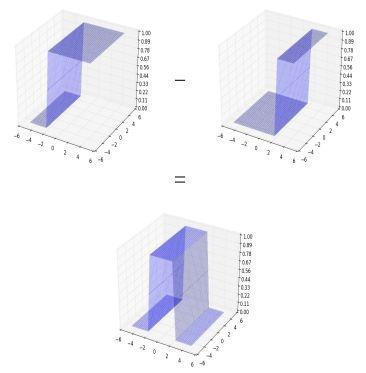
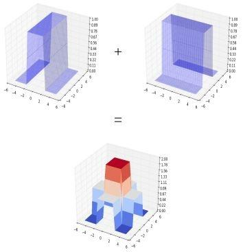

Copyright © Microsoft Corporation. All rights reserved.
  适用于[License](https://github.com/Microsoft/ai-edu/blob/master/LICENSE.md)版权许可

## 9.3 通用近似定理

这里有一篇论文，Kurt Hornik在1991年发表的，说明了含有一个隐层的神经网络能拟合任意复杂函数。我们把英文的摘要放在这里，供大家参考：

https://www.sciencedirect.com/science/article/pii/089360809190009T

Abstract - We show that standard multilayer feedforward networks with as few as a single hidden layer and arbitrary bounded and nonconstant activation function are universal approximators with respect to L(u) performance criteria, for arbitrary finite input envrionment measres u, provided only that sufficiently many hidden units are available. If the activation function is continuous, bounded and nonconstant, then continuous mappings can be learned uniformly over compact input sets. We also give very general conditions ensuring that networks with sufficiently smooth activation functions are capable of arbitrarily accurate approximation to a function and its derivatives.

简言之：两层前馈神经网络（即一个隐层加一个输出层）和至少一层具有任何一种挤压性质的激活函数，只要隐层的神经元的数量足够，它能以任意精度来近似拟合任意连续函数。

#### 直观解释

还有一种直观的解释是这样的（个人认为这不是神经网络的工作原理），用无数个矩形的拼接来近似一条曲线：

|粗粒度|细粒度|
|---|---|
|||

它的理论基础是：

假设在隐层有两个神经元，都配置有Sigmoid激活函数。第一个神经元在-0.01处产生一个阶跃，第二个神经元在+0.01处产生一个阶跃，都是用Sigmoid函数完成的，然后用第一个神经元的输出减去第二个神经元的输出（设置权重值为[1,-1]）,就会形成一个“门”。无数个这样的“门”就能模拟出一条曲线。

对于三维空间，它是这个样子的：

|阶跃面|封闭塔|
|---|---|
|||

在三维空间中，两个有不同偏置值的sigmoid激活函数相减，我们将得到左侧的等效曲线。如果我们采用另一个水平垂直的塔架到现在组合的曲线上。在叠加这两个水平垂直的开放式塔时，我们就可以得到封闭的塔。然后就可以用封闭塔模拟任何三维曲面。

### 参考资料

- https://towardsdatascience.com/representation-power-of-neural-networks-8e99a383586

# 用于拟合的双层神经网络的结构

## 前向计算

在本章中，为了完成复杂函数拟合任务，我们将使用如下正向过程：

$$Z1=W1 \cdot X+B1$$

$$A1=Sigmoid(Z1)$$

$$Z2=W2 \cdot A1+B2$$

$$A2=Identity(Z2) \tag{没有激活函数}$$

以及均方差损失函数：

$$J(w,b) = \frac{1}{2m}\sum^m_{i=1}(z_i-y_i)^2$$

前向计算图：

木头：这里有三个疑问：

1. 为什么要用两层神经网络？
2. 为什么在神经网络的第二层，没有用到激活函数？
3. 为什么我们用均方差损失函数，而不是交叉熵损失函数？

铁柱：这先要理解神经网络的原理，我们一个个地回答你的问题。

## 为什么要用两层神经网络？

首先，一层神经网络肯定不能完成这个复杂函数的拟合过程。因为一层神经网络，只能完成线性任务。这里的“线性任务”的定义，从简单到复杂，列表如下：

|名称|形式|能力
|---|---|---|
|单变量线性回归|$y=w_0+w_1·x$|拟合二维平面直线|
|多变量线性回归|$y=w_0+w_1·x_1+w_2·x_2...$|拟多高维空间直线或平面|
|高阶线性回归|$y=w_0+w_1·x_1+w_2·x^2_1...$|拟合二维平面高阶曲线|
|多变量高阶线性回归|$y=w_0+w_1·x_1+w_2·x_2+w_3·x^2_1+w_4·x^2_2...$|拟合多维空间高阶曲线或曲面|

所谓的“高阶”，指的是特征变量其实只有一个x1，但是把x1的平方也算作第二个特征向量。比如一栋房子的长度x1，宽度x2，占地面积x3=x1*x2。这里的x3并不是独立存在的，真正的自变量只有x1和x2。

这些高次线性回归问题，可以用单层的神经网络来解决，但是是有前提条件的，即假设函数必须和实际问题吻合。满足这个条件的实际工程问题并不多见，并且这种情况完全可以用两层的神经网络来解决，所以我们没有在单层的神经网络中涉及这个问题。

## 为什么在输出层没有用到激活函数？

神经网络不管有多少层，最后的输出层决定了这个神经网络能干什么。在单层神经网络中，我们学习到了以下示例：

|网络|输入|输出|激活函数|功能|
|---|---|---|---|---|
|单层|单变量|单输出|无|二维线性回归/拟合|
|单层|多变量|单输出|无|多维线性回归/拟合|
|单层|多变量|单输出|二分类函数|二分类|
|单层|多变量|多输出|多分类函数|多分类|

对于多层神经网络也是如此，我们要完成拟合任务，而不是分类，所以用不到激活/分类函数。通常把激活函数和分类函数混淆在一起说，如果明确地区分二者，则可以这样说：**神经网络的最后一层不用激活函数**，只可能用到分类函数。Sigmoid既是激活函数，又是分类函数，是个特例。

神经网络的拟合原理是这样的：在第一层神经网络，通过$W1*X+B1$的计算做线性变化，把非线性问题转换成线性问题；在第二层神经网络做线性回归。所以在第二层是不需要激活函数的，否则就没法画出一条直线来。这个可以想象两个独立的神经网络，第一个网络已经把数据处理成线性的了，以便让我们使用第4章的方法，做一次线性回归就好了。

简言之：

1. 神经网络最后一层不需要激活函数
2. 激活函数只用于连接前后两层神经网络

## 为什么用均方差而不是交叉熵损失函数？

我们把上面的表格拿来再扩充一下：

|网络|输入|输出|激活函数|损失函数|功能|
|---|---|---|---|---|---|
|单层|单变量|单输出|无|均方差|二维线性回归/拟合|
|单层|多变量|单输出|无|均方差|多维线性回归/拟合|
|单层|多变量|单输出|二分类函数|交叉熵|二分类|
|单层|多变量|多输出|多分类函数|交叉熵|多分类|

交叉熵函数是用于分类的，均方差函数是用于拟合的，可以理解为计算拟合的点和样本标签点的距离之平方和。

## 反向传播

木头：由于是第一次接触两层的神经网络，我看到反向传播的函数体中，比起一层的网络复杂了很多。您能详细解释一下吗？

铁柱：看一下计算图，然后用链式求导法则反推。

蓝色的箭头线表示正向计算过程，黄色的箭头线表示反向的传播过程。

### 梯度生成

对损失函数求导，可以得到损失函数对输出层的梯度值，即上图中的Z2部分。

因为：

$$J(w,b) = \frac{1}{2m} \sum (z_i-y_i)^2$$

$${\partial{J} \over \partial{z_i}}=\frac{1}{2m} \sum {\partial{(z_i-y_i)^2} \over \partial{z_i}}=\frac{1}{m} \sum (z_i-y_i)$$

用于矩阵运算，可以简写为：

$$dZ2 = \frac{\partial{J}}{\partial{Z2}} = Z2-Y \tag{1}$$

### 求W2的梯度

$$Z2 = W2 \cdot A1+B2$$

$${\partial{Z2} \over \partial{W2}}=\frac{\partial{(W2 \cdot A1+B2)}}{\partial{W2}}$$

$$=\frac{\partial{(W2 \cdot A1)}}{\partial{W2}}+\frac{\partial{(B2)}}{\partial{W2}}$$

$$=A1^T+0=A1^T$$

结合损失函数对Z2的偏导结果，使用链式法则：

$$
dW2 = \frac{\partial{J}}{\partial{W2}} = \frac{\partial{J}}{\partial{Z2}} \cdot \frac{\partial{Z2}}{\partial{W2}}
$$
$$=(Z2-Y)A1^T \tag{2}$$

### 求B2的梯度

$$dB2 = \frac{\partial{J}}{\partial{B2}} = \frac{\partial{J}}{\partial{Z2}} \cdot \frac{\partial{Z2}}{\partial{B2}}$$

$$=(Z2-Y) \cdot 1=Z2-Y \tag{3}$$

### 求损失函数对隐层的梯度

对于深度神经网络，需要把梯度从最后一层逐层向前传递，经过激活函数的导数，直接达到线性计算部分，即下图中的Z1部分：

链式求导公式如下：

$$
\frac{\partial{J}}{\partial{Z1}} = \frac{\partial{J}}{\partial{Z2}} \cdot \frac{\partial{Z2}}{\partial{A1}} \cdot \frac{\partial{A1}}{\partial{Z1}}
$$

公式(1)已经有了第一项的结果，现在来解决后面两项：

$$\frac{\partial{Z2}}{\partial{A1}} = \frac{\partial{(W2 \cdot A1 + B2)}}{\partial{A1}}=W2^T$$

$$\frac{\partial{A1}}{\partial{Z1}}=\frac{\partial{(Sigmoid(Z1))}}{\partial{Z1}}=A1 \odot (1-A1)$$

所以：

$$dZ1=\frac{\partial{J}}{\partial{Z1}} = \frac{\partial{J}}{\partial{Z2}} \cdot \frac{\partial{Z2}}{\partial{A1}} \cdot \frac{\partial{A1}}{\partial{Z1}}$$
$$=W2^T \times dZ2 \odot A1 \odot (1-A1) \tag{4}$$

### 求W1的梯度

$$\frac{\partial{Z1}}{\partial{W1}} = \frac{\partial{(W1 \cdot X+B1)}}{\partial{W1}} = X^T$$

$$
dW1=\frac{\partial{J}}{\partial{W1}} = \frac{\partial{J}}{\partial{Z1}} \frac{\partial{Z1}}{\partial{W1}}= dZ1 \times X^T \tag{5}
$$

### 求B1的梯度

$$\frac{\partial{Z1}}{\partial{B1}} = \frac{\partial{(W1 \cdot X+B1)}}{\partial{B1}} = 1$$

$$
dB1=\frac{\partial{J}}{\partial{B1}} = \frac{\partial{J}}{\partial{Z1}} \frac{\partial{Z1}}{\partial{B1}}= dZ1 \tag{6}
$$

