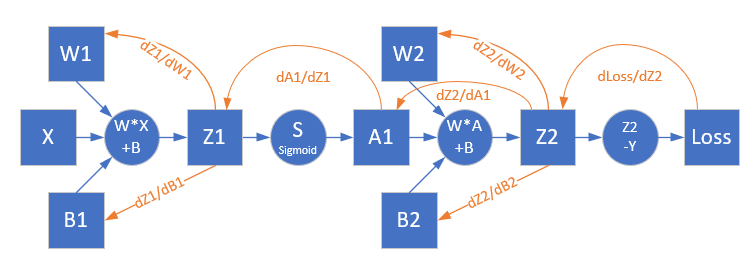

Copyright © Microsoft Corporation. All rights reserved.
  适用于[License](https://github.com/Microsoft/ai-edu/blob/master/LICENSE.md)版权许可

## 9.3 双层神经网络实现非线性回归

### 9.3.1 万能近似定理

这里有一篇论文，Kurt Hornik在1991年发表的，说明了含有一个隐层的神经网络能拟合任意复杂函数。

https://www.sciencedirect.com/science/article/pii/089360809190009T

简言之：两层前馈神经网络（即一个隐层加一个输出层）和至少一层具有任何一种挤压性质的激活函数，只要隐层的神经元的数量足够，，它可以以任意的精度来近似任何从一个有限维空间到另一个有限维空间的Borel可测函数。当然这个函数需要是单调递增有界的。

注意，它要求的是挤压性质的激活函数，也就是类似Sigmoid的函数，如果用ReLU函数不能实现这个效果。

万能近似定理意味着无论我们试图学习什么函数，我们知道一个大的MLP一定能够表示这个函数。然而，我们不能保证训练算法能够学得这个函数。即使MLP能够表示该函数，学习也可能因两个不同的原因而失败。

1. 用于训练的优化算法可能找不到用于期望函数的参数值；
2. 训练算法可能由于过拟合而选择了错误的函数。

根据“没有免费的午餐”定理，说明了没有普遍优越的机器学习算法。前馈网络提供了表示函数的万能系统，在这种意义上，给定一个函数，存在一个前馈网络能够近似该函数。但不存在万能的过程既能够验证训练集上的特殊样本，又能够选择一个函数来扩展到训练集上没有的点。

总之，具有单层的前馈网络足以表示任何函数，但是网络层可能大得不可实现，并且可能无法正确地学习和泛化。在很多情况下，使用更深的模型能够减少表示期望函数所需的单元的数量，并且可以减少泛化误差。

### 9.3.2 定义神经网络结构

通过观察样本数据的范围，x是在[0,1]，y是[-0.5,0.5]，这样我们就不用做数据归一化了。这条线看起来像一条处于攻击状态的眼镜蛇！由于是拟合任务，所以标签值y是一系列的实际数值，并不是0/1这样的特殊标记。

根据万能近似定理的要求，我们定义一个两层的神经网络，输入层不算，一个隐藏层，含3个神经元，一个输出层。

#### 输入层

输入层就是一个标量x值。

#### 权重矩阵W1/B1

$$
W1=
\begin{pmatrix}
w_{11} & w_{12} & w_{13}
\end{pmatrix}
$$

其实这里的B1所在的圆圈里应该是个常数1，而B1连接到Z1-1...Z1-4的权重线B1-1...B1-4应该是个浮点数。我们为了说明问题方便，就写了个B1，而实际的B1是指B1-1...B1-4的矩阵/向量。

$$
B1=
\begin{pmatrix}
b_{11} & b_{12} & b_{13} 
\end{pmatrix}
$$

#### 隐层

我们用3个神经元的网络来模拟函数，每个神经元的输入

$$z_{11} = x_1 \cdot w_{11} + b_{11}$$
$$z_{12} = x_1 \cdot w_{12} + b_{12}$$
$$z_{13} = x_1 \cdot w_{13} + b_{13}$$
$$a_{1i} = sigmoid(z_{1i})$$

写成矩阵形式：

$$Z1 = X \cdot W1 + B1 = \begin{pmatrix}
z_{11} & z_{12} & z_{13} 
\end{pmatrix}$$
$$A1 = Sigmoid(Z1) = \begin{pmatrix}
a_{11} & a_{12} & a_{13} 
\end{pmatrix}$$

#### 权重矩阵W2/B2

W2的尺寸是3x1，B2的尺寸是1x1。
$$
W2=
\begin{pmatrix}
w_{11} \\
w_{21} \\
w_{31}
\end{pmatrix}
$$

$$
B2=
\begin{pmatrix}
b_{11}
\end{pmatrix}
$$

#### 输出层

由于我们只想完成一个拟合任务，所以输出层只有一个神经元：

$$
z2 = 
\begin{pmatrix}
    a_{11} & a_{12} & a_{13}
\end{pmatrix}
\cdot
\begin{pmatrix}
    w_{11} \\
    w_{21} \\
    w_{31}
\end{pmatrix}
=a_{11}w_{11}+a_{12}w_{21}+a_{13}w_{31}+b_{11}
$$

矩阵形式：

$$Z2=A1 \cdot W2+B2$$

#### 损失函数

均方差损失函数：

$$loss(w,b) = \frac{1}{2} (z2_i-y_i)^2$$

其中，$z2_i$是样本预测值，$y_i$是样本的标签值，这里的z是第二层的输出Z2。

### 9.3.3 反向传播

由于我们第一次接触双层神经网络，所以需要推导一下反向传播的各个过程。看一下计算图，然后用链式求导法则反推。

$$
{\partial loss \over \partial z2_i} = z2_i - y_i
$$

$$
{\partial z2_i \over \partial w2} = 
\begin{pmatrix}
    {\partial z2_i / \partial w_{11}} \\
    {\partial z2_i / \partial w_{21}} \\
    {\partial z2_i / \partial w_{31}}
\end{pmatrix}
=
\begin{pmatrix}
    a_{11} \\
    a_{12} \\
    a_{13}
\end{pmatrix}
=\begin{pmatrix}
    a_{11} & a_{12} & a_{13}
\end{pmatrix}^T
=a1^T
$$

所以w2的误差为：

$$
{\partial loss \over \partial z2_i}{\partial z2_i \over \partial w2}=(z2_i - y_i) \cdot a1^T
$$

所以b2的误差为：

$$
{\partial loss \over \partial z2_i}{\partial z2_i \over \partial b2}=z2_i - y_i
$$

$$
{\partial z2 \over \partial a1}=
\begin{pmatrix}
    {\partial z2 \over \partial a_{11}} & {\partial z2 \over \partial a_{12}} & {\partial z2 \over \partial a_{13}}
\end{pmatrix}
=
\begin{pmatrix}
    w_{11} & w_{21} & w_{31}
\end{pmatrix}
=W2^T
$$
$$
{\partial a1 \over \partial z1}=a1 \odot (1-a1)
$$

$$
{\partial loss \over \partial z1}={\partial loss \over \partial z2}{\partial z2 \over \partial a1}{\partial a1 \over \partial z1}
$$
$$
=W2^T \cdot (z2-y) \odot a1 \odot (1-a1)
$$

### 代码位置

ch09, Level3
