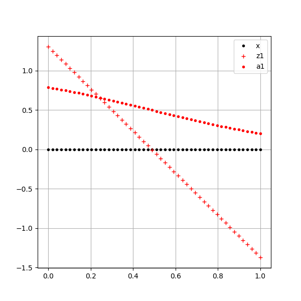
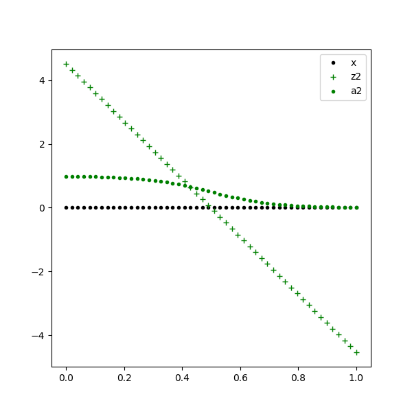
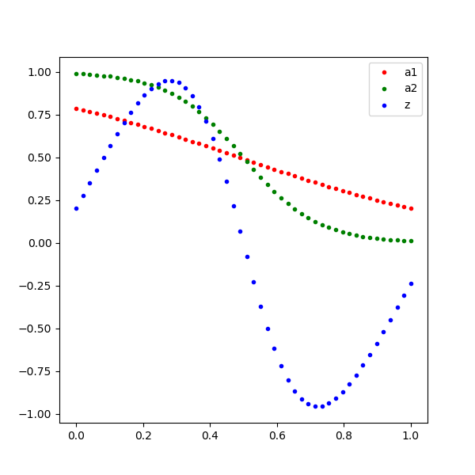

<!--Copyright © Microsoft Corporation. All rights reserved.
  适用于[License](https://github.com/Microsoft/ai-edu/blob/master/LICENSE.md)版权许可-->

## 9.6 非线性回归的工作原理

### 9.6.1 多项式为何能拟合曲线

先回忆一下本章最开始讲的多项式回归法，它成功地用于正弦曲线和复合函数曲线的拟合，其基本工作原理是把单一特征值的高次方做为额外的特征值加入，使得神经网络可以得到附加的信息用于训练。实践证明其方法有效，但是当问题比较复杂时，需要高达8次方的附加信息，且训练时间也很长。

当我们使用双层神经网络时，在隐层只放置了三个神经元，就轻松解决了复合函数拟合的问题，效率高出十几倍，复杂度却降低了几倍。那么含有隐层的神经网络究竟是如何完成这个任务的呢？

我们以正弦曲线拟合为例来说明这个问题，首先看一下多项式回归方法的示意图，如图9-17。


图9-17 多项式回归方法的特征值输入

单层神经网络的多项式回归法，需要$x，x^2，x^3$三个特征值，组成如下公式来得到拟合结果：

$$
z = x \cdot w_1 + x^2 \cdot w_2 + x^3 \cdot w_3 + b \tag{1}
$$

我们可以回忆一下第5章学习的多变量线性回归问题，公式1实际上是把一维的x的特征信息，增加到了三维，然后再使用多变量线性回归来解决问题的。本来一维的特征只能得到线性的结果，但是三维的特征就可以得到非线性的结果，这就是多项式拟合的原理。

我们用具体的数值计算方式来理解一下其工作过程。

```Python
import numpy as np
import matplotlib.pyplot as plt

if __name__ == '__main__':
    x = np.linspace(0,1,10)
    w = 1.1
    b = 0.2
    y = x * w + b
    p1, = plt.plot(x,y, marker='.')

    x2 = x*x
    w2 = -0.5
    y2 = x * w + x2 * w2 + b
    p2, = plt.plot(x, y2, marker='s')

    x3 = x*x*x
    w3 = 2.3
    y3 = x * w + x2 * w2 + x3 * w3 + b
    p3, = plt.plot(x, y3, marker='x')

    plt.grid()
    plt.xlabel("x")
    plt.ylabel("y")
    plt.title("linear and non-linear")
    plt.legend([p1,p2,p3], ["x","x*x","x*x*x"])
    plt.show()
```

上述代码完成了如下任务：

1. 定义[0,1]之间的等距的10个点
2. 使用w=1.1, b=0.2, 计算一个线性回归数值y
3. 使用w=1.1, w2=-0.5, b=0.2, 计算一个二项式回归数值y2
4. 使用w=1.1, w2=-0.5, w3=2.3, b=0.2, 计算一个三项式回归数值y3
5. 绘制出三条曲线，如图9-18所示。


图9-18 线性到非线性的变换

可以清楚地看到：

- 蓝色直线是线性回归数值序列；
- 红色曲线是二项式回归数值序列；
- 绿色曲线是三项式回归数值序列。

也就是说，我们只使用了同一个x序列的原始值，却可以得到三种不同数值序列，这就是多项式拟合的原理。当多项式次数很高、数据样本充裕、训练足够多的时候，甚至可以拟合出非单调的曲线。

### 9.6.2 神经网络的非线性拟合工作原理

我们以正弦曲线的例子来讲解神经网络非线性回归的工作过程和原理。

表9-14

|单层多项式回归|双层神经网络|
|---|---|
|||

比较一下表9-14中的两张图，左侧为单特征多项式拟合的示意图，右侧为双层神经网络的示意图。

左图中，通过人为的方式，给Z的输入增加了$x^2和x^3$项。

右图中，通过线性变换的方式，把x变成了两部分：$z_{11}/a_{11}，z_{12}/a_{12}$，然后再通过一次线性变换把两者组合成为Z，这种方式和多项式回归非常类似：

1. 隐层把x拆成不同的特征，根据问题复杂度决定神经元数量，神经元的数量相当于特征值的数量；
2. 隐层通过激活函数做一次非线性变换；
3. 输出层使用多变量线性回归，把隐层的输出当作输入特征值，再做一次线性变换，得出拟合结果。

与多项式回归不同的是，不需要指定变换参数，而是从训练中学习到参数，这样的话权重值不会大得离谱。

下面讲述具体的工作步骤。

#### 第一步 把X拆成两个线性序列z1和z2

假设原始值x有21个点，样本数据如表9-15所示。

表9-15

|id|0|1|2|...|19|20|21|
|--|--|--|--|--|--|--|--|
|x|0.|0.05|0.1|...|0.9|0.95|1.|

通过以下线性变换，被分成了两个线性序列，得到表9-16所示的隐层值：

$$
z1 = x \cdot w_{11} + b_{11} \tag{2}
$$
$$
z2 = x \cdot w_{12} + b_{12} \tag{3}
$$

其中：

- $w_{11}$ = -2.673
- $b_{11}$ = 1.303
- $w_{12}$ = -9.036
- $b_{12}$ = 4.507

表9-16 隐层线性变化结果

||0|1|2|...|19|20|21|
|--|--|--|--|--|--|--|--|
|z1|1.303|1.169|1.035|...|-1.102|-1.236|-1.369|
|z2|4.507|4.055|3.603|...|-3.625|-4.077|-4.528|

三个线性序列如图9-19所示，黑色点是原始数据序列，红色和绿色点是拆分后的两个序列。


图9-19 从原始数据序列拆分成的两个数据序列

这个运算相当于把特征值分解成两个部分，不太容易理解。打个不太恰当的比喻，有一个浮点数12.34，你可以把它拆成12和0.34两个部分，然后去分别做一些运算。另外一个例子就是，一张彩色图片上的黄色，我们普通人看到的就是黄色，但是画家会想到是红色和绿色的组合。

#### 第二步 计算z1的激活函数值a1

表9-17和图9-20分别展示了隐层对第一个特征值的计算结果数值和示意图。

表9-17 第一个特征值及其激活函数结果数值

||0|1|2|...|19|20|21|
|--|--|--|--|--|--|--|--|
|z1|1.303|1.169|1.035|...|-1.102|-1.236|-1.369|
|a1|0.786|0.763|0.738|...|0.249|0.225|0.203|

第二行的a1值等于第1行的z1值的sigmoid函数值：

$$a1 = {1 \over 1+e^{-z1}} \tag{4}$$



图9-20 第一个特征值及其激活函数结果可视化

z1还是一条直线，但是经过激活函数后的a1已经不是一条直线了。上面这张图由于z1的跨度大，所以a1的曲线程度不容易看出来。

#### 第三步 计算z2的激活函数值a2

表9-18和图9-21分别展示了隐层对第二个特征值的计算结果数值和示意图。

表9-18 第二个特征值及其激活函数结果数值

||0|1|2|...|19|20|21|
|--|--|--|--|--|--|--|--|
|z2|4.507|4.055|3.603|...|-3.625|-4.077|-4.528|
|a2|0.989|0.983|0.973|...|0.026|0.017|0.011|

$$a2 = {1 \over 1+e^{-z2}} \tag{5}$$



图9-21 第二个特征值及其激活函数结果可视化

z2还是一条直线，但是经过激活函数后的a2已经明显看出是一条曲线了。

#### 第四步 计算Z值

表9-19和图9-22分别展示了输出层对两个特征值的计算结果数值和示意图。

表9-19 输出层的计算结果数值

||0|1|2|...|19|20|21|
|--|--|--|--|--|--|--|--|
|a1|0.786|0.763|0.738|...|0.249|0.225|0.203|
|a2|0.989|0.983|0.973|...|0.026|0.017|0.011|
|z|0.202|0.383|0.561|...|-0.580|-0.409|-0.235|

$$z = a1 \cdot w_{11} + a2 \cdot w_{21} + b \tag{6}$$

其中：

- $w_{11}=-9.374$
- $w_{21}=6.039$
- $b=1.599$
  


图9-22 输出层的计算结果可视化

也就是说，相同x值的红点a1和绿点a2，经过公式6计算后得到蓝点z，而所有的蓝点就拟合出一条正弦曲线。

### 9.6.3 比较多项式回归和双层神经网络解法

表9-20列出了多项式回归和神经网络的比较结果，可以看到神经网络处于绝对的优势地位。

表9-20 多项式回归和神经网络的比较

||多项式回归|双层神经网络|
|---|---|---|
|特征提取方式|特征值的高次方|线性变换拆分|
|特征值数量级|高几倍的数量级|数量级与原特征值相同|
|训练效率|低，需要迭代次数多|高，比前者少好几个数量级|

### 代码位置

ch09, Level5
