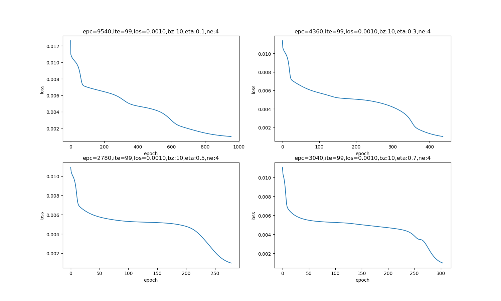
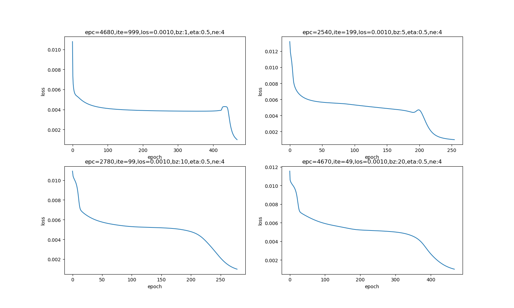
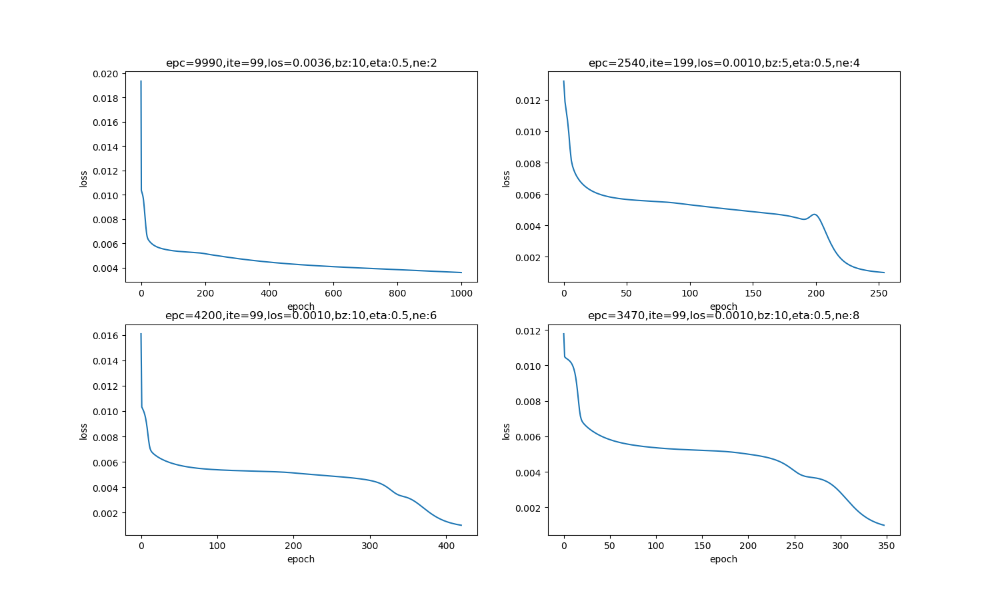

<!--Copyright © Microsoft Corporation. All rights reserved.
  适用于[License](https://github.com/Microsoft/ai-edu/blob/master/LICENSE.md)版权许可-->

## 9.7 超参数优化的初步认识

超参数优化（Hyperparameter Optimization）主要存在两方面的困难：

1. 超参数优化是一个组合优化问题，无法像一般参数那样通过梯度下降方法来优化，也没有一种通用有效的优化方法。
2. 评估一组超参数配置（Configuration）的时间代价非常高，从而导致一些优化方法（比如演化算法）在超参数优化中难以应用。

对于超参数的设置，比较简单的方法有人工搜索、网格搜索和随机搜索。 

### 9.7.1 可调的参数

我们使用表9-21所示的参数做第一次的训练。

表9-21 参数配置

|参数|缺省值|是否可调|注释|
|---|---|---|---|
|输入层神经元数|1|No|
|隐层神经元数|4|Yes|影响迭代次数|
|输出层神经元数|1|No|
|学习率|0.1|Yes|影响迭代次数|
|批样本量|10|Yes|影响迭代次数|
|最大epoch|10000|Yes|影响终止条件,建议不改动|
|损失门限值|0.001|Yes|影响终止条件,建议不改动|
|损失函数|MSE|No|
|权重矩阵初始化方法|Xavier|Yes|参看15.1|

表9-21中的参数，最终可以调节的其实只有三个：

- 隐层神经元数
- 学习率
- 批样本量

另外还有一个权重矩阵初始化方法需要特别注意，我们在后面的章节中讲解。

另外两个要提一下的参数，第一个是最大epoch数，根据不同的模型和案例会有所不同，在本例中10000次足以承载所有的超参组合了；另外一个是损失门限值，它是一个先验数值，也就是说笔者通过试验，事先知道了当eps=0.001时，会训练出精度可接受的模型来，但是在实践中没有这种先验知识，只能摸着石头过河，因为在训练一个特定模型之前，谁也不能假设它能到达的精度值是多少，损失函数值的下限也是通过多次试验，通过历史记录的趋势来估算出来的。

如果读者不了解神经网络中的基本原理，那么所谓“调参”就是碰运气了。今天咱们可以试着改变几个参数，来看看训练结果，以此来增加对神经网络中各种参数的了解。

#### 避免权重矩阵初始化的影响

权重矩阵中的参数，是神经网络要学习的参数，所以不能称作超参数。

权重矩阵初始化是神经网络训练非常重要的环节之一，不同的初始化方法，甚至是相同的方法但不同的随机值，都会给结果带来或多或少的影响。

在后面的几组比较中，都是用Xavier方法初始化的。在两次参数完全相同的试验中，即使两次都使用Xavier初始化，因为权重矩阵参数的差异，也会得到不同的结果。为了避免这个随机性，我们在代码WeightsBias.py中使用了一个小技巧，调用下面这个函数：

```Python
class WeightsBias(object):
    def InitializeWeights(self, folder, create_new):
        self.folder = folder
        if create_new:
            self.__CreateNew()
        else:
            self.__LoadExistingParameters()
        # end if

    def __CreateNew(self):
        self.W, self.B = WeightsBias.InitialParameters(self.num_input, self.num_output, self.init_method)
        self.__SaveInitialValue()
        
    def __LoadExistingParameters(self):
        file_name = str.format("{0}\\{1}.npz", self.folder, self.initial_value_filename)
        w_file = Path(file_name)
        if w_file.exists():
            self.__LoadInitialValue()
        else:
            self.__CreateNew()
```

第一次调用InitializeWeights()时，会得到一个随机初始化矩阵。以后再次调用时，如果设置create_new=False，只要隐层神经元数量不变并且初始化方法不变，就会用第一次的初始化结果，否则后面的各种参数调整的结果就没有可比性了。

至于为什么使用Xavier方法初始化，将在15.1中讲解。

### 9.7.2 手动调整参数

手动调整超参数，我们必须了解超参数、训练误差、泛化误差和计算资源（内存和运行时间）之间的关系。手动调整超参数的主要目标是调整模型的有效容量以匹配任务的复杂性。有效容量受限于3个因素：

- 模型的表示容量；
- 学习算法与代价函数的匹配程度；
- 代价函数和训练过程正则化模型的程度。

表9-22比较了几个超参数的作用。具有更多网络层、每层有更多隐藏单元的模型具有较高的表示能力，能够表示更复杂的函数。学习率是最重要的超参数。如果你只有一个超参数调整的机会，那就调整学习率。

表9-22 各种超参数的作用

|超参数|目标|作用|副作用|
|---|---|---|---|
|学习率|调至最优|低的学习率会导致收敛慢，高的学习率会导致错失最佳解|容易忽略其它参数的调整|
|隐层神经元数量|增加|增加数量会增加模型的表示能力|参数增多、训练时间增长|
|批大小|有限范围内尽量大|大批量的数据可以保持训练平稳，缩短训练时间|可能会收敛速度慢|

通常的做法是，按经验设置好隐层神经元数量和批大小，并使之相对固定，然后调整学习率。

### 9.7.3 网格搜索

当有3个或更少的超参数时，常见的超参数搜索方法是网格搜索（grid search）。对于每个超参数，选择一个较小的有限值集去试验。然后，这些超参数的笛卡儿乘积（所有的排列组合）得到若干组超参数，网格搜索使用每组超参数训练模型。挑选验证集误差最小的超参数作为最好的超参数组合。

用学习率和隐层神经元数量来举例，横向为学习率，取值[0.1,0.3,0.5,0.7]；纵向为隐层神经元数量，取值[2,4,8,12]，在每个组合上测试验证集的精度。我们假设其中最佳的组合精度达到0.97，学习率=0.5，神经元数=8，那么这个组合就是我们需要的模型超参，可以拿到测试集上去做最终测试了。

表9-23数据为假设的结果值，用于说明如何选择最终参数值。

表9-23 各种组合下的准确率

||eta=0.1|eta=0.3|eta=0.5|eta=0.7|
|---|---|---|---|---|
|ne=2|0.63|0.68|0.71|0.73|
|ne=4|0.86|0.89|0.91|0.3|
|ne=8|0.92|0.94|0.97|0.95|
|ne=12|0.69|0.84|0.88|0.87|

针对我们这个曲线拟合问题，规模较小，模型简单，所以可以用上表列出的数据做搜索。对于大规模模型问题，学习率的取值集合可以是{0.1, 0.01, 0.001, 0.0001, 0.00001}，隐层单元数集合可以是{50, 100, 200, 500, 1000, 2000}，亦即在对数尺度上搜索，确定范围后，可以做进一步的小颗粒步长的搜索。

网格搜索带来的一个明显问题是，计算代价会随着超参数数量呈指数级增长。如果有m个超参数，每个最多取n个值，那么训练和估计所需的试验数将是$O(n^m)$。我们可以并行地进行实验，并且并行要求十分宽松（进行不同搜索的机器之间几乎没有必要进行通信）。令人遗憾的是，由于网格搜索指数级增长计算代价，即使是并行，我们也无法提供令人满意的搜索规模。

下面我们做一下具体的试验。

#### 学习率的调整

我们固定其它参数，即隐层神经元ne=4、batch_size=10不变，改变学习率，来试验网络训练情况。为了节省时间，不做无限轮次的训练，而是设置eps=0.001为最低精度要求，一旦到达，就停止训练。

表9-24和图9-23展示了四种学习率值的不同结果。

表9-24 四种学习率值的比较

|学习率|迭代次数|说明|
|----|----|----|
|0.1|10000|学习率小，收敛最慢，没有在规定的次数内达到精度要求|
|0.3|10000|学习率增大，收敛慢，没有在规定的次数内达到精度要求|
|0.5|8200|学习率增大，在8200次左右达到精度要求|
|0.7|3500|学习率进一步增大，在3500次达到精度|



图9-23 四种学习率值造成的损失函数值的变化

需要说明的是，对于本例的拟合曲线这个特定问题，较大的学习率可以带来很快的收敛速度，但是有两点：

- 但并不是对所有问题都这样，有的问题可能需要0.001或者更小的学习率
- 学习率大时，开始时收敛快，但是到了后来有可能会错失最佳解

#### 批大小的调整

我们固定其它参数，即隐层神经元ne=4、eta=0.5不变，调整批大小，来试验网络训练情况，设置eps=0.001为精度要求。

表9-25和图9-24展示了四种批大小值的不同结果。

表9-25 四种批大小数值的比较

|批大小|迭代次数|说明|
|----|----|----|
|5|2500|批数据量小到1，收敛最快|
|10|8200|批数据量增大，收敛变慢|
|15|10000|批数据量进一步增大，收敛变慢|
|20|10000|批数据量太大，反而会降低收敛速度|



图9-24 四种批大小值造成的损失函数值的变化

合适的批样本量会带来较快的收敛，前提是我们固定了学习率。如果想用较大的批数据，底层数据库计算的速度较快，但是需要同时调整学习率，才会相应地提高收敛速度。

这个结论的前提是我们用了0.5的学习率，如果用0.1的话，将会得到不同结论。

#### 隐层神经元数量的调整

我们固定其它参数，即batch_size=10、eta=0.5不变，调整隐层神经元的数量，来试验网络训练情况，设置eps=0.001为精度要求。

表9-26和图9-25展示了四种神经元数值的不同结果。

表9-26 四种隐层神经元数量值的比较

|隐层神经元数量|迭代次数|说明|
|---|---|---|
|2|10000|神经元数量少，拟合能力低|
|4|8000|神经元数量增加会有帮助|
|6|5500|神经元数量进一步增加，收敛更快|
|8|3500|再多一些神经元，还会继续提供收敛速度|



图9-25 四种隐层神经元数量值造成的损失函数值的变化

对于这个特定问题，隐层神经元个数越多，收敛速度越快。但实际上，这个比较不准确，因为隐层神经元数量的变化，会导致权重矩阵的尺寸变化，因此对于上述4种试验，权重矩阵的初始值都不一样，不具有很强的可比性。我们只需要明白神经元数量多可以提高网络的学习能力这一点就可以了。

### 9.7.4 随机搜索

随机搜索（Bergstra and Bengio，2012），是一个替代网格搜索的方法，并且编程简单，使用更方便，能更快地收敛到超参数的良好取值。

随机搜索过程如下：

首先，我们为每个超参 数定义一个边缘分布，例如，Bernoulli分布或范畴分布（分别对应着二元超参数或离散超参数），或者对数尺度上的均匀分布（对应着正实 值超参数）。例如，其中，u(a,b)表示区间(a,b)上均匀采样的样本。类似地，log_number_of_hidden_units可以从 u(log(50),log(2000))上采样。

与网格搜索不同，我们不需要离散化超参数的值。这允许我们在一个更大的集合上进行搜索，而不产生额外的计算代价。实际上，当有几个超参数对性能度量没有显著影响时，随机搜索相比于网格搜索指数级地高效。

Bergstra and Bengio（2012）进行了详细的研究并发现相比于网格搜索，随机搜索能够更快地减小验证集误差（就每个模型运行的试验数而 言）。

与网格搜索一样，我们通常会重复运行不同 版本的随机搜索，以基于前一次运行的结果改进下一次搜索。

随机搜索能比网格搜索更快地找到良好超参数的原因是，没有浪费的实验，不像网格搜索有时会对一个超参数的两个不同值（给定其他超参 数值不变）给出相同结果。在网格搜索中，其他超参数将在这两次实验中拥有相同的值，而在随机搜索中，它们通常会具有不同的值。因此，如果这两个值的变化所对应的验证集误差没有明显区别的话，网格搜索没有必要重复两个等价的实验，而随机搜索仍然会对其他超参数进行两次独立的探索。

贝叶斯优化是另外一种比较成熟技术，有兴趣的读者请自行学习。

### 思考与练习

1. 使用下列参数设置，找到批大小和学习率的关系：

   - 隐层神经元：4
   - 初始化：Xavier
   - 批大小选择：2，5，10，15
   - 学习率选择：0.1，0.3，0.5，0.7

    用表格列出结果，从而得到批大小与学习率的最佳组合。

### 代码位置

ch09, Level5
