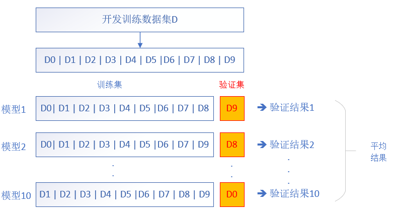

Copyright © Microsoft Corporation. All rights reserved.
  适用于[License](https://github.com/Microsoft/ai-edu/blob/master/LICENSE.md)版权许可

## 9.7 验证与测试

### 9.7.1 基本概念

- 训练集 train set

  A set of examples used for learning, which is to fit the parameters (i.e., weights) of the classifier. 
  
  用于模型训练的数据样本。

- 验证集 development set or dev set or validation set

  A set of examples used to tune the parameters (i.e., architecture, not weights) of a classifier, for example to choose the number of hidden units in a neural network. 

  是模型训练过程中单独留出的样本集，它可以用于调整模型的超参数和用于对模型的能力进行初步评估。
  
  在神经网络中，我们用验证数据集：
  - 寻找最优的网络深度
  - 或者决定反向传播算法的停止点
  - 或者在神经网络中选择隐藏层神经元的数量
  - 在普通的机器学习中常用的交叉验证 (Cross Validation) 就是把训练数据集本身再细分成不同的验证数据集去训练模型。

- 测试集 test set

  A set of examples used only to assess the performance (generalization) of a fully specified classifier. 

  用来评估模最终模型的泛化能力。但不能作为调参、选择特征等算法相关的选择的依据。

三者之间的关系如下图所示：


[一个形象的比喻来自这篇博客：](https://blog.csdn.net/kieven2008/article/details/81582591)

- 训练集：课本，学生根据课本里的内容来掌握知识。训练集直接参与了模型调参的过程，显然不能用来反映模型真实的能力。即不能直接拿课本上的问题来考试，防止死记硬背课本的学生拥有最好的成绩，即防止过拟合。

- 验证集：作业，通过作业可以知道不同学生学习情况、进步的速度快慢。验证集参与了人工调参(超参数)的过程，也不能用来最终评判一个模型（刷题库的学生不能算是学习好的学生）。

- 测试集：考试，考的题是平常都没有见过，考察学生举一反三的能力。所以要通过最终的考试(测试集)来考察一个学(模)生(型)真正的能力（期末考试）。

但是仅凭一次考试就对模型的好坏进行评判显然是不合理的，所以接下来就要介绍交叉验证法。

### 9.7.2 交叉验证

#### 传统的机器学习

在传统的机器学习中，我们经常用交叉验证(Cross Validation)的方法，比如把数据分成10份，V1-V10，其中V1-V9用来训练，V10用来验证。然后用V2-V10做训练，V1做验证......如此我们可以做10次训练和验证，大大增加了模型的可靠性。

这样的话，验证集也可以做训练，训练集数据也可以做验证，当样本很少时，这个很有用。

#### 神经网络/深度学习

那么深度学习中的用法是什么呢？

比如在神经网络中，训练时到底迭代多少次停止呢？或者我们设置学习率为多少何时呢？或者用几个中间层，以及每个中间层用几个神经元呢？如何正则化？这些都是超参数设置，都可以用验证集来解决。

在咱们前面的学习中，一般使用loss小于门限值做为迭代终止条件，因为我们预先知道了这个门限值可以满足训练精度。但对于实际应用中的问题，没有先验的门限值可以参考，如何设定终止条件？此时，我们可以用验证集来验证一下准确率，假设只有90%的的准确率，那可能确实是局部最优解。这样我们可以继续迭代，寻找全局最优解。

举个糖炒栗子：一个BP神经网络，我们无法确定隐层的神经元数目，因为没有理论支持。此时可以这样做：



1. 随机将训练数据分成K等份（通常建议K=10），得到$D_1, D_2, D_k$
2. 对于一个模型M，选择$D_9$为验证集，其它为训练集，训练若干轮，用$D_9$验证，得到误差$E$。再训练，再用$D_9$测试，如此N次。对N次的误差做平均，得到泛化误差
3. 换一个不同参数的模型的组合，比如神经元数量，或者网络层数，激活函数，用D8去得到泛化误差
4. ......一共验证10组组合
5. 最后选择具有最小泛化误差的模型结构，用所有的 $D0...D9$ 再次训练，成为最终模型，不用再验证
6. 用测试集测试

### 9.7.3 留出法 Hold out

使用交叉验证的方法虽然比较保险，但是非常耗时，尤其是在大数据量时，训练出一个模型都要很长时间，没有可能去训练出10个模型再去比较。

在深度学习中，有另外一种方法使用验证集，称为留出法。亦即从训练数据中保留出验证样本集，主要用于解决过拟合情况，这部分数据不用于训练。如果训练数据的准确度持续增长，但是验证数据的准确度保持不变或者反而下降，说明神经网络亦即过拟合了，此时需要停止训练，用测试集做最终测试。

所以，训练步骤的伪代码如下：

```
for each epoch
    shuffle
    for each iteraion
        获得当前小批量数据
        前向计算
        反向传播
        更新梯度
        if reach report loop
            用当前小批量数据计算训练集的loss值和accuracy值并记录
            计算验证集的loss值和accuracy值并记录
            如果loss值不再下降，停止训练
            如果accuracy值满足要求，停止训练
        end if
    end for
end for
```

从本章开始，我们将使用新的DataReader类来管理训练/测试数据，与前面的SimpleDataReader类相比，这个类有以下几个不同之处：

- 要求既有训练集，也有测试集
- 提供GenerateValidationSet()方法，可以从训练集中产生验证集

以上两个条件保证了我们在以后的训练中，可以使用本节中所描述的留出法，来监控整个训练过程。

关于三者的比例关系，在传统的机器学习中，三者可以是6:2:2。在深度学习中，一般要求样本数据量很大，所以可以给训练集更多的数据，比如8:1:1。

如果有些数据集已经给了你训练集和测试集，那就不关心其比例问题了，只需要从训练集中留出10%左右的验证集就可以了。
