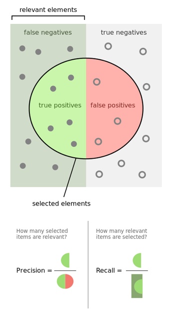
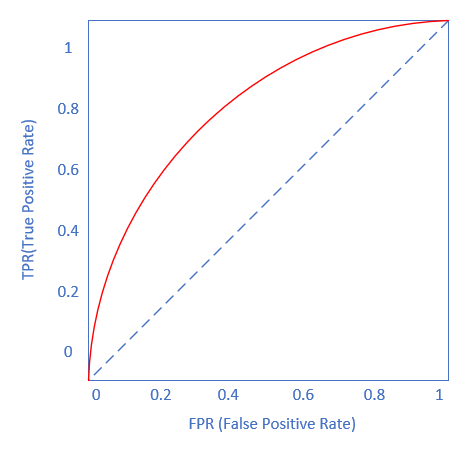

Copyright © Microsoft Corporation. All rights reserved.
  适用于[License](https://github.com/Microsoft/ai-edu/blob/master/LICENSE.md)版权许可

# 第10章 多入单出的双层神经网络

## 10.0 非线性二分类

### 10.0.1 提出问题

在1969年，一本著名的书《Perceptrons》（感知器，Minsky、Papert,1969）证明了无法使用单层网络（当时称为感知器）来表示最基本的异或逻辑功能。这本书带来了毁灭性的影响，对于感知机这一新生领域的资金支持及兴趣都消失了。

从上图看，两类样本点交叉分布在[0,1]空间的四个角上，用一条直线无法分割开两类样本。神经网络是建立在感知器的基础上的，那么我们用神经网络如何解决异或问题呢？

我们先回忆一下线性/非线性，二分类/多分类的含义。从直观上理解，这几个概念应该符合下图中的示例：

||二分类|多分类|
|---|---|---|
|线性|||
|非线性|||

通常，单层神经网络只能实现线性分类，虽然可以用一些特征的高阶形式来拟合有限的曲线，但要轻松想实现真正的非线性分类，必须使用两层以上的神经网络。

回到异或的问题上，能够分开这两类的的曲线，好像不符合上面四个图中的任意一个，笔者能想象出来的两种非线性分割方式如下：

但实际情况会是什么样呢？让我们一起学习一下神经网络的神奇之处。

### 10.0.2 分类模型的评估标准

#### 准确率 Accuracy

也可以称之为精度，我们在本书中混用这两个词。

对于二分类问题，假设测试集上一共1000个样本，其中550个正例，450个负例。测试一个模型时，得到的结果是：521个正例样本被判断为正类，435个负例样本被判断为负类，则正确率计算如下：

$$(521+435)/1000=0.956$$

即正确率为95.6%。这种方式对多分类也是有效的，即三类中判别正确的样本数除以总样本数，即为准确率。

但是这种计算方法丢失了很多细节，比如：是正类判断的精度高还是负类判断的精度高呢？因此，我们还有如下一种评估标准。

#### 混淆矩阵

还是用上面的例子，如果具体深入到每个类别上，会分成4部分来评估：
- 正例中被判断为正类的样本数（TP-True Positive）：521
- 正例中被判断为负类的样本数（FN-False Negative）：550-521=29
- 负例中被判断为负类的样本数（TN-True Negative）：435
- 负例中被判断为正类的样本数（FP-False Positive）：450-435=15

可以用下图来帮助理解：

在圆圈中的样本是被模型判断为正类的，圆圈之外的样本是被判断为负类的。

用矩阵表达的话是这样的：

|预测值|样本实际为正例|样本实际为负例||
|---|---|---|---|
|被判断为正类|TP-True Positive|FP-False Positive|P$={TP \over TP+FP}$|
|被判断为负类|FN-False Negative|TN-True Negative|
||TPR$={TP \over TP+FN}$|FPR$={FP \over FP+TN}$|

从混淆矩阵中可以得出以下统计指标：

- 准确率 Accuracy

$$Accuracy = {TP+TN \over TP+TN+FP+FN}$$

这个指标就是上面提到的准确率，越大越好。

- 精确率/查准率 Precision

分子为被判断为正类并且真的是正类的样本数。分母是被判断为正类的样本数。越大越好。

$$Precision={TP \over TP+FP}$$

- 召回率/查全率 Recall

$$Recall= {TP \over TP+FN}$$

分子为被判断为正类并且真的是正类的样本数。分母是真的正类的样本数。越大越好。

- TPR - True Positive Rate

$$TPR = {TP \over TP + FN}$$

- FPR - False Positive Rate

$$FPR = {FP \over FP+TN}$$

- 调和平均值 F1

$$F1={2 \times Precision \times Recall \over Precision+Recall}={2 \over {1 / P}+{1 / R}}$$

- ROC曲线与AUC

ROC曲线的横坐标是FPR，纵坐标是TPR。

图中红色的曲线就是ROC曲线，曲线下的面积就是AUC值，区间[0.5,1.0]，越大越好。面积越大，意味着红色曲线曲率越大，会向上方拱起得越大。最糟糕的情况是与蓝色虚线贴近。

当然在实际应用中，红色曲线不会这么平滑，由于采样间隔会导致该曲线呈阶梯状。

#### Kappa statics 

Kappa值，即内部一致性系数(inter-rater,coefficient of internal consistency)，是作为评价判断的一致性程度的重要指标。取值在0～1之间。
- Kappa≥0.75两者一致性较好；
- 0.75>Kappa≥0.4两者一致性一般；
- Kappa<0.4两者一致性较差。 

#### Mean absolute error 和 Root mean squared error 

平均绝对误差和均方根误差，用来衡量分类器预测值和实际结果的差异，越小越好。

#### Relative absolute error 和 Root relative squared error 

相对绝对误差和相对均方根误差，有时绝对误差不能体现误差的真实大小，而相对误差通过体现误差占真值的比重来反映误差大小。
