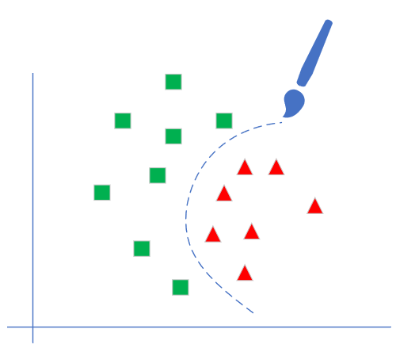
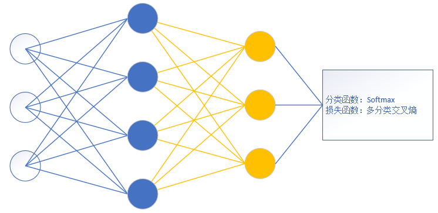
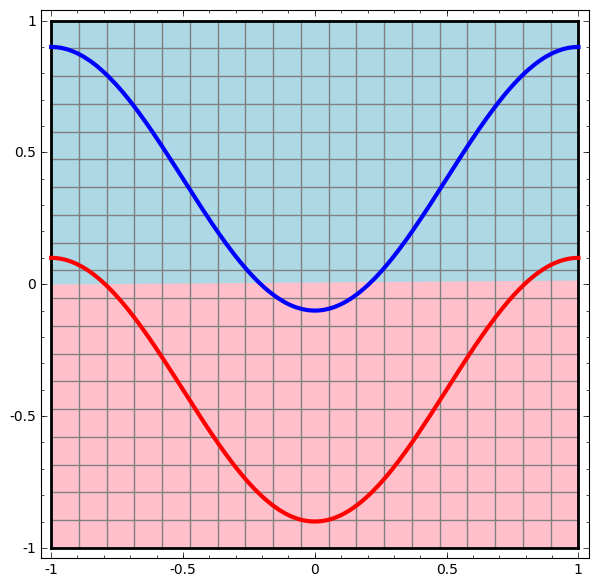

Copyright © Microsoft Corporation. All rights reserved.
  适用于[License](https://github.com/Microsoft/ai-edu/blob/master/LICENSE.md)版权许可

# 第10章 多入多出的双层神经网络

# 非线性分类问题

我们先比较一下线性/非线性，二分类/多分类的含义：

||二分类|多分类|
|---|---|---|
|线性|||
|非线性|||

单层神经网络只能实现线性分类，虽然可以用一些特征的高阶形式来拟合有限的曲线，但要想实现真正的非线性分类，必须使用两层以上的神经网络。

# 用于分类的双层神经网络

和我们前面学到的线性分类器一样，双层神经网络也有二分类和多分类两种分类器。

这是二分类器：

- 输入层可以是任意数量的特征值
- 隐层的神经元数量要大于等于输入层特征值数量，并且需要Sigmoid或Tanh等激活函数
- 输出层用一个神经元，后接Sigmoid分类函数
- 损失函数用二分类交叉熵函数
 
这是多分类器，图中所示为三分类：

- 输入层可以是任意数量的特征值，但是对于三分类，只有一个特征值的话，是不可能实现的
- 隐层的神经元数量要大于等于输入层特征值数量，并且需要Sigmoid或Tanh等激活函数
- 输出层用N个神经元，神经元的数量等于分类的数量，后接Softmax分类函数
- 损失函数用多分类交叉熵函数

# 工作原理

在两层神经网络的输出层，可以用和单层神经网络一样的结构来完成分类任务，而用隐层来完成非线性到线性的转换工作。我们可以通过以下几张图的比较来理解一下非线性到线性的转换。

以下图片均来自于[Christopher Olah的博客](https://colah.github.io/posts/2014-03-NN-Manifolds-Topology/)。

假设有两组点组成的红蓝两色曲线如下图：

我们如何用神经网络画一条直线或者曲线来把红蓝两线分开呢？用一层的神经网络可以做到这样：

神经网络已经很努力地把损失函数值降到最低了，但是由于能力有限，没有完成任务。于是我们考虑两层神经网络，它能很轻松地画一条曲线来区分红蓝两色：

我们不禁要奇怪它是如何做到的？其实神经网络的第二层还是只能画一条直线，而最神奇的地方是第一层，加上激活函数后，它可以做到坐标转换和空间扭曲：

从上图中可以看出，第一层计算，把坐标空间扭曲，然后第二层神经网络轻松地画了一条直线，就把二者完美分开了。

# 参考资料

https://colah.github.io/posts/2014-03-NN-Manifolds-Topology/
