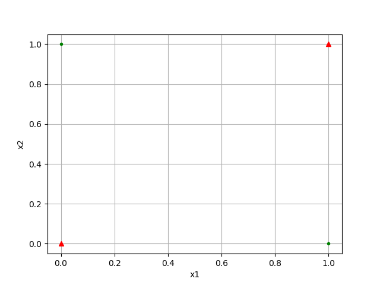
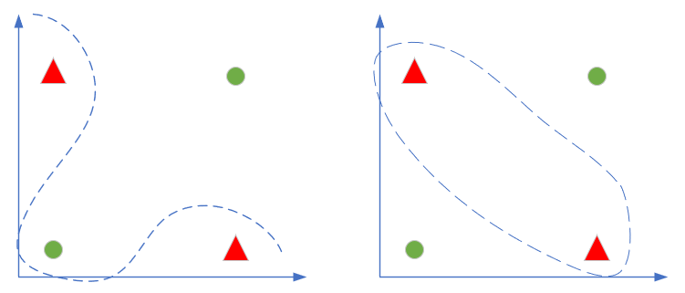

Copyright © Microsoft Corporation. All rights reserved.
  适用于[License](https://github.com/Microsoft/ai-edu/blob/master/LICENSE.md)版权许可

# 第10章 多入多出的双层神经网络

## 10.0 非线性分类

### 10.0.1 提出问题

在1969年，一本著名的书《Perceptrons》（感知器，Minsky、Papert,1969）证明了无法使用单层网络（当时称为感知器）来表示最基本的异或逻辑功能。这本书带来了毁灭性的影响，对于感知机这一新生领域的资金支持及兴趣都消失了。

从上图看，两类样本点交叉分布在[0,1]空间的四个角上，用一条直线无法分割开两类样本。神经网络是建立在感知器的基础上的，那么我们用神经网络如何解决异或问题呢？

我们先回忆一下线性/非线性，二分类/多分类的含义。从直观上理解，这几个概念应该符合下图中的示例：

||二分类|多分类|
|---|---|---|
|线性|||
|非线性|||

通常，单层神经网络只能实现线性分类，虽然可以用一些特征的高阶形式来拟合有限的曲线，但要轻松想实现真正的非线性分类，必须使用两层以上的神经网络。

回到异或的问题上，能够分开这两类的的曲线，好像不符合上面四个图中的任意一个，笔者能想象出来的两种非线性分割方式如下：

但实际情况会是什么样呢？让我们一起学习一下神经网络的神奇。

### 10.0.2 分类模型的评估标准

https://blog.csdn.net/hanphy/article/details/51911716