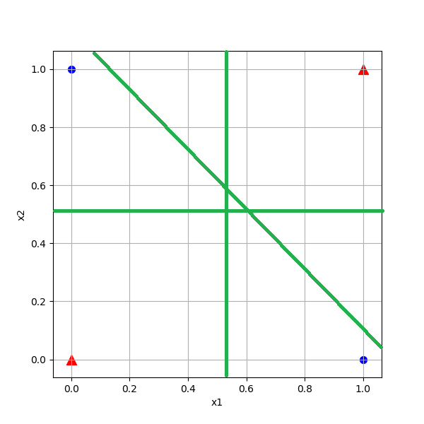
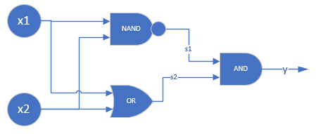

<!--Copyright © Microsoft Corporation. All rights reserved.
  适用于[License](https://github.com/Microsoft/ai-edu/blob/master/LICENSE.md)版权许可-->

## 10.1 为什么必须用双层神经网络

### 10.1.1 分类

我们先回忆一下各种分类的含义：

- 从复杂程度上分，有线性/非线性之分；
- 从样本类别上分，有二分类/多分类之分。

从直观上理解，这几个概念应该符合表10-2中的示例。

表10-2 各种分类的组合关系

||二分类|多分类|
|---|---|---|
|线性|||
|非线性|||

在第三步中我们学习过线性分类，如果用于此处的话，我们可能会得到表10-3所示的绿色分割线。

表10-3 线性分类结果

|XOR问题|弧形问题|
|---|---|
|||
|图中两根直线中的任何一根，都不可能把蓝色点分到一侧，同时红色点在另一侧|对于线性技术来说，它已经尽力了，使得两类样本尽可能地分布在直线的两侧|

### 10.1.2 简单证明异或问题的不可能性

用单个感知机或者单层神经网络，是否能完成异或任务呢？我们自己做个简单的证明。先看样本数据，如表10-4。

表10-4 异或的样本数据

|样本|x1|x2|y|
|---|---|---|---|
|1|0|0|0|
|2|0|1|1|
|3|1|0|1|
|4|1|1|0|

用单个神经元（感知机）的话，就是表10-5中两种技术的组合。

表10-5 神经元结构与二分类函数

|神经元|分类函数Logistic|
|--|--|
|||

前向计算公式：

$$z = x_1  w_1 + x_2  w_2 + b \tag{1}$$
$$a = Logistic(z) \tag{2}$$

- 对于第一个样本数据

x1=0, x2=0, y=0。如果需要a=y的话，从Logistic函数曲线看，需要z<0，于是有：

$$x_1 w_1 + x_2  w_2 + b < 0$$

因为x1=0，x2=0，所以只剩下b项：

$$b < 0 \tag{3}$$

- 对于第二个样本数据

x1=0，x2=1，y=1。如果需要a=y，则要求z值大于0，不等式为：

$$x_1w_1 + x_2w_2+b=w_2+b > 0 \tag{4}$$

- 对于第三个样本数据

x1=1，x2=0，y=1。如果需要a=y，则要求z值大于0，不等式为：

$$x_1w_1 + x_2w_2+b=w_1+b > 0 \tag{5}$$

- 对于第四个样本

x1=1，x2=1，y=0。如果需要a=y，则要求z值小于0，不等式为：

$$x_1w_1 + x_2w_2+b=w_1+w_2+b < 0 \tag{6}$$

把公式6两边都加b，并把公式3接续：

$$(w_1 + b) + (w_2 + b) < b < 0 \tag{7}$$

再看公式4、5，不等式左侧括号内的两个因子都大于0，其和必然也大于0，不可能小于b。因此公式7不成立，无论如何也不能满足所有的4个样本的条件，所以单个神经元做异或运算是不可能的。

### 10.1.3 非线性的可能性

我们前边学习过如何实现与、与非、或、或非，我们看看如何用已有的逻辑搭建异或门，如图10-5所示。

图10-5 用基本逻辑单元搭建异或运算单元

表10-6 组合运算的过程

|样本与计算|1|2|3|4|
|----|----|----|----|----|
|x1|0|0|1|1|
|x2|0|1|0|1|
|s1=x1 NAND x2|1|1|1|0|
|s2=x1 OR x1|0|1|1|1|
|y=s1 AND s2|0|1|1|0|

经过表10-6所示的组合运算后，可以看到y的输出与x1,x2的输入相比，就是异或逻辑了。所以，实践证明两层逻辑电路可以解决问题。另外，我们在地四步中学习了非线性回归，使用双层神经网络可以完成一些神奇的事情，比如复杂曲线的拟合，只需要6、7个参数就搞定了。我们可以模拟这个思路，用两层神经网络搭建模型，来解决非线性分类问题。
