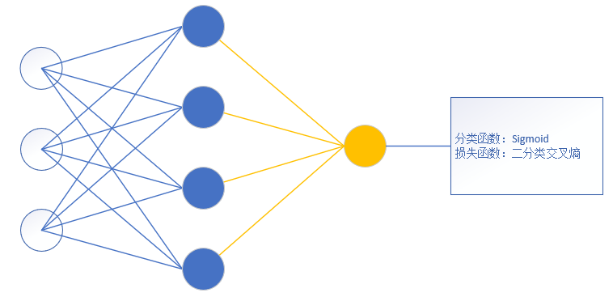
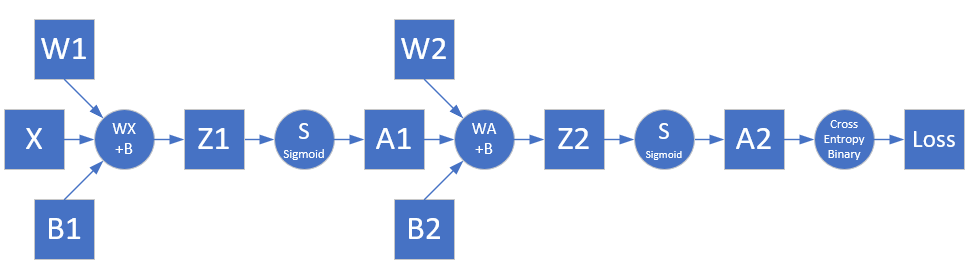
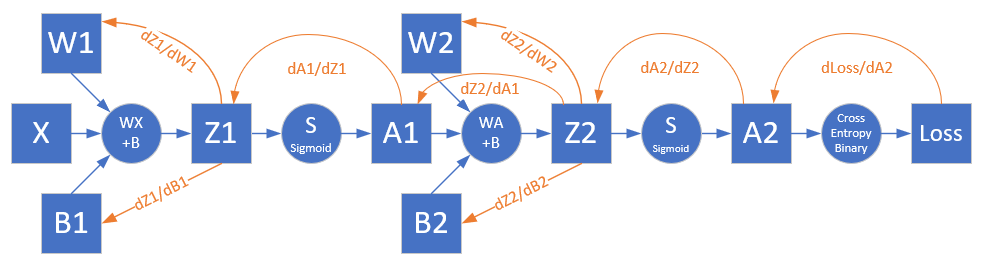

Copyright © Microsoft Corporation. All rights reserved.
  适用于[License](https://github.com/Microsoft/ai-edu/blob/master/LICENSE.md)版权许可

## 10.2 非线性二分类实现

### 10.2.1 定义神经网络结构

- 输入层两个特征值x1, x2
  $$
  X=\begin{pmatrix}
    x_1 & x_2
  \end{pmatrix}
  $$
- 隐层2x2的权重矩阵W1
$$
  W1=\begin{pmatrix}
    w^1_{11} & w^1_{12} \\
    w^1_{21} & w^1_{22} 
  \end{pmatrix}
$$
- 隐层1x2的偏移矩阵B1

$$
  B1=\begin{pmatrix}
    b^1_{1} & b^1_{2}
  \end{pmatrix}
$$

- 隐层由两个神经元构成
$$
Z1=\begin{pmatrix}
  z^1_{1} & z^1_{2}
\end{pmatrix}
$$
$$
A1=\begin{pmatrix}
  a^1_{1} & a^1_{2}
\end{pmatrix}
$$
- 输出层2x1的权重矩阵W2
$$
  W2=\begin{pmatrix}
    w^2_{11} \\
    w^2_{21}  
  \end{pmatrix}
$$

- 输出层1x1的偏移矩阵B2

$$
  B2=\begin{pmatrix}
    b^2_{1}
  \end{pmatrix}
$$

- 输出层有一个神经元使用Logisitc函数进行分类
$$
  Z2=\begin{pmatrix}
    z^2_{1}
  \end{pmatrix}
$$
$$
  A2=\begin{pmatrix}
    a^2_{1}
  \end{pmatrix}
$$

对于一般的用于二分类的双层神经网络可以是这样子的：

输入特征值可以有很多，隐层单元也可以有很多，输出单元只有一个，且后面要接Logistic分类函数和二分类交叉熵损失函数。

### 10.2.2 前向计算

根据网络结构，我们有了前向计算图：

#### 第一层

- 线性计算

$$
z^1_{1} = x_{1} w^1_{11} + x_{2} w^1_{21} + b^1_{1}
$$
$$
z^1_{2} = x_{1} w^1_{12} + x_{2} w^1_{22} + b^1_{2}
$$
$$
Z1 = X \cdot W1 + B1
$$

- 激活函数

$$
a^1_{1} = Sigmoid(z^1_{1})
$$
$$
a^1_{2} = Sigmoid(z^1_{2})
$$
$$
A1=\begin{pmatrix}
  a^1_{1} & a^1_{2}
\end{pmatrix}
$$

#### 第二层

- 线性计算

$$
z^2_1 = a^1_{1} w^2_{11} + a^1_{2} w^2_{21} + b^2_{1}
$$
$$
Z2 = A1 \cdot W2 + B2
$$

- 分类函数

$$a^2_1 = Logistic(z^2_1)$$
$$A2 = Logistic(Z2)$$

#### 损失函数

我们把异或问题归类成二分类问题，所以使用二分类交叉熵损失函数：

$$
loss = -y \ln A2 + (1-y) \ln (1-A2) \tag{12}
$$

### 10.2.3 反向传播

#### 求损失函数对输出层的反向误差

对损失函数求导，可以得到损失函数对输出层的梯度值，即上图中的Z2部分。

根据公式15，求A2和Z2的导数（此处A2、Z2都是标量）：

$$
{\partial loss \over \partial Z2}={\partial loss \over \partial A2}{\partial A2 \over \partial Z2}
$$
$$
={A2-y \over A2(1-A2)} \cdot A2(1-A2)
$$
$$
=A2-y => dZ2 \tag{13}
$$

#### 求W2和B2的梯度

$$
{\partial loss \over \partial W2}=\begin{pmatrix}
  {\partial loss \over \partial w^2_{11}} \\
  \\
  {\partial loss \over \partial w^2_{21}}
\end{pmatrix}
=\begin{pmatrix}
  {\partial loss \over \partial Z2}{\partial z2 \over \partial w^2_{11}} \\
  \\
  {\partial loss \over \partial Z2}{\partial z2 \over \partial w^2_{21}}
\end{pmatrix}
$$
$$
=\begin{pmatrix}
  (A2-y)a^1_{1} \\
  (A2-y)a^1_{2} 
\end{pmatrix}
=\begin{pmatrix}
  a^1_{1} \\ a^1_{2}
\end{pmatrix}(A2-y)
$$
$$
=A1^T \cdot dZ2 => dW2  \tag{14}
$$
$${\partial{loss} \over \partial{B2}}=dZ2 => dB2 \tag{15}$$

#### 求损失函数对隐层的反向误差

$$
\frac{\partial{loss}}{\partial{A1}} = \begin{pmatrix}
  {\partial loss \over \partial a^1_{1}} & {\partial loss \over \partial a^1_{2}} 
\end{pmatrix}
$$
$$
=\begin{pmatrix}
\frac{\partial{loss}}{\partial{Z2}} \frac{\partial{Z2}}{\partial{a^1_{1}}} & \frac{\partial{loss}}{\partial{Z2}}  \frac{\partial{Z2}}{\partial{a^1_{2}}}  
\end{pmatrix}
$$
$$
=\begin{pmatrix}
dZ2 \cdot w^2_{11} & dZ2 \cdot w^2_{21}
\end{pmatrix}
$$
$$
=dZ2 \cdot \begin{pmatrix}
  w^2_{11} & w^2_{21}
\end{pmatrix}
$$
$$
=dZ2 \cdot W2^T \tag{16}
$$

$$
{\partial A1 \over \partial Z1}=A1 \odot (1-A1) => dA1\tag{17}
$$

所以最后到达z1的误差矩阵是：

$$
{\partial loss \over \partial Z1}={\partial loss \over \partial A1}{\partial A1 \over \partial Z1}
$$
$$
=dZ2 \cdot W2^T \odot dA1 => dZ1 \tag{18}
$$

有了dZ1后，再向前求W1和B1的误差，就和第5章中一样了，我们直接列在下面：

$$
dW1=X^T \cdot dZ1 \tag{19}
$$
$$
dB1=dZ1 \tag{20}
$$
