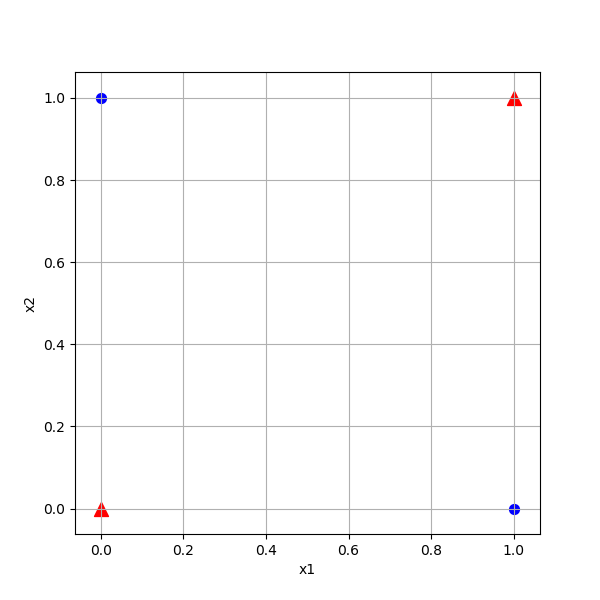

Copyright © Microsoft Corporation. All rights reserved.
  适用于[License](https://github.com/Microsoft/ai-edu/blob/master/LICENSE.md)版权许可

## 10.4 实现逻辑异或门

### 10.4.1 代码实现

#### 准备数据

异或数据比较简单，只有4个记录，所以就hardcode在此。不需要归一化，而且也不需要验证集、测试集等等，但是为了已有的NeuralNet2中的代码能顺利跑通，我们把验证集、测试集都设置成与训练集一致。

```Python
class XOR_DataReader(DataReader):
    def __init__(self):
        pass

    def ReadData(self):
        self.XTrainRaw = np.array([0,0,0,1,1,0,1,1]).reshape(4,2)
        self.YTrainRaw = np.array([0,1,1,0]).reshape(4,1)
        self.XTrain = self.XTrainRaw
        self.YTrain = self.YTrainRaw

        self.num_category = 1
        self.num_train = self.XTrainRaw.shape[0]
        self.num_feature = self.XTrainRaw.shape[1]

        self.XTestRaw = self.XTrainRaw
        self.YTestRaw = self.YTrainRaw
        self.XTest = self.XTestRaw
        self.YTest = self.YTestRaw
        
        self.num_test = self.num_train

    def GenerateValidationSet(self, k = 10):
        self.XVld = self.XTrain
        self.YVld = self.YTrain
```

#### 测试函数

与第6章中的逻辑与门和或门一样，我们需要神经网络的运算结果达到一定的精度，也就是非常的接近0，1两端，而不是说勉强大于0.5就近似为一了。精度要求是误差绝对值小于1e-2。

```Python
def Test(dataReader, net):
    print("testing...")
    X,Y = dataReader.GetTestSet()
    A = net.inference(X)
    diff = np.abs(A-Y)
    result = np.where(diff < 1e-2, True, False)
    if result.sum() == dataReader.num_test:
        return True
    else:
        return False
```

#### 主过程代码

```Python
if __name__ == '__main__':
    dataReader = XOR_DataReader()
    dataReader.ReadData()
    dataReader.GenerateValidationSet()

    ShowData(dataReader)
    plt.show()

    n_input = dataReader.num_feature
    n_hidden = 2
    n_output = 1
    eta, batch_size, max_epoch = 0.1, 1, 10000
    eps = 0.005

    hp = HyperParameters2(n_input, n_hidden, n_output, eta, max_epoch, batch_size, eps, NetType.BinaryClassifier, InitialMethod.Xavier)
    net = NeuralNet2(hp, "xor_221")

    net.train(dataReader, 100, True)
    net.ShowTrainingTrace()

    print(Test(dataReader, net))
```

此处的代码有几个需要强调的细节：
- n_input = dataReader.num_feature，值为2，而且必须为2，因为只有两个特征值
- n_hidden=2，这是人为设置的隐层神经元数量，可以是大于2的任何整数
- eps精度=0.005是后验知识，笔者通过测试得到的停止条件，用于方便案例讲解
- 网络类型是NetType.BinaryClassifier，指明是二分类网络
- 最后要调用Testh函数验证精度

### 10.4.2 运行结果

运行后，首先会显示一张原始样本的位置图，以便确定训练样本是否正确：



然后经过快速的迭代后，会显示损失函数曲线和准确率曲线图：


可以看到二者的走势很理想。

同时在控制台会打印一些信息，最后几行如下：

```
......
epoch=5699, total_iteration=22799
loss_train=0.006966, accuracy_train=1.000000
loss_valid=0.005098, accuracy_valid=1.000000
epoch=5799, total_iteration=23199
loss_train=0.004493, accuracy_train=1.000000
loss_valid=0.004991, accuracy_valid=1.000000
W= [[-5.57389264 -7.02732252]
 [-5.57225499 -7.01847673]]
B= [[8.31135648 2.96765809]]
W= [[ 11.99129834]
 [-12.42604825]]
B= [[-5.64851516]]
None
testing...
A2= [[0.00415298]
 [0.99551603]
 [0.99551851]
 [0.006808  ]]
True
```
一共用了5800个epoch，达到了指定的loss精度（0.005），loss_valid是0.004991，刚好小于0.005时停止迭代。

我们特意打印出了A2值，即网络推理结果：

|x1|x2|XOR|Inference|
|---|---|---|---|
|0|0|0|0.0041|
|0|1|1|0.9955|
|1|0|1|0.9955|
|1|1|0|0.0068|

表中第四列的推理值与第三列的XOR结果非常的接近，继续训练的话还可以得到更高的精度，但是一般没这个必要了。由此我们再一次认识到，神经网络只可以得到无限接近真实值的近似解。

### 代码位置

ch10, Level1
