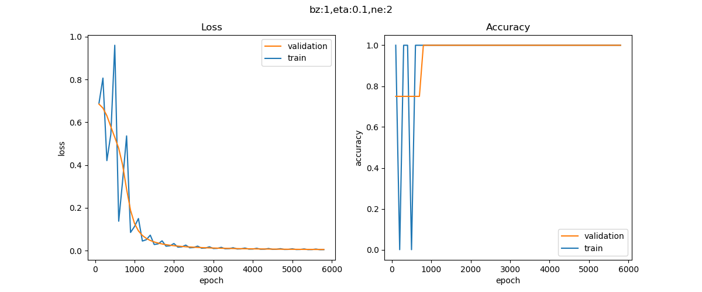

<!--Copyright © Microsoft Corporation. All rights reserved.
  适用于[License](https://github.com/Microsoft/ai-edu/blob/master/LICENSE.md)版权许可-->

## 10.3 实现逻辑异或门

### 10.3.1 代码实现

#### 准备数据

异或数据比较简单，只有4个记录，所以就hardcode在此，不用再建立数据集了。这也给读者一个机会了解如何从DataReader类派生出一个全新的子类XOR_DataReader。

比如在下面的代码中，我们覆盖了父类中的三个方法：

- init() 初始化方法：因为父类的初始化方法要求有两个参数，代表train/test数据文件
- ReadData()方法：父类方法是直接读取数据文件，此处直接在内存中生成样本数据，并且直接令训练集等于原始数据集（不需要归一化），令测试集等于训练集
- GenerateValidationSet()方法，由于只有4个样本，所以直接令验证集等于训练集

因为NeuralNet2中的代码要求数据集比较全，有训练集、验证集、测试集，为了已有代码能顺利跑通，我们把验证集、测试集都设置成与训练集一致，对于解决这个异或问题没有什么影响。

```Python
class XOR_DataReader(DataReader):
    def ReadData(self):
        self.XTrainRaw = np.array([0,0,0,1,1,0,1,1]).reshape(4,2)
        self.YTrainRaw = np.array([0,1,1,0]).reshape(4,1)
        self.XTrain = self.XTrainRaw
        self.YTrain = self.YTrainRaw
        self.num_category = 1
        self.num_train = self.XTrainRaw.shape[0]
        self.num_feature = self.XTrainRaw.shape[1]
        self.XTestRaw = self.XTrainRaw
        self.YTestRaw = self.YTrainRaw
        self.XTest = self.XTestRaw
        self.YTest = self.YTestRaw
        self.num_test = self.num_train

    def GenerateValidationSet(self, k = 10):
        self.XVld = self.XTrain
        self.YVld = self.YTrain
```

#### 测试函数

与第6章中的逻辑与门和或门一样，我们需要神经网络的运算结果达到一定的精度，也就是非常的接近0，1两端，而不是说勉强大于0.5就近似为1了，所以精度要求是误差绝对值小于1e-2。

```Python
def Test(dataReader, net):
    print("testing...")
    X,Y = dataReader.GetTestSet()
    A = net.inference(X)
    diff = np.abs(A-Y)
    result = np.where(diff < 1e-2, True, False)
    if result.sum() == dataReader.num_test:
        return True
    else:
        return False
```

#### 主过程代码

```Python
if __name__ == '__main__':
    ......
    n_input = dataReader.num_feature
    n_hidden = 2
    n_output = 1
    eta, batch_size, max_epoch = 0.1, 1, 10000
    eps = 0.005
    hp = HyperParameters2(n_input, n_hidden, n_output, eta, max_epoch, batch_size, eps, NetType.BinaryClassifier, InitialMethod.Xavier)
    net = NeuralNet2(hp, "Xor_221")
    net.train(dataReader, 100, True)
    ......
```

此处的代码有几个需要强调的细节：

- n_input = dataReader.num_feature，值为2，而且必须为2，因为只有两个特征值
- n_hidden=2，这是人为设置的隐层神经元数量，可以是大于2的任何整数
- eps精度=0.005是后验知识，笔者通过测试得到的停止条件，用于方便案例讲解
- 网络类型是NetType.BinaryClassifier，指明是二分类网络
- 最后要调用Test函数验证精度

### 10.3.2 运行结果

经过快速的迭代后，会显示训练过程如图10-10所示。



图10-10 训练过程中的损失函数值和准确率值的变化

可以看到二者的走势很理想。

同时在控制台会打印一些信息，最后几行如下：

```
......
epoch=5799, total_iteration=23199
loss_train=0.005553, accuracy_train=1.000000
loss_valid=0.005058, accuracy_valid=1.000000
epoch=5899, total_iteration=23599
loss_train=0.005438, accuracy_train=1.000000
loss_valid=0.004952, accuracy_valid=1.000000
W= [[-7.10166559  5.48008579]
 [-7.10286572  5.48050039]]
B= [[ 2.91305831 -8.48569781]]
W= [[-12.06031599]
 [-12.26898815]]
B= [[5.97067802]]
testing...
1.0
None
testing...
A2= [[0.00418973]
 [0.99457721]
 [0.99457729]
 [0.00474491]]
True
```
一共用了5900个epoch，达到了指定的loss精度（0.005），loss_valid是0.004991，刚好小于0.005时停止迭代。

我们特意打印出了A2值，即网络推理结果，如表10-7所示。

表10-7 异或计算值与神经网络推理值的比较

|x1|x2|XOR|Inference|diff|
|---|---|---|---|---|
|0|0|0|0.0041|0.0041|
|0|1|1|0.9945|0.0055|
|1|0|1|0.9945|0.0055|
|1|1|0|0.0047|0.0047|

表中第四列的推理值与第三列的XOR结果非常的接近，继续训练的话还可以得到更高的精度，但是一般没这个必要了。由此我们再一次认识到，神经网络只可以得到无限接近真实值的近似解。

### 代码位置

ch10, Level1
