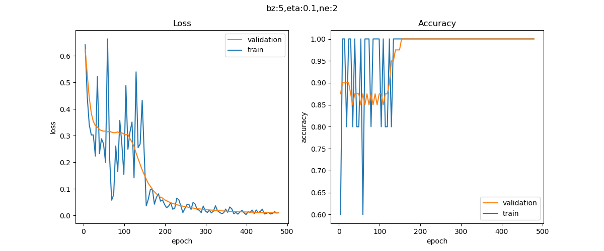

Copyright © Microsoft Corporation. All rights reserved.
  适用于[License](https://github.com/Microsoft/ai-edu/blob/master/LICENSE.md)版权许可

## 10.5 实现复杂二分类

逻辑异或问题的成功解决，可以带给我们一定的信心，但是毕竟只有4个样本，还不能发挥出双层神经网络的真正能力。下面让我们一起来解决问题二，复杂的二分类问题。

### 10.5.1 代码实现

#### 主过程代码

```Python
import numpy as np

from HelperClass2.DataReader import *
from HelperClass2.HyperParameters2 import *
from HelperClass2.NeuralNet2 import *

train_data_name = "../../Data/ch10.train.npz"
test_data_name = "../../Data/ch10.test.npz"

if __name__ == '__main__':
    dataReader = DataReader(train_data_name, test_data_name)
    dataReader.ReadData()
    dataReader.NormalizeX()
    dataReader.Shuffle()
    dataReader.GenerateValidationSet()

    n_input = dataReader.num_feature
    n_hidden = 2
    n_output = 1
    eta, batch_size, max_epoch = 0.1, 5, 10000
    eps = 0.01

    hp = HyperParameters2(n_input, n_hidden, n_output, eta, max_epoch, batch_size, eps, NetType.BinaryClassifier, InitialMethod.Xavier)
    net = NeuralNet2(hp, "sin_221")
    net.train(dataReader, 5, True)
    net.ShowTrainingTrace()
```

此处的代码有几个需要强调的细节：
- n_input = dataReader.num_feature，值为2，而且必须为2，因为只有两个特征值
- n_hidden=2，这是人为设置的隐层神经元数量，可以是大于2的任何整数
- eps精度=0.01是后验知识，笔者通过测试得到的停止条件，用于方便案例讲解
- 网络类型是NetType.BinaryClassifier，指明是二分类网络

### 10.5.2 运行结果

经过快速的迭代，训练完毕后，会显示损失函数曲线和准确率曲线图：



蓝色的线条是小批量训练样本的曲线，波动相对较大，不必理会，因为批量小势必会造成波动。红色曲线是验证集的走势，可以看到二者的走势很理想。从准确率看，似乎我们只训练300个epoch就可以了。

同时在控制台会打印一些信息，最后几行如下：

```
......
epoch=469, total_iteration=33839
loss_train=0.015062, accuracy_train=1.000000
loss_valid=0.010315, accuracy_valid=1.000000
epoch=474, total_iteration=34199
loss_train=0.009579, accuracy_train=1.000000
loss_valid=0.010169, accuracy_valid=1.000000
epoch=479, total_iteration=34559
loss_train=0.010810, accuracy_train=1.000000
loss_valid=0.009974, accuracy_valid=1.000000
W= [[ 9.01902538 12.28720763]
 [ 7.64396192 -9.22898702]]
B= [[-11.11983307   2.0960623 ]]
W= [[ 16.55633988]
 [-14.71558297]]
B= [[6.00596803]]
testing...
1.0
```
一共用了500个epoch，达到了指定的loss精度（0.01）时停止迭代。

看测试集的情况，准确度1.0，即100%分类正确。

### 代码位置

ch10, Level3
