<!--Copyright © Microsoft Corporation. All rights reserved.
  适用于[License](https://github.com/Microsoft/ai-edu/blob/master/LICENSE.md)版权许可-->

## 10.6 双弧形二分类的工作原理

在异或问题中，我们知道了如果使用三维坐标系来分析平面上任意复杂的分类问题，都可以迎刃而解：只要把不同的类别的点通过三维线性变换把它们向上升起，就很容易地分开不同类别的样本。但是这种解释有些牵强，笔者不认为神经网络已经聪明到这个程度了。

所以，笔者试图在二维平面上继续研究，寻找真正的答案，恰巧读到了关于流式学习的一些资料，于是做了下述试验，来验证神经网络到底在二维平面上做了什么样的空间变换。

### 10.6.1 两层神经网络的可视化

#### 几个辅助的函数
- DrawSamplePoints(x1, x2, y, title, xlabel, ylabel, show=True)
  
  画样本点，把正例绘制成红色的x，把负例绘制成蓝色的点。输入的x1和x2组成横纵坐标，y是正负例的标签值。

- Prepare3DData(net, count)

  准备3D数据，把平面划分成count*count的网格，并形成矩阵。如果传入的net不是None的话，会使用net.inference()做一次推理，以便得到和平面上的网格相对应的输出值。

- DrawGrid(Z, count)

  绘制网格。这个网格不一定是正方形的，有可能会由于矩阵的平移缩放而扭曲，目的是观察神经网络对空间的变换。

- ShowSourceData(dataReader)

  显示原始训练样本数据。

- ShowTransformation(net, dr, epoch)

  绘制经过神经网络第一层的线性计算即激活函数计算后，空间变换的结果。神经网络的第二层就是在第一层的空间变换的结果之上来完成分类任务的。

- ShowResult2D(net, dr, epoch)

  在二维平面上显示分类结果，实际是用等高线方式显示2.5D的分类结果。

#### 训练函数

```Python
def train(dataReader, max_epoch):
    n_input = dataReader.num_feature
    n_hidden = 2
    n_output = 1
    eta, batch_size = 0.1, 5
    eps = 0.01

    hp = HyperParameters2(n_input, n_hidden, n_output, eta, max_epoch, batch_size, eps, NetType.BinaryClassifier, InitialMethod.Xavier)
    net = NeuralNet2(hp, "Arc_221_epoch")
    
    net.train(dataReader, 5, True)
    
    ShowTransformation(net, dataReader, max_epoch)
    ShowResult2D(net, dataReader, max_epoch)
```
接收max_epoch做为参数，控制神经网络训练迭代的次数，以此来观察中间结果。我们使用了如下超参：

- n_input=输入的特征值数量，此例为2
- n_hidden=2，隐层的神经元数
- n_output=1，输出为二分类
- eta=0.1，学习率
- batch_size=5，批量样本数为5
- eps=0.01，停止条件
- NetType.BinaryClassifier，二分类网络
- InitialMethod.Xavier，初始化方法为Xavier

每迭代5次做一次损失值计算，打印一次结果。最后显示中间状态图和分类结果图。

#### 主过程

```Python
if __name__ == '__main__':
    dataReader = DataReader(train_data_name, test_data_name)
    dataReader.ReadData()
    dataReader.NormalizeX()
    dataReader.Shuffle()
    dataReader.GenerateValidationSet()

    ShowSourceData(dataReader)
    plt.show()

    train(dataReader, 20)
    train(dataReader, 50)
    train(dataReader, 100)
    train(dataReader, 150)
    train(dataReader, 200)
    train(dataReader, 600)
```
读取数据后，以此用20、50、100、150、200、600个epoch来做为训练停止条件，以便观察中间状态，笔者经过试验事先知道了600次迭代一定可以达到满意的效果。而上述epoch的取值，是通过观察损失函数的下降曲线来确定的。

### 10.6.2 运行结果

运行后，首先会显示一张原始样本的位置如图10-16，以便确定训练样本是否正确，并得到基本的样本分布概念。

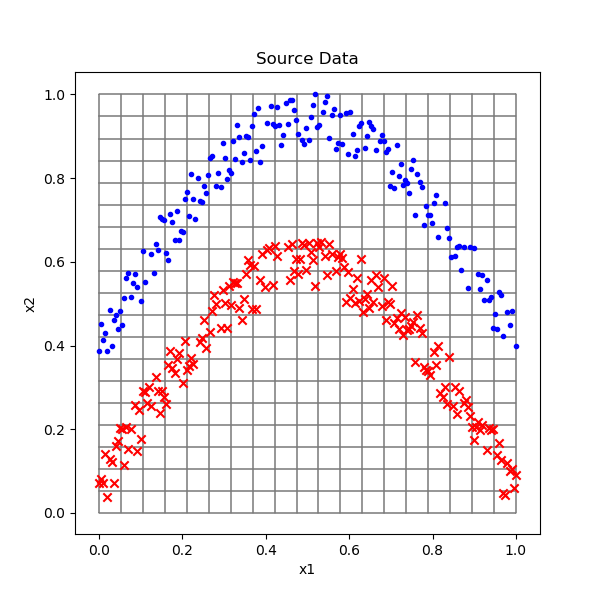

图10-16 双弧形的样本数据

随着每一个train()函数的调用，会在每一次训练结束后依次显示以下图片：

- 第一层神经网络的线性变换结果
- 第一层神经网络的激活函数结果
- 第二层神经网络的分类结果

表10-15 训练过程可视化

|迭代|线性变换|激活结果|分类结果|
|---|---|---|---|
|20次|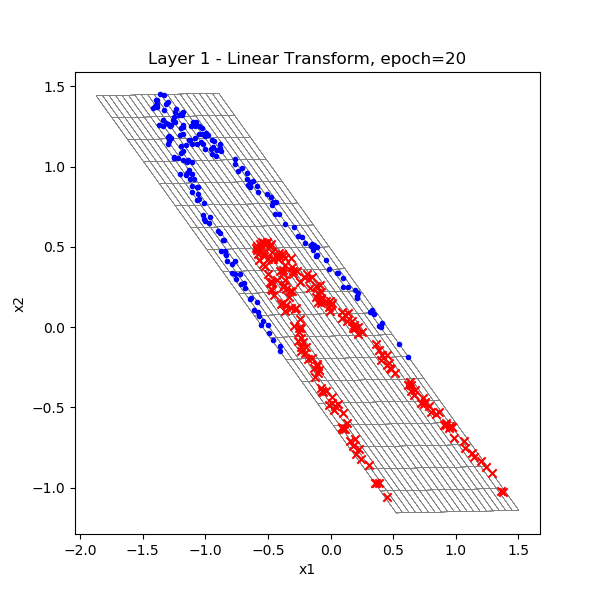|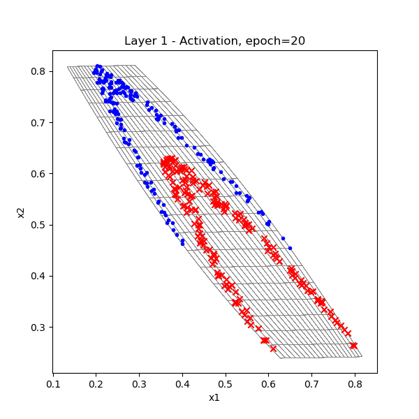|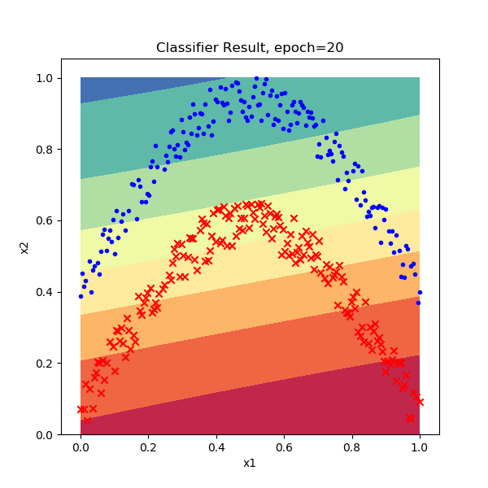|
|100次|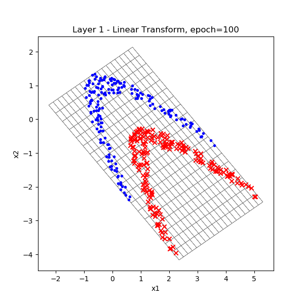|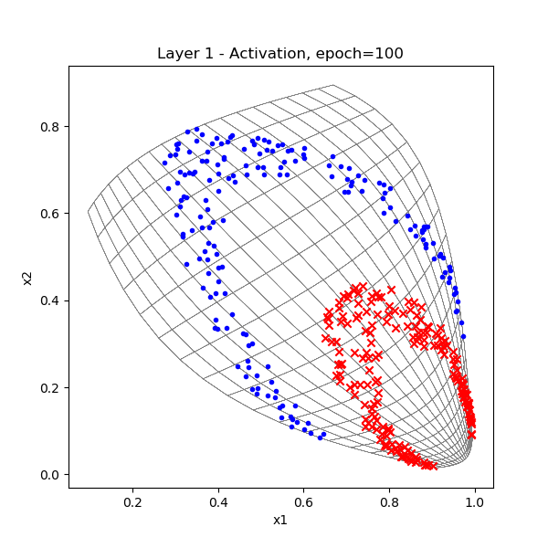|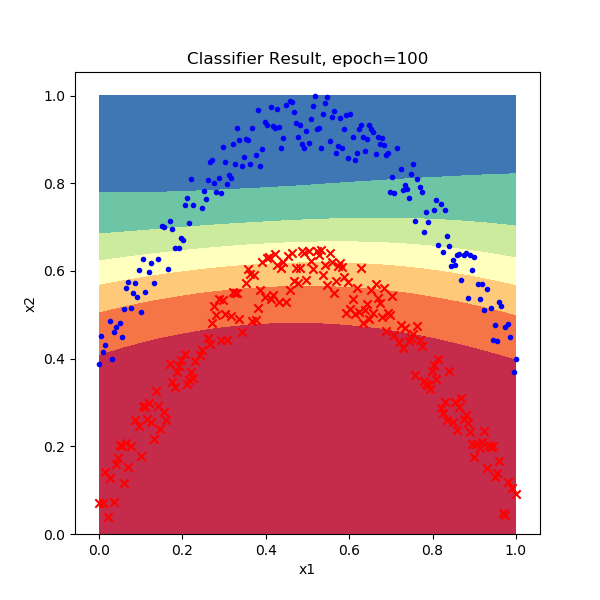|
|200次|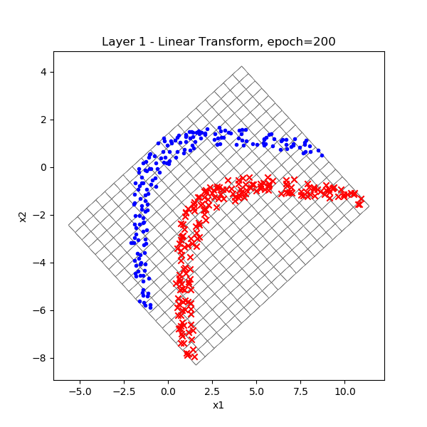|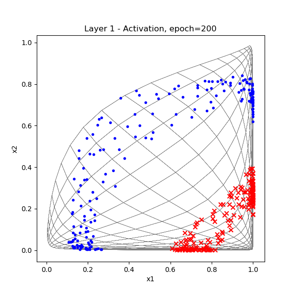||
|600次|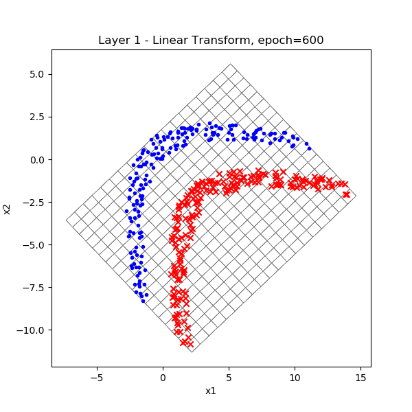|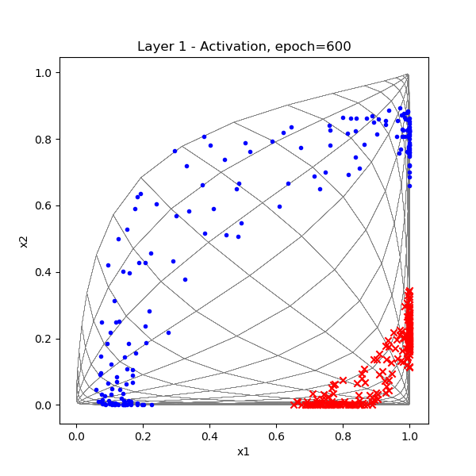|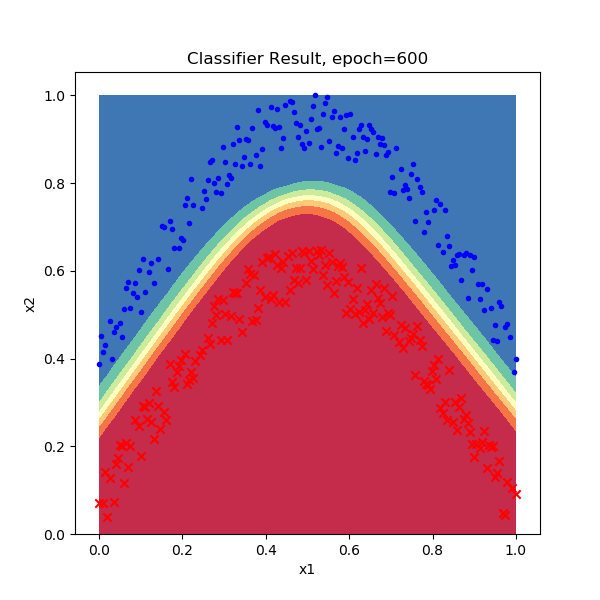|

分析表10-15中各列图片的变化，我们可以得到以下结论：

1. 在第一层的线性变换中，原始样本被斜侧拉伸，角度渐渐左倾到40度，并且样本间距也逐渐拉大，原始样本归一化后在[0,1]之间，最后已经拉到了[-5,15]的范围。这种侧向拉伸实际上是为激活函数做准备。
2. 在激活函数计算中，由于激活函数的非线性，所以空间逐渐扭曲变形，使得红色样本点逐步向右下角移动，并变得稠密；而蓝色样本点逐步向左上方扩撒，相信它的极限一定是[0,1]空间的左边界和上边界；另外一个值得重点说明的就是，通过空间扭曲，红蓝两类之间可以用一条直线分割了！这是一件非常神奇的事情。
3. 最后的分类结果，从毫无头绪到慢慢向上拱起，然后是宽而模糊的分类边界，最后形成非常锋利的边界。

似乎到了这里，我们可以得出结论了：神经网络通过空间变换的方式，把线性不可分的样本变成了线性可分的样本，从而给最后的分类变得很容易。


图10-17 经过空间变换后的样本数据

如图10-17中的那条绿色直线，很轻松就可以完成二分类任务。这条直线如果还原到原始样本图片中，将会是上表中第四列的分类结果的最后一张图的样子。

### 思考与练习

1. 请使用同样的方法分析异或问题。

### 代码位置

ch10, Level4
