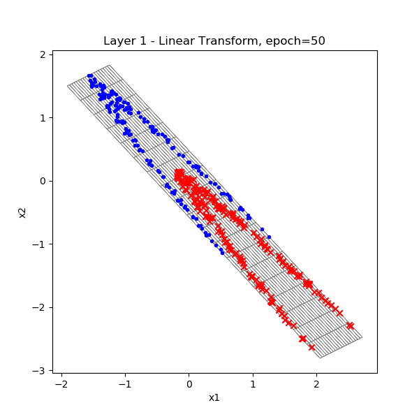
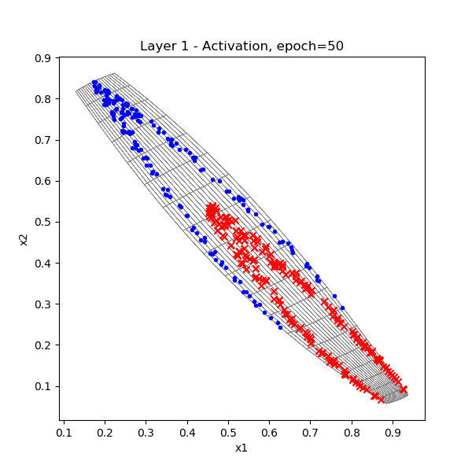
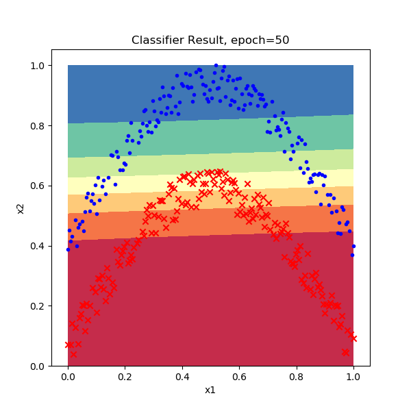
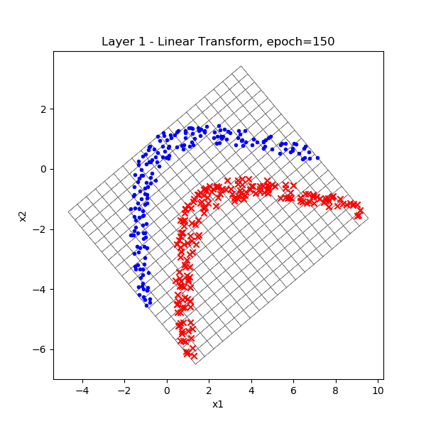
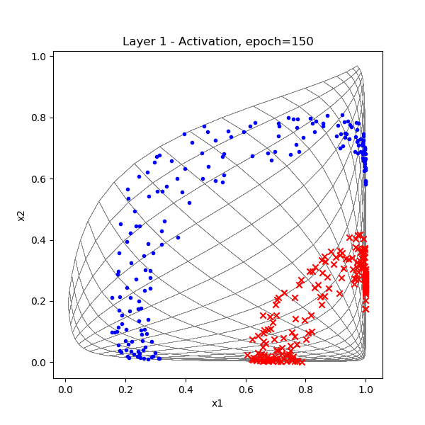
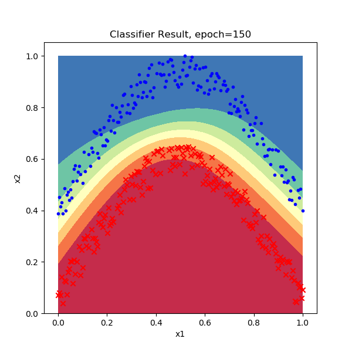

Copyright © Microsoft Corporation. All rights reserved.
  适用于[License](https://github.com/Microsoft/ai-edu/blob/master/LICENSE.md)版权许可

## 10.6 复杂二分类的工作原理

### 10.6.1 对两层神经网络工作机制的思考

在异或问题中，我们知道了如果使用三维坐标系来分析平面上任意复杂的分类问题，都可以迎刃而解：只要把不同的类别的点通过三维线性变换把它们向上升起，就很容易地分开不同类别的样本。但是这种解释有些牵强，笔者不认为神经网络已经聪明到这个程度了。所以，笔者试图在二维平面上继续研究，寻找真正的答案，恰巧读到了有关于流式学习的一些资料，于是做了下述试验。


运行后，首先会显示一张原始样本的位置图，以便确定训练样本是否正确：


我们在上一节课的代码基础上再增加些东西，来理解神经网络针对这个异或问题的工作原理。


|迭代次数|线性变换|激活结果|分类结果|
|---|---|---|---|
|20||||
|50||||
|100||||
|150||||
|200||||
|600||||


```
epoch=19, total_iteration=1439
loss_train=0.451441, accuracy_train=0.800000
loss_valid=0.482669, accuracy_valid=0.800000
W= [[ 0.97896717  0.01610319]
 [-2.39821674  2.59992997]]
B= [[ 0.52485481 -1.15827262]]
W= [[-2.65450503]
 [ 3.03008823]]
B= [[-0.56426328]]
testing...
0.77

epoch=49, total_iteration=3599
loss_train=0.427739, accuracy_train=0.800000
loss_valid=0.413761, accuracy_valid=0.825000
W= [[ 0.66307349  0.33338048]
 [-3.96269987  4.30670395]]
B= [[ 2.0562183  -2.80817536]]
W= [[-4.73132717]
 [ 5.67883463]]
B= [[-0.42064853]]
testing...
0.82

epoch=99, total_iteration=7199
loss_train=0.294710, accuracy_train=1.000000
loss_valid=0.381903, accuracy_valid=0.825000
W= [[ 2.95619249  1.71650291]
 [-4.60198856  4.58481896]]
B= [[ 2.35202164 -4.16406413]]
W= [[-5.2041818 ]
 [ 7.16855264]]
B= [[0.80093564]]
testing...
0.85

epoch=149, total_iteration=10799
loss_train=0.077825, accuracy_train=1.000000
loss_valid=0.122760, accuracy_valid=1.000000
W= [[ 8.18193106  4.85639307]
 [-6.02651471  5.0707032 ]]
B= [[ 1.37308326 -6.50151062]]
W= [[-8.34566334]
 [10.10503048]]
B= [[2.81412325]]
testing...
0.99

epoch=199, total_iteration=14399
loss_train=0.052826, accuracy_train=1.000000
loss_valid=0.050100, accuracy_valid=1.000000
W= [[ 9.81759204  6.66174404]
 [-7.22749206  5.87206967]]
B= [[ 1.57003189 -8.30393696]]
W= [[-10.64536759]
 [ 12.42926828]]
B= [[3.9440172]]
testing...
1.0

epoch=524, total_iteration=37799
loss_train=0.001761, accuracy_train=1.000000
loss_valid=0.009929, accuracy_valid=1.000000
W= [[12.47438041  9.18031635]
 [-9.52516352  7.75172608]]
B= [[  2.19623205 -11.3283102 ]]
W= [[-15.05699462]
 [ 16.97213121]]
B= [[6.11812285]]
testing...
1.0
```

### 思考与练习

1. 请使用同样的方法分析异或问题。

### 代码位置

ch10, Level4
