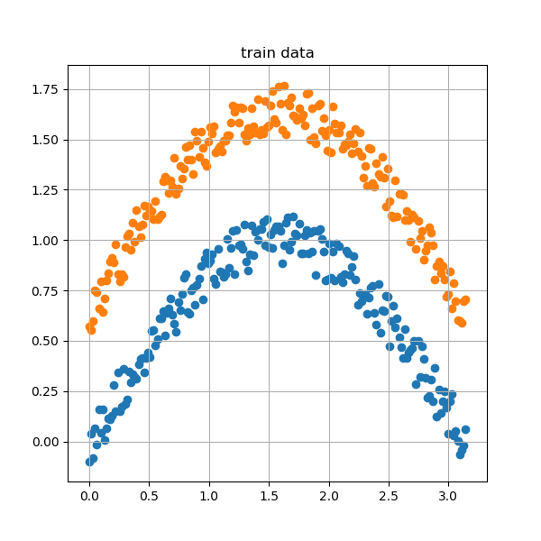
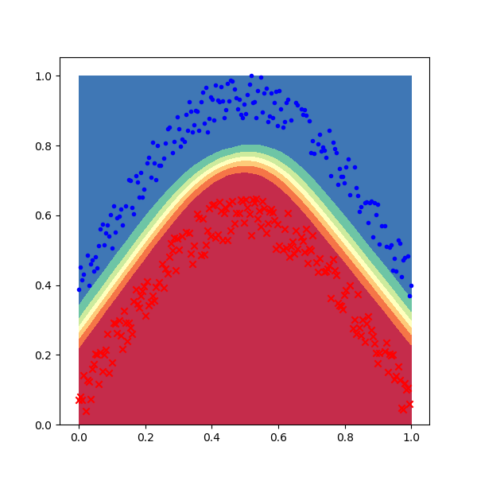
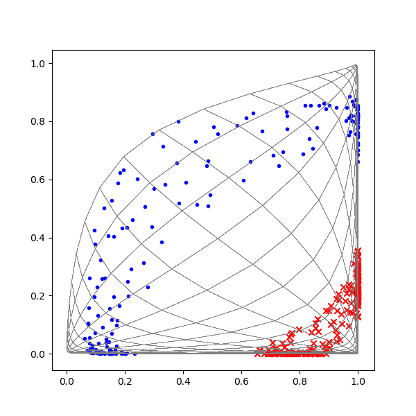

Copyright © Microsoft Corporation. All rights reserved.
  适用于[License](https://github.com/Microsoft/ai-edu/blob/master/LICENSE.md)版权许可


运行后，首先会显示一张原始样本的位置图，以便确定训练样本是否正确：



我们在上一节课的代码基础上再增加些东西，来理解神经网络针对这个异或问题的工作原理。







```
......
epoch=479, total_iteration=34559
loss_train=0.008521, accuracy_train=1.000000
loss_valid=0.010461, accuracy_valid=1.000000
epoch=484, total_iteration=34919
loss_train=0.015081, accuracy_train=1.000000
loss_valid=0.010271, accuracy_valid=1.000000
epoch=489, total_iteration=35279
loss_train=0.010576, accuracy_train=1.000000
loss_valid=0.010062, accuracy_valid=1.000000
epoch=494, total_iteration=35639
loss_train=0.009295, accuracy_train=1.000000
loss_valid=0.009889, accuracy_valid=1.000000
W= [[12.28689649  8.80994703]
 [-9.43026015  7.39572098]]
B= [[  2.19872773 -10.82283722]]
W= [[-14.53394998]
 [ 16.28792114]]
B= [[5.94311332]]
testing...
1.0
```

### 代码位置

ch10, Level4
