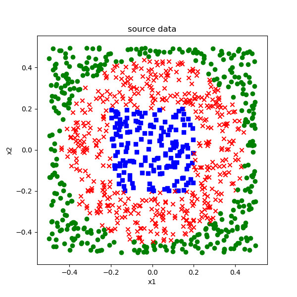

<!--Copyright © Microsoft Corporation. All rights reserved.
  适用于[License](https://github.com/Microsoft/ai-edu/blob/master/LICENSE.md)版权许可-->

# 第11章 多入多出的双层神经网络

## 11.0 双变量非线性多分类

### 11.0.1 提出问题：铜钱孔形问题

前面用异或问题和弧形样本学习了二分类，现在我们看看如何用它来做非线性多分类。

我们有如表11-1所示的1000个样本和标签。

表11-1 多分类问题数据样本

|样本|x1|x2|y|
|---|---|---|---|
|1|0.22825111|-0.34587097|2|
|2|0.20982606|0.43388447|3|
|...|...|...|...|
|1000|0.38230143|-0.16455377|2|

还好这个数据只有两个特征，所以我们可以用可视化的方法展示，如图11-1。

图11-1 可视化样本数据

一共有3个类别：

1. 蓝色方点
2. 红色叉点
3. 绿色圆点

样本组成了一个貌似铜钱的形状，我们就把这个问题叫做“铜钱孔形分类”问题吧，后面还要再提到。

**问题：如何用两层神经网络实现这个铜钱孔三分类问题？**

三种颜色的点有规律地占据了一个单位平面内(-0.5,0.5)的不同区域，从图中可以明显看出，这不是线性可分问题，而单层神经网络只能做线性分类，如果想做非线性分类，需要至少两层神经网络来完成。

红绿两色是圆形边界分割，红蓝两色是个矩形边界，都是有规律的。但是，学习神经网络，要忘记“规律”这个词，对于神经网络来说，数学上的“有规律”或者“无规律”是没有意义的，对于它来说一概都是无规律，训练难度是一模一样的。

另外，边界也是无意义的，要用概率来理解：没有一条非0即1的分界线来告诉我们哪些点应该属于哪个区域，我们可以得到的是处于某个位置的点属于三个类别的概率有多大，然后我们从中取概率最大的那个类别作为最终判断结果。

### 11.0.2 多分类模型的评估标准

我们以三分类问题举例，假设每类有100个样本，一共300个样本，最后的分类结果如表11-2所示。

表11-2 多分类结果的混淆矩阵

|样本所属类别|分到类1|分到类2|分到类3|各类样本总数|精(准)确率|
|---|---|---|---|---|---|
|类1|90|4|6|100|90%|
|类2|9|84|5|100|84%|
|类3|1|4|95|100|95%|
|总数|101|93|106|300|89.67%|

- 第1类样本，被错分到2类4个，错分到3类6个，正确90个；
- 第2类样本，被错分到1类9个，错分到3类5个，正确84个；
- 第3类样本，被错分到1类1个，错分到2类4个，正确95个。
 
总体的准确率是89.67%。三类的精确率是90%、84%、95%。实际上表11-2也是混淆矩阵在二分类基础上的扩展形式，其特点是在对角线上的值越大越好。

当然也可以计算每个类别的Precision和Recall，但是只在需要时才去做具体计算。比如，当第2类和第3类混淆比较严重时，为了记录模型训练的历史情况，才会把第2类和第3类单独拿出来分析。

我们在本书中，只使用总体的准确率来衡量多分类器的好坏。
