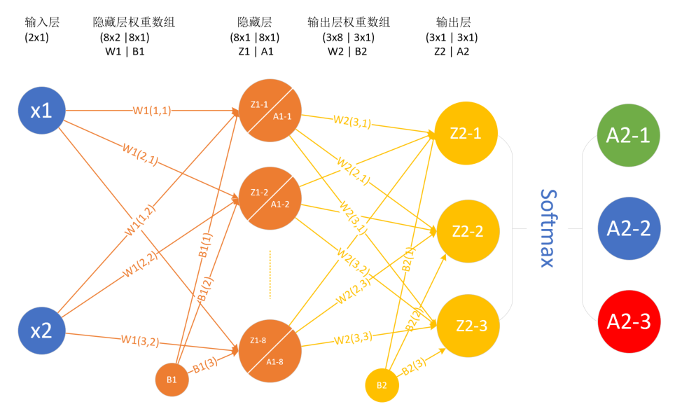
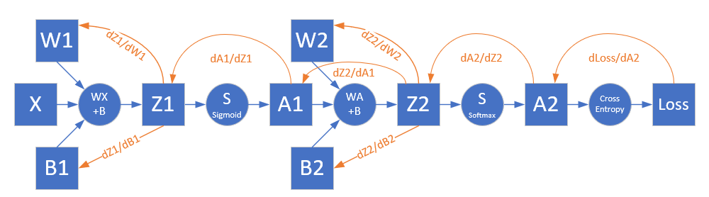
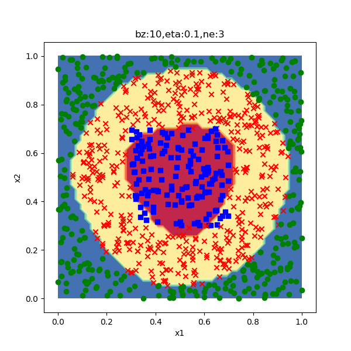

<!--Copyright © Microsoft Corporation. All rights reserved.
  适用于[License](https://github.com/Microsoft/ai-edu/blob/master/LICENSE.md)版权许可-->

## 11.1 非线性多分类

### 11.1.1 定义神经网络结构

先设计出能完成非线性多分类的网络结构，如图11-2所示。



图11-2 非线性多分类的神经网络结构图

- 输入层两个特征值$x_1, x_2$
$$
x=
\begin{pmatrix}
    x_1 & x_2
\end{pmatrix}
$$
- 隐层2x3的权重矩阵W1
$$
W1=
\begin{pmatrix}
    w1_{11} & w1_{12} & w1_{13} \\
    w1_{21} & w1_{22} & w1_{23}
\end{pmatrix}
$$

- 隐层1x3的偏移矩阵B1

$$
B1=\begin{pmatrix}
    b1_1 & b1_2 & b1_3 
\end{pmatrix}
$$

- 隐层由3个神经元构成
- 输出层3x3的权重矩阵W2
$$
W2=\begin{pmatrix}
    w2_{11} & w2_{12} & w2_{13} \\
    w2_{21} & w2_{22} & w2_{23} \\
    w2_{31} & w2_{32} & w2_{33} 
\end{pmatrix}
$$

- 输出层1x1的偏移矩阵B2

$$
B2=\begin{pmatrix}
    b2_1 & b2_2 & b2_3 
  \end{pmatrix}
$$

- 输出层有3个神经元使用Softmax函数进行分类

### 11.1.2 前向计算

根据网络结构，可以绘制前向计算图，如图11-3所示。


图11-3 前向计算图

#### 第一层

- 线性计算

$$
z1_1 = x_1 w1_{11} + x_2 w1_{21} + b1_1
$$
$$
z1_2 = x_1 w1_{12} + x_2 w1_{22} + b1_2
$$
$$
z1_3 = x_1 w1_{13} + x_2 w1_{23} + b1_3
$$
$$
Z1 = X \cdot W1 + B1
$$

- 激活函数

$$
a1_1 = Sigmoid(z1_1) 
$$
$$
a1_2 = Sigmoid(z1_2) 
$$
$$
a1_3 = Sigmoid(z1_3) 
$$
$$
A1 = Sigmoid(Z1)
$$

#### 第二层

- 线性计算

$$
z2_1 = a1_1 w2_{11} + a1_2 w2_{21} + a1_3 w2_{31} + b2_1
$$
$$
z2_2 = a1_1 w2_{12} + a1_2 w2_{22} + a1_3 w2_{32} + b2_2
$$
$$
z2_3 = a1_1 w2_{13} + a1_2 w2_{23} + a1_3 w2_{33} + b2_3
$$
$$
Z2 = A1 \cdot W2 + B2
$$

- 分类函数

$$
a2_1 = {e^{z2_1} \over e^{z2_1} + e^{z2_2} + e^{z2_3}}
$$
$$
a2_2 = {e^{z2_2} \over e^{z2_1} + e^{z2_2} + e^{z2_3}}
$$
$$
a2_3 = {e^{z2_3} \over e^{z2_1} + e^{z2_2} + e^{z2_3}}
$$
$$
A2 = Softmax(Z2)
$$

#### 损失函数

使用多分类交叉熵损失函数：
$$
loss = -(y_1 \ln a2_1 + y_2 \ln a2_2 + y_3 \ln a2_3)
$$
$$
J(w,b) = -{1 \over m} \sum^m_{i=1} \sum^n_{j=1} y_{ij} \ln (a2_{ij})
$$

m为样本数，n为类别数。

### 11.1.3 反向传播

根据前向计算图，可以绘制出反向传播的路径如图11-4。



图11-4 反向传播图

在第7.1中学习过了Softmax与多分类交叉熵配合时的反向传播推导过程，最后是一个很简单的减法：

$$
{\partial loss \over \partial Z2}=A2-y \rightarrow dZ2
$$

从Z2开始再向前推的话，和10.2节是一模一样的，所以直接把结论拿过来：

$$
{\partial loss \over \partial W2}=A1^T \cdot dZ2 \rightarrow dW2
$$
$${\partial{loss} \over \partial{B2}}=dZ2 \rightarrow dB2$$
$$
{\partial A1 \over \partial Z1}=A1 \odot (1-A1) \rightarrow dA1
$$
$$
{\partial loss \over \partial Z1}=dZ2 \cdot W2^T \odot dA1 \rightarrow dZ1 
$$
$$
dW1=X^T \cdot dZ1
$$
$$
dB1=dZ1
$$

### 11.1.4 代码实现

绝大部分代码都在HelperClass2目录中的基本类实现，这里只有主过程：

```Python
if __name__ == '__main__':
    ......
    n_input = dataReader.num_feature
    n_hidden = 3
    n_output = dataReader.num_category
    eta, batch_size, max_epoch = 0.1, 10, 5000
    eps = 0.1
    hp = HyperParameters2(n_input, n_hidden, n_output, eta, max_epoch, batch_size, eps, NetType.MultipleClassifier, InitialMethod.Xavier)
    # create net and train
    net = NeuralNet2(hp, "Bank_233")
    net.train(dataReader, 100, True)
    net.ShowTrainingTrace()
    # show result
    ......
```

过程描述：

1. 读取数据文件
2. 显示原始数据样本分布图
3. 其它数据操作：归一化、打乱顺序、建立验证集
4. 设置超参
5. 建立神经网络开始训练
6. 显示训练结果

### 11.1.5 运行结果

训练过程如图11-5所示。


图11-5 训练过程中的损失函数值和准确率值的变化

迭代了5000次，没有到达损失函数小于0.1的条件。

分类结果如图11-6所示。



图11-6 分类效果图

因为没达到精度要求，所以分类效果一般。从分类结果图上看，外圈圆形差不多拟合住了，但是内圈的方形还差很多。

打印输出：

```
......
epoch=4999, total_iteration=449999
loss_train=0.225935, accuracy_train=0.800000
loss_valid=0.137970, accuracy_valid=0.960000
W= [[ -8.30315494   9.98115605   0.97148346]
 [ -5.84460922  -4.09908698 -11.18484376]]
B= [[ 4.85763475 -5.61827538  7.94815347]]
W= [[-32.28586038  -8.60177788  41.51614172]
 [-33.68897413  -7.93266621  42.09333288]
 [ 34.16449693   7.93537692 -41.19340947]]
B= [[-11.11937314   3.45172617   7.66764697]]
testing...
0.952
```
最后的测试分类准确率为0.952。

### 代码位置

ch11, Level1

### 思考和练习

1. 请尝试改进参数以得到更好的分类效果，让内圈成为近似方形的边界。
