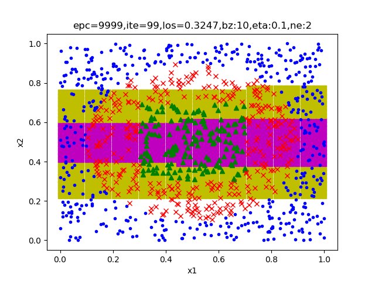
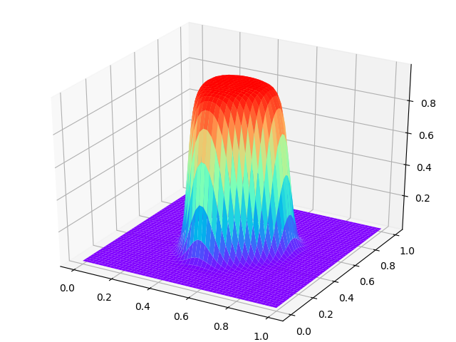
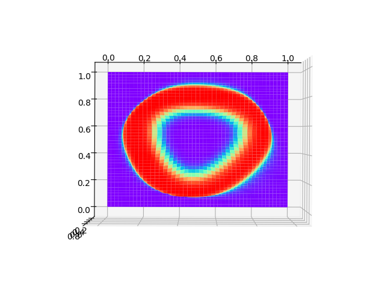
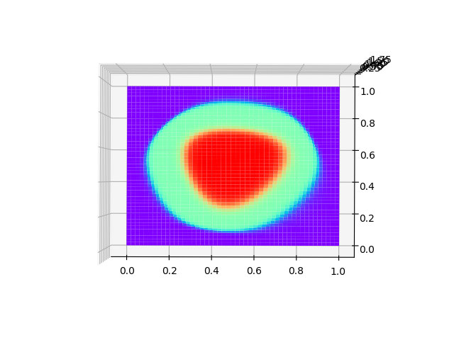

Copyright © Microsoft Corporation. All rights reserved.
  适用于[License](https://github.com/Microsoft/ai-edu/blob/master/LICENSE.md)版权许可

# 理解多分类的工作原理

使用以下参数测试：

- eta = 0.1
- batch_size = 10
- n_hidden = 3
- eps = 0.005

如果隐层只使用2个神经元，只能得到近似的线性结果，如下图：

所以，隐层必须用3个神经元以上。以下是结果：

|多分类损失函数值|分类结果(待优化)|
|---|---|
|||

我们延续9.2节的3D效果体验，但是，多分类的实际实现方式是1对多的，所以我们只能一次显示一个类别的分类效果图。

## 类别1

|斜侧图|投影图|
|----|----|
|||

对于类别1来说，周围是类别2和类别3的包围圈，中心红色地带是自己的概率较大的部分。

## 类别2

|斜侧图|投影图|
|---|---|
|||

对于类别2来说，中间有个空洞，是类别1的地盘，外侧的包围区域是类别3的地盘。

## 类别3

|斜侧图|投影图|
|---|---|
|||

对于类别3来说，和1，2正好相反，外围红色区域是自己的领地，概率值较大。

## 类别1+类别2

如果想要显示类别1和2的累加效果，如何做呢？

由于最后的结果都被Softmax归一为[0,1]之间，所以我们可以简单地把类别1的数据乘以2，再加上类别2的数据：

|斜侧图|投影图|
|---|---|
|||

代码位置：ch11, Level2
