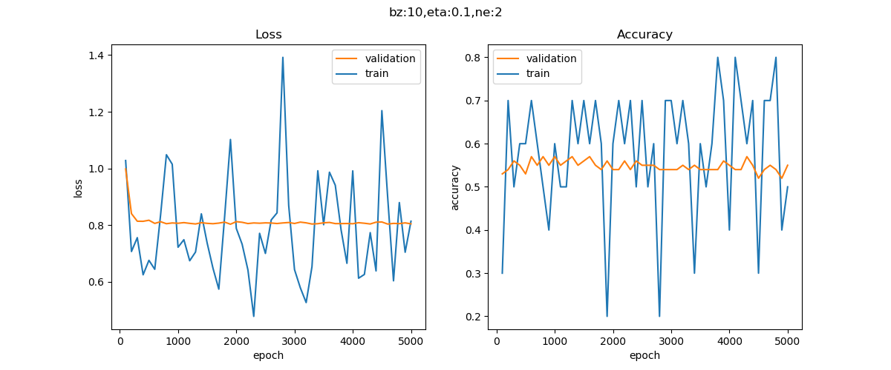
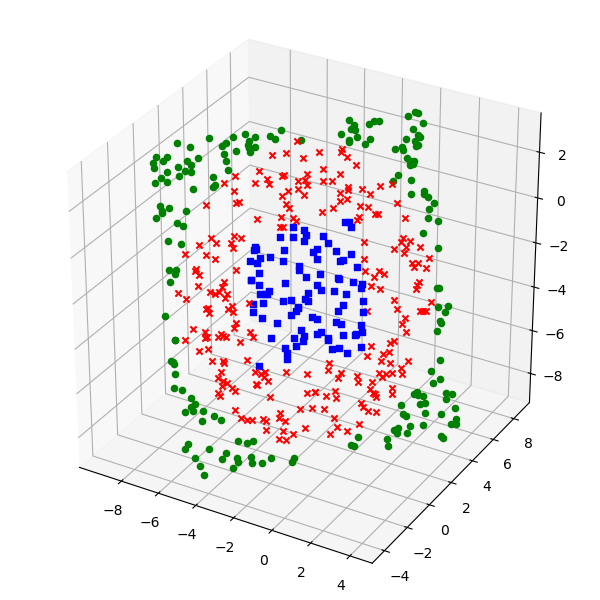
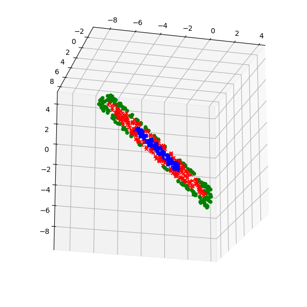
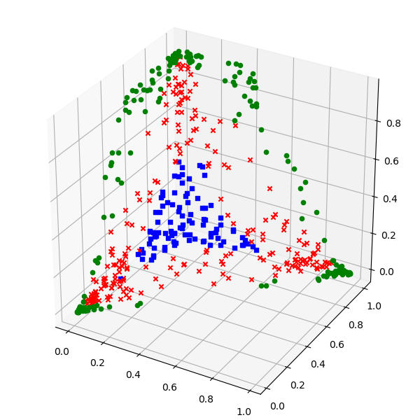
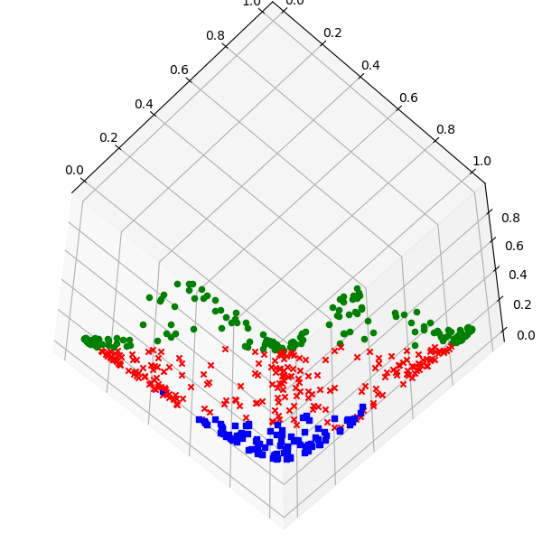

Copyright © Microsoft Corporation. All rights reserved.
  适用于[License](https://github.com/Microsoft/ai-edu/blob/master/LICENSE.md)版权许可

## 11.2 非线性多分类的工作原理

### 11.2.1 隐层神经元数量的影响

如果隐层只使用2个神经元，只能得到近似的线性结果，如下图：




所以，隐层必须用3个神经元以上。但是，由于使用了3个神经元，使得隐层的输出结果为每个样本一行三列。如果是一行两列的话，我们可以把两列数据看作横纵坐标，使用10.6节学习的知识，在二维平面上绘制中间结果；而一行三列的话，我们必须在三维空间中绘制中间结果。

#### 3D样本点分布图

```Python
def Show3D(net, dr):
    X,Y = dr.GetTestSet()
    net.inference(X)

    colors = ['b', 'r', 'g']
    shapes = ['s', 'x', 'o']

    fig = plt.figure(figsize=(6,6))
    ax = Axes3D(fig)
    count = Y.shape[0]
    for i in range(count):
        for j in range(Y.shape[1]):
            if Y[i,j] == 1:
                ax.scatter(net.Z1[i,0],net.Z1[i,1],net.Z1[i,2], color=colors[j], marker=shapes[j])
    plt.show()

    fig = plt.figure(figsize=(6,6))
    ax = Axes3D(fig)
    count = Y.shape[0]
    for i in range(count):
        for j in range(Y.shape[1]):
            if Y[i,j] == 1:
                ax.scatter(net.A1[i,0],net.A1[i,1],net.A1[i,2], color=colors[j], marker=shapes[j])
    plt.show()
```

上述代码首先使用测试集（500个样本点）在已经训练好的网络上做一次推理，得到了隐层的计算结果，然后分别用net.Z1和net.A1的三列数据，绘制三维点图。

||正视角|侧视角|
|---|---|---|
|z1|||
|a1|||

net.Z1的点图的含义是，输入数据经过线性变换后的结果，可以看到由于只是线性变换，所以从侧视角看还只是一个二维平面的样子。

net.A1的点图含义是，经过激活函数做非线性变换后的图。由于绿色点比较靠近边缘，所以三维坐标中的每个值在经过Sigmoid激活函数计算后，都有至少一维坐标会是向1靠近的值，所以分散的比较开，形成外围的三角区域；蓝色点正好相反，三维坐标值都趋近于0，所以最后都集中在三维坐标原点的三角区域内；红色点处于前两者之间，因为有很多中间值。

再观察net.A1的侧视图，似乎是已经分层了，蓝点沉积下去，绿点浮上来，红点在中间，像鸡尾酒一样分成了三层，这就给第二层神经网络创造了做一个线性三分类的条件，只需要两个平面，就可以把三者轻松分开了。

#### 3D分类结果图

我们延续9.2节的3D效果体验，但是，多分类的实际实现方式是1对多的，所以我们只能一次显示一个类别的分类效果图。

## 类别1

|斜侧图|投影图|
|----|----|
|||

对于类别1来说，周围是类别2和类别3的包围圈，中心红色地带是自己的概率较大的部分。

## 类别2

|斜侧图|投影图|
|---|---|
|||

对于类别2来说，中间有个空洞，是类别1的地盘，外侧的包围区域是类别3的地盘。

## 类别3

|斜侧图|投影图|
|---|---|
|||

对于类别3来说，和1，2正好相反，外围红色区域是自己的领地，概率值较大。

## 类别1+类别2

如果想要显示类别1和2的累加效果，如何做呢？

由于最后的结果都被Softmax归一为[0,1]之间，所以我们可以简单地把类别1的数据乘以2，再加上类别2的数据：

|斜侧图|投影图|
|---|---|
|||

### 代码位置

ch11, Level2
