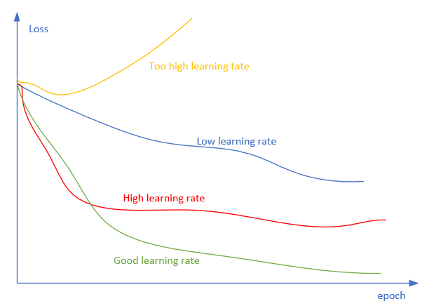
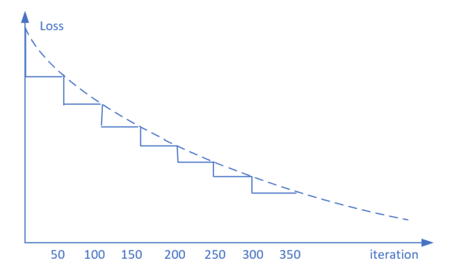
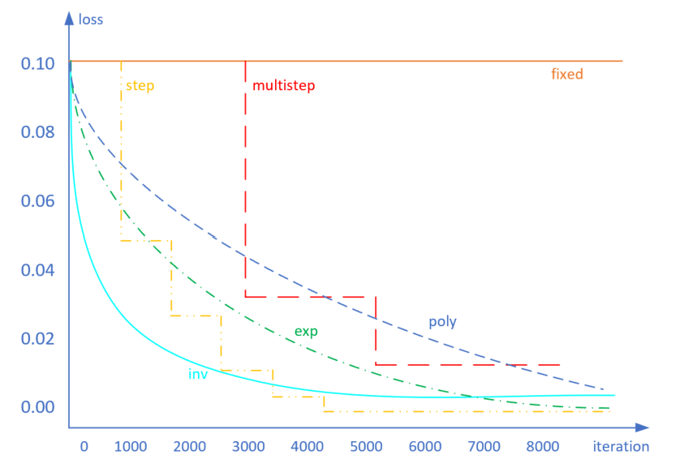
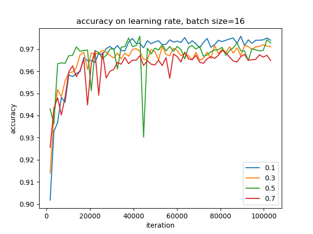

<!--Copyright © Microsoft Corporation. All rights reserved.
  适用于[License](https://github.com/Microsoft/ai-edu/blob/master/LICENSE.md)版权许可-->

## 12.3 学习率与批大小

在梯度下降公式中：

$$
w_{t+1} = w_t - {\eta \over m} \sum_i^m \nabla J(w,b) \tag{1}
$$

其中，$\eta$是学习率，m是批大小。所以，学习率与批大小是对梯度下降影响最大的两个因子。

### 12.3.1 关于学习率的挑战

有一句业内人士的流传的话：如果所有超参中，只需要调整一个参数，那么就是学习率。由此可见学习率是多么的重要，如果读者仔细做了9.6的试验，将会发现，不论你改了批大小或是隐层神经元的数量，总会找到一个合适的学习率来适应上面的修改，最终得到理想的训练结果。

但是学习率是一个非常难调的参数，下面给出具体说明。

前面章节学习过，普通梯度下降法，包含三种形式：

1. 单样本
2. 全批量样本
3. 小批量样本

我们通常把1和3统称为SGD(Stochastic Gradient Descent)。当批量不是很大时，全批量也可以纳入此范围。大的含义是：万级以上的数据量。

使用梯度下降的这些形式时，我们通常面临以下挑战：

1. 很难选择出合适的学习率
   
   太小的学习率会导致网络收敛过于缓慢，而学习率太大可能会影响收敛，并导致损失函数在最小值上波动，甚至出现梯度发散。
   
2. 相同的学习率并不适用于所有的参数更新
   
   如果训练集数据很稀疏，且特征频率非常不同，则不应该将其全部更新到相同的程度，但是对于很少出现的特征，应使用更大的更新率。
   
3. 避免陷于多个局部最小值中。
   
   实际上，问题并非源于局部最小值，而是来自鞍点，即一个维度向上倾斜且另一维度向下倾斜的点。这些鞍点通常被相同误差值的平面所包围，这使得SGD算法很难脱离出来，因为梯度在所有维度上接近于零。

表12-1 鞍点和驻点

|鞍点|驻点|
|---|---|
|||

表12-1中左图就是鞍点的定义，在鞍点附近，梯度下降算法经常会陷入泥潭，从而产生右图一样的历史记录曲线：有一段时间，Loss值随迭代次数缓慢下降，似乎在寻找突破口，然后忽然找到了，就一路下降，最终收敛。

为什么在3000至6000个epoch之间，有很大一段平坦地段，Loss值并没有显著下降？这其实也体现了这个问题的实际损失函数的形状，在这一区域上梯度比较平缓，以至于梯度下降算法并不能找到合适的突破方向寻找最优解，而是在原地徘徊。这一平缓地区就是损失函数的鞍点。

### 12.3.2 初始学习率的选择

我们前面一直使用固定的学习率，比如0.1或者0.05，而没有采用0.5、0.8这样高的学习率。这是因为在接近极小点时，损失函数的梯度也会变小，使用小的学习率时，不会担心步子太大越过极小点。

保证SGD收敛的充分条件是：

$$\sum_{k=1}^\infty \eta_k = \infty \tag{2}$$

且： 

$$\sum_{k=1}^\infty \eta^2_k < \infty \tag{3}$$ 

图12-5是不同的学习率的选择对训练结果的影响。

图12-5 学习率对训练的影响

- 黄色：学习率太大，loss值增高，网络发散
- 红色：学习率可以使网络收敛，但值较大，开始时loss值下降很快，但到达极值点附近时，在最优解附近来回跳跃
- 绿色：正确的学习率设置
- 蓝色：学习率值太小，loss值下降速度慢，训练次数长，收敛慢

有一种方式可以帮助我们快速找到合适的初始学习率。

Leslie N. Smith 在2015年的一篇论文[Cyclical Learning Rates for Training Neural Networks](https://arxiv.org/abs/1506.01186)中的描述了一个非常棒的方法来找初始学习率。

这个方法在论文中是用来估计网络允许的最小学习率和最大学习率，我们也可以用来找我们的最优初始学习率，方法非常简单：

1. 首先我们设置一个非常小的初始学习率，比如1e-5；
2. 然后在每个batch之后都更新网络，计算损失函数值，同时增加学习率；
3. 最后我们可以描绘出学习率的变化曲线和loss的变化曲线，从中就能够发现最好的学习率。

表12-2就是随着迭代次数的增加，学习率不断增加的曲线，以及不同的学习率对应的loss的曲线（理想中的曲线）。

表12-2 试验最佳学习率

|随着迭代次数增加学习率|观察Loss值与学习率的关系|
|---|---|
|||

从表12-2的右图可以看到，学习率在0.3左右表现最好，再大就有可能发散了。我们把这个方法用于到我们的代码中试一下是否有效。

首先，设计一个数据结构，做出表12-3。

表12-3 学习率与迭代次数试验设计

|学习率段|0.0001~0.0009|0.001~0.009|0.01~0.09|0.1~0.9|1.0~1.1|
|----|----|----|----|---|---|
|步长|0.0001|0.001|0.01|0.1|0.01|
|迭代|10|10|10|10|10|

对于每个学习率段，在每个点上迭代10次，然后：

$$当前学习率+步长 \rightarrow 下一个学习率$$

以第一段为例，会在0.1迭代100次，在0.2上迭代100次，......，在0.9上迭代100次。步长和迭代次数可以分段设置，得到图12-6。

图12-6 第一轮的学习率测试

横坐标用了np.log10()函数来显示对数值，所以横坐标与学习率的对应关系如表12-4所示。

表12-4 横坐标与学习率的对应关系

|横坐标|-1.0|-0.8|-0.6|-0.4|-0.2|0.0|
|--|--|--|--|--|--|--|
|学习率|0.1|0.16|0.25|0.4|0.62|1.0|

前面一大段都是在下降，说明学习率为0.1、0.16、0.25、0.4时都太小了，那我们就继续探查-0.4后的段，得到第二轮测试结果如图12-7。

图12-7 第二轮的学习率测试

到-0.13时（对应学习率0.74）开始，损失值上升，所以合理的初始学习率应该是0.7左右，于是我们再次把范围缩小的0.6，0.7，0.8去做试验，得到第三轮测试结果，如图12-8。

图12-8 第三轮的学习率测试

最后得到的最佳初始学习率是0.8左右。由于loss值是渐渐从下降变为上升的，前面有一个积累的过程，如果想避免由于前几轮迭代带来的影响，可以使用比0.8小一些的数值，比如0.75作为初始学习率。

### 12.3.3 学习率的后期修正

用12.1的MNIST的例子，固定批大小为128时，我们分别使用学习率为0.2，0.3，0.5，0.8来比较一下学习曲线。

图12-9 不同学习率对应的迭代次数与准确度值的

学习率为0.5时效果最好，虽然0.8的学习率开始时上升得很快，但是到了10个epoch时，0.5的曲线就超上来了，最后稳定在0.8的曲线之上。

这就给了我们一个提示：可以在开始时，把学习率设置大一些，让准确率快速上升，损失值快速下降；到了一定阶段后，可以换用小一些的学习率继续训练。用公式表示：

$$
LR_{new}=LR_{current} * DecayRate^{GlobalStep/DecaySteps} \tag{4}
$$

举例来说：

- 当前的LR = 0.1
- DecayRate = 0.9
- DecaySteps = 50

公式变为：

$$lr = 0.1 * 0.9^{GlobalSteps/50}$$

意思是初始学习率为0.1，每训练50轮计算一次新的lr，是当前的$0.9^n$倍，其中n是正整数，因为一般用GlobalSteps/50的结果取整，所以n=1，2，3......

图12-10 阶梯状学习率下降法

如果计算一下每50轮的衰减的具体数值，见表12-5。

表12-5 学习率衰减值计算

|迭代|0|50|100|150|200|250|300|...|
|---|---|---|---|---|---|---|---|---|
|学习率|0.1|0.09|0.081|0.073|0.065|0.059|0.053|...|

这样的话，在开始时可以快速收敛，到后来变得很谨慎，小心翼翼地向极值点逼近，避免由于步子过大而跳过去。

上面描述的算法叫做step算法，还有一些其他的算法如下。

图12-11 其他各种学习率下降算法

#### fixed

使用固定的学习率，比如全程都用0.1。要注意的是，这个值不能大，否则在后期接近极值点时不易收敛。

#### step

每迭代一个预订的次数后（比如500步），就调低一次学习率。离散型，简单实用。

#### multistep

预设几个迭代次数，到达后调低学习率。与step不同的是，这里的次数可以是不均匀的，比如3000、5500、8000。离散型，简单实用。

#### exp

连续的指数变化的学习率，公式为：

$$lr_{new}=lr_{base} * \gamma^{iteration} \tag{5}$$

由于一般的iteration都很大（训练需要很多次迭代），所以学习率衰减得很快。$\gamma$可以取值0.9、0.99等接近于1的数值，数值越大，学习率的衰减越慢。

#### inv

倒数型变化，公式为：

$$lr_{new}=lr_{base} * {1 \over ( 1 + \gamma * iteration)^{p}} \tag{6}$$

$\gamma$控制下降速率，取值越大下降速率越快；$p$控制最小极限值，取值越大时最小值越小，可以用0.5来做缺省值。

#### poly

多项式衰减，公式为：

$$lr_{new}=lr_{base} * (1 - {iteration \over iteration_{max}})^p \tag{7}$$

p=1时，为线性下降；p>1时，下降趋势向上突起；p<1时，下降趋势向下凹陷。p可以设置为0.9。

### 12.3.4 学习率与批大小的关系

#### 试验结果

我们回到MNIST的例子中，继续做试验。当批大小为32时，还是0.5的学习率最好，如图12-12所示。

图12-12 批大小为32时的几种学习率的比较

难道0.5是一个全局最佳学习率吗？别着急，继续降低批大小到16时，再观察准确率曲线。由于批大小缩小了一倍，所以要完成相同的epoch时，图12-13中的迭代次数会是图12-12中的两倍。

图12-13 批大小为16时几种学习率的比较

这次有了明显变化，一下子变成了0.1的学习率最好，这说明当批大小小到一定数量级后，学习率要和批大小匹配，较大的学习率配和较大的批量，反之亦然。

#### 原因解释

我们从试验中得到了这个直观的认识：大的批数值应该对应大的学习率，否则收敛很慢；小的批数值应该对应小的学习率，否则会收敛不到最佳点。

一个极端的情况是，当批大小为1时，即单个样本，由于噪音的存在，我们不能确定这个样本所代表的梯度方向就是正确的方向，但是我们又不能忽略这个样本的作用，所以往往采用很小的学习率。这种情况很适合于online-learning的场景，即流式训练。

使用Mini-batch的好处是可以克服单样本的噪音，此时就可以使用稍微大一些的学习率，让收敛速度变快，而不会由于样本噪音问题而偏离方向。从偏差方差的角度理解，单样本的偏差概率较大，多样本的偏差概率较小，而由于I.I.D.（独立同分布）的假设存在，多样本的方差是不会有太大变化的，即16个样本的方差和32个样本的方差应该差不多，那它们产生的梯度的方差也应该相似。

通常当我们增加batch size为原来的N倍时，要保证经过同样的样本后更新的权重相等，按照线性缩放规则，学习率应该增加为原来的m倍。但是如果要保证权重的梯度方差不变，则学习率应该增加为原来的$\sqrt m$倍。

研究表明，衰减学习率可以通过增加batch size来实现类似的效果，这实际上从SGD的权重更新式子就可以看出来两者确实是等价的。对于一个固定的学习率，存在一个最优的batch size能够最大化测试精度，这个batch size和学习率以及训练集的大小正相关。对此实际上是有两个建议：

1. 如果增加了学习率，那么batch size最好也跟着增加，这样收敛更稳定。
2. 尽量使用大的学习率，因为很多研究都表明更大的学习率有利于提高泛化能力。如果真的要衰减，可以尝试其他办法，比如增加batch size，学习率对模型的收敛影响真的很大，慎重调整。

#### 数值理解

如果上述一些文字不容易理解的话，我们用一个最简单的示例来试图说明一下学习率与批大小的正比关系。

图12-14 学习率与批大小关系的数值理解

先看图12-14中的左图：假设有三个蓝色样本点，正确的拟合直线如绿色直线所示，但是目前的拟合结果是红色直线，其斜率为0.5。我们来计算一下它的损失函数值，假设虚线组成的网格的单位值为1。

$$loss = {1 \over 2m} \sum_i^m (z-y)^2 = (1^2 + 0^2 + 1^2)/2/3=0.333$$

损失函数值可以理解为是反向传播的误差回传力度，也就是说此时需要回传0.333的力度，就可以让红色直线向绿色直线的位置靠近，即，让w值变小，斜率从0.5变为0。

注意，我们下面如果用一个不太准确的计算来说明学习率与样本的关系，这个计算并不是真实存在于神经网络的，只是个数值上的直观解释。

我们需要一个学习率$\eta_1$，令：

$$w = w - \eta_1 * 0.333 = 0.5 - \eta_1 * 0.333 = 0$$

则：

$$\eta_1 = 1.5 \tag{8}$$

再看图12-14的右图，样本点变成5个，多了两个橙色的样本点，相当于批大小从3变成了5，计算损失函数值：

$$loss = (1^2+0.5^2+0^2+0.5^2+1^2)/2/5=0.25$$

样本数量增加了，由于样本服从I.I.D.分布，因此新的橙色样本位于蓝色样本之间。也因此损失函数值没有增加，反而从三个样本点的0.333降低到了五个样本点的0.25，此时，如果想回传同样的误差力度，使得w的斜率变为0，则：

$$w = w - \eta_2 * 0.25 = 0.5 - \eta_2 * 0.25 = 0$$

则：

$$\eta_2 = 2 \tag{9}$$

比较公式8和公式9的结果，样本数量增加了，学习率需要相应地增加。

大的batch size可以减少迭代次数，从而减少训练时间；另一方面，大的batch size的梯度计算更稳定，曲线平滑。在一定范围内，增加batch size有助于收敛的稳定性，但是过大的batch size会使得模型的泛化能力下降，验证或测试的误差增加。

batch size的增加可以比较随意，比如从16到32、64、128等等，而学习率是有上限的，从公式2和3知道，学习率不能大于1.0，这一点就如同Sigmoid函数一样，输入值可以变化很大，但很大的输入值会得到接近于1的输出值。因此batch size和学习率的关系可以大致总结如下：

1. 增加batch size，需要增加学习率来适应，可以用线性缩放的规则，成比例放大
2. 到一定程度，学习率的增加会缩小，变成batch size的$\sqrt m$倍
3. 到了比较极端的程度，无论batch size再怎么增加，也不能增加学习率了
