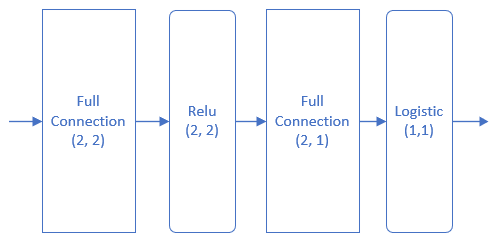
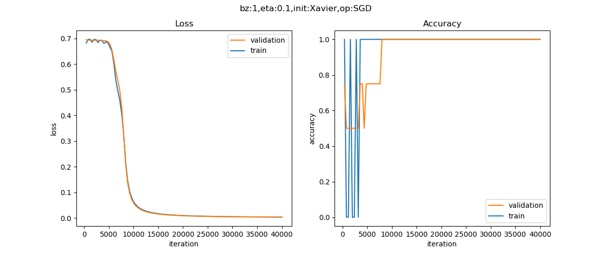
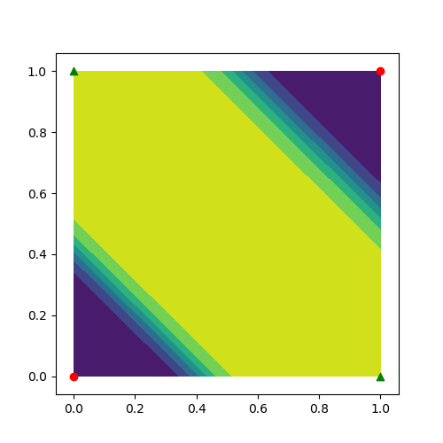

Copyright © Microsoft Corporation. All rights reserved.
  适用于[License](https://github.com/Microsoft/ai-edu/blob/master/LICENSE.md)版权许可

在第十章中，我们用一个两层的神经网络，实现了异或逻辑。这次我们先用mini框架重现一下异或逻辑的结果，以保证mini框架工作的正确性，相当于一个功能测试。然后我们将会尝试一个新的数据集，来测试一下mini框架对实际数据的二分类任务的支持程度。

# 重现异或逻辑门

## 建立数据集

在MiniFramework目录中已经有了一个DataReader类，我们在这个类的基础上，派生出一个异或数据类。

```Python
class XOR_DataReader(DataReader):
    def __init__(self):
        pass

    def ReadData(self):
        self.XTrain = np.array([[0,0],[1,1],[0,1],[1,0]])
        self.YTrain = np.array([0,0,1,1]).reshape(4,1)
        self.num_train = 4
        self.num_feature = 2
        self.num_category = 1
        
        self.XVld = self.XTrain
        self.YVld = self.YTrain

        self.XTest = self.XTrain
        self.YTest = self.YTrain
```

由于异或数据非常简单，只有一共4条记录，所以我们把Validation和Test数据设置成和Train数据一样，这是为了不改框架程序主要逻辑的前提下，做的一个临时处理。在实际的训练过程中，我们将会忽略验证集的结果。

## 模型




```Python
if __name__ == '__main__':
    dr = XOR_DataReader()
    dr.ReadData()
    
    num_input = 2
    num_hidden = 2
    num_output = 1

    max_epoch = 10000
    batch_size = 1
    learning_rate = 0.1
    eps = 0.001

    params = CParameters(
        learning_rate, max_epoch, batch_size, eps,
        LossFunctionName.CrossEntropy2,
        InitialMethod.Xavier, 
        OptimizerName.SGD)

    net = NeuralNet(params, "XOR")

    fc1 = FcLayer(num_input, num_hidden, params)
    net.add_layer(fc1, "fc1")
    sigmoid1 = ActivatorLayer(Sigmoid())
    net.add_layer(sigmoid1, "sigmoid1")
    
    fc2 = FcLayer(num_hidden, num_output, params)
    net.add_layer(fc2, "fc2")
    sigmoid2 = ClassificationLayer(Sigmoid())
    net.add_layer(sigmoid2, "sigmoid2")

    net.train(dr, checkpoint=100, need_test=True)
    net.ShowLossHistory()
    ShowResult2D(net)
```

同前面的章节中解决异或问题的方案一样，这里采用了一个两层的结构：一个隐层，一个输出层。其中：
- 输入层神经元数为2
- 隐层的神经元数为2，使用Sigmoid激活函数
- 由于是二分类任务，所以输出层只有一个神经元，用Sigmoid做二分类函数

其它参数：
- max_epoch=10000，最多训练10000轮
- batch_size=1，每次用一个数据训练
- learning_rate=0.1
- eps停止条件=0.001，根据经验，当损失函数值到达0.001时，就能很好地完成异或的二分类任务
- checkpoint=100，每隔100个epoch计算一次损失函数值
- need_test=True，最后需要用XTest数据集测试一下是否和YTest的值相等

## 运行结果



上面的运行结果图看上去有些怪异，其实是因为数据量太小造成的波动，不需要过于关注，只要趋势正确就行了。再看下面的运行结果：

```
epoch=9999, total_iteration=39999
loss_train=0.0026, accuracy_train=1.000000
loss_valid=0.0031, accuracy_valid=1.000000
time used: 3.1409988403320312
save parameters
total weights abs sum= 52.24225818496042
total weights = 6
little weights = 0
zero weights = 0
testing...
1.0
```
训练一共进行了10000轮，最关键的是最后的testing...的结果是1.0，表示100%正确，这初步说明mini框架在这个基本case上工作得很好。



其实，笔者刚开始并没有想重现异或问题的解决方案，但是在做下面的真实数据实战时，遇到了一些莫名其妙的问题，很不容易定位，是mini框架的问题呢，还是数据的问题？笔者想到了如果先解决一下我们熟悉的异或问题，就可以达到“测试”的目的，保证Mini框架能够正常工作。

这也给我们提供了一种思路：遇到复杂问题时，先用同质的简单问题验证工具的正确性，然后再用工具去解决稍微复杂一些的问题，一步步逼近目标。


# 代码位置

ch14, Level2
