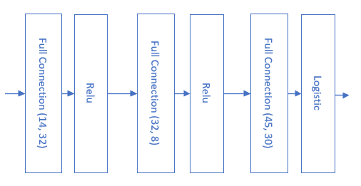
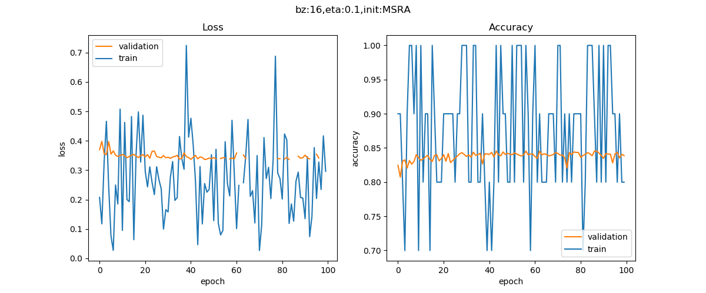

<!--Copyright © Microsoft Corporation. All rights reserved.
  适用于[License](https://github.com/Microsoft/ai-edu/blob/master/LICENSE.md)版权许可-->

## 14.4 二分类任务真实案例

我们用一个真实的数据级来实现一个二分类任务：收入调查与预测，即给定一个居民的各种情况，如工作、家庭、学历等，来预测该居民的年收入是否可以大于$50K/年，所以大于$50K的就是正例，而小于等于$50K的就是负例。

### 14.4.1 准备数据

此数据集是从1994 Census数据库中提取的$^{[1]}$。

#### 数据字段解读

标签值：>50K，<=50K。

属性字段：

- age，年龄：连续值
- workclass，工作性质：枚举型，类似私企、政府之类的
- fnlwgt，权重：连续值
- education，教育程度：枚举型，如学士、硕士等
- education-num，受教育的时长：连续值
- marital-status，婚姻状况：枚举型，已婚、未婚、离异等
- occupation，职业：枚举型，包含的种类很多，如技术支持、维修工、销售、农民渔民、军人等
- relationship，家庭角色：枚举型，丈夫、妻子等
- sex，性别：枚举型
- capital-gain，资本收益：连续值
- capitial-loss，资本损失：连续值
- hours-per-week，每周工作时长：连续值
- native-country，祖籍：枚举型

#### 数据处理

数据分析和数据处理实际上是一门独立的课，超出类本书的范围，所以我们只做一些简单的数据处理，以便神经网络可以用之训练。

对于连续值，我们可以直接使用原始数据。对于枚举型，我们需要把它们转成连续值。以性别举例，Female=0，Male=1即可。对于其它枚举型，都可以用从0开始的整数编码。

一个小技巧是利用python的list功能，取元素下标，即可以作为整数编码：

```Python
sex_list = ["Female", "Male"]
array_x[0,9] = sex_list.index(row[9].strip())
```

strip()是trim掉前面的空格，因为是csv格式，读出来会是这个样子："_Female"，前面总有个空格。index是取列表下标，这样对于字符串"Female"取出的下标为0，对于字符串"Male"取出的下标为1。

把所有数据按行保存到numpy数组中，最后用npz格式存储：
```Python
np.savez(data_npz, data=self.XData, label=self.YData)
```
原始数据已经把train data和test data分开了，所以我们针对两个数据集分别调用数据处理过程一次，保存为Income_Train.npz和Income_Test.npz。

#### 加载数据

```Python
train_file = "../../Data/ch14.Income.train.npz"
test_file = "../../Data/ch14.Income.test.npz"

def LoadData():
    dr = DataReader_2_0(train_file, test_file)
    dr.ReadData()
    dr.NormalizeX()
    dr.Shuffle()
    dr.GenerateValidationSet()
    return dr
```

因为属性字段众多，取值范围相差很大，所以一定要先调用NormalizeX()函数做归一化。由于是二分类问题，在做数据处理时，我们已经把大于$50K标记为1，小于等于$50K标记为0，所以不需要做标签值的归一化。

### 14.4.2 搭建模型

我们搭建一个与14.2一样的网络结构，不同的是为了完成二分类任务，在最后接一个Logistic函数。



图14-10 完成二分类真实案例的抽象模型

```Python
def model(dr):
    num_input = dr.num_feature
    num_hidden1 = 32
    num_hidden2 = 16
    num_hidden3 = 8
    num_hidden4 = 4
    num_output = 1

    max_epoch = 100
    batch_size = 16
    learning_rate = 0.1

    params = HyperParameters_4_0(
        learning_rate, max_epoch, batch_size,
        net_type=NetType.BinaryClassifier,
        init_method=InitialMethod.MSRA,
        stopper=Stopper(StopCondition.StopDiff, 1e-3))

    net = NeuralNet_4_0(params, "Income")

    fc1 = FcLayer_1_0(num_input, num_hidden1, params)
    net.add_layer(fc1, "fc1")
    a1 = ActivationLayer(Relu())
    net.add_layer(a1, "relu1")
    ......
    fc5 = FcLayer_1_0(num_hidden4, num_output, params)
    net.add_layer(fc5, "fc5")
    logistic = ClassificationLayer(Logistic())
    net.add_layer(logistic, "logistic")

    net.train(dr, checkpoint=1, need_test=True)
    return net
```

超参数说明：

1. 学习率=0.1
2. 最大epoch=100
3. 批大小=16
4. 二分类网络类型
5. MSRA初始化
6. 相对误差停止条件1e-3

net.train()函数是一个阻塞函数，只有当训练完毕后才返回。

### 14.4.3 训练结果

下图左边是损失函数图，右边是准确率图。忽略测试数据的波动，只看红色的验证集的趋势，损失函数值不断下降，准确率不断上升。

为什么不把max_epoch设置为更大的数字，比如1000，以便得到更好的结果呢？实际上，训练更多的次数，因为过拟合的风险，不会得到更好的结果。有兴趣的读者可以自己试验一下。



图14-11 训练过程中损失函数值和准确率的变化

下面是最后的打印输出：

```
......
epoch=99, total_iteration=169699
loss_train=0.296219, accuracy_train=0.800000
loss_valid=nan, accuracy_valid=0.838859
time used: 29.866002321243286
testing...
0.8431606905710491
```

最后用独立的测试集得到的结果是84%，与该数据集相关的其它论文相比，已经是一个不错的成绩了。

### 代码位置

ch14, Level4

### 参考资料

[1] Dua, D. and Graff, C. (2019). UCI Machine Learning Repository [http://archive.ics.uci.edu/ml]. Irvine, CA: University of California, School of Information and Computer Science. 

Ronny Kohavi and Barry Becker 
Data Mining and Visualization 
Silicon Graphics. 
e-mail: ronnyk '@' sgi.com for questions. 

https://archive.ics.uci.edu/ml/datasets/Census+Income
