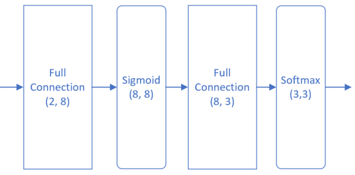
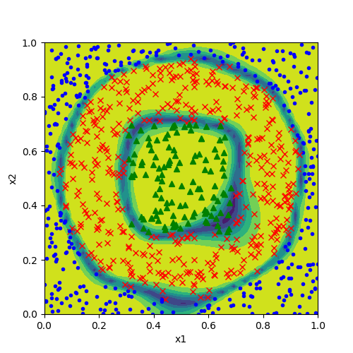
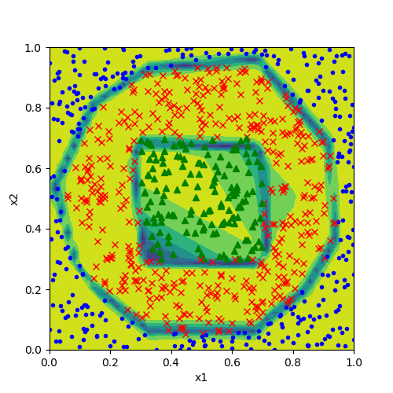

Copyright © Microsoft Corporation. All rights reserved.
  适用于[License](https://github.com/Microsoft/ai-edu/blob/master/LICENSE.md)版权许可

## 14.5 多分类功能测试 - “铜钱孔分类”问题

在第11章里，我们讲解了如何使用神经网络做多分类。在本节我们将会用Mini框架重现那个教学案例，然后使用一个真实的案例验证多分类的用法。

### 14.5.1 搭建模型一

#### 模型

使用Sigmoid做为激活函数的两层网络：



#### 代码

```Python
def model_sigmoid(num_input, num_hidden, num_output, hp):
    net = NeuralNet_4_0(hp, "chinabank_sigmoid")

    fc1 = FcLayer_1_0(num_input, num_hidden, hp)
    net.add_layer(fc1, "fc1")
    s1 = ActivationLayer(Sigmoid())
    net.add_layer(s1, "Sigmoid1")

    fc2 = FcLayer_1_0(num_hidden, num_output, hp)
    net.add_layer(fc2, "fc2")
    softmax1 = ClassificationLayer(Softmax())
    net.add_layer(softmax1, "softmax1")

    net.train(dataReader, checkpoint=50, need_test=True)
    net.ShowLossHistory()
    
    ShowResult(net, hp.toString())
    ShowData(dataReader)

if __name__ == '__main__':
    dataReader = LoadData()
    num_input = dataReader.num_feature
    num_hidden = 8
    num_output = 3

    max_epoch = 5000
    batch_size = 10
    learning_rate = 0.1

    hp = HyperParameters_4_0(
        learning_rate, max_epoch, batch_size,
        net_type=NetType.MultipleClassifier,
        init_method=InitialMethod.Xavier,
        stopper=Stopper(StopCondition.StopLoss, 0.08))
    model_sigmoid(num_input, num_hidden, num_output, hp) 
```

#### 超参数说明

1. 隐层8个神经元
2. 最大epoch=5000
3. 批大小=10
4. 学习率0.1
5. 绝对误差停止条件=0.08
6. 多分类网络类型
7. 初始化方法为Xavier

net.train()函数是一个阻塞函数，只有当训练完毕后才返回。

#### 运行结果

损失函数图和准确度图：


分类效果图：




### 14.5.2 搭建模型二

#### 模型

使用Relu做为激活函数的三层网络：


用两层网络也可以实现，但是使用Relu函数时，训练效果不是很稳定，用三层比较保险。

#### 代码

```Python
def model_relu(num_input, num_hidden, num_output, hp):
    net = NeuralNet_4_0(hp, "chinabank_relu")

    fc1 = FcLayer_1_0(num_input, num_hidden, hp)
    net.add_layer(fc1, "fc1")
    r1 = ActivationLayer(Relu())
    net.add_layer(r1, "Relu1")

    fc2 = FcLayer_1_0(num_hidden, num_hidden, hp)
    net.add_layer(fc2, "fc2")
    r2 = ActivationLayer(Relu())
    net.add_layer(r2, "Relu2")

    fc3 = FcLayer_1_0(num_hidden, num_output, hp)
    net.add_layer(fc3, "fc3")
    softmax = ClassificationLayer(Softmax())
    net.add_layer(softmax, "softmax")

    net.train(dataReader, checkpoint=50, need_test=True)
    net.ShowLossHistory()
    
    ShowResult(net, hp.toString())
    ShowData(dataReader)
    
if __name__ == '__main__':
    dataReader = LoadData()
    num_input = dataReader.num_feature
    num_hidden = 8
    num_output = 3

    max_epoch = 5000
    batch_size = 10
    learning_rate = 0.1

    hp = HyperParameters_4_0(
        learning_rate, max_epoch, batch_size,
        net_type=NetType.MultipleClassifier,
        init_method=InitialMethod.Xavier,
        stopper=Stopper(StopCondition.StopLoss, 0.08))
    #model_sigmoid(num_input, num_hidden, num_output, hp)
    hp.init_method = InitialMethod.MSRA
    model_relu(num_input, num_hidden, num_output, hp)
```

#### 超参数说明

1. 隐层8个神经元
2. 最大epoch=5000
3. 批大小=10
4. 学习率0.1
5. 绝对误差停止条件=0.08
6. 多分类网络类型
7. 初始化方法为MSRA

#### 运行结果

损失函数图和准确度图：


分类效果图：



### 14.5.3 比较

比较一下使用不同的激活函数的分类效果图：

|Sigmoid|Relu|
|---|---|
|||

可以看到左图中的边界要平滑许多，这也就是Relu和Sigmoid的区别，Relu是用分段线性拟合曲线，Sigmoid有真正的曲线拟合能力。但是Sigmoid也有缺点，看分类的边界，使用Relu函数的分类边界比较清晰，而使用Sigmoid函数的分类边界要平缓一些，过渡区较宽。

用一句简单的话来描述二者的差别：Relu能直则直，对方形边界适用；Sigmoid能弯则弯，对圆形边界适用。

### 代码位置

ch14, Level5
