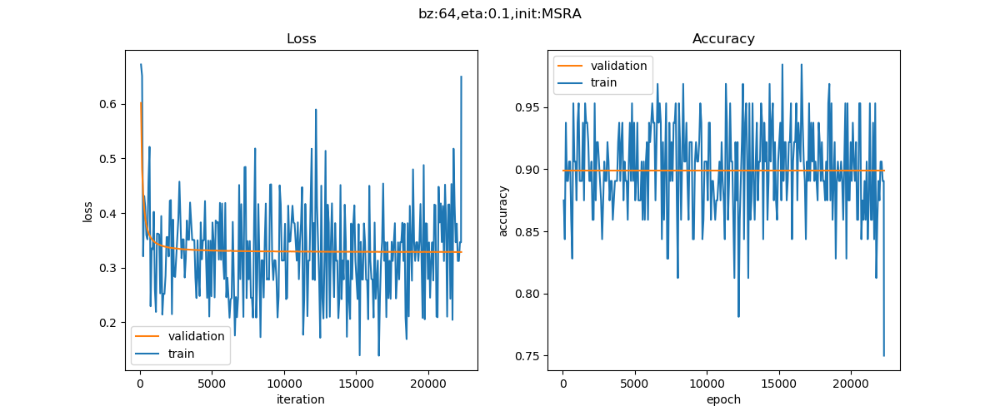

Copyright © Microsoft Corporation. All rights reserved.
  适用于[License](https://github.com/Microsoft/ai-edu/blob/master/LICENSE.md)版权许可

## 14.6 多分类任务 - Cifar10图像分类

### 14.6.1 数据读取

我们在第12章学习了MNIST手写数字识别数据集，本章我们认识一下另外一个比较常用的数据集CIFAR-10，这个数据集中包含10类图片，每类6000张，其中5000张用于训练，1000张用于测试。所以，一共有50000张训练图片，10000张测试图片。

下面是10类数据和随机抽取的图片：


```Python
file_1 = "..\\Data\\data_batch_1.bin"
file_2 = "..\\Data\\data_batch_2.bin"
file_3 = "..\\Data\\data_batch_3.bin"
file_4 = "..\\Data\\data_batch_4.bin"
file_5 = "..\\Data\\data_batch_5.bin"
test_file = "..\\Data\\test_batch.bin"

def LoadData():
    print("reading data...")
    dr = CifarImageReader(file_1, file_2, file_3, file_4, file_5, test_file)
    dr.ReadData()
    dr.NormalizeX()
    dr.NormalizeY(YNormalizationMethod.MultipleClassifier)
    dr.GenerateValidationSet(k=20)
    print(dr.num_validation, dr.num_example, dr.num_test, dr.num_train)
    return dr
```

每张图都是彩色的，但是只有32x32点阵，比较小，放大了反而看不清楚。为了简化问题，我们把彩色图片转成灰度的：

```Python
gray_data = np.dot([0.299,0.587,0.114], color_data.reshape(3,-1)).reshape(1,1024)
```

由于我们想沿用处理MNIST数据集的思想，所以在转换成灰度图后，又直接用reshape(1,1024)转成了一个行向量。

### 14.6.2 搭建模型

一共4个隐层，都用Relu()激活函数连接，最后的输出层是10分类：


以下是主要参数设置：

```Python
if __name__ == '__main__':
    dataReader = LoadData()
    num_feature = dataReader.num_feature
    num_example = dataReader.num_example
    num_input = num_feature
    num_hidden1 = 128
    num_hidden2 = 64
    num_hidden3 = 32
    num_hidden4 = 16
    num_output = 10
    max_epoch = 10
    batch_size = 64
    learning_rate = 0.1

    params = HyperParameters_4_0(
        learning_rate, max_epoch, batch_size,
        net_type=NetType.MultipleClassifier,
        init_method=InitialMethod.MSRA,
        stopper=Stopper(StopCondition.StopDiff, 1e-5))

    net = NeuralNet_4_0(params, "Cifar10")

    fc1 = FcLayer_1_0(num_input, num_hidden1, params)
    net.add_layer(fc1, "fc1")
    r1 = ActivationLayer(Relu())
    net.add_layer(r1, "r1")
    
    fc2 = FcLayer_1_0(num_hidden1, num_hidden2, params)
    net.add_layer(fc2, "fc2")
    r2 = ActivationLayer(Relu())
    net.add_layer(r2, "r2")

    fc3 = FcLayer_1_0(num_hidden2, num_hidden3, params)
    net.add_layer(fc3, "fc3")
    r3 = ActivationLayer(Relu())
    net.add_layer(r3, "r3")

    fc4 = FcLayer_1_0(num_hidden3, num_hidden4, params)
    net.add_layer(fc4, "fc4")
    r4 = ActivationLayer(Relu())
    net.add_layer(r4, "r4")

    fc5 = FcLayer_1_0(num_hidden4, num_output, params)
    net.add_layer(fc5, "fc5")
    softmax = ClassificationLayer(Softmax())
    net.add_layer(softmax, "softmax")

    net.train(dataReader, checkpoint=0.1, need_test=True)
    net.ShowLossHistory(xcoord=XCoordinate.Iteration)
```

### 14.6.3 运行结果



epoch=9, total_iteration=7429
loss_train=0.101935, accuracy_train=1.000000
loss_valid=0.330125, accuracy_valid=0.898800
time used: 47.30188751220703
testing...
0.9
```

最后的识别精度位90.0%。

根据cifar10的[官方网站](http://www.cs.toronto.edu/~kriz/cifar.html)上的说明，一般的识别错误率是18%，即精度为82%，如果做了数据扩展，则可以到达89%的精度。我们在这个例子中，用彩色图片灰度化的方式，并且只用全连接网络，就达到了90%的精度，结果已经非常好了。有资料说如果搭建卷积神经网络可以达到95%的精度。

### 代码位置

ch14, Level6
