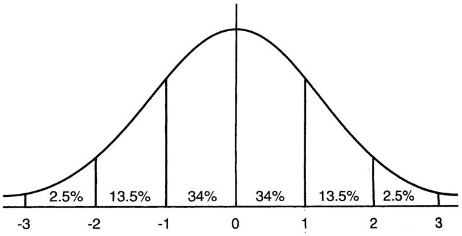
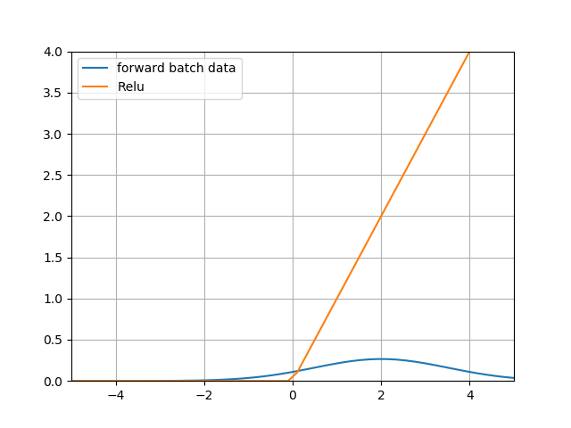

<!--Copyright © Microsoft Corporation. All rights reserved.
  适用于[License](https://github.com/Microsoft/ai-edu/blob/master/LICENSE.md)版权许可-->

## 15.5 批量归一化的原理

有的书翻译成归一化，有的翻译成正则化，英文Batch Normalization，简称为BatchNorm，或BN。

### 15.5.1 基本数学知识

#### 正态分布

正态分布，又叫做高斯分布。

若随机变量X，服从一个位置参数为μ、尺度参数为σ的概率分布，且其概率密度函数为：

$$
f(x)={1 \over \sigma\sqrt{2 \pi} } e^{- {(x-\mu)^2} \over 2\sigma^2} \tag{1}
$$

则这个随机变量就称为正态随机变量，正态随机变量服从的分布就称为正态分布，记作：

$$
X \sim N(\mu,\sigma^2) \tag{2}
$$

当μ=0,σ=1时，称为标准正态分布：

$$X \sim N(0,1) \tag{3}$$

此时公式简化为：

$$
f(x)={1 \over \sqrt{2 \pi}} e^{- {x^2} \over 2} \tag{4}
$$

图15-10就是三种（μ, σ）组合的函数图像。

图15-10 不同参数的正态分布函数曲线

### 15.5.2 深度神经网络的挑战

机器学习领域有个很重要的假设：I.I.D.（独立同分布）假设，就是假设训练数据和测试数据是满足相同分布的，这样就能做到通过训练数据获得的模型能够在测试集获得好的效果。

在深度神经网络中，我们可以将每一层视为对输入的信号做了一次变换：

$$
Z = W \cdot X + B \tag{5}
$$

我们在第5章学过，输入层的数据已经归一化，如果不做归一化，很多时候甚至网络不会收敛，可见归一化的重要性。

随后的网络的每一层的输入数据在经过公式5的运算后，其分布一直在发生变化，前面层训练参数的更新将导致后面层输入数据分布的变化，必然会引起后面每一层输入数据分布的改变，不再是输入的原始数据所适应的分布了。

而且，网络前面几层微小的改变，后面几层就会逐步把这种改变累积放大。训练过程中网络中间层数据分布的改变称之为内部协变量偏移（Internal Covariate Shift）。BN的提出，就是要解决在训练过程中，中间层数据分布发生改变的情况。

比如，在上图中，假设X是服从蓝色或红色曲线的分布，经过公式5后，有可能变成了绿色曲线的分布。

标准正态分布的数值密度占比如图15-11所示。

图15-11 标准正态分布的数值密度占比

有68%的值落在[-1,1]之间，有95%的值落在[-2,2]之间。

比较一下偏移后的数据分布区域和Sigmoid激活函数的图像，如图15-12所示。

图15-12 偏移后的数据分布区域和Sigmoid激活函数

可以看到带来的问题是：

1. 在大于2的区域，激活后的值基本接近1了，饱和输出。如果蓝色曲线表示的数据更偏向右侧的话，激活函数就会失去了作用，因为所有的输出值都是0.94、0.95、0.98这样子的数值，区别不大；
2. 导数数值小，只有不到0.1甚至更小，反向传播的力度很小，网络很难收敛。

有的人会问，我们在深度学习中不是都用ReLU激活函数吗？那么BN对于ReLU有用吗？下面我们看看ReLU函数的图像，如图15-13所示。

图15-13 ReLU函数曲线

上图中蓝色为数据分布，已经从0点向右偏移了，黄色为ReLU的激活值，可以看到95%以上的数据都在大于0的区域，从而被Relu激活函数原封不动第传到了下一层网络中，而没有被小于0的部分剪裁，那么这个网络和线性网络也差不多了，失去了深层网络的能力。

### 15.5.3 批量归一化

既然可以把原始训练样本做归一化，那么如果在深度神经网络的每一层，都可以有类似的手段，也就是说把层之间传递的数据移到0点附近，那么训练效果就应该会很理想。这就是批归一化BN的想法的来源。

深度神经网络随着网络深度加深，训练起来越困难，收敛越来越慢，这是个在DL领域很接近本质的问题。很多论文都是解决这个问题的，比如ReLU激活函数，再比如Residual Network。BN本质上也是解释并从某个不同的角度来解决这个问题的。

BN就是在深度神经网络训练过程中使得每一层神经网络的输入保持相同的分布，致力于将每一层的输入数据正则化成$N(0,1)$的分布。因次，每次训练的数据必须是mini-batch形式，一般取32，64等数值。

具体的数据处理过程如图15-14所示。

图15-14 数据处理过程

1. 数据在训练过程中，在网络的某一层会发生Internal Covariate Shift，导致数据处于激活函数的饱和区；
2. 经过均值为0、方差为1的变换后，位移到了0点附近。但是只做到这一步的话，会带来两个问题：
   
   a. 在[-1,1]这个区域，Sigmoid激活函数是近似线性的，造成激活函数失去非线性的作用；
   
   b. 在二分类问题中我们学习过，神经网络把正类样本点推向了右侧，把负类样本点推向了左侧，如果再把它们强行向中间集中的话，那么前面学习到的成果就会被破坏；

3. 经过$\gamma、\beta$的线性变换后，把数据区域拉宽，则激活函数的输出既有线性的部分，也有非线性的部分，这就解决了问题a；而且由于$\gamma、\beta$也是通过网络进行学习的，所以以前学到的成果也会保持，这就解决了问题b。

在实际的工程中，我们把BN当作一个层来看待，一般架设在全连接层（或卷积层）与激活函数层之间。

### 15.5.4 前向计算

#### 符号表

表15-11中，m表示batch_size的大小，比如32或64个样本/批；n表示features数量，即样本特征值数量。

表15-11 各个参数的含义和数据形状 

|符号|数据类型|数据形状|
|:---------:|:-----------:|:---------:|
|$X$| 输入数据矩阵 | [m, n] |
|$x_i$|输入数据第i个样本| [1, n] |
|$N$| 经过归一化的数据矩阵 | [m, n] |
|$n_i$| 经过归一化的单样本 | [1, n] |
|$\mu_B$| 批数据均值 | [1, n] |
|$\sigma^2_B$| 批数据方差 | [1, n] |
|$m$|批样本数量| [1] |
|$\gamma$|线性变换参数| [1, n] |
|$\beta$|线性变换参数| [1, n] |
|$Z$|线性变换后的矩阵| [1, n] |
|$z_i$|线性变换后的单样本| [1, n] |
|$\delta$| 反向传入的误差 | [m, n] |

如无特殊说明，以下乘法为元素乘，即element wise的乘法。

在训练过程中，针对每一个batch数据，m是批的大小。进行的操作是，将这组数据正则化，之后对其进行线性变换。

具体的算法步骤是：

$$
\mu_B = {1 \over m}\sum_1^m x_i \tag{6}
$$

$$
\sigma^2_B = {1 \over m} \sum_1^m (x_i-\mu_B)^2 \tag{7}
$$

$$
n_i = {x_i-\mu_B \over \sqrt{\sigma^2_B + \epsilon}} \tag{8}
$$

$$
z_i = \gamma n_i + \beta \tag{9}
$$

其中，$\gamma 和 \beta$是训练出来的，$\epsilon$是防止$\mu_B^2$为0时加的一个很小的数值，通常为1e-5。

### 15.5.5 测试和推理时的归一化方法

批量归一化的“批量”两个字，表示在训练过程中需要有一小批数据，比如32个样本。而在测试过程或推理时，我们只有一个样本的数据，根本没有mini-batch的概念，无法计算算出正确的均值。因此，我们使用的均值和方差数据是在训练过程中样本值的平均。也就是：

$$
E[x] = E[\mu_B]
$$
$$
Var[x] = {m \over m-1} E[\sigma^2_B]
$$

一种做法是，我们把所有批次的$\mu$和$\sigma$都记录下来，然后在最后训练完毕时（或做测试时）平均一下。

另外一种做法是使用类似动量的方式，训练时，加权平均每个批次的值，权值$\alpha$可以为0.9：

$$m_{t} = \alpha \cdot m_{t-1} + (1-\alpha) \cdot \mu_t$$
$$v_{t} = \alpha \cdot v_{t-1} + (1-\alpha) \cdot \sigma_t$$

测试或推理时，直接使用$m_t和v_t$的值即可。

### 15.5.6 批量归一化的优点

1. 可以选择比较大的初始学习率，让你的训练速度提高。
   
    以前还需要慢慢调整学习率，甚至在网络训练到一定程度时，还需要想着学习率进一步调小的比例选择多少比较合适，现在我们可以采用初始很大的学习率，因为这个算法收敛很快。当然这个算法即使你选择了较小的学习率，也比以前的收敛速度快，因为它具有快速训练收敛的特性；

2. 减少对初始化的依赖
   
    一个不太幸运的初始化，可能会造成网络训练实际很长，甚至不收敛。

3. 减少对正则的依赖
   
   在第16章中，我们将会学习正则化知识，以增强网络的泛化能力。采用BN算法后，我们会逐步减少对正则的依赖，比如令人头疼的dropout、L2正则项参数的选择问题，或者可以选择更小的L2正则约束参数了，因为BN具有提高网络泛化能力的特性；

### 代码位置

ch15, Level5

Level5_BatchNormTest.py，是为了验证代码的正确性，与cs231n中的另一种实现方法做比较，得到的结果为True，表示代码无误。

Level5_NormalDistribution.py，是一个绘图程序，可以忽略。

### 参考资料

https://arxiv.org/abs/1502.03167

