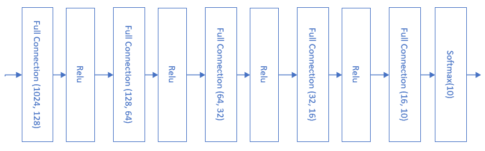
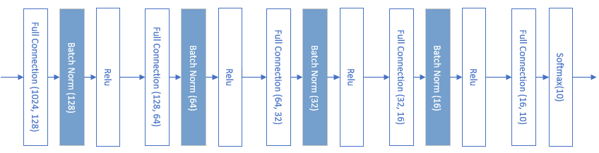
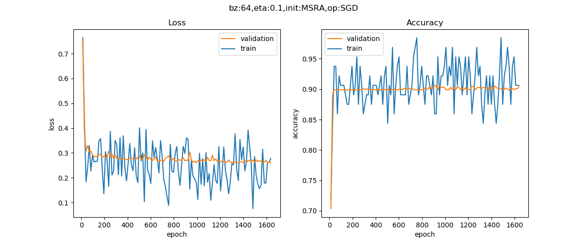

Copyright © Microsoft Corporation. All rights reserved.
  适用于[License](https://github.com/Microsoft/ai-edu/blob/master/LICENSE.md)版权许可

## 15.6 批量归一化的实现

在这一节中，我们将会动手实现一个批量归一化层，来验证BN的实际作用。

### 15.6.1 反向传播

在上一节中，我们知道了BN的正向计算过程，这一节中，为了实现完整的BN层，我们首先需要推导它的反向传播公式，然后用代码实现。本节中的公式序号接上一节，以便于说明。

首先假设已知从上一层回传给BN层的误差矩阵是：

$$\delta = {dJ \over dZ}，\delta_i = {dJ \over dz_i} \tag{10}$$

#### 求BN层参数梯度

则根据公式9，求$\gamma 和 \beta$的梯度：

$${dJ \over d\gamma} = \sum_{i=1}^m {dJ \over dz_i}{dz_i \over d\gamma}=\sum_{i=1}^m \delta_i \cdot n_i \tag{11}$$

$${dJ \over d\beta} = \sum_{i=1}^m {dJ \over dz_i}{dz_i \over d\beta}=\sum_{i=1}^m \delta_i \tag{12}$$

注意$\gamma和\beta$的形状与批大小无关，只与特征值数量有关，我们假设特征值数量为1，所以它们都是一个标量。在从计算图看，它们都与N,Z的全集相关，而不是某一个样本，因此会用求和方式计算。

#### 求BN层的前传误差矩阵

下述所有乘法都是element-wise的矩阵点乘，不再特殊说明。

从正向公式中看，对z有贡献的数据链是：

- $z_i \leftarrow n_i \leftarrow x_i$
- $z_i \leftarrow n_i \leftarrow \mu_B \leftarrow x_i$
- $z_i \leftarrow n_i \leftarrow \sigma^2_B \leftarrow x_i$
- $z_i \leftarrow n_i \leftarrow \sigma^2_B \leftarrow \mu_B \leftarrow x_i$

从公式8，9：

$$
{dJ \over dx_i} = {dJ \over d n_i}{d n_i \over dx_i} + {dJ \over d \sigma^2_B}{d \sigma^2_B \over dx_i} + {dJ \over d \mu_B}{d \mu_B \over dx_i} \tag{13}
$$

公式13的右侧第一部分（与全连接层形式一样）：

$$
{dJ \over d n_i}=  {dJ \over dz_i}{dz_i \over dn_i} = \delta_i \cdot \gamma\tag{14}
$$

上式等价于：

$$
{dJ \over d N}= \delta \cdot \gamma\tag{14}
$$

公式14中，我们假设样本数为64，特征值数为10，则得到一个64x10的结果矩阵（因为1x10的矩阵会被广播为64x10的矩阵）：

$$\delta^{(64 \times 10)} \odot \gamma^{(1 \times 10)}=R^{(64 \times 10)}$$

公式13的右侧第二部分，从公式8：
$$
{d n_i \over dx_i}={1 \over \sqrt{\sigma^2_B + \epsilon}} \tag{15}
$$

公式13的右侧第三部分，从公式8（注意$\sigma^2_B$是个标量，而且与X,N的全集相关，要用求和方式）：

$$
{dJ \over d \sigma^2_B} = \sum_{i=1}^m {dJ \over d n_i}{d n_i \over d \sigma^2_B} 
$$
$$
= -{1 \over 2}(\sigma^2_B + \epsilon)^{-3/2}\sum_{i=1}^m {dJ \over d n_i} \cdot (x_i-\mu_B) \tag{16}
$$

公式13的右侧第四部分，从公式7：
$$
{d \sigma^2_B \over dx_i} = {2(x_i - \mu_B) \over m} \tag{17}
$$

公式13的右侧第五部分，从公式7，8：

$$
{dJ \over d \mu_B}={dJ \over d n_i}{d n_i \over d \mu_B} + {dJ \over  d\sigma^2_B}{d \sigma^2_B \over d \mu_B} \tag{18}
$$

公式18的右侧第二部分，根据公式8：

$$
{d n_i \over d \mu_B}={-1 \over \sqrt{\sigma^2_B + \epsilon}} \tag{19}
$$

公式18的右侧第四部分，根据公式7（$\sigma^2_B和\mu_B$与全体$x_i$相关，所以要用求和）：

$$
{d \sigma^2_B \over d \mu_B}=-{2 \over m}\sum_{i=1}^m (x_i- \mu_B) \tag{20}
$$

所以公式18是：

$$
{dJ \over d \mu_B}=-{\delta \cdot \gamma \over \sqrt{\sigma^2_B + \epsilon}} - {2 \over m}{dJ \over d \sigma^2_B}\sum_{i=1}^m (x_i- \mu_B) \tag{18}
$$

公式13的右侧第六部分，从公式6：

$$
{d \mu_B \over dx_i} = {1 \over m} \tag{21}
$$

所以，公式13最后是这样的：

$$
{dJ \over dx_i} = {\delta \cdot \gamma \over \sqrt{\sigma^2_B + \epsilon}} + {dJ \over d\sigma^2_B} \cdot {2(x_i - \mu_B) \over m} + {dJ \over d\mu_B} \cdot {1 \over m} \tag{13}
$$

### 15.6.2 代码实现

#### 初始化类

```Python
class BnLayer(CLayer):
    def __init__(self, input_size, momentum=0.9):
        self.gamma = np.ones((1, input_size))
        self.beta = np.zeros((1, input_size))
        self.eps = 1e-5
        self.input_size = input_size
        self.output_size = input_size
        self.momentum = momentum
        self.running_mean = np.zeros((1,input_size))
        self.running_var = np.zeros((1,input_size))
```
后面三个变量，momentum、running_mean、running_var，是为了计算/记录历史方差均差的。

#### 正向计算

```Python
    def forward(self, input, train=True):
        assert(input.ndim == 2 or input.ndim == 4)  # fc or cv
        self.x = input

        if train:
            # 公式6
            self.mu = np.mean(self.x, axis=0, keepdims=True)
            # 公式7
            self.x_mu  = self.x - self.mu
            self.var = np.mean(self.x_mu**2, axis=0, keepdims=True) + self.eps
            # 公式8
            self.std = np.sqrt(self.var)
            self.norm_x = self.x_mu / self.std
            # 公式9
            self.z = self.gamma * self.norm_x + self.beta
            # mean and var history, for test/inference
            self.running_mean = self.momentum * self.running_mean + (1.0 - self.momentum) * self.mu
            self.running_var = self.momentum * self.running_var + (1.0 - self.momentum) * self.var
        else:
            self.mu = self.running_mean
            self.var = self.running_var
            self.norm_x = (self.x - self.mu) / np.sqrt(self.var + self.eps)
            self.z = self.gamma * self.norm_x + self.beta
        # end if
        return self.z
```
前向计算完全按照上一节中的公式6到公式9实现。要注意在训练/测试阶段的不同算法，用train是否为True来做分支判断。

#### 反向传播

```Python
    def backward(self, delta_in, flag):
        assert(delta_in.ndim == 2 or delta_in.ndim == 4)  # fc or cv
        m = self.x.shape[0]
        # calculate d_beta, b_gamma
        # 公式11
        self.d_gamma = np.sum(delta_in * self.norm_x, axis=0, keepdims=True)
        # 公式12
        self.d_beta = np.sum(delta_in, axis=0, keepdims=True)

        # calculate delta_out
        # 公式14
        d_norm_x = self.gamma * delta_in 
        # 公式16
        d_var = -0.5 * np.sum(d_norm_x * self.x_mu, axis=0, keepdims=True) / (self.var * self.std) # == self.var ** (-1.5)
        # 公式18
        d_mu = -np.sum(d_norm_x / self.std, axis=0, keepdims=True) - 2 / m * d_var * np.sum(self.x_mu, axis=0, keepdims=True)
        # 公式13
        delta_out = d_norm_x / self.std + d_var * 2 * self.x_mu / m + d_mu / m
        #return delta_out, self.d_gamma, self.d_beta
        return delta_out
```

d_norm_x需要多次使用，所以先计算出来备用，以增加代码性能。

公式16中有一个$(\sigma^2_B + \epsilon)^{-3/2}$次方，在前向计算中，我们令：
```Python
self.var = np.mean(self.x_mu**2, axis=0, keepdims=True) + self.eps
self.std = np.sqrt(self.var)
```
则：$self.var * self.std == self.var*self.var^{0.5}=self.var^{(3/2)}$，放在分母中就是(-3/2)次方了。

另外代码中有很多np.sum(..., axis=0, keepdims=True)，这个和全连接层中的多样本计算一个道理，都是按样本数求和，并保持维度，便于后面的矩阵运算。

#### 更新参数
```Python
    def update(self, learning_rate=0.1):
        self.gamma = self.gamma - self.d_gamma * learning_rate
        self.beta = self.beta - self.d_beta * learning_rate
```
更新$\gamma$和$\beta$时，我们使用0.1作为学习率。在初始化代码中，并没有给BN层指定学习率，如果有需求的话，读者可以自行添加这部分逻辑。


### 15.6.3 BN层的实际应用

首先回忆一下第14.6节中的Cifar10的图片分类网络，当时的模型是这样的：



当时用了29个epoch（22289个Iteration），达到了0.26的预计loss值而停止训练。我们看看使用BN后的样子：



在全连接层和激活函数之间，加入一个BN层，最后的分类函数Softmax前面不能加BN。

#### 主程序代码

```Python
if __name__ == '__main__':

    dataReader = LoadData()
    num_feature = dataReader.num_feature
    num_example = dataReader.num_example
    num_input = num_feature
    num_hidden1 = 128
    num_hidden2 = 64
    num_hidden3 = 32
    num_hidden4 = 16
    num_output = 10
    max_epoch = 30
    batch_size = 64
    learning_rate = 0.1

    params = HyperParameters_4_1(
        learning_rate, max_epoch, batch_size,
        net_type=NetType.MultipleClassifier,
        init_method=InitialMethod.MSRA,
        stopper=Stopper(StopCondition.StopLoss, 0.26))

    net = NeuralNet_4_1(params, "Cifar10")

    fc1 = FcLayer_1_1(num_input, num_hidden1, params)
    net.add_layer(fc1, "fc1")
    bn1 = BnLayer(num_hidden1)
    net.add_layer(bn1, "bn1")
    r1 = ActivationLayer(Relu())
    net.add_layer(r1, "r1")
    
    fc2 = FcLayer_1_1(num_hidden1, num_hidden2, params)
    net.add_layer(fc2, "fc2")
    bn2 = BnLayer(num_hidden2)
    net.add_layer(bn2, "bn2")
    r2 = ActivationLayer(Relu())
    net.add_layer(r2, "r2")

    fc3 = FcLayer_1_1(num_hidden2, num_hidden3, params)
    net.add_layer(fc3, "fc3")
    bn3 = BnLayer(num_hidden3)
    net.add_layer(bn3, "bn3")
    r3 = ActivationLayer(Relu())
    net.add_layer(r3, "r3")
    
    fc4 = FcLayer_1_1(num_hidden3, num_hidden4, params)
    net.add_layer(fc4, "fc4")
    bn4 = BnLayer(num_hidden4)
    net.add_layer(bn4, "bn4")
    r4 = ActivationLayer(Relu())
    net.add_layer(r4, "r4")

    fc5 = FcLayer_1_1(num_hidden4, num_output, params)
    net.add_layer(fc5, "fc5")
    softmax = ClassificationLayer(Softmax())
    net.add_layer(softmax, "softmax")

    net.train(dataReader, checkpoint=0.02, need_test=True)
    net.ShowLossHistory(xcoord=XCoordinate.Iteration)
```

#### 运行结果

为了比较，我们使用与14.6中完全一致的参数设置来训练这个有BN的模型，得到如下图：



打印输出的最后几行如下：

```
......
epoch=1, total_iteration=1273
loss_train=0.271839, accuracy_train=0.921875
loss_valid=0.259415, accuracy_valid=0.905600
time used: 8.926599740982056
testing...
0.906
0.906
```

可以看到到达相同的损失值0.26时，只用了不到2个epoch的1273次迭代，相比14.6中的29个epoch的22000+次迭代，速度提升了10多倍。时间上用了8.9秒，以前用了84秒，是以前的十分之一。为什么迭代速度提升10多倍，而时间只提升了不到10倍呢？这是因为BN的正向和反向计算过程还是比较复杂的，需要花费一些时间。

### 代码位置

ch15, Level6
