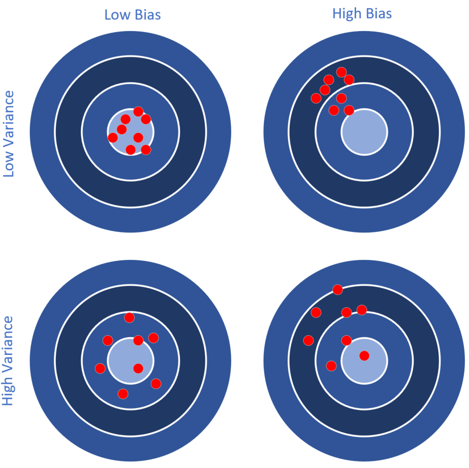
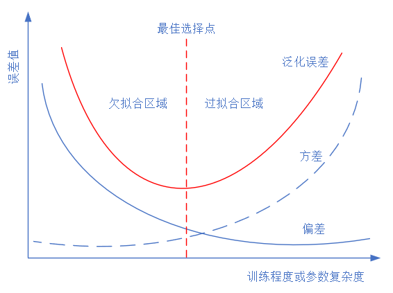

<!--Copyright © Microsoft Corporation. All rights reserved.
  适用于[License](https://github.com/Microsoft/ai-edu/blob/master/LICENSE.md)版权许可-->

## 16.1 偏差与方差

(do be add more...)

### 16.1.1 直观的解释

先用一个直观的例子来理解偏差和方差。比如打靶，如图16-9所示。

图16-9 打靶中的偏差和方差

总结一下，不同偏差和方差反映的射手的特点如表16-1所示。

表16-1 不同偏差和方差的射手特点

||低偏差|高偏差|
|---|---|---|
|低方差|射手很稳，枪的准星也很准。|射手很稳，但是枪的准星有问题，所有子弹都固定地偏向一侧。|
|高方差|射手不太稳，但枪的准星没问题，虽然弹着点分布很散，但没有整体偏移。|射手不稳，而且枪的准星也有问题，弹着点分布很散且有规律地偏向一侧。|

### 16.1.2 神经网络训练的例子

我们在前面讲过数据集的使用，包括训练集、验证集、测试集。在训练过程中，我们要不断监测训练集和验证集在当前模型上的误差，和上面的打靶的例子一样，有可能产生四种情况，如表16-2所示。

表16-2 不同偏差和方差反映的四种情况

|情况|训练集误差A|验证集误差B|偏差|方差|说明|
|---|---|---|---|---|---|
|情况1|1.5%|1.7%|低偏差|低方差|A和B都很好，适度拟合|
|情况2|12.3%|11.4%|高偏差|低方差|A和B都很不好，欠拟合|
|情况3|1.2%|13.1%|低偏差|高方差|A很好，但B不好，过拟合|
|情况4|12.3%|21.5%|高偏差|高方差|A不好，B更不好，欠拟合|

在本例中，偏差衡量训练集误差，方差衡量训练集误差和验证集误差的比值。

上述四种情况的应对措施：

- 情况1
  
  效果很好，可以考虑进一步降低误差值，提高准确度。

- 情况2

  训练集和验证集同时出现较大的误差，有可能是：迭代次数不够、数据不好、网络设计不好，需要继续训练，观察误差变化情况。

- 情况3

  训练集的误差已经很低了，但验证集误差很高，说明过拟合了，即训练集中的某些特殊样本影响了网络参数，但类似的样本在验证集中并没有出现

- 情况4

  两者误差都很大，目前还看不出来是什么问题，需要继续训练

### 16.1.3 偏差-方差分解

除了用上面的试验来估计泛化误差外，我们还希望在理论上分析其必然性，这就是偏差-方差分解的作用，bias-variance decomposition。表16-3是本章中使用的符号的含义，后续在推导公式的时候会用到。

表16-3 符号含义

|符号|含义|
|---|---|
|$x$|测试样本|
|$D$|数据集|
|$y$|x的真实标记|
|$y_D$|x在数据集中标记(可能有误差)|
|$f$|从数据集D学习的模型|
|$f_{x;D}$|从数据集D学习的模型对x的预测输出|
|$f_x$|模型f对x的期望预测输出|

学习算法期望的预测：
$$f_x=E[f_{x;D}] \tag{1}$$
不同的训练集/验证集产生的预测方差：
$$var(x)=E[(f_{x;D}-f_x)^2] \tag{2}$$
噪声：
$$\epsilon^2=E[(y_D-y)^2] \tag{3}$$
期望输出与真实标记的偏差：
$$bias^2(x)=(f_x-y)^2 \tag{4}$$
算法的期望泛化误差：
$$
\begin{aligned}
E(f;D)&=E[(f_{x;D}-y_D)^2] \\
&=E[(f_{x;D}-f_x+f_x-y_D)^2] \\
&=E[(f_{x;D}-f_x)^2]+E[(f_x-y_D)^2] \\
&+E[2(f_{x;D}-f_x)(f_x-y_D)](从公式1，此项为0) \\
&=E[(f_{x;D}-f_x)^2]+E[(f_x-y_D)^2] \\
&=E[(f_{x;D}-f_x)^2]+E[(f_x-y+y-y_D)^2] \\
&=E[(f_{x;D}-f_x)^2]+E[(f_x-y)^2]+E(y-y_D)^2] \\
&+E[2(f_x-y)(y-y_D)](噪声期望为0，所以此项为0)\\
&=E[(f_{x;D}-f_x)^2]+(f_x-y)^2+E[(y-y_D)^2] \\
&=var(x) + bias^2(x) + \epsilon^2
\end{aligned}
$$

所以，各个项的含义是：

- 偏差：度量了学习算法的期望与真实结果的偏离程度，即学习算法的拟合能力。
- 方差：训练集与验证集的差异造成的模型表现的差异。
- 噪声：当前数据集上任何算法所能到达的泛化误差的下线，即学习问题本身的难度。

想当然地，我们希望偏差与方差越小越好，但实际并非如此。一般来说，偏差与方差是有冲突的，称为偏差-方差窘境 (bias-variance dilemma)。

- 给定一个学习任务，在训练初期，由于训练不足，网络的拟合能力不够强，偏差比较大，也是由于拟合能力不强，数据集的特征也无法使网络产生显著变化，也就是欠拟合的情况。
- 随着训练程度的加深，网络的拟合能力逐渐增强，训练数据的特征也能够渐渐被网络学到。
- 充分训练后，网络的拟合能力已非常强，训练数据的微小特征都会导致网络发生显著变化，当训练数据自身的、非全局的特征被网络学到了，则将发生过拟合。

图16-10 训练过程中的偏差和方差变化

在图16-10中，随着训练程度的增加，偏差（点线）一路下降，但是方差（虚线）一路上升，整体误差（实线，偏差+方差+噪音误差）呈U形，最佳平衡点就是U形的最低点。

### 16.1.4 没有免费午餐定理

没有免费午餐定理（No Free Lunch Theorem，NFL）是由Wolpert和Macerday在最优化理论中提出的。没有免费午餐定理证明：对于基于迭代的最优化算法，不存在某种算法对所有问题（有限的搜索空间内）都有效。如果一个算法对某些问题有效，那么它一定在另外一些问题上比纯随机搜索算法更差。

还可以理解为在所有可能的数据生成分布上平均之后，每一个分类算法在未事先观测的点上都有相同的错误率。也就是说，不能脱离具体问题来谈论算法的优劣，任何算法都有局限性。必须要“具体问题具体分析”。

没有免费午餐定理对于机器学习算法也同样适用。不存在一种机器学习算 法适合于任何领域或任务。如果有人宣称自己的模型在所有问题上都好于其他模型，那么他肯定是在吹牛。

### 参考资料

- 周志华老师的西瓜书《机器学习》
- http://scott.fortmann-roe.com/docs/BiasVariance.html
