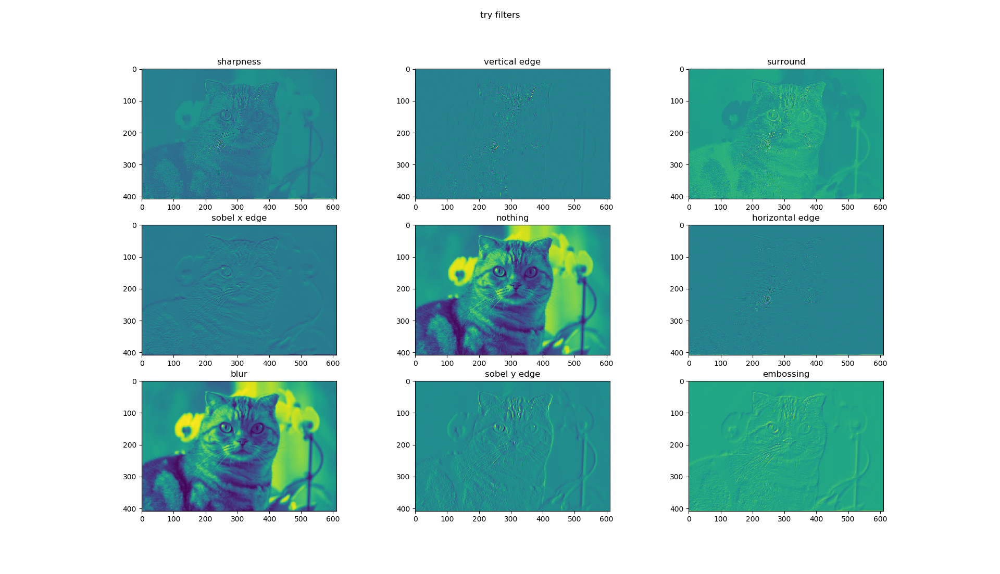

Copyright © Microsoft Corporation. All rights reserved.
  适用于[License](https://github.com/Microsoft/ai-edu/blob/master/LICENSE.md)版权许可

# 卷积神经网络

特点 用途
用于特征压缩

举例 图片效果

https://www.cnblogs.com/bnuvincent/p/9612686.html

