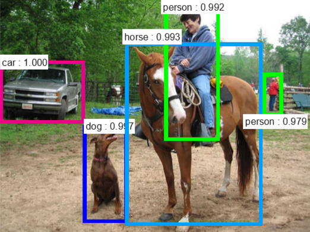
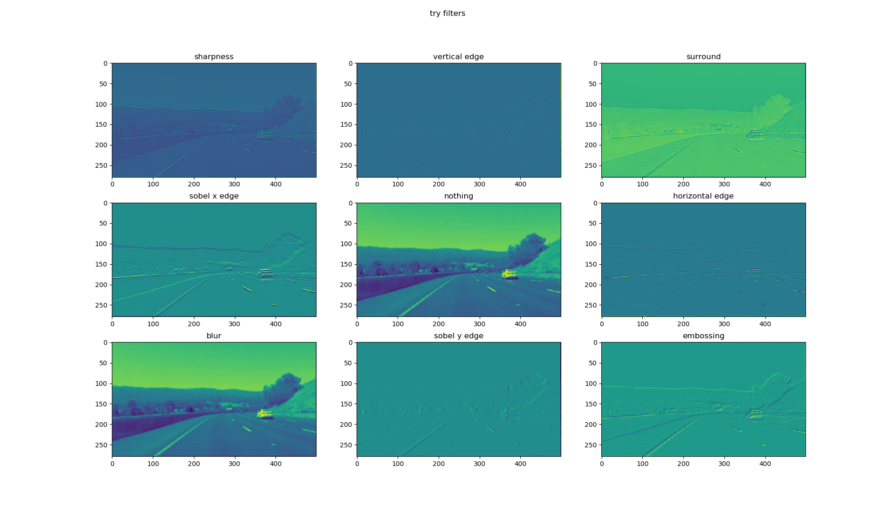
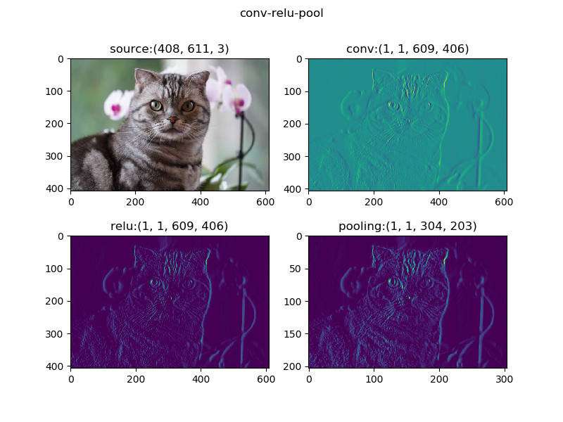

Copyright © Microsoft Corporation. All rights reserved.
  适用于[License](https://github.com/Microsoft/ai-edu/blob/master/LICENSE.md)版权许可

## 17.0 卷积神经网络

### 17.0.1 卷积神经网络的能力

卷积神经网络（ConvNet or CNN)是神经网络的类型之一，在图像识别和分类领域中取得了非常好的效果，比如识别人脸、物体、交通标识等，这就为机器人、自动驾驶等应用提供了基本的技术条件。

比如下面两张图：

|图一：两匹斑马|图二：两个骑车人|
|---|---|
|||
|a couple of zebra standing on top of a dirt field|a man riding a bike down a street next to a woman|

【图片来源：https://cs.stanford.edu/people/karpathy/neuraltalk2/demo.html 】

CNN可以识别出上面两张图中的物体和场景，图一是“两匹斑马站在泥地上”，图二是“一个在道路上骑车的男人旁边还有个女人”。当然，识别物体和给出简要的场景描述是两套系统。


在下面两张图中，CNN展现了识别人类日常生活中的物体的能力：

|图一|图二|
|---|---|
|||

【图片来源：https://arxiv.org/pdf/1506.01497v3.pdf 】

图一是4个人在一条船上，图二是一个农场中的车、狗、马、人等物体识别。


### 17.0.2 卷积网络的典型结构

一个典型的卷积神经网络的结构如下图所示：


我们分析一下它的层级结构：

1. 原始的输入是一张图片，可以是彩色的，也可以是灰度的或黑白的。这里假设是只有一个通道的图片，目的是识别10个手写体数字；
2. 第一层卷积，我们使用了4个卷积核，得到了4张feature map；激活函数层没有单独画出来，这里我们紧接着卷积操作使用了Relu激活函数；
3. 第二层是池化，使用了Max Pooling方式，把图片的高宽各缩小一倍，但仍然是4个feature map；
4. 第三层卷积，我们使用了4x6个卷积核，其中4对应着输入通道，6对应着输出通道，从而得到了6张feature map，当然也使用了Relu激活函数；
5. 第四层再次做一次池化，现在得到的图片尺寸只是原始尺寸的四分之一左右；
6. 第五层把第四层的6个图片展平成一维，成为一个fully connected层；
7. 第六层再接一个小一些的fully connected层；
8. 最后接一个softmax函数，判别10个分类。

所以，在一个典型的卷积神经网络中，会至少包含以下几个层：
- 卷积层
- 激活函数层
- 池化层
- 全连接分类层

我们会在后续的小节中讲解卷积层和池化层的具体工作原理。

### 17.0.3 卷积核的作用

我们遇到了一个新的概念：卷积核。卷积网络之所以能工作，完全是卷积核的功劳。什么是卷积核呢？卷积核其实就是一个小矩阵，类似这样：

```
1.1  0.23  -0.45
0.1  -2.1   1.24
0.74 -1.32  0.01
```

这是一个3x3的卷积核，还会有1x1、5x5、7x7、9x9、11x11的卷积核。在卷积层中，我们会用输入数据与卷积核相乘，得到输出数据，就类似全连接层中的Weights一样，所以卷积核里的数值，也是通过反向传播的方法学习到的。

下面我们看看卷积核的具体作用：



上面的九张图，是使用9个不同的卷积核在同一张图上运算后得到的结果，而下面的python代码中按顺序列出了9个卷积核的数值核名称，可以一一对应到上面的9张图中：

```Python
    filters = [
        np.array([0,-1,0,
                  -1,5,-1,
                  0,-1,0]),         # sharpness filter

        np.array([0,-1,0,
                  0,2,0,
                  0,-1,0]),         # vertical edge

        np.array([1,1,1,
                  1,-9,1,
                  1,1,1]),          # surround

        np.array([-1,0,1,
                  -2,0,2,
                  -1,0,1]),         # sobel x

        np.array([0,0,0,
                  0,1,0,
                  0,0,0]),          # nothing

        np.array([0,0,0,
                  -1,2,-1,
                  0,0,0]),          # horizontal edge

        np.array([0.11,0.11,0.11,
                  0.11,0.11,0.11,
                  0.11,0.11,0.11]),    # blur

        np.array([-1,-2,-1,
                  0,0,0,
                  1,2,1]),          # sobel y

        np.array([2,0,0,
                  0,-1,0,
                  0,0,-1])]         # embossing
```

我们先说中间那个图，就是第5个卷积核，叫做"nothing"。为什么叫nothing呢？因为这个卷积核在与原始图片计算后得到的结果，和原始图片一模一样，所以我们看到的图5就是相当于原始图片，放在中间是为了方便和其它卷积核的效果做对比。

下面说明其它8个卷积核的作用：

|序号|名称|说明|
|---|---|---|
|1|锐化|会把亮度高的地方进一步变高，在灰度图上效果不明显|
|2|检测竖边|由于此图基本没有竖边，所以只能看到不多的短边|
|3|周边|把周边增强，把同色的区域变弱，形成大色块|
|4|Sobel横向亮度差分|可以检测出竖边|
|6|横边检测|
|7|模糊|通过把周围的点做平均值计算而“杀富济贫”|
|8|Sobel竖向亮度差分|可以检测出竖边|
|9|浮雕|形成大理石浮雕般的效果|

### 17.0.4 卷积后续的运算

前面我们认识到了卷积核的强大能力，卷积神经网络通过反向传播而令卷积核自我学习，找到分布在图片中的不同的feature，最后形成的卷积核中的数据。但是如果想达到这种效果，只有卷积层的话是不够的，还需要激活函数、池化等操作的配合。

下图中的四个子图，依次展示了：
1. 原图
2. 卷积结果
3. 激活结果
4. 池化结果



注意图一是原始图片，用cv2读取出来的图片，其顺序是反向的，即：
- 第一维是高度
- 第二维是宽度
- 第三维是彩色通道数，但是其顺序为BGR，而不是常用的RGB

我们对原始图片使用了一个3x1x3x3的卷积核，因为原始图片为彩色图片，所以第一个维度是3，对应RGB三个彩色通道；我们希望只输出一张feature map，以便于说明，所以第二维是1；我们使用了3x3的卷积核，用的是sobel x算子。所以图二是卷积后的结果。

图三做了一层Relu激活计算，把小于0的值都去掉了，只留下了边的特征。

图四是图三的四分之一大小，虽然图片缩小了，但是特征都没有丢失，反而因为图像尺寸变小而变得密集，亮点的密度要比图三大而粗。

### 17.0.5 卷积神经网络的学习

从17.0.2节中的整体图中，可以看到在卷积-池化操作的后面，要接全连接层，这里的全连接层和我们在前面学习的深度网络的功能一模一样，都是做为分类层使用。

在最后一层的池化后面，把所有特征数据变成一个一维的全连接层，然后就和普通的深度全连接网络一样了，通过在最后一层的softmax分类函数，以及多分类交叉熵函数，对比图片的OneHot编码标签，回传误差值，从全连接层传回到池化层，通过激活函数层再回传给卷积层，对卷积核的数值进行梯度更新，实现卷积核数值的自我学习。


### 代码位置

ch17, Level0

### 参考资料

- https://ujjwalkarn.me/2016/08/11/intuitive-explanation-convnets/
