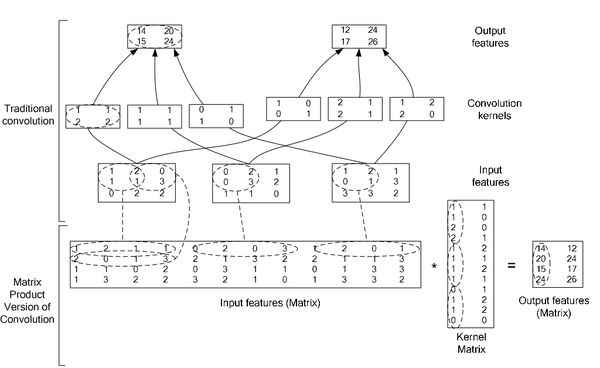

<!--Copyright © Microsoft Corporation. All rights reserved.
  适用于[License](https://github.com/Microsoft/ai-edu/blob/master/LICENSE.md)版权许可-->

## 17.2 卷积前向计算代码实现

### 17.2.1 卷积核的实现

卷积核，实际上和全连接层一样，是权重矩阵加偏移向量的组合，区别在于全连接层中的权重矩阵是二维的，偏移矩阵是列向量，而卷积核的权重矩阵是四维的，偏移矩阵是也是列向量。

```Python
class ConvWeightsBias(WeightsBias_2_1):
    def __init__(self, output_c, input_c, filter_h, filter_w, init_method, optimizer_name, eta):
        self.FilterCount = output_c
        self.KernalCount = input_c
        self.KernalHeight = filter_h
        self.KernalWidth = filter_w
        ...

    def Initialize(self, folder, name, create_new):
        self.WBShape = (self.FilterCount, self.KernalCount, self.KernalHeight, self.KernalWidth)        
        ...
```


图17-19 卷积核的组成

以图17-19为例，各个维度的数值如下：

- FilterCount=2，第一维，过滤器数量，对应输出通道数。
- KernalCount=3，第二维，卷积核数量，对应输入通道数。两个Filter里面的Kernal数必须相同。
- KernalHeight=5，KernalWidth=5，卷积核的尺寸，第三维和第四维。同一组WeightsBias里的卷积核尺寸必须相同。

在初始化函数中，会根据四个参数定义WBShape，然后在CreateNew函数中，创建相应形状的Weights和Bias。

### 17.2.2 卷积前向运算的实现 - 方法1
```Python
class ConvLayer(CLayer):
    def forward(self, x, train=True):
        self.x = x
        self.batch_size = self.x.shape[0]
        # 如果有必要的话，先对输入矩阵做padding
        if self.padding > 0:
            self.padded = np.pad(...)
        else:
            self.padded = self.x
        #end if
        self.z = conv_4d(...)
        return self.z
```

上述代码中的conv_4d函数实现了17.1中定义的四维卷积运算：

```Python
def conv_4d(x, weights, bias, out_h, out_w, stride=1):
    batch_size = x.shape[0]
    input_channel = x.shape[1]
    output_channel = weights.shape[0]
    filter_height = weights.shape[2]
    filter_width = weights.shape[3]
    rs = np.zeros((batch_size, num_output_channel, out_h, out_w))

    for bs in range(batch_size):
        for oc in range(output_channel):
            rs[bs,oc] += bias[oc]
            for ic in range(input_channel):
                for i in range(out_h):
                    for j in range(out_w):
                        ii = i * stride
                        jj = j * stride
                        for fh in range(filter_height):
                            for fw in range(filter_width):
                                rs[bs,oc,i,j] += x[bs,ic,fh+ii,fw+jj] * weights[oc,ic,fh,fw]
```

上面的函数包含以下几重循环：

1. 批量数据循环（第一维）：bs in batch_size，对每个样本进行计算；
2. 输出通道循环（第二维）：oc in output_channel。这里先把bias加上了，后加也可以；
3. 输入通道循环：ic in input_channel;
4. 输出图像纵坐标循环：i in out h；
5. 输出图像横坐标循环：j in out_w。循环4和5完成对输出图像的每个点的遍历，在下面的子循环中计算并填充值；
6. 卷积核纵向循环（第三维）：fh in filter_height；
7. 卷积核横向循环（第四维）：fw in filter_width。循环6和7完成卷积核与输入图像的卷积计算，并保存到循环4和5指定的输出图像的点上。

我们试着运行上面的代码并循环10次，看看它的执行效率如何：

```
Time used for Python: 38.057225465774536
```

出乎我们的预料，在足足等了30多秒后，才返回结果。

通过试验发现，其运行速度非常慢，如果这样的函数在神经网络训练中被调用几十万次，其性能是非常糟糕的，这也是Python做为动态语言的一个缺点。

### 17.2.3 卷积前向运算的实现 - 方法2

既然动态语言速度慢，我们把它编译成静态方法，是不是会快一些呢？

很幸运，有这样一个开源项目：[numba](https://numba.pydata.org/)，它可以在运行时把Python编译成C语言执行，代码是用C语言“风格”编写的Python代码，而且越像C的话，执行速度越快。

我们先用pip安装numba包：

```
pip install numba
```

然后在需要运行时编译的函数前面加上一个装饰符：

```Python
@nb.jit(nopython=True)
def jit_conv_4d(x, weights, bias, out_h, out_w, stride=1):
    ...
```

为了明确起见，我们把conv_4d前面加上一个jit前缀，表明这个函数是经过numba加速的。然后运行循环10次的测试代码：

```
Time used for Numba: 0.0727994441986084
```

又一次出乎我们的预料，这次只用了0.07秒，比纯Python代码快了500多倍！

但是不要急，我们还需要检查一下其正确性。方法1输出结果为output1，Numba编译后的方法输出结果为output2，二者都是四维矩阵，我们用np.allclose()函数来比较它们的差异：

```Python
    print("correctness:", np.allclose(output1, output2, atol=1e-7))
```

得到的结果是：

```
correctness: True
```

np.allclose方法逐元素检查两种方法的返回值的差异，如果绝对误差在1e-7之内，说明两个返回的四维数组相似度极高，运算结果可信。

为什么不把所有的Python代码都编译成C代码呢？是因为numba的能力有限，并不支持numpy的所有函数，所以只能把关键的运算代码设计为独立的函数，然后用numba编译执行，函数的输入可以是数组、向量、标量，不能是复杂的自定义结构体或函数指针。

### 17.2.4 卷积前向运算的实现 - 方法3

由于卷积操作是原始图片数据与卷积核逐点相乘的结果，所以遍历每个点的运算速度非常慢。在全连接层中，由于是两个矩阵直接相乘，所以速度非常快。我们是否可以把卷积操作转换为矩阵操作呢？

在Caffe框架中，巧妙地把逐点相乘的运算转换成了矩阵运算，大大提升了程序运行速度。这就是著名的im2col函数（我们在代码中命名为img2col)。

```Python
    def forward_img2col(self, x, train=True):
        self.x = x
        self.batch_size = self.x.shape[0]
        assert(self.x.shape == (self.batch_size, self.InC, self.InH, self.InW))
        self.col_x = img2col(x, self.FH, self.FW, self.stride, self.padding)
        self.col_w = self.WB.W.reshape(self.OutC, -1).T
        self.col_b = self.WB.B.reshape(-1, self.OutC)
        out1 = np.dot(self.col_x, self.col_w) + self.col_b
        out2 = out1.reshape(batch_size, self.OutH, self.OutW, -1)
        self.z = np.transpose(out2, axes=(0, 3, 1, 2))
        return self.z
```

#### 原理

我们观察一下图17-20。



图17-20 把卷积运算转换成矩阵运算

先看上半部分：绿色的3x3矩阵为输入，经过棕色的卷积核运算后，得到右侧的2x2的矩阵。

再看图的下半部分：

第一步，上半部分中蓝色的虚线圆内的四个元素排列成第1行，形成[0,1,3,4]，红色虚线圆内的四个元素排列成第4行[4,5,7,8]，中间两行可以从右上角的[1,2,4,5]和左下角的[3,4,6,7]得到。这样，一个3x3的矩阵，就转换成了一个4x4的矩阵。也就是把卷积核视野中的每个二维2x2的数组变成1x4的向量。

第二步，把棕色的权重矩阵变成4x1的向量[3,2,1,0]。

第三步，把4x4的矩阵与4x1的向量相乘，得到4x1的结果向量[5,11,23,29]。

第四步：把4x1的结果变成2x2的矩阵，就得到了卷积运算的真实结果。

#### 四维数组的展开

前面只说明了二维数组的展开形式，四维数组可以用同样的方式展开。

我们假定有2个输入样本，每个样本含有3个通道，每个通道上是3x3的数据，则样本的原始形状和展开形状分别是：
```
x =
(样本1)                 [样本2]
    (通道1)                 (通道1)
 [[[[ 0  1  2]           [[[27 28 29]
   [ 3  4  5]              [30 31 32]
   [ 6  7  8]]             [33 34 35]]
    (通道2)                 (通道2)
  [[ 9 10 11]             [[36 37 38]
   [12 13 14]              [39 40 41]
   [15 16 17]]             [42 43 44]]
    (通道3)                 (通道3)
  [[18 19 20]             [[45 46 47]
   [21 22 23]              [48 49 50]
   [24 25 26]]]            [51 52 53]]]]
------------------------------------------   
col_x =
 [[0.  1.  3.  4.|  9. 10. 12. 13.| 18. 19. 21. 22.]
 [ 1.  2.  4.  5.| 10. 11. 13. 14.| 19. 20. 22. 23.]
 [ 3.  4.  6.  7.| 12. 13. 15. 16.| 21. 22. 24. 25.]
 [ 4.  5.  7.  8.| 13. 14. 16. 17.| 22. 23. 25. 26.]
 ----------------+----------------+----------------
 [27. 28. 30. 31.| 36. 37. 39. 40.| 45. 46. 48. 49.]
 [28. 29. 31. 32.| 37. 38. 40. 41.| 46. 47. 49. 50.]
 [30. 31. 33. 34.| 39. 40. 42. 43.| 48. 49. 51. 52.]
 [31. 32. 34. 35.| 40. 41. 43. 44.| 49. 50. 52. 53.]]
```

从生成的8x12的矩阵中可以观察到：

- 前4行是样本1的数据，后4行是样本2的数据
- 前4列是通道1的数据，中间4列是通道2的数据，后4列是通道3的数据

#### 权重数组的展开

对应的四维输入数据，卷积核权重数组也需要是四维的，其原始形状和展开后的形状如下：
```
weights=
(过滤器1)               (过滤器2)
    (卷积核1)               (卷积核1)
 [[[[ 0  1]             [[[12 13]
   [ 2  3]]               [14 15]]
    (卷积核2)               (卷积核2)
  [[ 4  5]               [[16 17]
   [ 6  7]]               [18 19]]
    (卷积核3)               (卷积核3)
  [[ 8  9]               [[20 21]
   [10 11]]]              [22 23]]]]
---------------------------------------
col_w=
 [[ 0 12]
  [ 1 13]
  [ 2 14]
  [ 3 15]
  [ 4 16]
  [ 5 17]
  [ 6 18]
  [ 7 19]
  [ 8 20]
  [ 9 21]
  [10 22]
  [11 23]]
```

至此，展开数组已经可以和权重数组做矩阵相乘了。

#### 结果数据的处理

原始数据展开成了8x12的矩阵，权重展开成了12x2的矩阵，所以最后的结果是8x2的矩阵：
```
[[1035.| 2619.]
 [1101.| 2829.]
 [1233.| 3249.]
 [1299.| 3459.]
 ------+-------
 [2817.| 8289.]
 [2883.| 8499.]
 [3015.| 8919.]
 [3081.| 9129.]]
```
这是两个样本的结果。如何把它拆开呢？是简单的左右分开就行了吗？这里要稍微动一下脑筋，推理一下：

1. 两个样本的原始数组x展开后的矩阵col_x是8x12，计算结果是8x2，如果原始数据只有一个样本，则展开矩阵col_x的形状是4x12，那么运算结果将会是4x2。所以，在上面这个8x2的矩阵中，前4行应该是第一个样本的卷积结果，后4行是第二个样本的卷积结果。
2. 如果输出通道只有一个，则权重矩阵w展开后的col_w只有一列，那么运算结果将会是8x1；两个输出通道的运算结果是8x2。所以第一列和第二列应该是两个通道的数据，而不是两个样本的数据。

也就是说，在这个8x2的数组中：

- 第1列的前4行是第1个样本的第1个通道的输出
- 第2列的前4行是第1个样本的第2个通道的输出
- 第1列的后4行是第2个样本的第1个通道的输出
- 第2列的后4行是第2个样本的第2个通道的输出

于是我们可以分两步得到正确的矩阵形状：

1. 先把8x2的数据变成2个样本 * 输出高度 * 输出宽度的形状：

```Python
out2 = output.reshape(batch_size, output_height, output_width, -1)
```

得到结果：

```
out2= 
[[[[1035. 2619.]
   [1101. 2829.]]
  [[1233. 3249.]
   [1299. 3459.]]]
 [[[2817. 8289.]
   [2883. 8499.]]
  [[3015. 8919.]
   [3081. 9129.]]]]
```

注意现在1035和2619在一个子矩阵中，这是不对的，因为它们应该属于两个通道，所以应该在两个子矩阵中。目前这个结果中的四维数据的顺序是：样本、行、列、通道。于是我们做第二步，把“通道”所在的第4维移到第2维，变成：样本、通道、行、列：

2. 把第4维数据放到第2维（由于是0-base的，所以是把第3维移到第1维的位置）：

```Python
out3 = np.transpose(out2, axes=(0, 3, 1, 2))
```

结果是：

```
conv result=
(样本1)                     (样本2)
    (通道1)                     (通道1)
 [[[[1035. 1101.]            [[[2817. 2883.]
   [1233. 1299.]]              [3015. 3081.]]
    (通道2)                     (通道2)
  [[2619. 2829.]              [[8289. 8499.]
   [3249. 3459.]]]             [8919. 9129.]]]]
```

#### 验证正确性

我们可以用17.2.3中的方法1做为基准，如果用本节中的方法3可以得到同样的结果，就说明这种方式是正确的。

```Python
def test_4d_im2col():
    ......
    f1 = c1.forward_numba(x)
    f2 = c1.forward_img2col(x)
    print("correctness:", np.allclose(f1, f2, atol=1e-7))
```
得到的结果是：
```
correctness: True
```
上面的代码，首先生成了一个ConvLayer实例，然后分别调用内部实现的forward_numba()方法和forward_img2col()方法，得到f1和f2两个卷积结果矩阵，然后比较其数值，最后的返回值为True，说明im2col方法的正确性。

#### 性能测试

下面我们比较一下方法2和方法3的性能。

```Python
def test_performance():
    ...
    print("compare correctness of method 1 and method 2:")
    print("forward:", np.allclose(f1, f2, atol=1e-7))
```

上述代码先生成一个ConvLayer实例，然后分别调用1000次forward_numba()方法和1000次forward_img2col()方法，最后得到的结果是：

```
method numba: 11.663846492767334
method img2col: 14.926148653030396
compare correctness of method 1 and method 2:
forward: True
```

numba方法会比im2col方法快3秒，目前看来numba方法稍占优势。但是如果没有numba的帮助，im2col方法会比方法1快几百倍。

### 代码位置

ch17, Level2

其中，Level2_Numba_Test.py是测试numba库的性能，Level2_Img2Col_Test是比较numba方法和im2col方法的前向计算性能。

在Level2的主过程中有4个函数：

- test_2d_conv，理解2维下im2col的工作原理
- understand_4d_im2col，理解4维下im2col的工作原理
- test_4d_im2col，比较两种方法的结果，从而验证正确性
- test_performance，比较两种方法的性能
