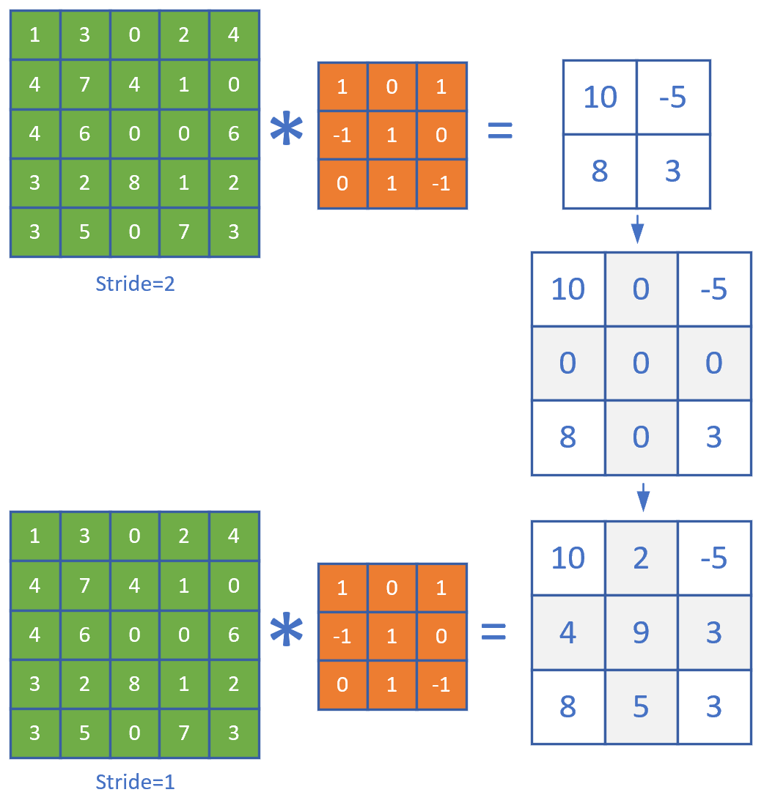
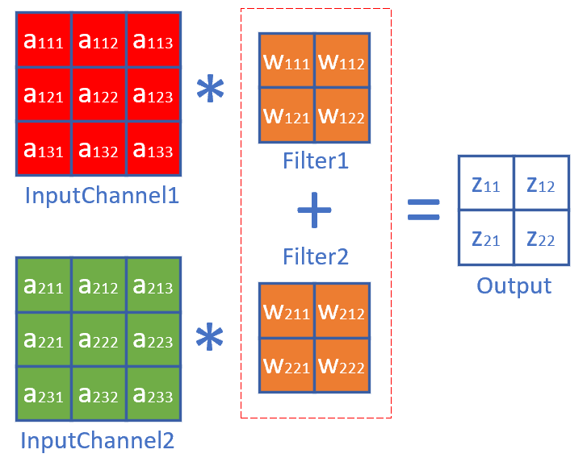
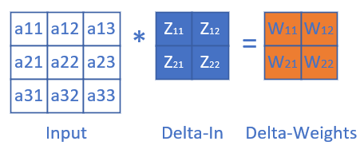
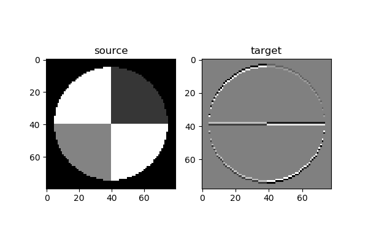
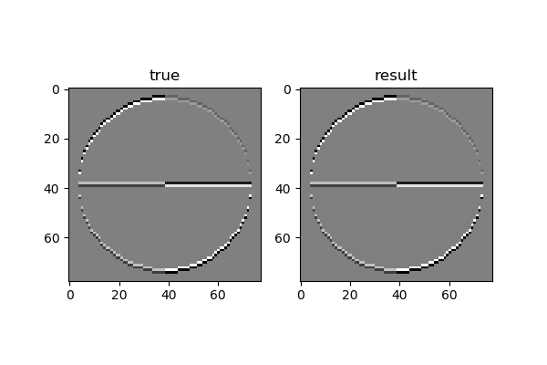

<!--Copyright © Microsoft Corporation. All rights reserved.
  适用于[License](https://github.com/Microsoft/ai-edu/blob/master/LICENSE.md)版权许可-->

## 17.3 卷积层的训练

同全连接层一样，卷积层的训练也需要从上一层回传的误差矩阵，然后计算：

1. 本层的权重矩阵的误差项
2. 本层的需要回传到下一层的误差矩阵

在下面的描述中，我们假设已经得到了从上一层回传的误差矩阵，并且已经经过了激活函数的反向传导。

### 17.3.1 计算反向传播的梯度矩阵

正向公式：

$$Z = W*A+b \tag{0}$$

其中，W是卷积核，*表示卷积（互相关）计算，A为当前层的输入项，b是偏移（未在图中画出），Z为当前层的输出项，但尚未经过激活函数处理。

我们举一个具体的例子便于分析。图17-21是正向计算过程。


图17-21 卷积正向运算

分解到每一项就是下列公式：

$$z_{11} = w_{11} \cdot a_{11} + w_{12} \cdot a_{12} + w_{21} \cdot a_{21} + w_{22} \cdot a_{22} + b \tag{1}$$
$$z_{12} = w_{11} \cdot a_{12} + w_{12} \cdot a_{13} + w_{21} \cdot a_{22} + w_{22} \cdot a_{23} + b \tag{2}$$
$$z_{21} = w_{11} \cdot a_{21} + w_{12} \cdot a_{22} + w_{21} \cdot a_{31} + w_{22} \cdot a_{32} + b \tag{3}$$
$$z_{22} = w_{11} \cdot a_{22} + w_{12} \cdot a_{23} + w_{21} \cdot a_{32} + w_{22} \cdot a_{33} + b \tag{4}$$

求损失函数J对a11的梯度：

$$
\frac{\partial J}{\partial a_{11}}=\frac{\partial J}{\partial z_{11}} \frac{\partial z_{11}}{\partial a_{11}}=\delta_{z11}\cdot w_{11} \tag{5}
$$

上式中，$\delta_{z11}$是从网络后端回传到本层的z11单元的梯度。

求J对a12的梯度时，先看正向公式，发现a12对z11和z12都有贡献，因此需要二者的偏导数相加：

$$
\frac{\partial J}{\partial a_{12}}=\frac{\partial J}{\partial z_{11}} \frac{\partial z_{11}}{\partial a_{12}}+\frac{\partial J}{\partial z_{12}} \frac{\partial z_{12}}{\partial a_{12}}=\delta_{z11} \cdot w_{12}+\delta_{z12} \cdot w_{11} \tag{6}
$$

最复杂的是求a22的梯度，因为从正向公式看，所有的输出都有a22的贡献，所以：

$$
\frac{\partial J}{\partial a_{22}}=\frac{\partial J}{\partial z_{11}} \frac{\partial z_{11}}{\partial a_{22}}+\frac{\partial J}{\partial z_{12}} \frac{\partial z_{12}}{\partial a_{22}}+\frac{\partial J}{\partial z_{21}} \frac{\partial z_{21}}{\partial a_{22}}+\frac{\partial J}{\partial z_{22}} \frac{\partial z_{22}}{\partial a_{22}} 
$$
$$
=\delta_{z11} \cdot w_{22} + \delta_{z12} \cdot w_{21} + \delta_{z21} \cdot w_{12} + \delta_{z22} \cdot w_{11} \tag{7}
$$

同理可得所有a的梯度。

观察公式7中的w的顺序，貌似是把原始的卷积核旋转了180度，再与传入误差项做卷积操作，即可得到所有元素的误差项。而公式5和公式6并不完备，是因为二者处于角落，这和卷积正向计算中的padding是相同的现象。因此，我们把传入的误差矩阵Delta-In做一个zero padding，再乘以旋转180度的卷积核，就是要传出的误差矩阵Delta-Out，如图17-22所示。


图17-22 卷积运算中的误差反向传播

最后可以统一成为一个简洁的公式：

$$\delta_{out} = \delta_{in} * W^{rot180} \tag{8}$$

这个误差矩阵可以继续回传到下一层。

- 当Weights是3x3时，$\delta_{in}$需要padding=2，即加2圈0，才能和Weights卷积后，得到正确尺寸的$\delta_{out}$
- 当Weights是5x5时，$\delta_{in}$需要padding=4，即加4圈0，才能和Weights卷积后，得到正确尺寸的$\delta_{out}$
- 以此类推：当Weights是NxN时，$\delta_{in}$需要padding=N-1，即加N-1圈0

举例：

正向时stride=1：$A^{(10 \times 8)}*W^{(5 \times 5)}=Z^{(6 \times 4)}$

反向时，$\delta_z^{(6 \times 4)} + 4 padding = \delta_z^{(14 \times 12)}$

然后：$\delta_z^{(14 \times 12)} * W^{rot180(5 \times 5)}= \delta_a^{(10 \times 8)}$

### 17.3.2 步长不为1时的梯度矩阵还原

我们先观察一下stride=1和2时，卷积结果的差异如图17-23。



图17-23 步长为1和步长为2的卷积结果的比较

二者的差别就是中间那个结果图的灰色部分。如果反向传播时，传入的误差矩阵是stride=2时的2x2的形状，那么我们只需要把它补上一个十字，变成3x3的误差矩阵，就可以用步长为1的算法了。

以此类推，如果步长为3时，需要补一个双线的十字。所以，当知道当前的卷积层步长为S（S>1）时：

1. 得到从上层回传的误差矩阵形状，假设为$M \times N$
2. 初始化一个$(M \cdot S) \times (N \cdot S)$的零矩阵
3. 把传入的误差矩阵的第一行值放到零矩阵第0行的0,S,2S,3S...位置
4. 然后把误差矩阵的第二行的值放到零矩阵第S行的0,S,2S,3S...位置
5. ......

步长为2时，用实例表示就是这样：

$$
\begin{bmatrix}
  \delta_{11} & 0 & \delta_{12} & 0 & \delta_{13}\\
  0 & 0 & 0 & 0 & 0\\
  \delta_{21} & 0 & \delta_{22} & 0 & \delta_{23}\\
\end{bmatrix}
$$ 

步长为3时，用实例表示就是这样：

$$
\begin{bmatrix}
  \delta_{11} & 0 & 0 & \delta_{12} & 0 & 0 & \delta_{13}\\
  0 & 0 & 0 & 0 & 0 & 0 & 0\\
  0 & 0 & 0 & 0 & 0 & 0 & 0\\
  \delta_{21} & 0 & 0 & \delta_{22} & 0 & 0 & \delta_{23}\\
\end{bmatrix}
$$ 

### 17.3.3 有多个卷积核时的梯度计算

有多个卷积核也就意味着有多个输出通道。

也就是14.1中的升维卷积，如图17-24。


图17-24 升维卷积

正向公式：

$$z111 = w111 \cdot a11 + w112 \cdot a12 + w121 \cdot a21 + w122 \cdot a22$$
$$z112 = w111 \cdot a12 + w112 \cdot a13 + w121 \cdot a22 + w122 \cdot a23$$
$$z121 = w111 \cdot a21 + w112 \cdot a22 + w121 \cdot a31 + w122 \cdot a32$$
$$z122 = w111 \cdot a22 + w112 \cdot a23 + w121 \cdot a32 + w122 \cdot a33$$

$$z211 = w211 \cdot a11 + w212 \cdot a12 + w221 \cdot a21 + w222 \cdot a22$$
$$z212 = w211 \cdot a12 + w212 \cdot a13 + w221 \cdot a22 + w222 \cdot a23$$
$$z221 = w211 \cdot a21 + w212 \cdot a22 + w221 \cdot a31 + w222 \cdot a32$$
$$z222 = w211 \cdot a22 + w212 \cdot a23 + w221 \cdot a32 + w222 \cdot a33$$

求J对a22的梯度：

$$
\frac{\partial J}{\partial a_{22}}=\frac{\partial J}{\partial Z_{1}} \frac{\partial Z_{1}}{\partial a_{22}}+\frac{\partial J}{\partial Z_{2}} \frac{\partial Z_{2}}{\partial a_{22}} 
$$
$$
=\frac{\partial J}{\partial z_{111}} \frac{\partial z_{111}}{\partial a_{22}}+\frac{\partial J}{\partial z_{112}} \frac{\partial z_{112}}{\partial a_{22}}+\frac{\partial J}{\partial z_{121}} \frac{\partial z_{121}}{\partial a_{22}}+\frac{\partial J}{\partial z_{122}} \frac{\partial z_{122}}{\partial a_{22}} 
$$
$$
+\frac{\partial J}{\partial z_{211}} \frac{\partial z_{211}}{\partial a_{22}}+\frac{\partial J}{\partial z_{212}} \frac{\partial z_{212}}{\partial a_{22}}+\frac{\partial J}{\partial z_{221}} \frac{\partial z_{221}}{\partial a_{22}}+\frac{\partial J}{\partial z_{222}} \frac{\partial z_{222}}{\partial a_{22}} 
$$
$$
=(\delta_{z111} \cdot w_{122} + \delta_{z112} \cdot w_{121} + \delta_{z121} \cdot w_{112} + \delta_{z122} \cdot w_{111})
$$
$$
+(\delta_{z211} \cdot w_{222} + \delta_{z212} \cdot w_{221} + \delta_{z221} \cdot w_{212} + \delta_{z222} \cdot w_{211})
$$
$$
=\delta_{z1} * W_1^{rot180} + \delta_{z2} * W_2^{rot180} 
$$

因此和公式8相似，先在$\delta_{in}$外面加padding，然后和对应的旋转后的卷积核相乘，再把几个结果相加，就得到了需要前传的梯度矩阵：

$$\delta_{out} = \sum_m \delta_{in\_m} * W^{rot180}_m \tag{9}$$

### 17.3.4 有多个输入时的梯度计算

当输入层是多个图层时，每个图层必须对应一个卷积核，如图17-25。



图17-25 多个图层的卷积必须有一一对应的卷积核

所以有前向公式：

$$
\begin{aligned}
z11 &= w111 \cdot a111 + w112 \cdot a112 + w121 \cdot a121 + w122 \cdot a122
\\
&+ w211 \cdot a211 + w212 \cdot a212 + w221 \cdot a221 + w222 \cdot a222 
\end{aligned}
\tag{10}
$$
$$
\begin{aligned}
z12 &= w111 \cdot a112 + w112 \cdot a113 + w121 \cdot a122 + w122 \cdot a123 \\
&+ w211 \cdot a212 + w212 \cdot a213 + w221 \cdot a222 + w222 \cdot a223 
\end{aligned}\tag{11}$$
$$
\begin{aligned}
z21 &= w111 \cdot a121 + w112 \cdot a122 + w121 \cdot a131 + w122 \cdot a132 \\
&+ w211 \cdot a221 + w212 \cdot a222 + w221 \cdot a231 + w222 \cdot a232 
\end{aligned}\tag{12}$$
$$
\begin{aligned}
z22 &= w111 \cdot a122 + w112 \cdot a123 + w121 \cdot a132 + w122 \cdot a133 \\
&+ w211 \cdot a222 + w212 \cdot a223 + w221 \cdot a232 + w222 \cdot a233 
\end{aligned}\tag{13}$$

最复杂的情况，求J对a122的梯度：

$$
\begin{aligned}
\frac{\partial J}{\partial a111}&=\frac{\partial J}{\partial z11}\frac{\partial z11}{\partial a122} + \frac{\partial J}{\partial z12}\frac{\partial z12}{\partial a122} + \frac{\partial J}{\partial z21}\frac{\partial z21}{\partial a122} + \frac{\partial J}{\partial z22}\frac{\partial z22}{\partial a122}
\\
&=\delta_{z11} \cdot w122 + \delta_{z12} \cdot w121 + \delta_{z21} \cdot w112 + \delta_{z22} \cdot w111 
\end{aligned}
$$

泛化以后得到：

$$\delta_{out1} = \delta_{in} * W_1^{rot180} \tag{14}$$

最复杂的情况，求J对a222的梯度：

$$
\begin{aligned}
\frac{\partial J}{\partial a211}&=\frac{\partial J}{\partial z11}\frac{\partial z11}{\partial a222} + \frac{\partial J}{\partial z12}\frac{\partial z12}{\partial a222} + \frac{\partial J}{\partial z21}\frac{\partial z21}{\partial a222} + \frac{\partial J}{\partial z22}\frac{\partial z22}{\partial a222} \\
&=\delta_{z11} \cdot w222 + \delta_{z12} \cdot w221 + \delta_{z21} \cdot w212 + \delta_{z22} \cdot w211 
\end{aligned}
$$

泛化以后得到：

$$\delta_{out2} = \delta_{in} * W_2^{rot180} \tag{15}$$

### 17.3.5 权重（卷积核）梯度计算

图17-26展示了我们已经熟悉的卷积正向运算。


图17-26 卷积正向计算

要求J对w11的梯度，从正向公式可以看到，w11对所有的z都有贡献，所以：

$$
\begin{aligned}
\frac{\partial J}{\partial w_{11}} &= \frac{\partial J}{\partial z_{11}}\frac{\partial z_{11}}{\partial w_{11}} + \frac{\partial J}{\partial z_{12}}\frac{\partial z_{12}}{\partial w_{11}} + \frac{\partial J}{\partial z_{21}}\frac{\partial z_{21}}{\partial w_{11}} + \frac{\partial J}{\partial z_{22}}\frac{\partial z_{22}}{\partial w_{11}}
\\
&=\delta_{z11} \cdot a_{11} + \delta_{z12} \cdot a_{12} + \delta_{z21} \cdot a_{21} + \delta_{z22} \cdot a_{22} 
\end{aligned}
\tag{9}
$$

对W22也是一样的：

$$
\begin{aligned}
\frac{\partial J}{\partial w_{12}} &= \frac{\partial J}{\partial z_{11}}\frac{\partial z_{11}}{\partial w_{12}} + \frac{\partial J}{\partial z_{12}}\frac{\partial z_{12}}{\partial w_{12}} + \frac{\partial J}{\partial z_{21}}\frac{\partial z_{21}}{\partial w_{12}} + \frac{\partial J}{\partial z_{22}}\frac{\partial z_{22}}{\partial w_{12}}
\\
&=\delta_{z11} \cdot a_{12} + \delta_{z12} \cdot a_{13} + \delta_{z21} \cdot a_{22} + \delta_{z22} \cdot a_{23} 
\end{aligned}
\tag{10}
$$

观察公式8和公式9，其实也是一个标准的卷积（互相关）操作过程，因此，可以把这个过程看成图17-27。



图17-27 卷积核的梯度计算

总结成一个公式：

$$\delta_w = A * \delta_{in} \tag{11}$$

### 17.3.6 偏移的梯度计算

根据前向计算公式1，2，3，4，可以得到：

$$
\begin{aligned}
\frac{\partial J}{\partial b} &= \frac{\partial J}{\partial z_{11}}\frac{\partial z_{11}}{\partial b} + \frac{\partial J}{\partial z_{12}}\frac{\partial z_{12}}{\partial b} + \frac{\partial J}{\partial z_{21}}\frac{\partial z_{21}}{\partial b} + \frac{\partial J}{\partial z_{22}}\frac{\partial z_{22}}{\partial b}
\\
&=\delta_{z11} + \delta_{z12}  + \delta_{z21} + \delta_{z22} 
\end{aligned}
\tag{12}
$$

所以：

$$
\delta_b = \delta_{in} \tag{13}
$$

每个卷积核W可能会有多个filter，或者叫子核，但是一个卷积核只有一个偏移，无论有多少子核。

### 17.3.7 计算卷积核梯度的实例说明

下面我们会用一个简单的例子来说明卷积核的训练过程。我们先制作一张样本图片，然后使用“横边检测”算子做为卷积核对该样本进行卷积，得到对比如图17-28。



图17-28 原图和经过横边检测算子的卷积结果

左侧为原始图片（80x80的灰度图），右侧为经过3x3的卷积后的结果图片（78x78的灰度图）。由于算子是横边检测，所以只保留了原始图片中的横边。

卷积核矩阵：

$$
w=\begin{pmatrix}
  0 & -1 & 0 \\
  0 & 2 & 0 \\
  0 & -1 & 0
\end{pmatrix}
$$

现在我们转换一下问题：假设我们有一张原始图片（如左侧）和一张目标图片（如右侧），我们如何得到对应的卷积核呢？

我们在前面学习了线性拟合的解决方案，实际上这个问题是同一种性质的，只不过把直线拟合点阵的问题，变成了图像拟合图像的问题，如表17-3所示。

表17-3 直线拟合与图像拟合的比较

||样本数据|标签数据|预测数据|公式|损失函数|
|---|---|---|---|---|---|
|直线拟合|样本点x|标签值y|预测直线z|$z=x \cdot w+b$|均方差|
|图片拟合|原始图片x|目标图片y|预测图片z|$z=x * w+b$|均方差|

直线拟合中的均方差，是计算预测值与样本点之间的距离；图片拟合中的均方差，可以直接计算两张图片对应的像素点之间的差值。

为了简化问题，我们令b=0，只求卷积核w的值，则前向公式为：

$$
z = x * w
$$
$$
loss = {1 \over 2}(z-y)^2
$$

反向求解w的梯度公式（从公式11得到）：

$$
{\partial loss \over \partial w}={\partial loss \over \partial z}{\partial z \over \partial w}=x * (z-y)
$$

即w的梯度为预测图片z减去目标图片y的结果，再与原始图片x做卷积，其中x为被卷积图片，z-y为卷积核。

训练部分的代码实现如下：

```Python
def train(x, w, b, y):
    output = create_zero_array(x, w)
    for i in range(10000):
        # forward
        jit_conv_2d(x, w, b, output)
        # loss
        t1 = (output - y)
        m = t1.shape[0]*t1.shape[1]
        LOSS = np.multiply(t1, t1)
        loss = np.sum(LOSS)/2/m
        print(i,loss)
        if loss < 1e-7:
            break
        # delta
        delta = output - y
        # backward
        dw = np.zeros(w.shape)
        jit_conv_2d(x, delta, b, dw)
        w = w - 0.5 * dw/m
    #end for
    return w
```

一共迭代10000次：

1. 用jit_conv_2d(x,w...)做一次前向计算
2. 计算loss值以便检测停止条件，当loss值小于1e-7时停止迭代
3. 然后计算delta值
4. 再用jit_conv_2d(x,delta)做一次反向计算，得到w的梯度
5. 最后更新卷积核w的值

运行结果：

```
......
3458 1.0063169744079507e-07
3459 1.0031151142628902e-07
3460 9.999234418532805e-08
w_true:
 [[ 0 -1  0]
 [ 0  2  0]
 [ 0 -1  0]]
w_result:
 [[-1.86879237e-03 -9.97261724e-01 -1.01212359e-03]
 [ 2.58961697e-03  1.99494606e+00  2.74435794e-03]
 [-8.67754199e-04 -9.97404263e-01 -1.87580756e-03]]
w allclose: True
y allclose: True
```

当迭代到3460次的时候，loss值小于1e-7，迭代停止。比较w_true和w_result的值，两者非常接近。用numpy.allclose()方法比较真实卷积核和训练出来的卷积核的值，结果为True。比如-1.86879237e-03，接近于0；-9.97261724e-01，接近于-1。

再比较卷积结果，当然也会非常接近，误差很小，allclose结果为True。用图示方法显示卷积结果比较如图17-29。



图17-29 真实值和训练值的卷积结果区别

人眼是看不出什么差异来的。由此我们可以直观地理解到卷积核的训练过程并不复杂。

### 代码位置

ch17, Level3
